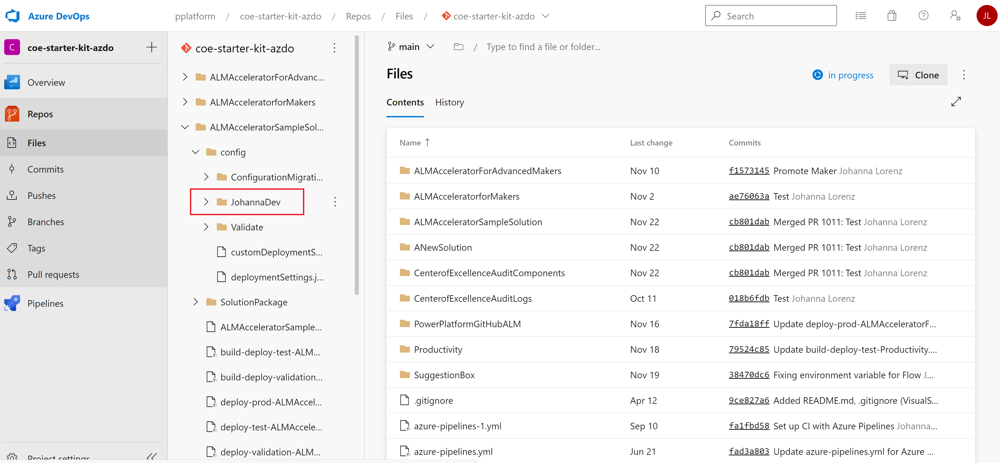

# Configuration and data deployment in pipelines

The ALM Accelerator uses JSON formatted files for updating connection references, setting environment variables, and setting permissions for Azure Active Directory (AD) groups and Microsoft Dataverse teams, in addition to sharing canvas apps and updating ownership of solution components such as Power Automate flows. The instructions in this article are optional and depend on what type of components your solution pipelines deploy. For instance, if your solution contains only Dataverse tables, columns, and model-driven apps with no per-environment configuration or data needed, some of these steps might not be necessary and can be skipped. The following configuration files allow you to fully automate the deployment of your solutions and specify how to configure items that are specific to the environment to which the solution is being deployed.

For an example of configuration and data deployment configuration, go to the ALMAcceleratorSampleSolution [deployment settings](https://github.com/microsoft/coe-starter-kit/blob/main/ALMAcceleratorSampleSolution/config/Prod/deploymentSettings.json) and [custom deployment settings](https://github.com/microsoft/coe-starter-kit/blob/main/ALMAcceleratorSampleSolution/config/Prod/customDeploymentSettings.json).

## Before you start

The following documentation is intended to be a step-by-step process for setting up deployment configuration files manually. However, we recommend that you use the [in-app feature](new-maker-experience.md) to generate this information on export of your solution. This article provides details and context for the actions that are performed by the ALM Accelerator for Power Platform app and pipelines, and acts as a reference for administrators who want to know the specifics of each step in the process.

## Create a deployment settings JSON file

When storing the customDeploymentSettings.json in the root of the config directory, the same configuration will apply to all environments. Assuming that you're using file transformation or token replacement pipeline tasks to store all of the environment-specific information, you can specify the environment-specific values in your pipeline variables. However, you can also create environment-specific customDeploymentSettings.json files by creating subdirectories in the config directory with the name of the environment, to allow for more flexibility. The directory name in this case must match the *EnvironmentName* pipeline variable you created when setting up your pipeline (validate, test, production). If no environment-specific deployment settings JSON and directory are found, the pipelines will revert to the configuration in the root of the config directory.



Additionally, you can create user-specific configuration files (for example, the JohannaDev directory in the preceding image) for individual developers to use when importing unmanaged solutions from source control. When the user imports an unmanaged solution from source control in the ALM accelerator, they're presented with the option to choose a specific configuration.

The deployment settings JSON file is used to configure connection references and environment variables.

```json
{
    "EnvironmentVariables": [
        {
            "SchemaName": "cat_shared_sharepointonline_97456712308a4e65aae18bafcd84c81f",
            "Value": "#{environmentvariable.cat_shared_sharepointonline_97456712308a4e65aae18bafcd84c81f}#"
        },
        {
            "SchemaName": "cat_shared_sharepointonline_21f63b2d26f043fb85a5c32fc0c65924",
            "Value": "#{environmentvariable.cat_shared_sharepointonline_21f63b2d26f043fb85a5c32fc0c65924}#"
        },
        {
            "SchemaName": "cat_TextEnvironmentVariable",
            "Value": "#{environmentvariable.cat_TextEnvironmentVariable}#"
        },
        {
            "SchemaName": "cat_ConnectorBaseUrl",
            "Value": "#{environmentvariable.cat_ConnectorBaseUrl}#"
        },
        {
            "SchemaName": "cat_DecimalEnvironmentVariable",
            "Value": "#{environmentvariable.cat_DecimalEnvironmentVariable}#"
        },
        {
            "SchemaName": "cat_JsonEnvironmentVariable",
            "Value": "#{environmentvariable.cat_JsonEnvironmentVariable}#"
        },
        {
            "SchemaName": "cat_ConnectorHostUrl",
            "Value": "#{environmentvariable.cat_ConnectorHostUrl}#"
        }
    ],
    "ConnectionReferences": [
        {
            "LogicalName": "new_sharedsharepointonline_b49bb",
            "ConnectionId": "#{connectionreference.new_sharedsharepointonline_b49bb}#",
            "ConnectorId": "/providers/Microsoft.PowerApps/apis/shared_sharepointonline"
        },
        {
            "LogicalName": "cat_CDS_Current",
            "ConnectionId": "#{connectionreference.cat_CDS_Current}#",
            "ConnectorId": "/providers/Microsoft.PowerApps/apis/shared_commondataserviceforapps"
        }
    ]
}
```

To create the deployment settings JSON file, follow these steps:

1. Copy the preceding JSON code sample to a new file named **deploymentSettings.json**.

1. Create a new folder named **config** and save the new file under the config folder in Git.

   

### Create connection reference JSON

The connection reference property in the **customDeploymentConfiguration.json** is `ConnectionReferences`. The connection reference property is used for setting connection references in your solution to specific connections after the solution is imported. Additionally, the `ConnectionReferences` are used to enable flows after the solution is imported, based on the owner of the connection specified in the variable.

1. Create the connections manually in your target environments.

1. Copy the IDs for the connections, to use in the following JSON value.

   - The format of the JSON for these variables takes the form of an array of name/value pairs.

   ```json
   "ConnectionReferences": 
   [
           {
               "LogicalName": "connection reference1 schema name",
               "ConnectionId": "my environment connection ID1",
               "ConnectorId": "/providers/Microsoft.PowerApps/apis/connectorid1"
           },
           {
               "LogicalName": "connection reference2 schema name",
               "ConnectionId": "my environment connection ID2",
               "ConnectorId": "/providers/Microsoft.PowerApps/apis/connectorid2"
           }
   ]
   ```

   - The logical name for the connection reference can be obtained from the connection reference component in your solution.
     

   - The connection ID can be obtained via the URL of the connection after you create it. For example, the ID of the following connection is 9f66d1d455f3474ebf24e4fa2c04cea2 where the URL is 'https://.../connections/shared_commondataservice/9f66d1d455f3474ebf24e4fa2c04cea2/details'.

1. After you've gathered the connection reference schema names and connection IDs, go to the **customDeploymentSettings.json** and paste the values into the `ConnectionReferences` property.

   ```json
   "ConnectionReferences": 
   [
           {
               "LogicalName": "new_sharedsharepointonline_b49bb",
               "ConnectionId": "#{connectionreference.new_sharedsharepointonline_b49bb}#",
               "ConnectorId": "/providers/Microsoft.PowerApps/apis/shared_sharepointonline"
           },
           {
               "LogicalName": "cat_CDS_Current",
               "ConnectionId": "#{connectionreference.cat_CDS_Current}#",
               "ConnectorId": "/providers/Microsoft.PowerApps/apis/shared_commondataserviceforapps"
           }
   ]
   ```

1. If you're using the Replace Tokens extension and adding tokens in your configuration as in the preceding example, open the pipeline for your solution, and then select **Edit** > **Variables**.

1. On the **Pipeline Variables** screen, create the connection [connection_reference_logicalname]. For this example, the pipeline variable is named `connection.cat_CDS_Current`.

1. Set the value to the connection ID you gathered earlier, and then select **Keep this value secret** if you want to ensure that the value isn't saved as plain text.

1. Where applicable, repeat these steps for each solution and pipeline you create.

### Create environment variable JSON

The environment variable property in the customDeploymentConfiguration.json is `EnvironmentVariables`. The environment variable property is used for setting Dataverse environment variables in your solution after the solution is imported into an environment.

> [!IMPORTANT]
> When exporting and source-controlling solutions, environment variable values are exported with the solution. In some cases, this can be a security risk when the environment variables contain sensitive information. We recommend that you not store sensitive information in environment variables. One way to ensure that your environment variable values aren't source-controlled is to create a solution specifically for environment variable values in your development environments, and set the current value of the environment variables in that solution. This will prevent the current values from being exported during the solution export and being stored in source control.

1. The format of the JSON for these variables takes the form of an array of name/value pairs.

   ```json
       "EnvironmentVariables": [
           {
               "SchemaName": "environment variable1 schema name",
               "Value": "environment variable1 value"
           },
           {
               "SchemaName": "environment variable2 schema name",
               "Value": "environment variable2 value"
           }
       ]
   ```

   - The schema name for the environment variable can be obtained from the environment variable component in your solution.
     

1. After you've gathered the environment variable schema names and values, go to the customDeploymentSettings.json and paste the JSON in the `EnvironmentVariables` property.

   ```json
   {
       "EnvironmentVariables": [
           {
               "SchemaName": "cat_TextEnvironmentVariable",
               "Value": "#{variable.cat_TextEnvironmentVariable}#"
           },
           {
               "SchemaName": "cat_DecimalEnvironmentVariable",
               "Value": "#{variable.cat_DecimalEnvironmentVariable}#"
           },
           {
               "SchemaName": "cat_JsonEnvironmentVariable",
               "Value": "{\"name\":\"#{variable.cat_JsonEnvironmentVariable.name}#\"}"
           }
       ]    
   }
   ```

1. If you're using the Replace Tokens extension and adding tokens in your configuration as in the preceding example, open the pipeline for your solution, and then select **Edit** > **Variables**.

1. On the **Pipeline Variables** screen, create a pipeline variable for each token in your configuration, for example *variable.cat_TextEnvironmentVariable*.

1. Set the value to the environment variable value for that specific environment, and then select **Keep this value secret** if you want to ensure that the value isn't saved as plain text.

1. Where applicable, repeat these steps for each solution and pipeline you create.

### Creating a custom deployment settings JSON file

The custom deployment settings JSON file contains the configuration settings required to automate the deployment of your solution. This file contains the configuration for activating flows on behalf of a user, specifying ownership of flows, sharing canvas apps with Azure AD Groups, and creating Dataverse group teams after deployment. The following sample is a custom deployment settings JSON file that will provide your pipelines with the necessary information required to configure a solution after it's been deployed to an environment.

```json
{
  "ActivateFlowConfiguration": [
    {
      "solutionComponentName": "DevOpsKitSampleFlow",
      "solutionComponentUniqueName": "0a43b549-50ed-ea11-a815-000d3af3a7c4",
      "activateAsUser": "#{activateflow.activateas.DevOpsKitSampleFlow}#"
    },
    {
      "solutionComponentName": "CallMeFromCanvasApp",
      "solutionComponentUniqueName": "71cc728c-2487-eb11-a812-000d3a8fe6a3",
      "activateAsUser": "#{activateflow.activateas.CallMeFromCanvasApp}#"
    },
    {
      "solutionComponentName": "GetEnvironmentVariables",
      "solutionComponentUniqueName": "d2f7f0e2-a1a9-eb11-b1ac-000d3a53c3c2",
      "activateAsUser": "#{activateflow.activateas.GetEnvironmentVariables}#"
    }
  ],
  "SolutionComponentOwnershipConfiguration": [
    {
      "solutionComponentType": 29,
      "solutionComponentName": "DevOpsKitSampleFlow",
      "solutionComponentUniqueName": "0a43b549-50ed-ea11-a815-000d3af3a7c4",
      "ownerEmail": "#{owner.ownerEmail.DevOpsKitSampleFlow}#"
    },
    {
      "solutionComponentType": 29,
      "solutionComponentName": "CallMeFromCanvasApp",
      "solutionComponentUniqueName": "71cc728c-2487-eb11-a812-000d3a8fe6a3",
      "ownerEmail": "#{owner.ownerEmail.CallMeFromCanvasApp}#"
    },
    {
      "solutionComponentType": 29,
      "solutionComponentName": "GetEnvironmentVariables",
      "solutionComponentUniqueName": "d2f7f0e2-a1a9-eb11-b1ac-000d3a53c3c2",
      "ownerEmail": "#{owner.ownerEmail.GetEnvironmentVariables}#"
    }
  ],
  "AadGroupCanvasConfiguration": [
    {
      "aadGroupId": "#{canvasshare.aadGroupId.DevOpsKitSampleCanvasApp}#",
      "canvasNameInSolution": "cat_devopskitsamplecanvasapp_c7ec5",
      "canvasDisplayName": "DevOpsKitSampleCanvasApp",
      "roleName": "#{canvasshare.roleName.DevOpsKitSampleCanvasApp}#"
    }
  ],
  "AadGroupTeamConfiguration": [
    {
      "aadGroupTeamName": "Sample Group Team Name",
      "aadSecurityGroupId": "#{team.samplegroupteamname.aadSecurityGroupId}#",
      "dataverseSecurityRoleNames": [
        "#{team.samplegroupteamname.role}#"
      ]
    }
  ]
}
```

#### To create the custom deployment settings JSON file

1. Copy the preceding JSON to a new file named **customDeploymentSettings.json**.

2. If you haven't already, create a new directory named **config** and save the new file under the config folder in Git.

   

#### Create default environment variable JSON

The environment variable property in the customDeploymentConfiguration.json is `DefaultEnvironmentVariables`. The `DefaultEnvironmentVariables` variable is used in the export pipeline for setting Dataverse default environment variables in your solution when the solution is exported and stored in source control.

> [!NOTE]
> The default environment variables settings only apply if the export pipeline is configured with the pipeline variable `VerifyDefaultEnvironmentVariableValues = true`.

1. The format of the JSON for these variables takes the form of an array of name/value pairs.

   ```json
   [
      [
         "environment variable1 schema name",
         "default environment variable1 value"
      ],
      [
         "environment variable2 schema name",
         "default environment variable2 value"
      ]
   ]
   ```

   - The schema name for the environment variable can be obtained from the environment variable component in your solution.
     

1. After you've gathered the environment variable schema names and values, go to the customDeploymentSettings.json and paste the JSON in the `DefaultEnvironmentVariables` property.

   ```json
   {
     "DefaultEnvironmentVariables": [
       [ "cat_TextEnvironmentVariable", "#{defaultvariable.cat_TextEnvironmentVariable}#" ],
       [ "cat_DecimalEnvironmentVariable", "#{defaultvariable.cat_DecimalEnvironmentVariable}#" ],
       [ "cat_jsonEnvironmentVariable", "{\"name\":\"#{defaultvariable.cat_jsonEnvironmentVariable.name}#\"}" ]
     ]
   }
   ```

1. If you're using the Replace Tokens extension and adding tokens in your configuration as in the preceding example, open the pipeline for your solution, and then select **Edit** > **Variables**.

1. On the **Pipeline Variables** screen, create a pipeline variable for each of the tokens in your configuration, for example `defaultvariable.cat_TextEnvironmentVariable`.

1. As necessary, repeat these steps for each solution and pipeline you create.

#### Create Azure AD Group canvas configuration JSON

The Azure AD group canvas configuration property in the customDeploymentConfiguration.json is `AadGroupCanvasConfiguration`. The Azure AD group canvas configuration property is used for sharing canvas apps in your solution with specific Azure AD groups after the solution is imported into an environment.

1. The format of the JSON for these variables takes the form of an array of objects. The `roleName` can be one of `CanView`, `CanViewWithShare`, and `CanEdit`.

   ```json
   [
    {
        "aadGroupId": "azure active directory group id",
        "canvasNameInSolution": "canvas app schema name1",
        "roleName": "CanView"
    },
    {
        "aadGroupId": "azure active directory group id",
        "canvasNameInSolution": "canvas app schema name2",
        "roleName": "CanViewWithShare"
    },
    {
        "aadGroupId": "azure active directory group id",
        "canvasNameInSolution": "canvas app schema name1",
        "roleName": "CanEdit"
    }
   ]
   ```

   - The schema name for the canvas app can be obtained from the canvas app component in your solution.
     

   - The Azure AD group ID can be obtained from the **Group** blade in Azure AD from the Azure portal.
     

1. After you've gathered the environment variable schema names and values, go to the customDeploymentSettings.json and paste the JSON in the `AadGroupCanvasConfiguration` property.

   ```json
   {
     "AadGroupCanvasConfiguration": [
       {
         "aadGroupId": "#{canvasshare.aadGroupId}#",
         "canvasNameInSolution": "cat_devopskitsamplecanvasapp_c7ec5",
         "roleName": "#{canvasshare.roleName}#"
       }
     ]
   }
   ```

1. If you're using the Replace Tokens extension and adding tokens in your configuration as in the preceding example, open the pipeline for your solution, and then select **Edit** > **Variables**.

1. On the **Pipeline Variables** screen, create a pipeline variable for each of the tokens in your configuration, for example `canvasshare.aadGroupId`.

1. Set the value to the Azure AD group ID to which the app must be shared for that specific environment, and then select **Keep this value secret** if you want to ensure that the value isn't saved as plain text.

1. Where applicable, repeat these steps for each solution and pipeline you create.

### Create Azure AD group and team configuration JSON

The Azure AD group canvas configuration property in the customDeploymentConfiguration.json is `AadGroupTeamConfiguration`. The Azure AD group canvas configuration property is used for mapping Dataverse teams and roles to specific Azure AD groups in your solution with specific Azure AD groups after the solution is imported into an environment.

> [!NOTE]
> The security roles must be added to your solution if they aren't manually created in the target environment.

1. The formats of the JSON for these variables take the form of an array of objects. One or many roles can be applied to a team. These roles provide permissions to solution components required by the users in the group.

    ```json
    [
     {
         "aadGroupTeamName": "dataverse team1 name to map",
         "aadSecurityGroupId": "azure active directory group id1",
         "dataverseSecurityRoleNames": [
             "dataverse role1 to apply to the team"
         ]
     },
     {
         "aadGroupTeamName": "dataverse team2 name to map",
         "aadSecurityGroupId": "azure active directory group id2",
         "dataverseSecurityRoleNames": [
             "dataverse role2 to apply to the team"
         ]
     }
    ]
    ```

   - The Dataverse team name can be any existing team or a new team to be created in Dataverse and mapped to an Azure AD group after the solution is imported via the pipeline.

   - The Azure AD group ID can be obtained from the **Group** blade in Azure AD from the Azure portal.

   

   - The Dataverse roles can be any security role in Dataverse that would be applied to the existing or newly created team after the solution is imported via the pipeline. The role must have privileges to the resources required by the solution, such as tables and processes.

1. After you've gathered the team names, Azure AD group IDs, and roles, go to the customDeploymentSettings.json and paste the JSON in the `AadGroupTeamConfiguration` property.

    ```json
    {
      "AadGroupTeamConfiguration": [
        {
          "aadGroupTeamName": "alm-accelerator-sample-solution",
          "aadSecurityGroupId": "#{team.aadSecurityGroupId}#",
          "dataverseSecurityRoleNames": [
            "ALM Accelerator Sample Role"
          ]
        }
      ]
    }
    ```

1. If you're using the Replace Tokens extension and adding tokens in your configuration as in the preceding example, open the pipeline for your solution, and then select **Edit** > **Variables**.

1. On the **Pipeline Variables** screen, create a pipeline variable for each of the tokens in your configuration, for example `team.aadSecurityGroupId`.

1. Set the value to the Azure AD group ID to associate with the team in Dataverse, and then select **Keep this value secret** if you want to ensure that the value isn't saved as plain text.

1. Where applicable, repeat these steps for each solution and pipeline you create.

#### Create solution component ownership JSON

The solution component ownership property in the customDeploymentConfiguration.json is `SolutionComponentOwnershipConfiguration`. The solution component ownership property is used for assigning ownership of solution components to Dataverse users after the solution is imported into an environment. Assigning component ownership is useful for components such as flows that by default will be owned by the service principal user when the solution is imported by the pipeline, and organizations want to reassign them after import. Additionally, the  `SolutionComponentOwnershipConfiguration` property is used to enable flows that don't have any connection references. The flow will be enabled by the user specified when no connection references are found to use to enable the flow.

> [!NOTE]
> The current pipeline only implements the ability to set ownership of flows.

1. The format of the JSON for these variables takes the form of an array of objects.

   ```json
   [
    {
        "solutionComponentType": solution component1 type code,
        "solutionComponentUniqueName": "unique id of the solution component1",
        "ownerEmail": "new owner1 email address"
    },
    {
        "solutionComponentType": solution component2 type code,
        "solutionComponentUniqueName": "unique id of the solution component2",
        "ownerEmail": "new owner2 email address"
    }
   ]
   ```

   - The solution component type code is based on the component types specified in the [solutioncomponent EntityType](/dynamics365/customer-engagement/web-api/solutioncomponent) Web API reference. For example, a Power Automate flow is component type 29. The component type must be specified as an integer value (with no quotation marks).
   - The unique name of the solution component, if it's a Power Automate flow, has to be taken from the unpacked solution. Retrieving the unique name from the solution is a limitation due to the fact that flows currently don't require unique names when they're created. As such, the only true unique identifier for a flow is the internal ID the system uses to identify it in a solution.
     
      
   - The owner email address can be gathered from the user's record in Dataverse or Microsoft 365.

1. After you've gathered the component type codes, unique name of the components, and owner email addresses, go to the customDeploymentSettings.json and paste the JSON in the `AadGroupTeamConfiguration` property.

   ```json
   {
     "SolutionComponentOwnershipConfiguration": [
       {
         "solutionComponentType": 29,
         "solutionComponentUniqueName": "00000000-0000-0000-0000-00000000000",
         "ownerEmail": "#{owner.ownerEmail}#"
       },
       {
         "solutionComponentType": 29,
         "solutionComponentUniqueName": "00000000-0000-0000-0000-00000000000",
         "ownerEmail": "#{owner.ownerEmail}#"
       }
     ]
   }
   ```

1. If you're using the Replace Tokens extension and adding tokens in your configuration as in the preceding example, open the pipeline for your solution, and then select **Edit** > **Variables**.

1. On the **Pipeline Variables** screen, create a pipeline variable for each of the tokens in your configuration, for example `owner.ownerEmail`.

1. Set the value to the email address of the owner of the component, and then select **Keep this value secret** if you want to ensure that the value isn't saved as plain text.

1. Where applicable, repeat these steps for each solution and pipeline you create.

### Importing data from your pipeline

In many cases, you'll want to import configuration or seed data into your Dataverse environment initially after deploying your solution to the target environment. The pipelines are configured to import data by using the Configuration Migration tool, available via [NuGet](https://www.nuget.org/packages/Microsoft.CrmSdk.XrmTooling.ConfigurationMigration.Wpf). To add configuration data for your pipeline, use the following steps. For more information about the Configuration Migration tool, go to [Manage configuration data](../../admin/manage-configuration-data.md).

1. Clone the Azure DevOps repo where your solution is to be source-controlled and where you created your solution pipeline YAML to your local machine.

1. If you haven't already created a config directory, under your solution folder, create a new directory named config under the **config** folder.

   

1. Install the Configuration Migration tool following the instructions in [Download tools from NuGet](/dynamics365/customerengagement/on-premises/developer/download-tools-nuget).

1. Open the Configuration Migration tool, select **Create schema**, and then select **Continue**.

   

1. Sign in to the tenant from which you want to export your configuration data.

1. Select your environment.

1. Select the tables and columns you want to export for your configuration data.

1. Select **Save and Export** and save the data to the directory path **config\ConfigurationMigrationData** in your local Azure DevOps repo under the solution folder for which this configuration data is to be imported.

   > [!NOTE]
   > The pipeline will look for this specific folder to run the import after your solution is imported. Ensure that the name of the folder and the location are the same as the following screenshot.

    Similar to the note earlier in this article regarding specific configuration files for each environment, the preceding steps create configuration data that will be deployed to all environments. However, if you have specific configuration data for each environment, you can create subdirectories in the config directory with the name of the environment to allow for more flexibility. The directory name in this case must match the `EnvironmentName` pipeline variable you created when setting up your pipeline (validate, test, production). If no environment-specific configuration data and directory are found, the pipelines will revert to the configuration data in the root of the config directory.

1. When prompted to export the data, select **Yes**.

1. Choose the same location for your exported data, select **Save**, then select **Export Data**.

1. When the export is complete, unzip the files from the data.zip file to the **ConfigurationMigrationData** directory, and delete the data.zip and SampleData.xml files.

   

1. Finally, commit the changes with your data to Azure DevOps.

## Next steps

> [!div class="nextstepaction"]
> [Configure user permissions](./setup-app-user-permissions.md)

[!INCLUDE[footer-include](../../includes/footer-banner.md)]
