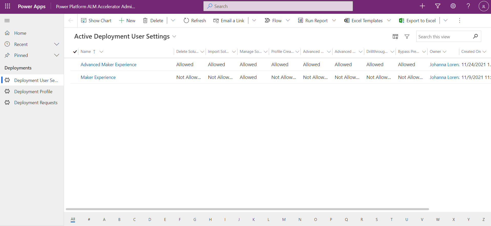

# Configure deployment user settings and profiles for the ALM Accelerator for Power Platform app

Depending on a user's role, you can configure the ALM Accelerator for Power Platform by turning on and off certain features in the UI, based on user preference and experience. To help all users use the app effectively, a common scenario is to create both a maker experience (for users who are unfamiliar with ALM) and an advanced maker experience (for users who are very familiar with ALM concepts). Deployment profiles are linked to user settings. The app uses deployment profiles to make decisions for the user on where and how to create branches and approvals for deployment. For more information on deployment profiles see [Deployment profiles](./setup-deployment-user-profiles.md).

In this section, we'll describe how to use the ALM Accelerator for Power Platform Administration app to configure these settings for use by the ALM accelerator.

> [!NOTE]
> It's not necessary to create deployment user settings manually. If a user signs in to the ALM Accelerator for Power Platform app and doesn't have a deployment user setting assigned to them, the app automatically creates a deployment user setting for that user. This user setting is created with all functionality enabled, including import, delete, and all advanced features.

## Creating user settings and profiles with the ALM Accelerator for Power Platform Administration app

To create deployment user settings for the ALM accelerator for Microsoft Power Platform, follow these steps:

1. Open the **ALM Accelerator for Power Platform Administration**, and then select **Deployment User Settings**.

   

1. Select **New**, and then **Provide a Name** for the user setting. This name will only be displayed to users who have access to more than one user setting option.

1. Select **User Functions to Allow or Disallow**. The following areas are configurable in the app:

    - **Import Solutions** - Allowing this function shows the **Import Solution** command in the app.
    - **Delete Solutions** - This function shows the **Delete Solution** command in the app.
    - **Manage Solutions** - This function shows the **Manage Solutions** command in the app.
    - **Drillthrough Status** - This function allows users to drill into the Azure DevOps pipeline runs for the promote and deploy functionality.
    - **Profile Creation** - This function provides users with the ability to create new deployment profiles in the app.
    - **Profile Updates** - This function provides users with the ability to update deployment profiles settings in the app.
    - **Advanced Deploy** - This function provides users with the ability to switch between using the advanced deploy functionality. They can specify a source and target branch for a pull request.
    - **Advanced Promote** - This function provides users with the ability to change between using the advanced promote functionality. They can specify a source and target branch, or create a new branch.
    - **Bypass Prepare** - This function provides the user with the ability to skip the preparation step during the promotion of a solution. They can bypass needing to configure deployment settings before committing to source control.
    - **Bypass Prepare Default** - If the **Bypass Prepare** is **Allowed**, this function prepopulates the **Bypass Prepare** toggle control in the ALM Accelerator App. If the **Bypass Prepare Default** set as Allowed the **Bypass Prepare** toggle control would be preset to True and vice versa.
    - **Deployment Configuration** - This function provides the user with the ability to skip the preparation step during the promotion of a solution. They can bypass needing to configure deployment settings before committing to source control.
    - **Show All Solutions** - This function provides users with the ability to see all solutions in the selected environment.
    - **Bypass Approval** - This function provides the user with the ability to skip the approval of Pull Request during the deployment of a solution. They can bypass needing to approve the Pull Request before deploying to test environments.
    - **Bypass Approval Default** - If the **Bypass Approval** is **Allowed**, this function prepopulates the **Bypass Approval** toggle control in the ALM Accelerator App. If the **Bypass Approval Default** set as Allowed the **Bypass Approval** toggle control would be preset to True and vice versa.
    - **Commit Portals** - This function provides the user with the ability to include the Power Apps Portal/Power Pages website during the solution commit to source control. They can select the Power Apps Portal/Power Pages website before committing to source control.
    - **Commit Portals Default** - If the **Commit Portals** is **Allowed**, this function prepopulates the **Include Power Apps Portal/Power Pages** toggle control in the ALM Accelerator App. If the **Commit Portals Default** set as Allowed the **Include Power Apps Portal/Power Pages** toggle control would be preset to True and vice versa.
    - **Publish Customizations** - This function provides the user with the ability to publish customizations during the solution commit to source control. They can select the publish customizations toggle before committing to source control or turn off the toggle to skip publishing which can save time in the commit process.
    - **Publish Customizations Default** If the **Publish Customizations** is **Allowed**, this function prepopulates the **Publish Customizations** toggle control in the ALM Accelerator app. If the **Bypass Approval Default** is set to **Allowed**, the **Bypass Approval** toggle control would be preset to true and vice versa.
    - **Allow Import Managed** - This function provides the user with the ability to import managed solutions during the solution import. They can select the import managed toggle before importing the solution or turn off the toggle to import unmanaged solutions into their maker environment.
    - **Import Managed Default** If the **Allow Import Managed** is **Allowed**, this function prepopulates the **Allow Import Managed** toggle control in the ALM Accelerator app. If the **Allow Import Managed Default** is set to **Allowed**, the **Allow Import Managed** toggle control would be preset to true and vice versa.

1. Update **User Labels**. The following areas are configurable in the app related to user labels for functions. These values also appear in the **Deployment History** view under the action that was executed:

    - **Deploy Solution** - Updating this label changes the text of the button for the deployment action in the app. The default value is **"DEPLOY SOLUTION"**.
    - **Commit Solution** - Updating this label changes the text of the button for the promote action in the app. The default value is **"COMMIT SOLUTION"**.
    - **Import Solution** - Updating this label changes the text of the button for the import solution action in the app. The default value is **"IMPORT SOLUTION"**.
    - **Delete Solution** - Updating this label changes the text of the button for the delete solution action in the app. The default value is **"DELETE SOLUTION"**.

1. Select **Save** to save your user settings.

## Sharing ALM accelerator user settings and profiles by using the ALM Accelerator for Power Platform Administration app

To share user settings created for a particular user profile, we recommend that you share the user setting row with an Azure Active Directory (Azure AD) Group team. Sharing with an Azure AD Group team allows you to manage access to user settings and deployment profiles from Azure AD by adding the user to the group in Azure AD. The following steps describe how to share and provide the appropriate roles to an Azure AD Group team after installing the ALM Accelerator for Power Platform app.

1. If you haven't already created an Azure AD Group team in Microsoft Dataverse to share your user settings, perform the following steps; otherwise, skip to step 2.

   1. Go to [https://admin.powerplatform.com](https://admin.powerplatform.com) and select the environment in which you've installed the ALM Accelerator for Power Platform app.

   1. Under **Access -Teams**, select **See all**, and then select **Create Team**.

   1. Enter the required fields, and select **AAD Group Team** (AAD Security Group or AAD Office Group) as the **Team Type**.

   1. Select the **AAD Group** to use for this team, and then select **Next**.

   1. Select **ALM Power App Access** and **Basic User** as the roles for the team, and then select **Save**.

1. Open the ALM Accelerator for Power Platform Administration app, and go to **Deployment User Settings**.

1. Open the **Deployment User Setting** that you want to share with your team, and then select **Share**.

1. Open your Azure AD Group team by using **Advanced lookup** in the **Sharing** dialog.

   1. In **Advanced lookup**, select **Teams**.

   1. From the **View** dropdown list, select **All AAD Security Group Teams**.

   1. Select the team you created previously, and then select **Done**.

1. Under **Manage Share Access**, select the team, and then select **Read** and **Append** as the privileges.

1. Select **Share**.

Next, you'll add new deployment profiles to your user settings. Deployment profiles are used by the ALM Accelerator for Power Platform app to determine where and how to create branches during the commit stage, and how to create pull requests when deploying. The following section describes the steps to create a deployment profile with the ALM Accelerator for Power Platform Administration app to associate with one or many deployment user settings.

> [!div class="nextstepaction"]
> [Configure deployment profiles](./setup-deployment-user-profiles.md)

## Read next

- [Configuring Deployment Profiles](./setup-deployment-user-profiles.md)
- [ALM Accelerator Advanced Maker Experience](./advanced-maker-experience.md)
- [ALM Accelerator Maker Experience](./new-maker-experience.md)

[!INCLUDE[footer-include](../../includes/footer-banner.md)]
