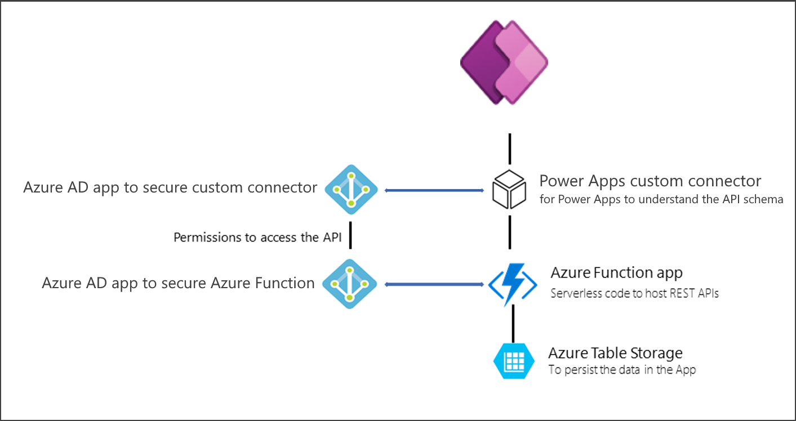
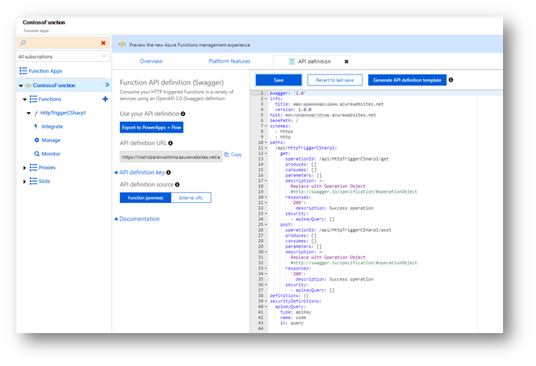
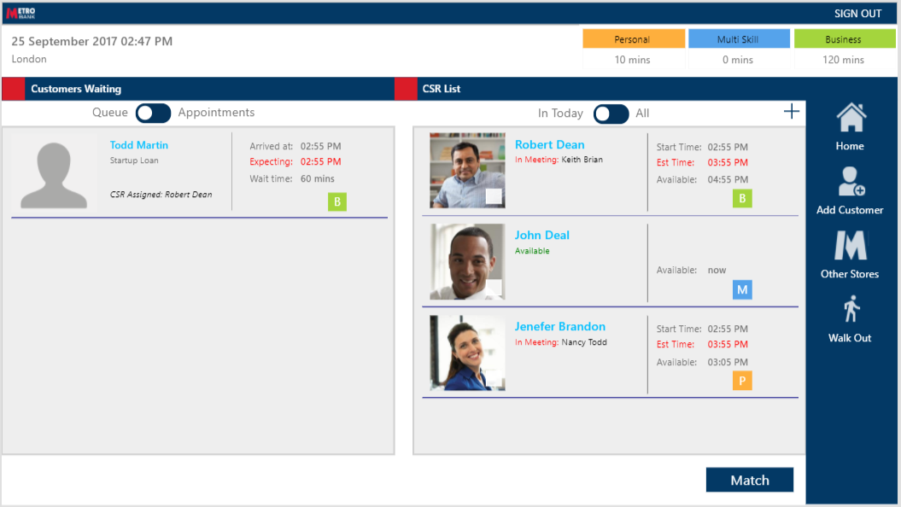

# Using Azure Functions to extend the functionality of canvas apps 

Microsoft Power Platform enables you to extend the functionality of your app by using Azure Functions. When dealing with complex algorithms or with many data sources, Azure Functions becomes an ideal choice to help keep your formulas within Power Apps simple while moving more complex functionality server-side. Function apps<!--note from editor: Via Cloud Style Guide, the service is "Azure Functions" and the thing you create with it is a "function app."--> require professional developers who are familiar with the Azure Stack, but are easy to maintain and scale due to their serverless nature.

<!--
note that in the image, "Azure Function app" should be "function app." I'm not sure whether "Azure Function" should be "Azure Functions" or "function app" - depends which you mean. Also, please make the following alt text better, and verify whether the alt text for the next two images seems adequate.-->
:::image type="complex" source="./media/azurefunctionarch.png" alt-text="Diagram of using Azure Functions with Power Apps.":::
   Diagram showing a Power Apps custom connector between an app and a function app, which contains serverless code to host REST APIs. The function app connects to Azure Table Storage, to persist data in the app. An Azure AD app secures the custom connector and, through permissions to access the API, an Active AD app secures the function app. 
:::image-end:::

Function apps driven by RESTful HTTP requests can also be exported for additional functionality. Behind the scenes, you can create a custom connector by using the OpenAPI definition automatically generated within the Azure portal, which you can then export so that it can be consumed in Power Apps or Power Automate.

As an example of customers using Azure Functions in their solution, you can read the Metro Bank customer story at [Case study: Metro Bank uses Power Apps to improve the in-store customer experience](https://powerapps.microsoft.com/blog/metro-bank-customer-greet-app/). 

In this case study, you'll see how Metro Bank used Azure Functions to build a complex algorithm to estimate wait time and pair up the customer with the appropriate bank representative.

