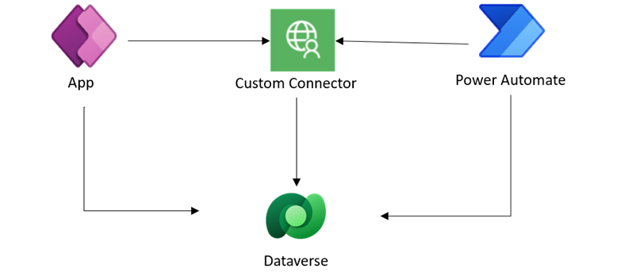
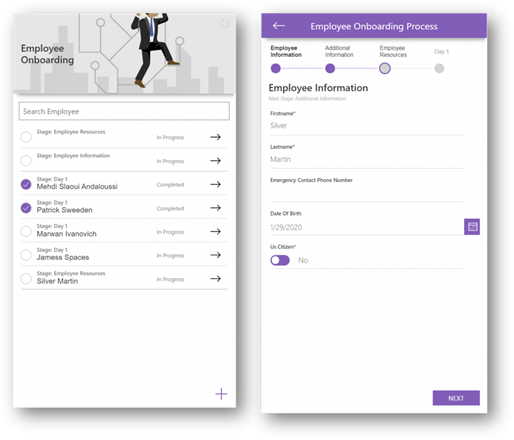
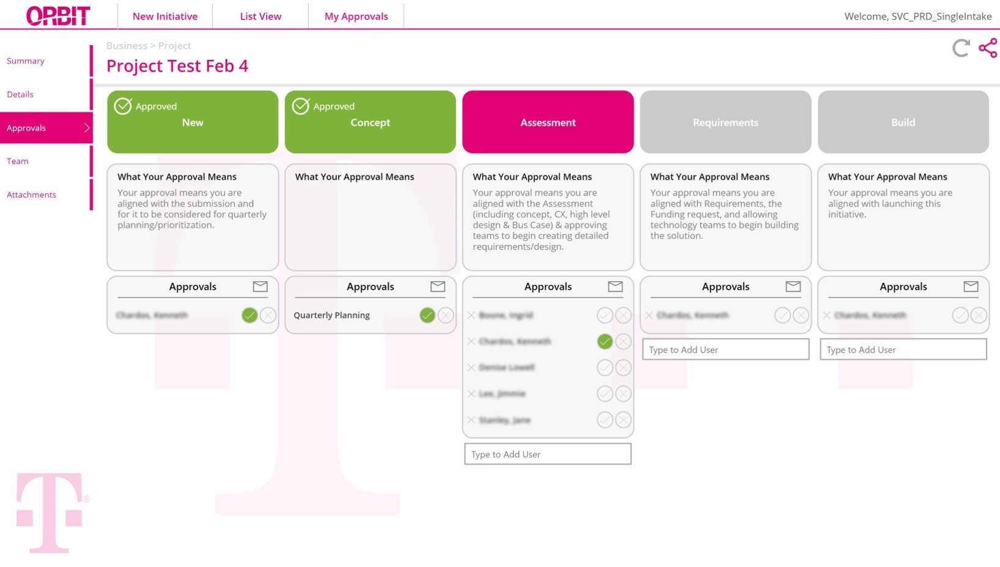

# Using Business Process Flows, the Common Data Service, “Codeless” Custom Connectors and Power Automate with Canvas App 

 

With business process flows (BPF), you can ensure that users enter data consistently and follow the same steps every time. The out of the box experience of BPF is composed of stages and steps that are then displayed in a control at the top of the form.

 

For experiences that require a custom user experience, Dataverse offers a rich set of APIs that one can use to create a rich BPF experience within Canvas app.  Here is an example of a business process flow implemented in Canvas app:
 

 
To render a BPF within a canvas app, we can make use of a “codeless” custom connector that implements some key Dataverse APIs related to BPF functionality. A “codeless” custom connector is a connector in which we only need to the Open API spec that lines-up with the underlying Dataverse API service without building the service itself. In the case of BPF, there are important APIs available to retrieve the different BPF stages, active stage and meta data related to the controls defined in each stage. To learn more about BPF APIs, check out this article https://docs.microsoft.com/en-us/dynamics365/customerengagement/on-premises/developer/model-business-process-flows#use-retrieveprocessinstances-and-retrieveactivepath-messages 

Within the Canvas app, one can consume those APIs by simply adding the custom connector and invoking the exposed functions. However, it is sometimes more convenient to transform and shape the data returned from the custom connect server side. In that case, Power Automate becomes a “low code” mechanism to process data server-side and return shaped responses to Power Apps. Power Automate can in effect be used as a substitute to a full-fledged API service which can be more performant but potentially more costly to build and would require pro developer skills.

Of course, building a Canvas apps that implement a business process is possible without the use of BPF but when you are building an app that also has complex security requirements, leveraging the out of the box BPF technology with the advanced security model offered by Dataverse becomes powerful.

For a real world example, checkout how T-Mobile built an app called Orbit used by projects leads and executives to approve all new initiatives across the company: https://powerapps.microsoft.com/en-us/blog/tmobile/ 

