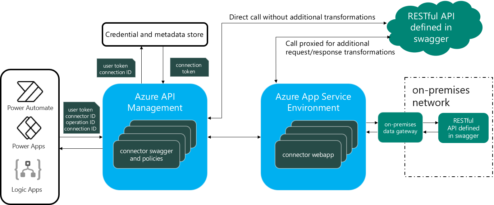

# Using Rest APIs via Custom Connectors with canvas apps

With custom connectors, developers can capitalize on existing organization investments in Rest APIs services or create new APIs to expose complex server-side operations that are not available with the out-of-the-box connectors. In this case, we are dealing with a middle-tier architecture where Power Apps is used as a UI layer. This architecture offers flexibility but also means more pro-developer work is needed to develop and maintain the web service and data layer. In general, as the complexity of the app increases, one should strongly consider this type of architecture. For example, when multiple data sources are needed to build a single view, the use of an API layer is highly recommended to deliver a performing experience, as the data response can be shaped server-side and delivered to the client more efficiently. The use of this middle-tier layer means that one can add a server-side caching layer and implement richer telemetry for the app. 

To enable Logic Apps, Power Automate, or Power Apps to communicate with that REST or SOAP API, use a custom connector, which is a wrapper around a REST API (Logic Apps also supports SOAP APIs). A high-level architecture of how custom connectors work is as follows:

For more in-depth information, check out this https://docs.microsoft.com/connectors/connectors

As an example, Microsoft built a suite of employee engagement mobile apps that have been deployed worldwide to 100,000+ employees. The apps were built on top existing APIs deployed by IT. 

The Thrive home app in particular (which is essentially an internal company news feed) shows various events and activities happening within the company and also shows various user-customized cards such as vacation balance card. The IT Team found that when multiple data sources are needed to build a single view, the use of an API layer was instrumental to delivering a performant experience, as the data response can be shaped server-side and delivered to the client more efficiently. 

Check out the full story here:
https://powerapps.microsoft.com/blog/microsoft-thrive/

