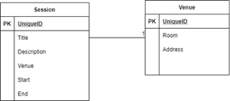
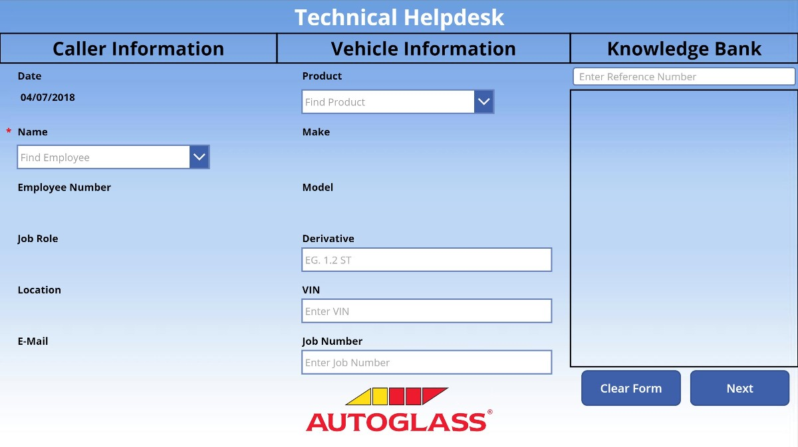

# Using Microsoft Dataverse with a canvas app 

Microsoft Dataverse is a great choice when dealing with complex object models that include several related tables. As an app maker using the [Dataverse connector](/connectors/commondataserviceforapps/), you get access to a hierarchical object model where tables and their relationships are readily available without the need to build complex lookups and joins to retrieve related tables. This simplifies the development process and results in highly performing applications because data requests are optimized accordingly.



When retrieving the Session table, the Dataverse connector will automatically expand the Venue field into a record, making all the information about the Venue available, such as Room and Address. Within a gallery control, the formula bound to a label would be this:

```powerappsfl
ThisItem.Venue.Room
```

Contrast this to other data sources:

```powerappsfl
LookUp(Venues, VenueID = ThisItem.VenueID).Room
```

This simplicity in dealing with relationships makes Dataverse more approachable for citizens developers and can improve productivity as well. In addition, the process of creating tables and relationships within Power Apps ([make.powerapps.com](https://make.powerapps.com)) makes Dataverse the data source of choice. 

Further, the Dataverse connector bypasses the traditional connector infrastructure and calls directly into the Dataverse back end, leading to better performance. More information: [Blog: Considerations for optimized performance in Power Apps](https://powerapps.microsoft.com/blog/considerations-for-optimized-performance-in-power-apps/)

:::image type="complex" source="./media/PA_DataverseArch.png" alt-text="Diagram showing an app sending an OData request to, and receiving data directly from, Dataverse.":::
   The elapsed time of the request is the sum of client and server side overhead which the time it takes to send, process and transmit the data back to Power Apps.
:::image-end:::


As a real-world example, consider Belron, the worldwide leader in vehicle glass repair and replacement. Belron uses more than 40 apps, all developed in-house by just one employee with no programming skills. For more insight on how Belron used Dataverse, read the story here: [Customer story: Vehicle glass repair provider digitizes processes and increases productivity with self-developed apps](https://customers.microsoft.com/story/belron-autoglass-consumer-goods-powerapps). 

