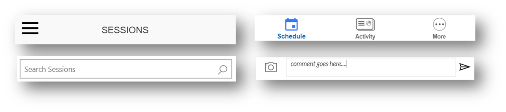
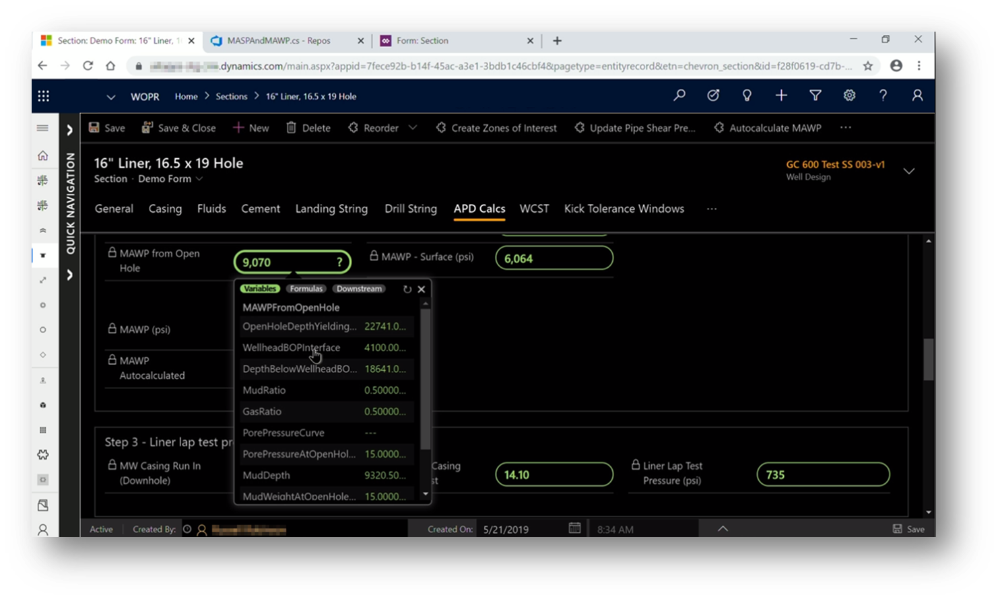

# Building reusable UI using PCF and canvas components

Power Apps offers two options to create reusable components. The first one is canvas components, which is a low-code way of creating reusable controls within Power Apps Studio. The second is the Power Apps Component Framework (PCF), which is a pro-developer way of building reusable controls using HTML, Typescript, and CSS. Canvas components are powerful and can be used to fulfill most UI requirements for your app. They should be considered first as the cost to build and maintain can lower in most cases than PCF.

Here are some examples of canvas components

Canvas components can be packaged within Component libraries, which are containers that makes it easy to reuse components across many apps. Component libraries make it easy to search and discover components, publish changes, and notify app makers when new components updates are available.

For more advanced scenarios, PCF offers access to a rich set of framework APIs that expose many capabilities like component lifecycle management, contextual data, and metadata. For scenarios that require access to device features like camera, microphone or advanced animation and transitions, building a PCF component will be the only option. PCF Components can be using in model-driven apps,canvas apps and Power Apps Portals.

To see real world use of PCF, check-out how Chevron built a digitally enhanced well planning tool to help with the design of a well that is 35000 feet deep (, nearly 7 miles under the earth). This digital tool uses the Power Apps Component Framework to enhance the app experience. https://youtu.be/ABcRl-lErIY?t=2050  

