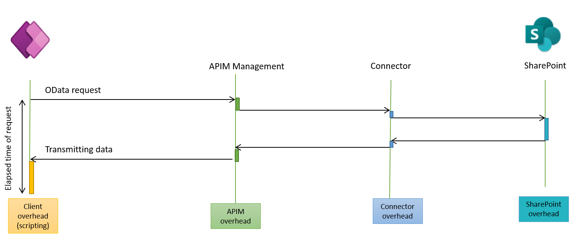

# Using the SharePoint connector with canvas apps 
<!--note from editor: Is there a reason to use "Online" here? It doesn't seem to be part of the actual connector name.-->
SharePoint is a great data source for organizations with a strong Microsoft 365 practice who are starting their journey with Power Apps. The SharePoint connector allows app makers to quickly connect to SharePoint lists and perform create, read, update, and delete operations in a simple and efficient way. SharePoint as a data source is well-suited for apps with a simple object model and limited number of tables (lists) and relationships among those tables. The SharePoint connector is also adequate for apps that don't require more complex security models such as row-level or field-level security. 

On the other hand, as data grows in size and complexity, app developers using SharePoint-based apps need to be aware of some limitations when searching and filtering data, due to the delegation support offered by the SharePoint connector. These limitations are documented in the [Understand delegation in a canvas app](/powerapps/maker/canvas-apps/delegation-overview) topic, and should be taken into account when choosing the right data source or back end for your app.

The following image represents the data flow when calling a standard connector such as SharePoint. When a request is issued from the Power Apps client, we move through API Management and the connector hub before we reach the final data source where data is retrieved or written. This move introduces a small decrease in performance, but ensures a consistent interface for Power Apps with all connectors.

<!---->
:::image type="complex" source="./media/DefaultConnectorArchi.png" alt-text="Diagram of architecture of data flow from Power Apps through the SharePoint connector.":::
   <!--NOTE FROM EDITOR: NEED DETAILED ALT TEXT HERE-->
:::image-end:::

As an example, Standard Bank built a canvas app with SharePoint for inspecting ATMs. The app uses the device GPS capabilities to find nearby ATMs and the device camera to take pictures when issues need to be reported. Read the full story here:
[Case study: Standard Bank South Africa creates a Center of Excellence for Microsoft Power Platform](https://powerapps.microsoft.com/blog/standard-bank-south-africa-creates-a-center-of-excellence-for-the-power-platform/).

