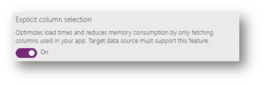
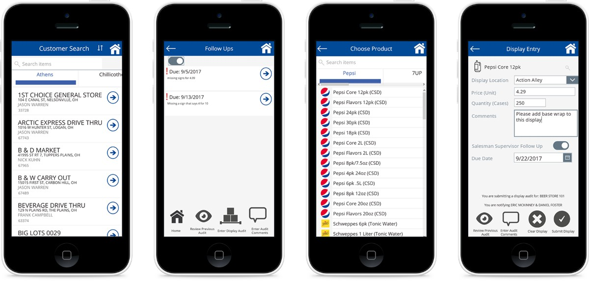

# Using on-premises SQL Server with a canvas app through an on-premises data gateway 

The [on-premises data gateway](/data-integration/gateway/service-gateway-onprem) acts as a bridge to provide secure data transfer between on-premises data and Power Apps.

:::image type="complex" source="./media/gateway.png" alt-text="Diagram of on-premises data gateway architecture.":::
   Relationship among cloud services, gateway, and SQL Server
:::image-end:::

A powerful use of data gateways happens when your data resides in on-premises SQL Server. The SQL Server connector supports two important features that makes retrieving data more efficient, especially as we go through an on-premises gateway: *views* and *explicit column selection*.

- A *view* is a virtual table based on the result set of a SQL statement. The data in a view is fetched from one or more tables in the database. Views are executed server-side, which means that you don't need to reference separate tables in Power Apps and perform lookup and joins between these tables client-side. Another scenario that views solve is aggregating (group and sum) data prior to bringing it into Power Apps. Rather than bringing all the records into Power Apps and using the Sum feature, that advanced processing was done with views in SQL Server.

- *Explicit column selection* in Power Apps Studio intelligently optimizes formulas to fetch only the fields referenced in the application, boosting the performance of the app.  

  

Using on-premises gateways does have performance implications, so it's important to allocate an adequate configuration for the on-premises hardware where the gateway is installed. This ensures that the gateway machine isn't overloaded by requests from other apps that would slow down the app.

:::image type="complex" source="./media/gatewayperf.png" alt-text="Diagram of on-premises gateway architecture.":::
      OData requests are sent from Power Apps to APIM Management service which in turns relays the request to the Connector hub that sends the requests to the SQL via the Data gateway.
:::image-end:::

As an example of an app built with on-premises SQL Server, G&J Pepsi created a merchandise app that enables better mobility and flexibility for field personnel. Read the story here: [Customer story: Transforming in-store merchandising and auditing to achieve targeted business goals](https://customers.microsoft.com/story/gj-pepsi-consumer-goods-powerapps).

