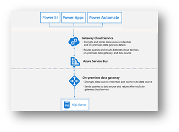
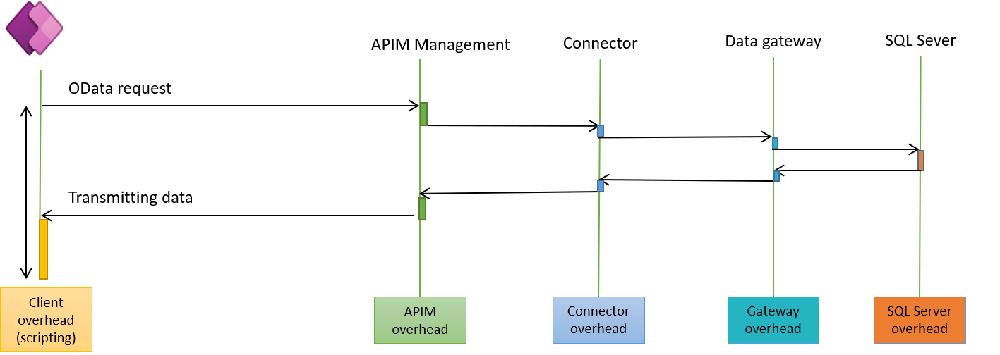

# Using on-premises SQL Server with a canvas app through an on-premises data gateway 

The [on-premises data gateway](/data-integration/gateway/service-gateway-onprem) acts as a bridge to provide secure data transfer between on-premises data and Power Apps.

A powerful use of data gateways happens when your data resides in an on-premises SQL Server. The SQL connector supports two important features that makes retrieving data more efficient specially as we are going through an on-premises gateway: *views* and *explicit column selection*.

A view is a virtual table based on the result-set of a SQL statement. The data in a view is fetched from one or more tables in the database. Views are executed server side, which means that there is no need to reference separate tables in Power Apps and perform lookup and joins between these tables client-side. Another scenario that views solve is aggregating (group and sum) data prior to bringing it into Power Apps. Rather than bringing all the records into Power Apps and using the Sum feature, they were able to do that advanced processing in SQL Server.

Explicit column selection in Power Apps Studio intelligently optimizes formulas to fetch only the fields referenced in the application, boosting the performance of the app.  

There are performance implications when using on-premises gateways, so it's important to allocate an adequate configuration for the on-premise hardware where the gateway is installed. This ensures that the gateway machine is not overloaded by requests from other apps that would slow down the app.

As an example of app built with on-premises SQL Server, G&J Pepsi created a merchandise app that enables better mobility and flexibility for field personnel. Read the story here: [Customer story: Transforming in-store merchandising and auditing to achieve targeted business goals](https://customers.microsoft.com/story/gj-pepsi-consumer-goods-powerapps).

