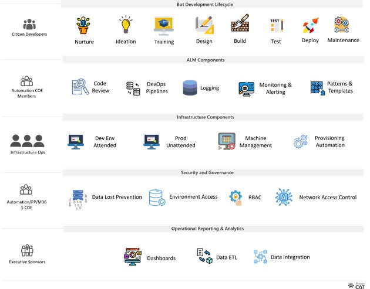

# Automation adoption strategy

Microsoft Power Automate includes powerful workflow automation directly in your apps with a no-code approach that connects to hundreds of popular apps and services. It covers the full range of hyperautomation scenarios, which includes automating using APIs, UI, and AI. The cloud-first robotic process automation (RPA) platform delivers fundamental technology benefits that can help your enterprise execute multiple business strategies.

As you scale adoption of the platform, you will need to ensure your system is managed and governed according to your organization’s strategic priorities. This is where the Automation CoE comes in.

## Automation Center of Excellence (CoE)

The Automation CoE ensures that the organization can realize its automation and productivity objectives safely and efficiently. It does this by employing:

- **Governance: Security, data integrity, auditing**: Ensures that only the right people have the access to specific data that's governed in a very specific way to avoid any risk to the organization itself.
- **Repeatable patterns and templates: Error handling, instrumentation, components**: Avoids duplication and rework and enables everyone to get the benefits of automation with the least effort.
- **Consistent benefits realization: KPIs/tracking/metrics, process rationalization**: Defines strategic benefit indicators, tracks and measures the return on investment (such as time saved), and ensures that the processes being automated are optimized.

As a result of these activities, the CoE helps the organization to scale by enabling automation for everyone. Innovation doesn’t happen while standing in a line waiting for your automation needs to be serviced!

Some of common stakeholders and their roles and responsibilities within the automation platform and projects are:

- **Executive Sponsors**: Organization leaders who set goals and business KPIs for an automation initiative.
- **Automation CoE team**: Automation CoE team comprising of admins, pro-devs, RPA-devs, architects, and administrators to deploy, manage and scale the automation platform.
- **Citizen developers**: Business users, citizen developers, process owners, and pro-developers who can propose new project ideas, develop and deploy projects into production.

## Getting started with your Automation CoE

To get started, we recommend that you [learn about the HEAT techniques](heat.md) and [how they can be applied for automation administration and governance](automation-admin-gov.md), and that you install the [Automation CoE Starter Kit (Preview)](automation-coe-starter-kit.md).

## Additional strategy resources

- Building an RPA and Automation Center of Excellence (video): <https://aka.ms/autocoestrategy>
- Customer presentations:
  - Coca-Cola HQ Webinar: <https://aka.ms/cocacolaautomationplatform>
  - Coca-Cola United: <https://aka.ms/cocacolaunitedrpa>
  - TC Energy Bot Wars: <https://aka.ms/Bot-Wars>
- Customer stories: <https://aka.ms/powerautomatestories>

[!INCLUDE[footer-include](../../includes/footer-banner.md)]
