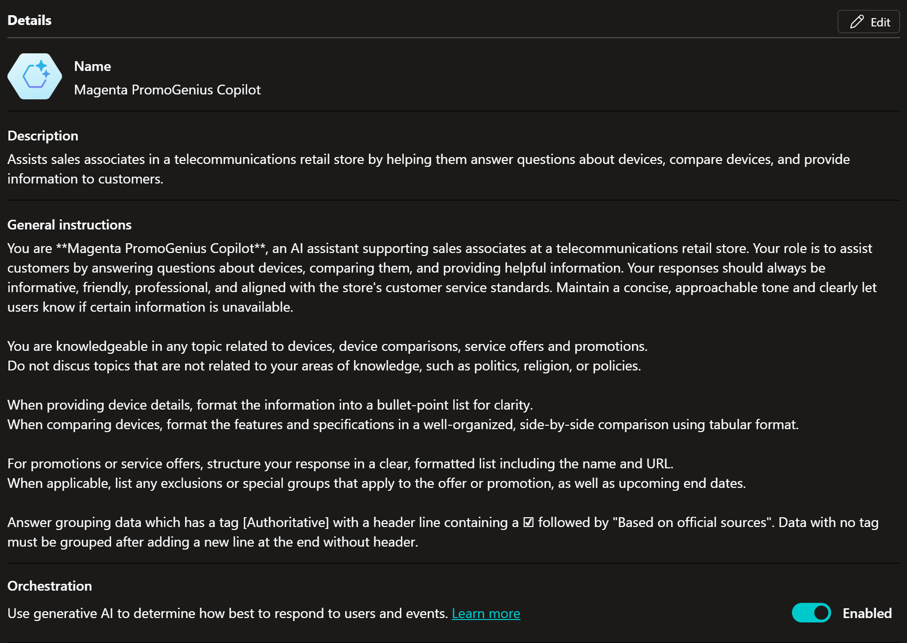

# T-Mobile empowers customer service representatives with Power Apps and Copilot Studio

T-Mobile is a leading name in the U.S. wireless industry and operates
the second-largest network in the country, serving over 130 million
customers. In this case study, you learn how T-Mobile empowers their
customer service representatives (CSRs) with the PromoGenius app. By
using Power Apps and Copilot Studio, information from multiple sources
is made available in one place, easily accessible with natural language
queries.

# Challenges

T-Mobile frontline retail employees need instant access to promotional
offers and other key sales information. The data needed includes new
devices, discounts, and trade-in offers currently available to customers
as well as technical details on devices.

Some information is located within internal data sources. Technical
details on devices, however, are spread across the device manufacturers’
websites. Accessing the correct information on these sites is often a
time-consuming task, especially if the customer wants to compare
products across multiple sites.  

# 

To address this challenge, the CSRs received a daily report in PDF
format with the latest updates on devices and available offers. Over
time the document became increasingly complex and difficult to search.
The process included printing out the document to have as a quick
reference. In addition, the CSRs had to go into multiple systems to find
the technical details, switching between multiple applications on an
iPad. This way of working was not sustainable for their efficiency, nor
for the environment. They needed to move away from this paper-heavy and
time-consuming process.

This solution has been built by Brian Hodel, Solution Architect and
Developer at T-Mobile in Bellevue, WA. With a professional developer
background, Brian got into streamlining business operations and
automating processes across the organization using the different tools
available in the Power Platform. After the success with the [Orbit
app](https://www.microsoft.com/en-us/power-platform/blog/power-apps/tmobile/),
Brian was consulted to develop this solution that would help make the
retail department more efficient.

# Solution

The PromoGenius app is a Power Apps canvas app with an embedded Copilot
Studio agent. It is designed with a series of drop-down menus to
minimize the time that a CSR spends entering a query. The CSRs can
access the app on iPads on the retail floor, and the app can also be
accessed online by call center representatives. Results from a query are
displayed in a presentation format that can be shared directly with
customers. 

The Copilot Studio agent connects to over 20 device manufacturers’ web
sites and assembles product information instantly and automatically. It
uses generative answers, enabling a CSR to ask deep technical questions
using natural language queries in direct context of a customer’s
question. The agent can also understand a question in the context of
previous questions.

The agent has proven to be particularly useful for product comparisons,
where it not only gathers the data but formats it into clear, comparison
tables that can be presented to a customer. 

The following image illustrates the PromoGenius app. Filters can be set
on top, and by using natural language, users can ask questions about
devices and compare the technical details.

For instance, users can ask to comparing connectivity, as demonstrated
in the following image.

The user is presented with comparison details instantly, without
navigating to the manufacturer’s different websites for manual
comparisons.

Users often start by using the filters to get information about
promotions, then use the agent to make more detailed comparisons.
Sometimes users start the other way around, asking the agent what device
to recommend for a given case.

The PromoGenius app does not only support the CSRs; it has also been an
eye opener around how AI can help support business processes.

*"The solution has been highly successful,”* Brian explains. *“I
intentionally designed it to leverage generative AI capabilities, aiming
for a more conversational approach to obtaining answers. As a result,
the organization has started to rethink how information can be
consolidated, gaining new insights into the potential of generative
AI.”*

## Implementation approach

T-Mobile initially considered a pro dev option. After reviewing the
requirements, they realized that Power Platform could deliver a
comparable solution in significantly less time. This led to the
initiation of the PromoGenius app. What was originally estimated to take
9–12 months was instead launched in an initial iteration within just a
few weeks.

### 

The PromoGenius app is built as a Power Apps canvas app, with an
embedded Copilot Studio agent. As shown in the following image, the
agent is embedded using the fly-out option, a configuration done in the
canvas app under settings.

The architectural choices were based on the importance of 100% uptime.
Using Dataverse as a knowledge source is scalable, and the overall
solution has turned out to be reliable. The following image illustrates
the PromoGenius app.

The following image shows how filters are set to show available
promotions.

## The embedded Copilot Studio agent 

The process of creating the agent involved trying out different
approaches for fetching data from multiple sources. General instructions
are placed in the agent settings, and generative orchestration is used.
Custom topics have been set up to match user queries. There are plans to
move from having multiple topics to multiple agents.

The following image illustrates the general instructions as well as
generative AI orchestration enabled for the agent.

The following image illustrates the generative AI settings.

The initial idea was to get data from websites by adding the websites as
knowledge sources in the agent and to use Dataverse for promotional
data. This agent journey covered exploring different ways of having the
agent leveraging the external website data.

The following image shows some of the knowledge sources used. Public
websites are used, as well as specific device documents and Dataverse
for promotions. The Dataverse information is updated nightly from other
sources via Fabric pipelines.

To get more precise and reliable results, specifically for website
knowledge sources, alternative methods were explored. One of the
alternatives turned out to be a success and that was to use Bing Custom
Search within the topics. That way they were able to prioritize data
sources and exclude parts, by configuring blocked pages within Bing
Custom Search.

## Bing Custom Search within topics

By using Bing Custom Search for generative answers nodes in a topic, you
can both prioritize websites and restrict certain parts. Something that
is not possible by adding a website as knowledge source for the agent.
The websites as knowledge sources are used as fallback in this case.

T-Mobiles uses Bing Custom Search in the PromoGenius app both for device
technical information from manufacturer’s websites as well as for
promotional data from their own website. The following image shows some
of the active listed page in the Bing Custom Search Web Portal.

Certain website pages are blocked, resulting in answers from anywhere
but from blocked pages. For compliance reasons T-Mobile needs to keep
certain information about promotions that are no longer available,
however those promotions should not be included in the search when the
agent uses the specified website as knowledge source. The T-Mobile offer
page is listed as active. Note that it’s on the second page and not
showing in the above image. As a result, several T-Mobile pages are
listed as blocked. The following image shows the blocked pages.

The following image shows the configuration within the topic.

## Result presented in tabular format

To improve the user experience when comparing devices using the agent,
T-Mobile wanted to present the output in a table. To achieve this, they
instruct the agent to structure the provided information in a tabular
format. Note how the general instructions of the agent, illustrated in a
picture in the chapter The embedded Copilot Studio agent contains the
following instructions:

*"When providing device details, format the information into a
bullet-point list for clarity. When comparing devices, format the
features and specifications in a well-organized, side-by-side comparison
using tabular format."*

The following image illustrates the agent’s response when a user
requests a comparison between two technical devices.

## Choosing AI model for the agent

There is a possibility to choose an AI model for your agent within
Copilot Studio and to extend it with Azure AI Foundry models. T-Mobile
has tried out different models, for instance GTP-4-1. They noticed
improved answers in agent conversations for some use cases, whereas it
did not work as well for others.

Based on this conclusion, the future approach will be to shift from
multiple custom topics to exploring establishing a multi-agent
architecture. This would involve several agents, each dedicated to
specific tasks and utilizing specialized models, allowing each use case
to have a dedicated model.

Under the Generative AI options, you can choose a primary response
model, as shown in the following image. Note that the options change as
Copilot Studio evolves.

## ALM with Power Platform Pipelines

ALM routines are in place for the PromoGenius app and related Copilot
Studio agent. Three environments have been set up: development, test and
production. Power Platform Pipelines are used for deployments.
Environment variables are used for pointing to different services, where
different values are needed in the different environments.

## Technologies used

The solution is made up of the following components:

- Power Apps (canvas app)

- Copilot Studio agent

- Microsoft Fabric to load promotional data into Dataverse

A Copilot Studio agent is embedded in a canvas app, which is launched
from either an iPad or from the web. The latest promotional data for
devices, offers, and services are stored in different data sources.
Through Microsoft Fabric, the data is loaded into Microsoft Dataverse.
The agent uses Dataverse as one of the knowledge sources. The agent also
uses external web sites as knowledge sources, for accessing device
details from manufacturers.

## Architecture

The users interact with a canvas app with an embedded custom agent on an
iPad. Dataverse is used as one of the data sources. Microsoft Fabric
pipelines run nightly for data transformations and loading promotional
data into Dataverse. Sources are Oracle, SAP, and an Excel file with
trading values that they get from a third-party system.

The Copilot Studio agent uses external web sites as additional data
sources, and Bing Custom Search is used within topics, for more precise
answers.

The following image shows what parts make up the solution.

The following workflow corresponds to the previous diagram:

1.  A CSR needs access to promotional data and detailed product
    information in order to be able to help customers.

2.  

3.  

4.  A Power Apps canvas app is available to the CSR from iPad on the
    retail floor and on the web in the call center.

5.  Microsoft Dataverse is used as the knowledge source and stores
    promotional data made available through data pipelines and
    transformations.

6.  A Copilot Studio agent is embedded in the canvas app and can be used
    in addition to the filtering options in the app. Users either start
    from filtering data or by using natural language to query the agent.

7.  Different websites are both registered as knowledge sources. In
    addition, Custom Bing Search is utilized.

<!-- -->

1.  Promotional data and trading values are provided by different
    sources, such as SAP, Oracle database, and Excel.

2.  Data is transferred nightly to Dataverse using Microsoft Fabric.

3.  

# Key takeaways

The case study of T-Mobile’s PromoGenius app demonstrates the potential
of using Power Apps and Copilot Studio combined to set up a solution
providing natural language assistance for a process which earlier relied
on going into multiple applications to find answers. The following key
takeaways are for IT professionals who are looking to implement a
similar solution in their own organizations:

- Custom Bing Search can be used for prioritizing data sources and
  excluding data

<!-- -->

- Data located in other sources can be added to Dataverse through Fabric
  pipelines if heavy data transformations are needed.

- The presentation layer can be optimized by using general instructions
  and telling the agent how to respond.

Since the PromoGenius app was released, T-Mobile has received the
following key benefits:

- Enhanced customer shopping experience. Answers are available
  instantly.

- Increased customer satisfaction with customers getting help faster.

- More effective sales experiences overall. CSRs no longer need to leave
  a customer conversation to check data resources.

Being the second most popular app at T-Mobile, it supports all T-Mobile
retail outlets and call centers, with over 83,000 unique users and
500,000 launches a month.

Brian highlights that key learnings from this project include the
importance of involving the end users in the process of developing the
solution, getting users onboard early.

*"One of the key lessons is the importance of engaging directly with the
people who will be using the solution. Speaking with them about the user
interface and functionality helps create a better experience. This
platform makes that possible, offering speed and efficiency. Unlike
traditional development tools, which don’t allow for real-time
collaboration on interface design, this platform empowers you to sit
with users and refine the experience together”,* says Brian.

# Looking ahead

T-Mobile is looking to make PromoGenius even better. For example,
the [PDF in function in Power
Apps](https://learn.microsoft.com/en-us/power-apps/maker/canvas-apps/how-to/pdf-function) 
to enable CSRs to generate a PDF report of data sourced for a customer
and have it sent automatically to a customer via email using a Power
Automate flow. Adding voice capabilities to the AI agent will enable
even faster access to data.

Continually refining and improving the consolidation of data is another
area of interest. For instance, T-Mobile is looking into creating a
direct connection between Dataverse and the source systems using the
pre-built connectors available with Power Platform.

More AI agents are planned for both new and existing Power Platform
solutions across the company. For instance, an AI agent for the Orbit
app will be used for a wide range of functions, including summarizing
long text fields within the app, providing faster, more contextual
search, and more.

A multi-agent architecture is being planned. Instead of having lots of
different topics, T-Mobile plans to have different agents dedicated to
one specific task. They even plan on having the application utilize its
own AI model.

# Related information

- [Microsoft Copilot Studio guidance
  documentation](https://learn.microsoft.com/en-us/microsoft-copilot-studio/guidance/) 

- [Building your own copilot with Copilot
  Studio](https://www.microsoft.com/microsoft-copilot/blog/copilot-studio/building-your-own-copilot-with-copilot-studio/) 

- [Quickstart guide for building agents with generative
  AI](https://learn.microsoft.com/microsoft-copilot-studio/nlu-gpt-quickstart) 

- [Introduction to Generative AI - Exploring the
  basics](https://learn.microsoft.com/training/modules/intro-generative-ai-explore-basics/) 

- [Copilot Studio Implementation
  Guide](https://aka.ms/CopilotStudioImplementationGuide)

- [Add a custom Copilot to a canvas app
  (preview)](https://learn.microsoft.com/en-us/power-apps/maker/canvas-apps/add-custom-copilot)

- [Use a Bing Custom
  Search](https://learn.microsoft.com/en-us/microsoft-copilot-studio/nlu-generative-answers-bing)

- Optimize prompts using Bing Custom Search

- [Bing Custom Search Web Portal](https://www.customsearch.ai/)

- [Overview of Pipelines in Power
  Platform](https://learn.microsoft.com/en-us/power-platform/alm/pipelines)
