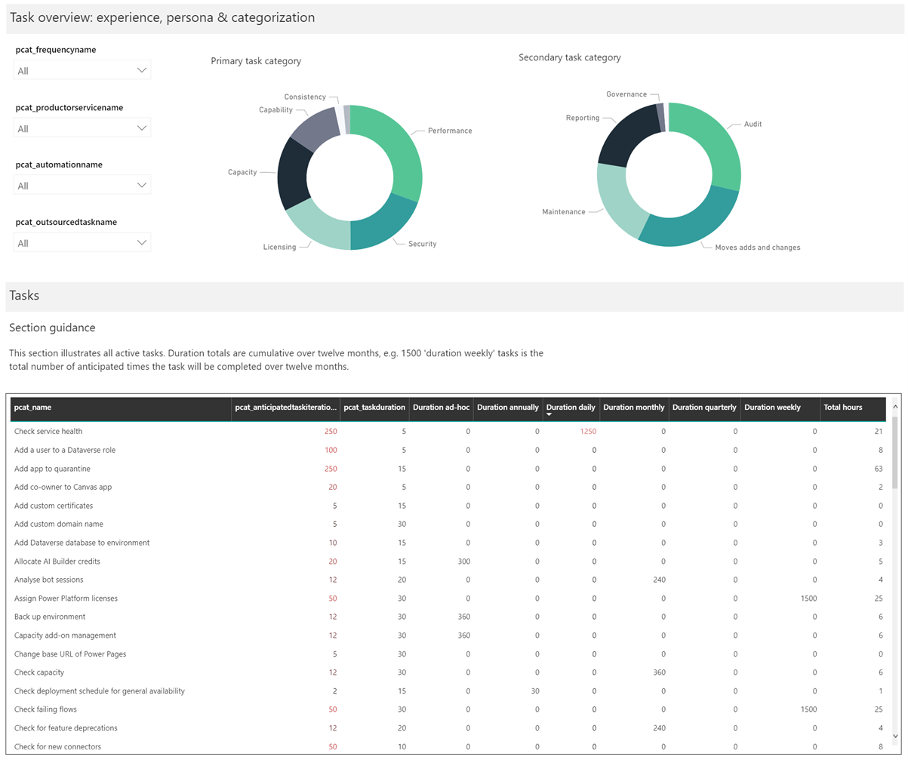

# Use Power Platform Administration Planning component

Behind the scenes, your IT and Center of Excellence team spends time configuring, managing and nurturing the adoption of Microsoft Power Platform. Understanding how that time is spent can help you plan who you need on your team and find the highest-impact opportunities to streamline the administrative effort.

The Power Platform Administration Planning is designed to help you better:

- Plan your team structure
- Review where you spend time and look for automation or innovation opportunities

Each organization has unique requirements for governance and administration of Microsoft Power Platform. The Power Platform Administration Planning solution provides insight to your administrative tasks.

- If your organization is setting up an administration team, common challenges include knowing which administrative tasks need to be performed, the frequency, how long they take, and what level of expertise is required.  The solution helps you get started by listing more than 70 common administrative tasks across the Microsoft Power Platform.

- If your organization already administers Power Platform, you can get insights into your effort, such as:
  - Where your team focuses time (for example: reporting, security, configuration)
  - Understanding how reactive / proactive your team is
  - The effects that automation and outsourcing have (or could have) on the team's workload
  - What level of experience is required to complete various administrative tasks
  - How many tasks rely on other teams and departments

## What's in the Power Platform Administration Planning component?

The solution is built on Microsoft Dataverse. Admin tasks are defined in a model-driven app and insights are provided in a Power BI dashboard.

You can start either by adding your own tasks or by importing a set of example tasks from an Excel spreadsheet, populated with some of the most common administration tasks covering:

- AI Builder
- Power Apps
- Power Automate
- Power Pages
- Power Virtual Agents
- Environments, Data Loss Prevention (DLP) policies, and connectors

Follow the steps describing how to [set up and configure](setup-admin-tasks-component.md) the Power Platform Administration Planning component.

## Update the admin task data

The dashboard and insights this solution provides derive from admin task data that you interact with via the Admin Tasks app. Launch the Admin Tasks app to manage the task list. Try to review task metadata frequently (monthly or quarterly) so that the dashboard accurately represents data.  

The table below describes the fields used to define a task:

| Column | Value type | Description |
|---|---|---|
| Name | Text | A short description of the task, for example: 'Create an environment' |
| Task description | Text | A detailed description of the task |
| Task documentation link | Text (URL format) | URL to documentation | 
| Active task | Two options (Boolean) | Specifies if the task is performed in your organization |
| Outsourced task | Two options (Boolean) | Specifies if the task is outsourced |
| Automation | Two options (Boolean) | Specifies if the task is automated |
| Frequency | Choice | Specifies the frequency that the task is performed |
| Anticipated task iterations | Number | How many times in a year you anticipate performing this task. *This column is populated by a business rule calculating the number of iterations for you based on the Frequency, unless you select 'Ad-hoc'.*|
| Duration | Number | Specifies how long the task should take to complete, in minutes |
| Experience required | Choice | Specifies the level of experience required to complete the task |
| Core admin persona | Choice | Who in the core team will primarily perform the task (for example: Environment Admin, Product Owner) |
| Peripheral admin persona | Choice | Who else is required to complete the task (for example: Azure AD Administrator, SharePoint Administrator) |
| Primary task category | Choice | Specifies the primary category for the task, for example: Security |
| Secondary task category | Choice | Specifies the secondary category for the task, for example: Reporting |
| Product or service | Choice | Specifies the product or service, for example: AI Builder, Power Apps |

## Use the Power BI dashboard

The dashboard is structured in a way to help you focus on what you do, how reactive your team is, and the effect that automation and outsourcing have on overall efficiency.

### Team, outsourcing, and automation
<!-- Jim, should we use the ::: format for images?, and if so can we please make it so they all have the gray border around them? Otherwise we should edit some of the images to have borders. I'm also going to leave the alt text to you. -->

The first section of the report contains aggregated administrative task data, illustrating:

- **Team workload**: Enter the number of team members in the dashboard input box, and based on aggregated task data (duration, anticipated number of iterations & frequency) the number of hours required per day are calculated. It's then divided by the number of team members, and 80% of an 8 hour working day to estimate if you have enough people in your team.
- **Outsourcing**: Illustrates the effect that outsourcing is having on your overall workload.  The number of tasks, expertise required, and duration (hours) are displayed.
- **Automation**: Illustrates how much time is being saved, how it translates into resources, and the expertise required.

### Task breakdown - proactive & reactive balance

This section of the report focuses on how many tasks are ad hoc (reactive). You can filter the list and analyze the percentage of tasks that have been categorized as ad hoc, to look for automation, outsourcing, or innovation opportunities.

### Task breakdown - experience & personas

This section of the report aggregates duration for all tasks, grouped by task frequency, and provides insight into:

- **Experience levels** required. Illustrates the experience required across all tasks, which can be useful in estimating training requirements for your existing team.
- **Core & peripheral** personas.  Illustrates how many tasks are assigned to the different personas in your core administration team and how many require other teams to complete.  For example, creating an environment could require the Power Platform administrator and an Azure AD administrator to create the environment and security groups for managing access.

### Task overview - categorization

Tasks are categorized to show where your team spends the most time. Tasks have a primary and secondary category to provide further insight into where your administration team spends their time.  Selecting a category refines a list of tasks to provide further insight.

[!INCLUDE[footer-include](../../includes/footer-banner.md)]