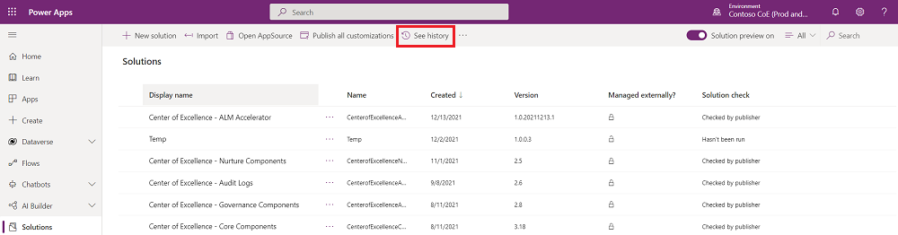
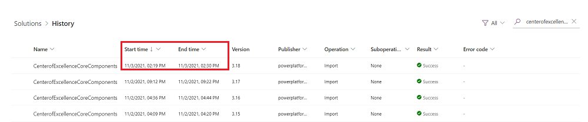
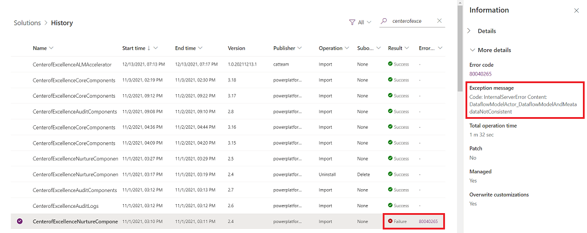

# What's next: After installing the CoE Starter kit

## Installing upgrades

The CoE Starter Kit solutions will receive monthly updates with new features, bug fixes, or optimizations. These updates will be announced as a [release](https://github.com/microsoft/coe-starter-kit/releases) on [GitHub](https://aka.ms/CoEStarterKitRepo), and can be downloaded from there or by direct download at [aka.ms/CoEStarterKitDownload](https://aka.ms/CoEStarterKitDownload). We target releasing monthly during the first full week of each month.  

>[!IMPORTANT]
>We recommend upgrading at least every three months.

Install the updates by importing the latest version to the environment where you originally installed the solution.

1. Watch releases on our [GitHub repository](https://github.com/microsoft/coe-starter-kit) to receive notifications about the latest release.
    1. Go to our [GitHub repository](https://github.com/microsoft/coe-starter-kit) and login with your GitHub user.
    1. Select **Watch > Custom**.

      
    1. Select **Releases**.

       
    1. Select **Apply**.
1. Download the latest version CoE Starter Kit compressed file ([aka.ms/CoeStarterKitDownload](https://aka.ms/CoeStarterKitDownload)).

    >[!IMPORTANT]
    > **Extract the zip file** after downloading and before moving on to the next step. The CoE Starter Kit compressed file contains all solution components as well as non-solution aware components that make up the CoE Starter Kit.
1. If you have made any changes to the flows or apps in the solution, they will not receive updates until you remove that unmanaged layer. For every flow/app that you changed but would like to receive the latest update, go to the solution layers and remove the unmanaged layer. A good indication that a component has been changed is if the modified date is more recent than the latest install. Read our recommendations for [extending the CoE Starter Kit](#extending-the-starter-kit) to avoid creating unmanaged layers.
    1. Select **... > See solution layers**.

        
    1. Select **Remove unmanaged layer**

        
1. Import the solution
    1. If [Installing to Production Environment](faq.md#installing-a-solution-in-a-production-environment) – use the solution file from the download called CenterOfExcellenceCoreComponents_x_x_x_xx_managed.zip.
    1. If [Installing to Dataverse for Teams Environment](faq.md#installing-a-solution-in-a-dataverse-for-teams-environment) – use the solution file from the download called CenterOfExcellenceCoreComponentsTeams_x_x_x_xx_managed.zip.
1. Select **Upgrade** (default setting). [Solution upgrades](/power-platform/alm/solution-concepts-alm#solution-lifecycle) will delete components that existed but are no longer included in the upgraded version.

    
1. If the upgrade adds new environment variables or connection references, establish connections and update environment variable values. You will find the expected values in our setup instructions.
1. Wait for the Upgrade to finish. This can take up to 15 mins. During the upgrade, the new version is installed first and then the old version is deleted. Whilst the upgrade is processing, you may see two solutions with the same name in your solution explorer. Check the [solution history](/powerapps/maker/data-platform/solution-history#view-solution-history) to view the progress of the upgrade.

    
  The upgrade will be complete when the end time is no longer empty.

    
1. The [solution history](/powerapps/maker/data-platform/solution-history#view-solution-history) will also show you if the upgrade has failed and why. Raise an [issue](https://aka.ms/coe-starter-kit-issues) and provide the [solution operation error details](/powerapps/maker/data-platform/solution-history#view-solution-operation-error-details).

    
1. Make sure to check the setup instructions of the solution you're upgrading to see if any new steps are necessary to use the solution and it's new features.
    1. [Setup core components](setup-core-components.md)
    1. [Setup governance components](before-setup-gov.md)
    1. [Setup nurture components](setup-nurture-components.md)

## Extending the starter kit

When you're ready to extend the CoE Starter Kit with your own ideas, you'll do so by making modifications to the solution components in your own unmanaged solution:

1. Read about solutions in our documentation, which will introduce you to the concepts in addition to notions like how to create your publisher. More information: [Introduction to solutions](/powerapps/developer/common-data-service/introduction-solutions)

1. Create a new unmanaged solution. Environment variables that are part of the CoE Starter Kit can only be used from solutions. If you save a copy of apps or flows outside of a solution, environment variables will not get picked up.

1. Choose components from the CoE Starter Kit to add to your new solution. You decide which ones you want to customize.

1. Extend the CoE Starter Kit by making modifications to the solution components in the context of your new unmanaged solution.

   > [!CAUTION]
   > It's currently not possible to extend canvas apps or flows. If you want to make customizations to apps and flows, create a copy add them to your unmanaged solution.  
   > Editing apps and flows in the managed solution will prevent you from getting changes during an upgrade. See [Installing updates](#installing-upgrades).

1. Deploy your solution to test and production. We recommend making modifications and installing updates pushed by our team to the solution in a development environment dedicated to this kit, and hosting a production environment that has the real data. If data is being accessed and contributed by other users, it's a good idea to have separate development, test, and production environments.

