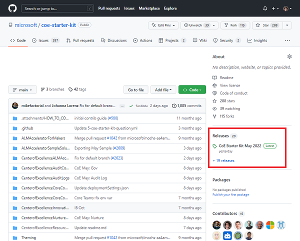
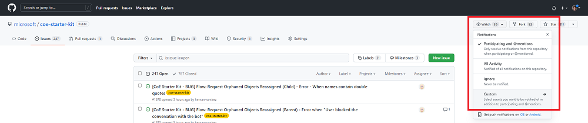
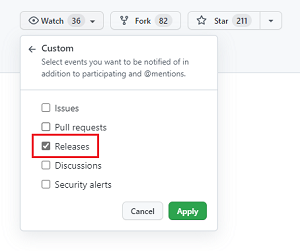
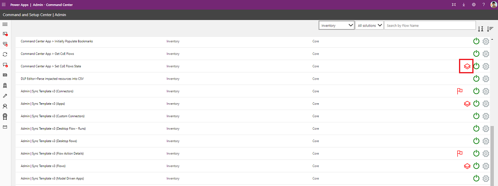
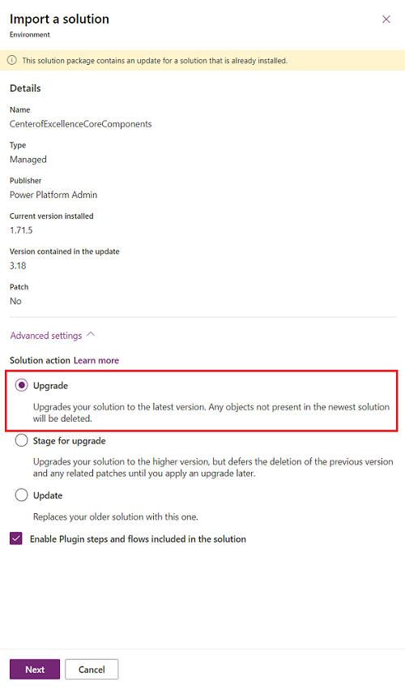

# Updating the Center of Excellence (CoE) Starter Kit

This article prepares you to upgrade the CoE Starter Kit. It provides guidance on:

- How to stay up to date with the latest release.
- How often and why to apply upgrades.
- How to install the latest release.
- How to test the latest release.

> [!NOTE]
> If you're setting up the CoE Starter Kit for the first time, check out our [setup instructions](setup.md). If you're looking to extend the CoE Starter Kit with your own customizations, refer to our guidance for [extending the CoE Starter Kit](modify-components.md).

>[!IMPORTANT]
> We recommend upgrading the CoE Starter Kit solution at least **every three months**. With the fast pace of change for Microsoft Power Platform, leaving updates longer than three months could result in unexpected issues when you do update.

## How often new versions are released

A new version of the CoE Starter Kit is released monthly, usually in the first full week of each month. This release cadence is important to know so you can review, organize, plan, and test the latest version.

Updates (bug fixes, enhancements, new features, and deprecations) are announced through [GitHub release notes](https://github.com/microsoft/coe-starter-kit/releases).

### GitHub release notes

Each release of the CoE Starter Kit is accompanied with a release note that details bug fixes and enhancements addressed by the release. You should review the release note prior to installing the new version in your organization.

#### Viewing release notes

To view the details of a release:

1. Navigate to the [CoE Starter Kit repository](https://github.com/microsoft/coe-starter-kit) in GitHub.
1. Select the [latest release](https://github.com/microsoft/coe-starter-kit/releases) notes.

   

Release notes contain a change log of issues (bug fixes and enhancements) addressed by the new version and may also include specific upgrade instructions that are new for the release. This could mean turning on a new flow or notes on deprecated features.

#### Subscribe to CoE Starter Kit releases

Watch releases on our [GitHub repository](https://github.com/microsoft/coe-starter-kit) to receive notifications about the latest release.

1. Sign in to your GitHub account.
1. Go to our [GitHub repository](https://github.com/microsoft/coe-starter-kit).
1. Select **Watch** > **Custom**.

    
    
1. Select **Releases**.

     
     
1. Select **Apply**.

### How often should you update the CoE Starter Kit?

Here are questions to consider when deciding your update frequency:

- Does the new release **resolve an issue** that you currently have?
- Does the new release **contain a new feature** that you would like to try out?
- Was your current version installed **more than three months** ago?

With the fast pace of change for Microsoft Power Platform, leaving updates longer than three months could result in unexpected issues when you do update.

>[!TIP]
>Review releases monthly by subscribing to release notes.

## Installing updates

Below are step-by-step instructions on how to install the latest version of the CoE Starter Kit.

### Download the latest solution file

First, read the [latest release notes](https://github.com/microsoft/coe-starter-kit/releases).

Download the latest version of the CoE Starter Kit compressed file ([aka.ms/CoeStarterKitDownload](https://aka.ms/CoeStarterKitDownload)).

> [!IMPORTANT]
> **Extract the zip file** after downloading and before moving on to the next step. The CoE Starter Kit compressed file contains all solution components and nonsolution aware components that make up the CoE Starter Kit.

### Remove unmanaged layers from inventory flows

Before installing the upgrade, check that the solution is in a healthy state to receive the new updates.

Making any changes to flows or apps in the solution creates an unmanaged layer. Components with unmanaged layers won't receive updates until you remove that unmanaged layer. Learn more: [Solution layers](/power-platform/alm/solution-layers-alm)

All flows with *Admin \| Sync Template v* in the name are responsible for collecting your tenant's inventory and building the foundation that the CoE Starter Kit relies on. These flows shouldn't be customized. If you have additional requirements on what inventory to collect, raise a [feature ask](https://github.com/microsoft/coe-starter-kit/issues/new?assignees=&labels=coe-starter-kit%2Cenhancement&template=3-coe-starter-kit-feature.yml&title=%5BCoE+Starter+Kit+-+Feature%5D%3A+FEATURE+TITLE) or create your own flow. Learn more: [Extending the CoE Starter Kit](modify-components.md)

Your first check before installing the upgrade is removing unmanaged layers from the inventory flows.

>[!NOTE]
>You may have unknowingly created an unmanaged layer by selecting **Edit** to look at flow actions or by modifying the run-only properties of the flow.

You can check for unmanaged layers on the inventory flows using the [Coe Admin Command Center](core-components.md#coe-admin-command-center) app.

1. Open the **CoE Admin Command Center** app from your CoE environment.
1. Select **CoE flows** from the navigation.
1. Check if any of the flows show the layer icon, indicating they have unmanaged layers

   

1. Select the layer icon to go to the solution layer page of the flow and remove the unmanaged layer.

   

### Removing other customizations

Any cloud flow or canvas app that you've changed won't receive updates until you remove the unmanaged layer.

1. If you want to keep your changes, learn more about how to [extend the CoE Starter Kit](modify-components.md).
 
1. If you don't want to keep your changes, remove all unmanaged layers prior to the update. A good indication that a component has been changed is if the modified date is more recent than the latest install. Read our recommendations for [extending the CoE Starter Kit](modify-components.md) to avoid creating unmanaged layers.
   
   1. Select the ellipsis (**...**) > **See solution layers**.
        
      
        
   1. Select **Remove unmanaged layer**.
        
      

## Importing the new solution version

Once you've removed unmanaged layers, you can import the new solution version:

1. [Import the solution](faq.md#installing-a-solution-in-a-production-environment).
 
1. Select **Upgrade** (default setting). [Solution upgrades](/power-platform/alm/solution-concepts-alm#solution-lifecycle) delete components that existed but are no longer included in the upgraded version.
 
   
    
1. If the upgrade adds new environment variables or connection references, establish connections and update environment variable values. You'll find the expected values in our [setup instructions](setup-core-components.md).
 
1. Wait for the upgrade to finish. This can take up to 15 minutes. During the upgrade, the new version is installed first and then the old version is deleted. While the upgrade is processing, you may see two solutions with the same name in your solution explorer. Check the [solution history](/powerapps/maker/data-platform/solution-history#view-solution-history) to view the progress of the upgrade.
 
   
    
1. The upgrade will be complete when the end time is no longer empty.
 
   
    
1. The [solution history](/powerapps/maker/data-platform/solution-history#view-solution-history) will also show you if the upgrade has failed and why. [Raise an issue](https://aka.ms/coe-starter-kit-issues) and [provide the solution operation error details](/powerapps/maker/data-platform/solution-history#view-solution-operation-error-details).
 
   

1. After the solution import is successful, open the **Center of Excellence - Core Components** solution.
1. Open the **CoE Setup and Upgrade Wizard** app.
1. This app provides a guided step by step experience through the configuration steps. During an upgrade, it will show you the solution history, any components with unmanaged layers and any new apps, flows and environment variables that have been added during this upgrade.

1. Once you have finished this step, move on to [testing](#testing-strategy).

## Updating the Audit Log solution

Connections to custom connectors have to be re-established after solution upgrade. If you're using the Audit Log solution, [reset the connection](https://github.com/microsoft/coe-starter-kit/issues/1424) to the custom connector.

## Testing strategy

As with installing any update, testing prior to installation in a production environment increases the likelihood of success.

> [!IMPORTANT]
> Testing is important as it provides you with an opportunity to try out new features and confirm bug fixes work as expected. Doing this in an isolated environment protects production versions.
> 
> Create a dedicated testing environment for CoE Starter Kit updates.

Below are some recommendations:

- Create a dedicated testing environment.
- Test and production environments should have the same versions of the CoE Starter Kit installed.
- Test and production environments should have the same customizations installed.
- Document test patterns and expected outcomes. Make sure you've covered all possible combinations that might fail.

Example test pattern:

| Reference | Test | Expected outcome | Result |
|-----------|------|------------------|--------|
| 1 | Enable: Admin - Sync Template v3 flow | Turn on successfully | Pass |
| 2 | Launch: CoE Admin Command Center | App successfully launches | Pass |

### Testing with users

When you've completed your functional tests, you should run final tests with users of the CoE Starter Kit. This helps ensure that your update doesn't introduce unexpected results.

### If you have an issue

If you find a bug or an issue when testing, you can [raise a bug here](https://github.com/microsoft/coe-starter-kit/issues/new?assignees=Jenefer-Monroe&labels=coe-starter-kit%2Cbug&template=1-coe-starter-kit-bug.yml&title=%5BCoE+Starter+Kit+-+BUG%5D+ISSUE+TITLE), ensuring to provide the [solution operation error](/powerapps/maker/data-platform/solution-history#view-solution-operation-error-details) details.

## Application lifecycle management

This document doesn't go deep into application lifecycle management (ALM). If you're interested in recommendations and scenarios, review the [overview of application lifecycle management with Microsoft Power Platform](/power-platform/alm/overview-alm). ALM covers many disciplines. This document touches lightly on the discipline of deploying solutions.

### ALM accelerator for Power Platform

The [ALM accelerator for Power Platform](almacceleratorpowerplatform-components.md) is a reference implementation that sits on top of Azure Pipelines and Git source control.  

The ALM Accelerator for Power Platform includes a canvas app that provides a simplified interface for makers to regularly export components in solutions to source control, and create deployment requests.

### Microsoft Power Platform Build Tools

The [Microsoft Power Platform Build Tools for Azure DevOps Services](/power-platform/alm/devops-build-tools?msclkid=147921b0c15611ecbb1fdca93966d349) automate common build and deployment tasks. They can be used with any other Azure DevOps tasks to compose build and release pipelines.

[Download](https://marketplace.visualstudio.com/items?itemName=microsoft-IsvExpTools.PowerPlatform-BuildTools&msclkid=d4b015ebc16e11ecb673fbfc869800f3) the tools, and refer to the [tasks documentation](/power-platform/alm/devops-build-tool-tasks) to get started.
