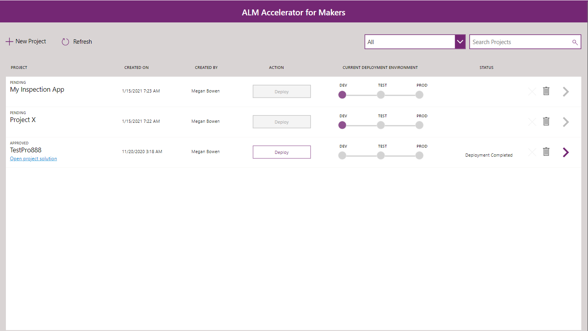
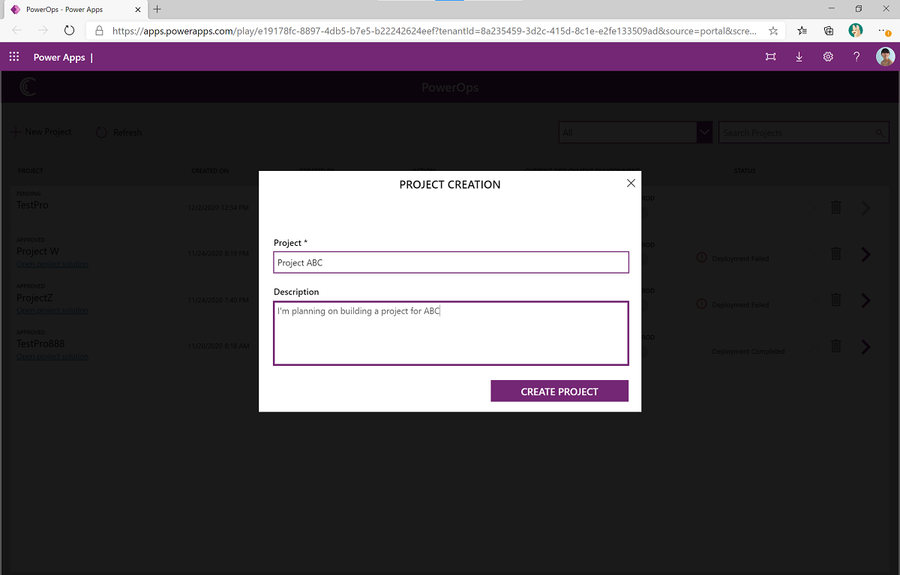
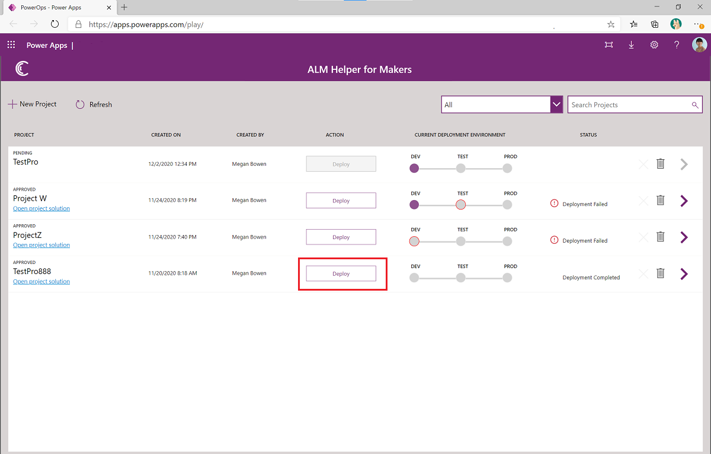
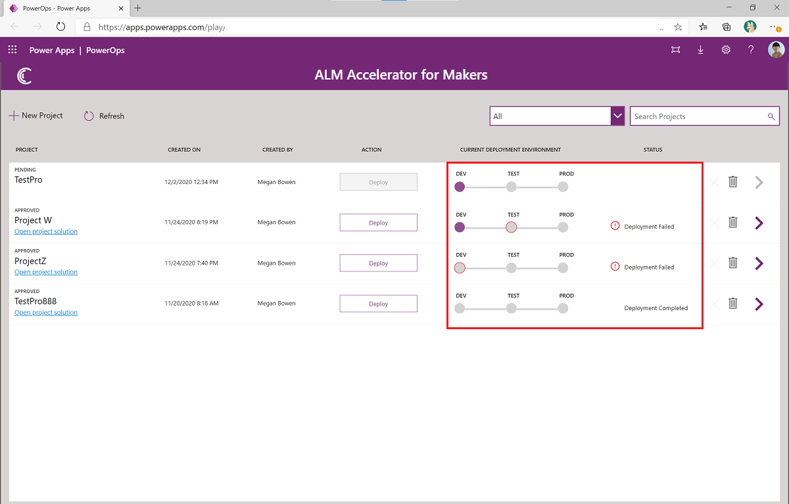
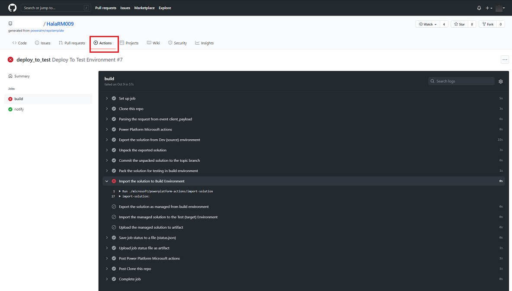
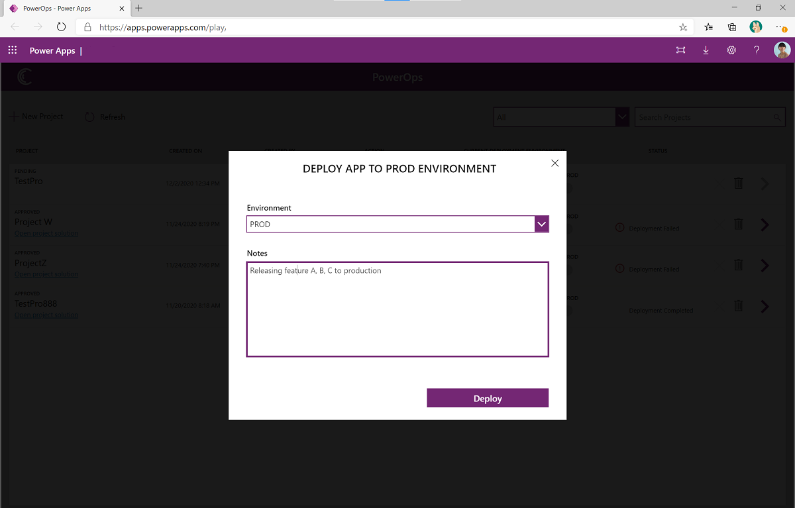
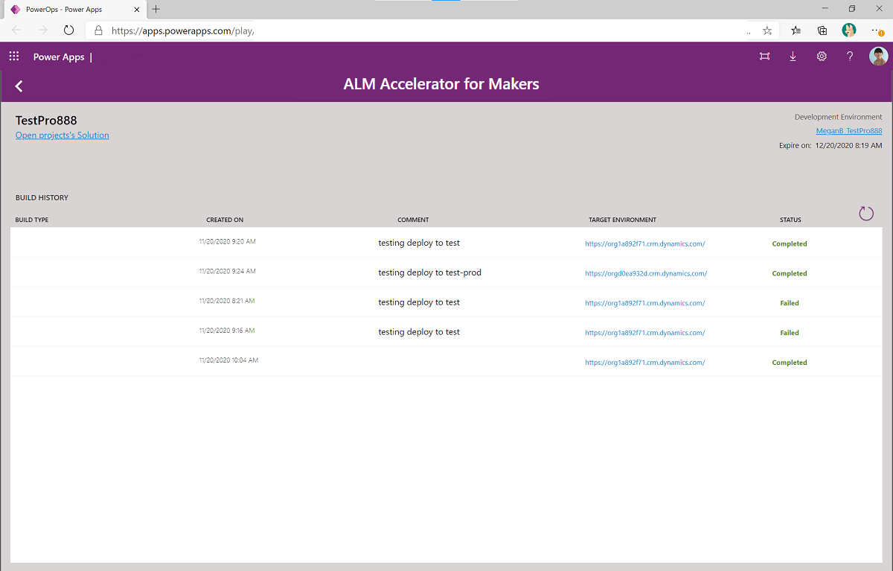

# Use the ALM Accelerator for Makers app

> [!IMPORTANT]
> The ALM Accelerator for Makers components are for reference only. For more robust deployment configurations including components that need to be configured as part of or after the solution deployment, it's recommended to use the ALM Accelerator for Power Platform. The GitHub integration in the ALM Accelerator for Makers will eventually be replaced by functionality in the ALM Accelerator for Power Platform, but remains as part of the CoE Starter Kit for reference. More information: [Set up ALM Accelerator for Power Platform components](setup-almacceleratorpowerplatform-cli.md) and [Use ALM Accelerator for Power Platform components](almacceleratorpowerplatform-components.md)

Use the ALM Accelerator for Makers app to follow ALM patterns and practices for source control, and move your solutions from development to test to production environments by using GitHub. More information: [Set up ALM Accelerator for Makers components](setup-almaccelerator.md)

ALM Accelerator for Makers enables makers to apply source control strategies by using GitHub, and use automated builds and deployment of solutions to their environments without the need for manual intervention by the maker, administrator, developer, or tester. In addition, ALM Accelerator for Makers provides makers the ability to work without intimate knowledge of downstream technologies and switch quickly from developing solutions to implementing source control for the solution&mdash;and, ultimately, pushing their apps to other environments with as few interruptions to their work as possible.

Makers can use the ALM Accelerator for Makers app to view all their projects, and deploy their work-in-progress or completed solution to a test or production environment. After a new project has been created and approved, makers can go to [make.powerapps.com](https://make.powerapps.com) to build and create assets&mdash;such as apps, flows, and tables&mdash;in a solution that has been created for them.

**Prerequisite**: This app uses Microsoft Dataverse; a Premium license is therefore required for every app user.

1. Go to [make.powerapps.com](<https://make.powerapps.com>).
1. On the left pane, select **Solutions**.
1. Select the **Power Platform GitHub ALM** solution, and then select **ALM Accelerator for Makers**. You might need to open the app in a private browser session if the app fails to load.

The app dashboard shows all projects created by your user.

## Request approval for a new project

- Select **New Project** to create your first project.
- Enter a name and description (optional), and then select **Create Project**.

When a user submits this request, an Approval request is sent to a predefined administrator. The admin will review the request, and approve or reject it. After a project is created and approved, go to the maker portal to build and create resources (apps, flows, tables, and so on) under the newly created solution for your project.

## Create an environment and GitHub repository

When an administrator approves a project, a new environment with a Dataverse database is created. This environment is dedicated to the maker and their solution. By default, this developer environment is set to expire in 30 days, but users can request an extension.

A GitHub repository is also created. This repository will be used to persist all of the resources of the project contained in the solution.

## Open your project

When a project is approved, the **Deploy** button is activated and a link to the solution is shown. A user can go to the maker portal directly and open their solution in the newly created environment.

## Deploy your project to test

A maker can deploy to a test environment at any point during their development phase. No approval is required for a maker to deploy a test environment. When deploying to test, the solution for this project is also checked in to the GitHub repository under a developer branch.

## View deployment status

ALM Accelerator for Makers will show the status of the deployment. When a deployment is completed or fails, both the admin and the app maker will receive an email notification with the details. If the deployment is successful, the notification email will have links to the environment where the solution has been deployed.  

## View build details

Admins can monitor progress step by step on the **Actions** tab of the GitHub repo. They can also check out the cloud flows used to orchestrate the deployment.

## Deploy your project to production

Before a maker can deploy their project to production, the project must have been successfully deployed to the test environment. An approval from an administrator is required to deploy to a production environment. When deploying to test, a pull request is created and when the deployment request is approved, the solution for the project is merged into the main branch in the GitHub repo.

## View deployment history

Makers can check the deployment history for their project by navigating to the detail pages for their project (by using the **>** arrow).

[!INCLUDE[footer-include](../../includes/footer-banner.md)]
