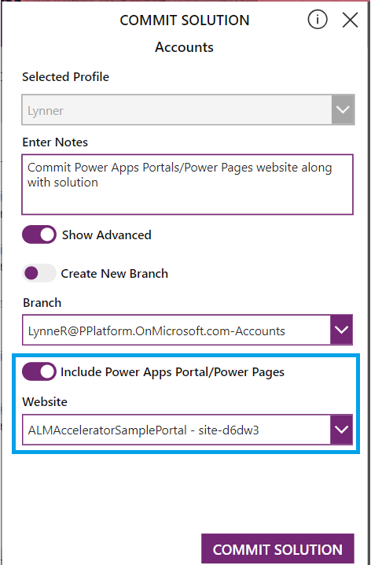
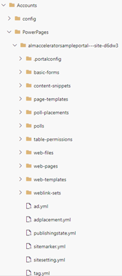
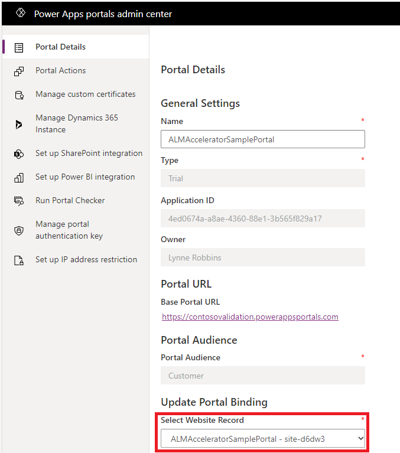
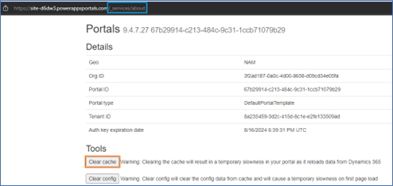

# Power Apps Portal/Power Pages website ALM using ALM accelerator

> [!NOTE]
> The ALM accelerator for Microsoft Power Platform is currently in public preview. Go to [our GitHub repo](https://github.com/microsoft/coe-starter-kit/CenterofExcellenceALMAccelerator/PREVIEW.md) to see the items to be completed prior to general availability.

The application lifecycle management (ALM) accelerator components enable makers to apply source-control strategies with Azure DevOps and use automated builds and deployment of solutions to their environments without the need for manual intervention by the maker, administrator, developer, or tester. In addition, the ALM accelerator helps makers work without intimate knowledge of downstream technologies and switch quickly from developing solutions to source-controlling the solution and, ultimately, pushing their apps to other environments with as few interruptions to their work as possible.

With the ALM Accelerator, you can source control your Power Apps Portal/Power Pages website, transport them to downstream environments and include them during solution commit. 

## Prerequisites for Power Apps Portal/Power Pages website ALM

- An active website of either Power Apps Portal/Power Pages. Go to [Power Apps portals](/power-apps/maker/portals/overview) or [Power Pages](https://powerpages.microsoft.com) to create a website.
- ALM accelerator for Power Platform app. Go to [ALM accelerator for Power Platform app](almacceleratorpowerplatform-components.md)

## Including Power Apps Portal/Power Pages website during solution commit

Follow these steps to include ower Apps Portal/Power Pages website during solution commit:

1. During the solution commit, on the 'COMMIT SOLUTION' pane, toggle **Include Power Apps Portal/Power Pages** to **Enabled**.
1. Select the website from the **Website** dropdown and click on **COMMIT SOLUTION**

   

1. Once the 'Commit' is successful, a folder with downloaded website contents with convention "Solution_name\PowerPages\Site_Name" gets created under the Repository branch.

   

## Upload Power Apps Portal/Power Pages website to downstream environments

No additional steps are required to upload Power Apps Portal/Power Pages website to downstream environments. Use the [ALM accelerator for Power Platform app](almacceleratorpowerplatform-components.md) **DEPLOY SOLUTION** option which will upload of Power Apps Portal/Power Pages website to your downstream environments.

## Complete Power Apps Portal/Power Pages website set up post deployment

Follow these steps to update the website binding once the Power Apps Portal/Power Pages website has been deployed to your downstream environments:

1. Open **Power Apps portals admin center**. [Steps to open Power Apps portals admin center](/power-apps/maker/portals/overview)
1. Under the 'Update Portal Bindings', select the website which got transported from your maker/dev environment and click on **Update**

   

## Be aware of configuration cache

If your changes are not reflected on the website post deployment, you will need to clear the configuration cache:

### Restart the Portal in Portal Admin Center

1. This is easier for admins.
1. Open **Power Apps portals admin center**. [Steps to open Power Apps portals admin center](/power-apps/maker/portals/overview).
1. Go to Portal Actions > Restart.

### Use browse/preview button in studio

1. This is the easiest for makers and admins and minimum down time.
1. Be careful not to change anything and close the studio tab right away.

### Service page for site administrator users

1. This requires more setup and planning but is likely the safest feature.
1. Authenticate to the site and assign the resulting contact record has the Administrator Web Role. You can then go to the Site URL + "/_services/about" in your browser where you can select the **Clear cache** button. 

   

1. Refresh the website in your browser to see the changes. 
