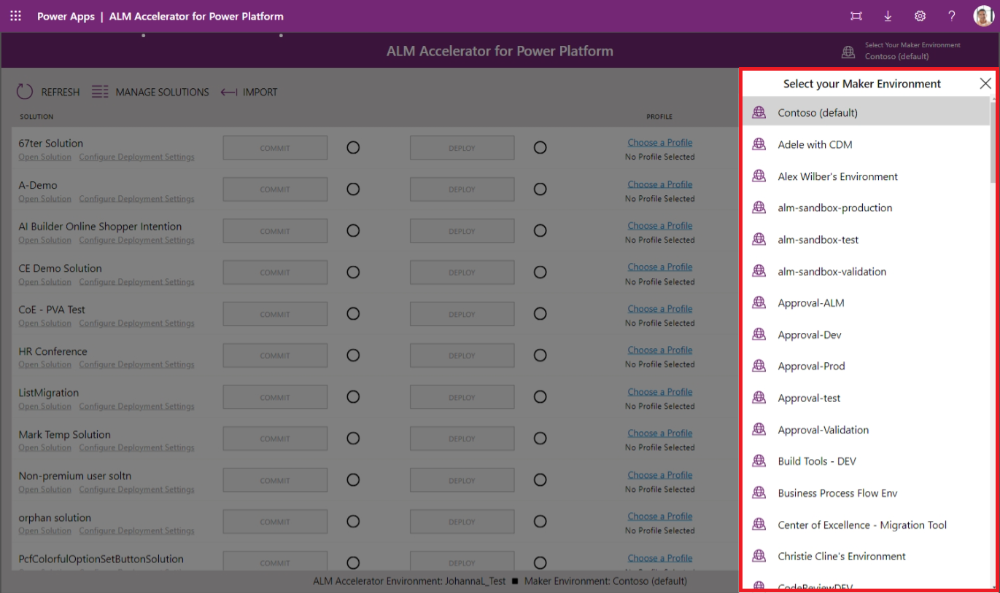
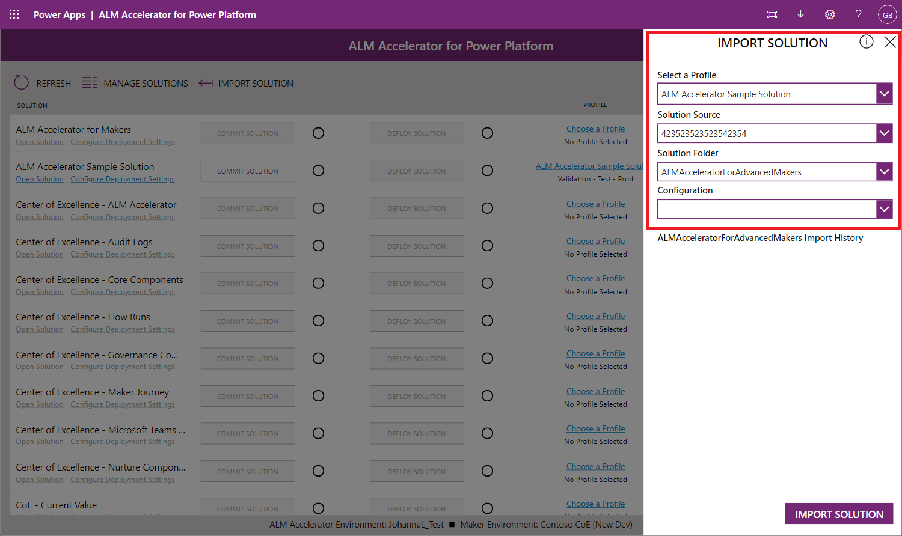
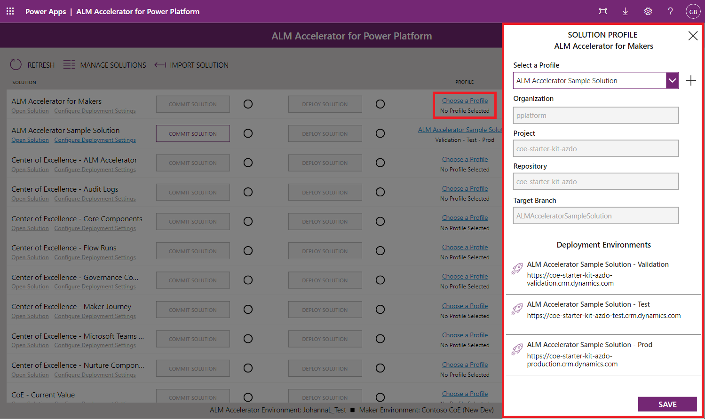
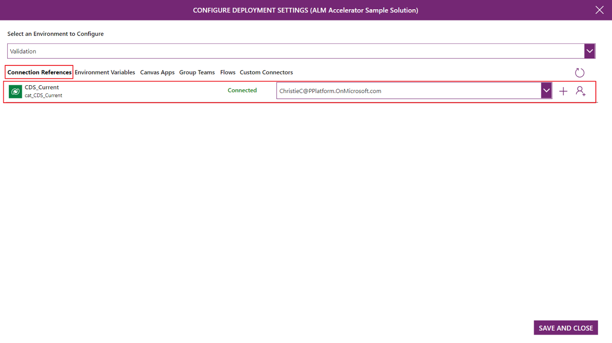
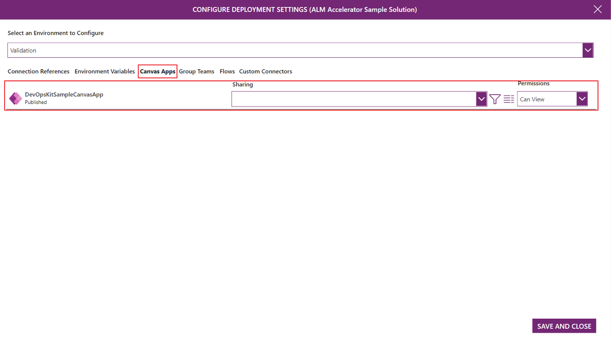
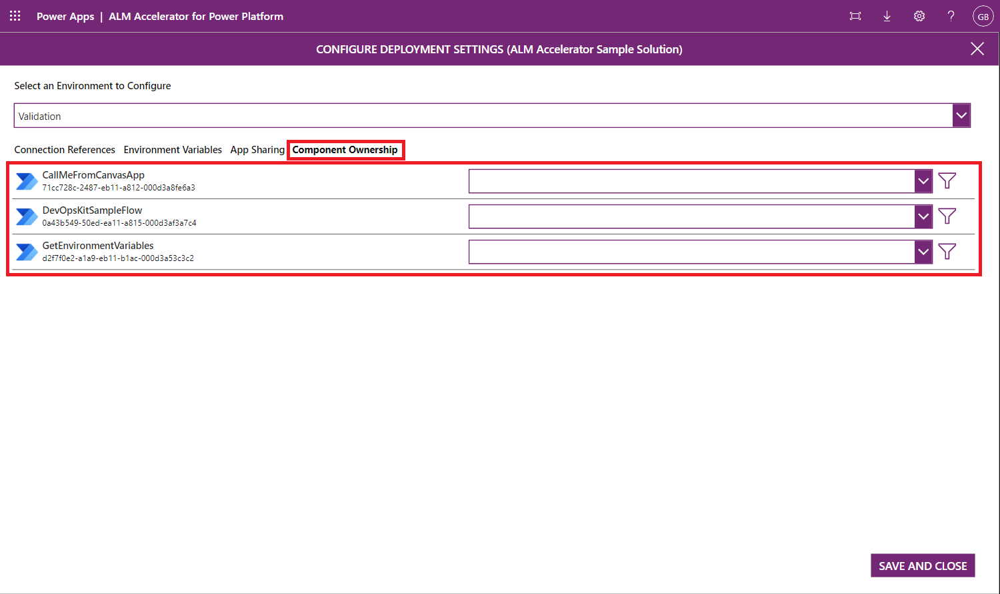
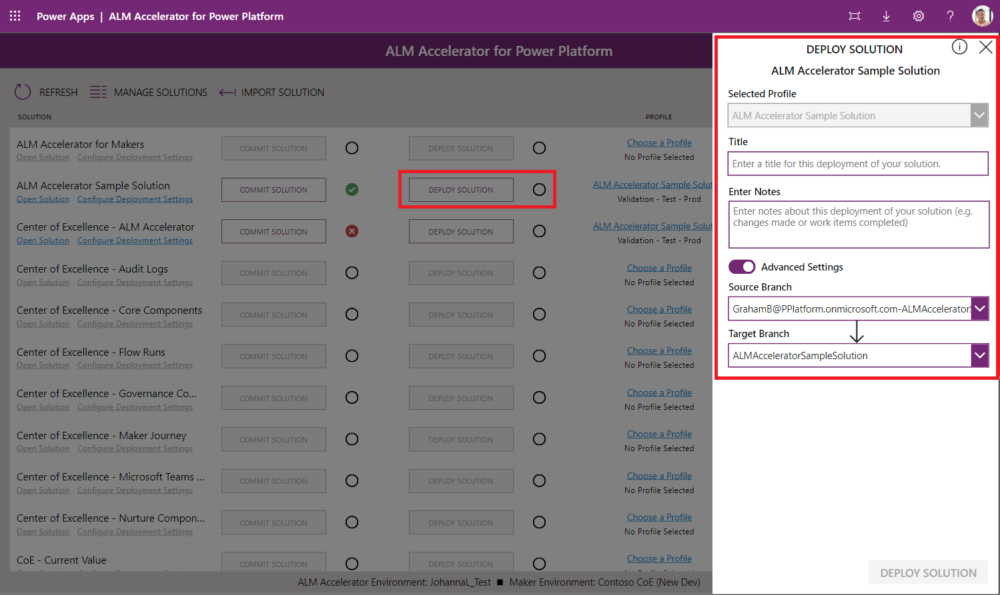
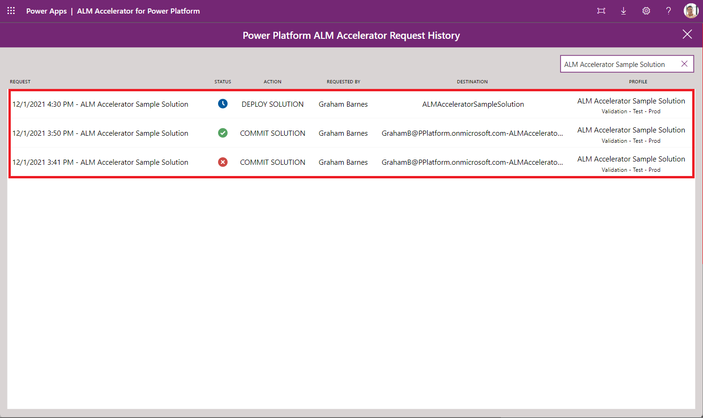

# ALM Accelerator for Power Platform Advanced Maker Experience (Preview)

> [!NOTE]
> ALM Accelerator for Power Platform is currently in public preview. Please see Issues currently tagged as [vnext](https://github.com/microsoft/coe-starter-kit/issues?q=is%3Aopen+is%3Aissue+label%3Aalm-accelerator+label%3Avnext) for the Roadmap to be completed prior to general availability. While in Public Preview it can be expected that there will be breaking changes and frequent updates to address feedback from preview members. Additionally, the Public Preview is reliant on the experimental [Power Apps Source File Pack and Unpack Utility](https://github.com/microsoft/PowerApps-Language-Tooling) that is being developed separately from AA4PP.

## Demo: ALM Accelerator Advanced Maker Experience

Watch how to use the ALM Accelerator for Power Platform solution
[Demo Videos](https://github.com/microsoft/coe-starter-kit/CenterofExcellenceALMAccelerator/WALKTHROUGHS.md)

## Walkthrough: ALM Accelerator Advanced Maker Experience

1. Once you have installed and configured the app, launch it from your Environment under Apps.

1. When prompted to create connections / grant consent create the necessary connections or accept the consent dialog.

1. When prompted with the following screen enter 'https://graph.microsoft.com' for both the **Base Resource URL** and **Azure AD Resource URI**

      

1. The first time you open the app you will be asked to select an environment. Next time you open the app, it will remember which environment you were working on.

    

1. Once the environment is selected, the main screen will display a list of all the **unmanaged solutions** in the environment. Depending on the *user deployment settings*, your user has assigned you will be able to see the following options for each solution:

    - **Commit Solution**: It commits all the changes you have done within the solution in your version control system.
    - **Deploy Solution**: Allows you to move the changes across environment.
    - **Choose a Profile**: Allows you to configure what **Organization**, **Project**, **Repository**, **Target Branch**, and **Environments** your solution can be deployed to.
    - **Delete a solution**: Deletes the solution allowing you to reimport if necessary from source control again with latest changes.
    - **Request History**: (right chevron icon): Provides a list of requests (commits and deployments) done for that solution.

   

1. You can now create a new solution from the maker portal or also import an unmanaged solution from an existing DevOps project to begin making changes to it. To import a solution, use the **Import Solutions** button and select a **Profile, Solution Source, Solution Folder and Configuration (Optional)**.

   - **Profile** the configured profiles your user has access to, this profile points to an organization and project in DevOps.

   - **Solution Source** is based on the branches in DevOps for the Project you selected in the configuration.

   - **Solution Folder** is a list of folders in the selected branch that contain a **SolutionPackage folder** from a previous export.

   - **Configuration** is a directory under the config directory in the Solution Folder that contains deployment settings and configuration data. For more information on configuration settings, see the [Deployment Configuration Guide](setup-almacceleratorpowerplatform-deployment-config.md)

    > [!NOTE]
    > The idea here is that you're either pulling the latest from the Solution branch or possibly want to pull another makers branch into your own environment. The configuration allows you to ensure that all of the necessary post solution import configuration and data exists in your environment.

   

1. Once you have created or imported your solution, you are going to need to choose a **solution profile** to the solution so you can associate the solution to a specific **Organization**, **Project**, **Repository**, **Target Branch**, and **Environments** where you will be able to deploy the solution into

   

    > [!NOTE]
    > Depending on wether you are an admin or not, you will be able to create new deployment profiles from here. If you are a maker the likelihood is that an administrator from your organization has made some profiles available for you to choose from. If still nothing suits what you want, you will need to work with your administrator to request a new profile.

1. Once you have a profile associated, you can also begin to configure your solution for deployment. **Select the Configure Deployment Settings link** under the name of the Solution. On the configuration deployment page, you'll see the following items

   - Deployment Environments

     

     - The environments listed are the one configured in the deployment steps in the deployment profiles created by the administrator.

   - Connection References

      

      - This screen lists all of the connection references in your solution and allows users to create connections in their downstream environments to hook up the connection references in the target environment.
      - To create a new connection **select the + button**.
      - After creating a new connection, **select the refresh button** in the top right to get the latest list of connections.
      - To select an existing connection in the target environment **select a connection from the dropdown list**.
      - To Navigate to the connection in the target environment **select the name or the status of the connection**.

   - Environment Variables

      

      - This screen lists all of the environment variables in your solution and allows users to set the value of the environment variables in the downstream environment.
      - For standard environment variables (for example String, Number, JSON) **enter the value in the text box** to the right of the environment variable name
      - For data source environment variables **use the dropdowns to select the appropriate data source** to use in the downstream environment.

   - App Sharing

      

      - This screen lists all of the apps in your solution and allows users to share the apps in the downstream environment with an Azure AAD Group.
      - Use  the dropdown to **select the Azure AAD group** with which you'd like to share the app.
      - To view the Group details **select the details icon**. This button will launch a new browser window with a link to the AAD Group in the Azure portal.
      - To set the permissions **select the permissions dropdown** and set the permissions to either Can View, Can Edit or Can View and Share.

   - Component Ownership

      

      - This screen lists all of the Flows in your solution. Users can configure the owner of the Flow in the downstream environment by selecting a Dataverse user.
      - Use  the **dropdown to select a Dataverse user** to own the Flow in the downstream environment.
      - To view the Flow **select the name of the Flow** to open a new window with the Flow Definition.

1. Once you've configured your solution, you can push your changes to Git using the **Commit Solution** button for your solution. Depending on the permissions you are given, you will see here a toggle to **Show Advanced** options. Show Advanced allows you to choose an existing branch or to create a new one with a specific naming convention. When not given permission to these options the app will create a new branch based on your username and **deployment profile** data.

    > [!NOTE]
    > Be sure to publish any App changes before initiating the push

   - Select an **existing branch** or **create a new branch** based on an existing branch and enter a **comment**. Use the hashtag notation for example `#123` to link the changes to a specific work item in DevOps and Select **Commit**.
     

   - When the push begins, a waiting indicator will appear. If the push is successful, a checkbox will appear otherwise a red x will appear. To see the progress of your push, select the progress indicator, which will take you to the running pipeline in DevOps.
   - Repeat the pushes as you iterate on your solution.

    > [!NOTE]
    > Using the progress icons links to visualize what is happening in the pipelines in DevOps can be disabled for makers.

1. Once you have finished the changes in your solution and you are ready to deploy them across other environment use the **Deploy Solution** button.

    > [!NOTE]
    > Be sure to publish any App changes before initiating the push

    Depending on the permissions, you will see the **Advanced Settings** toggle.

   - With the **Advanced Settings** toggle off, choose the environment you want to deploy to and use the **Deploy Solution** button.

       

   - Using the **Advanced Settings** Specify the Source and Target branch and enter a Title and Comment for your Pull Request and use the **Deploy Solution** button.

       

1. Once you deploy the solution the next things that happen is going to depend on the **approval type** of the **deployment step**.

    - **Pull Request**: A Pull Request is created for your changes, the remaining steps to Merge and Release to Test occur in DevOps. Depending on the Branch Policies and Triggers configured for your Target Branch, an DevOps user can approve or reject your Pull Request based on their findings in the submitted changes. The status of the Pull Request will appear in the App.

    - **Environment**: The pipeline to deploy the solution to the target environment will be triggered, the remaining approval steps will occur in DevOps.

1. To initiate a **solution upgrade** in the target environment, you can tag a Pull Request with the **solution-upgrade** tag.

      

1. Approving the PR or the pipeline execution (depending on the approval type selected for the step/environment) will start the deployment of your solution to the selected environment. If you get the approval for either your PR or pipeline execution, you'll see the progress indicator state the deployment has started. You can also use the right chevron icon to visualize the request history.

      

1. For Production, you can either need to go into **advanced settings** for the deployment and choose the main branch used to trigger the deployment to production or create the PR directly in DevOps
[!INCLUDE[footer-include](../../includes/footer-banner.md)]
