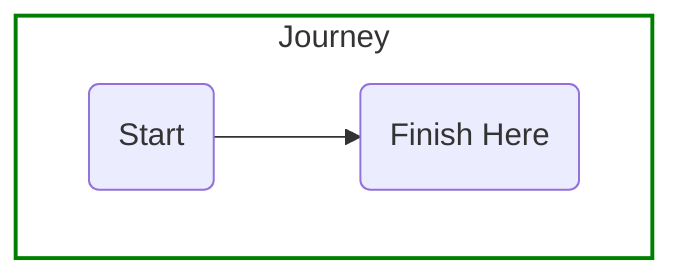
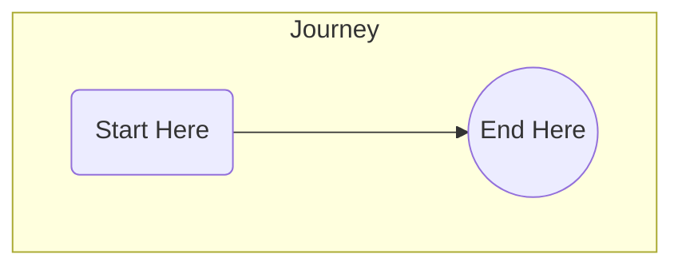

# CoE CLI development documentation (Deprecated)

> [!NOTE]
> The CoE CLI is deprecated and will be removed in a future release. Use the [Power Platform Project Setup Wizard](../../../alm-accelerator/setup-admin-tasks.md) to set up and manage your ALM Accelerator for Power Platform projects.

Documentation is key to understanding how the CLI works. As you add new commands, consider the following documentation:

- [Add markdown pages](#add-markdown-pages) - Describes the functionality for end users.
- [Recording the command line](#recording-command-line) to demonstrate the process.

## Add markdown pages

Add new pages to [help](https://github.com/microsoft/coe-starter-kit/tree/main/coe-cli/docs/help/overview.md) that describes the new command and explains to the user the expected usage.

Consider adding the following to the page:

1. Static images that summarize the operation.

1. [Recording command line](#recording-command-line) to demonstrate the process.

## Diagrams

For decision trees, the diagrams are generated via [mermaid](https://mermaid-js.github.io/mermaid).

Example diagrams:

- [Maturity](/power-platform/guidance/coe/cli/alm/maturity/maturity.svg)

- [AA4PP decision tree](/power-platform/guidance/coe/cli/alm/maturity/decision-tree.svg)

### Diagram styles

To style the diagram **sample.mmd**.

1. Use subgroup styles.



1. Apply CSS styles with a file in the same folder. For example, in the above sample, create **sample.css** in same folder as the mmd file.

```css
#L-start-finish path {
   stroke: red
}
```

#### Notes

1. Review the [node shapes](https://mermaid-js.github.io/mermaid/#/flowchart?id=node-shapes) to control the symbols displayed.

1. Circles can be styled using following approach.



To color the end circle green using css [starts with a selector](https://www.w3schools.com/cssref/sel_attr_begin.asp). This is required as each item will have a unique ID assigned by mermaid.

```css
[id^=flowchart-finish] circle {
   stroke: green;
   fill: lightgreen
}
```

1. Coloring a line. Each line will have the format L-start-finish for the `path`, which is the line and the class `.path`, which is the line around the arrow head.

```css
#L-start-finsh path,
#L-start-finsh .path
 {
   stroke: green;
}
```

### Update diagrams

The static images for each diagram are generated as follows.

1. Go to the **coe-cli** folder.

```bash
cd coe-cli
```

1. Generate static files.

```bash
npm run diagrams
```

## Add help pages

Add new help pages to [help](https://github.com/microsoft/coe-starter-kit/tree/main/coe-cli/docs/help/overview.md). Each page in help provides detailed information on the command and options. The help markdown file can be accessed using the help command that will display the associated help markdown file in the console window.

```bash
coe help alm
```

The command above will display the contents of the [help](https://aka.ms/coe-cli/help/alm).

## Recording command line

To include a short animated recording of commands that demonstrate the expected output, you can use the following process.

1. Install termtosvg in a Unix based terminal.

```bash
pip3 install --user termtosvg
```

This process will work cross platform and any of the following options can be used:

- Native Unix shell on macOS or Linux distributions.

- Docker images with a Unix shell.

- [Windows subsystem for Linux](/windows/wsl/install-win10) on Windows.

1. Record the session to a cast file.

```bash
termtosvg record test.cast
```

The generated cast file is a simple text file that can be edited with any text editor.

1. Remove pauses using [term-trim.ps1](https://github.com/microsoft/coe-starter-kit/tree/main/coe-cli/scripts/scripts/term-trim.ps1).

```bash
./term-trim.ps1 -Input test.cast -Output test2.cast -Trim 1

```

1. Generate the svg file.

```bash
termtosvg render test2.cast test.svg -t window_frame
```

[!INCLUDE[footer-include](../../../../includes/footer-banner.md)]
