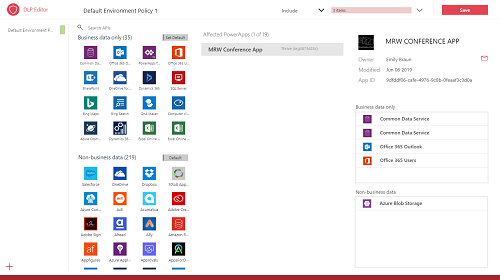
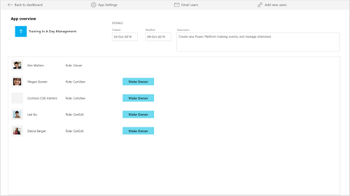

<!---KATHY SAYS: Manuela, I actually had never looked at the metadata in any of the docs I have reviewed for you. I am wondering if Search.App needs to be updated. Also, shouldn't you name by on the authors list?--->
# Use Core components

These components provide the core to get started with setting up a CoE – they sync all your resources into entities and build admin apps on top of that to help you get more visibility of what apps, flows and makers are in your environment. Additionally, apps like the DLP Editor and Set New App Owner help with daily admin tasks.  The Core Components solution contains assets relevant only to admins. <!---KATHY SAYS: You can see I have a pet thing about where the word "only" goes. :-).--->

Learn how to [set up the core components](setup-core-components.md).

Here's a breakdown of the assets that form the core components:

- **Catalog tenant resources**
  - CDS Entities: Environments, Apps, Flows
  - Admin | Sync Template v2 (Flows) – all, Apps, Flows, Custom Connectors, Connectors, Model Driven Apps
  - Admin | Sync Audit Log (Flow)
  - Power BI Dashboard
  - Custom Connector for Office 365 Audit Logs
  - Power Platform Admin View (Model Driven App)
- **DLP Strategy and Visibility**
  - DLP Editor (Canvas App)
  - DLP Customizer (Canvas App)
- **Change App Ownership**
  - Set New App Owner (Canvas App)

## Entities

- **Environment**
Represents the Environment object, which contains Power Apps<!---KATHY SAYS: I am not sure whether it is OK to refer to the apps themselves as "a Power App" even though we do all the time. I am leaving these branding things alone for the most part.--->, Flows and Connectors
- **PowerApps App**
Represents a Power Apps app<!---KATHY SAYS: Removed the periods here because these are not numbered lists and are sentence fragments.--->
- **Flow** Represents a flow
- **PowerApps Connector** Represents a standard or custom connector
- **Connection Reference** The linking table for the many to many relationships between Connectors (PowerApps Connector) and flows (Flow) / Power Apps (PowerApps App)
- **Maker** Represents a user who has created a Power App, flow, Custom Connector or Environment
- **Audit Log** Represents session details for Power Apps
- **CoE Settings** Settings configurations live in a record here. This is an important entity to populate data into during the setup process, because it contains details that are important for configuring the branding and support aspect of the solution.
- **Sync Flow Errors** Represents daily occurrence of Sync Flow errors to provide a summary email to admin

## Security Roles

- **Power Platform Admin SR** Gives full access to create, read, write and delete operations on the custom entities

- **Power Platform Maker SR** Gives read and write access to the custom entities (e.g., Environments, Apps, etc)

- **Power Platform User SR**  Gives read only access to the resources in the custom entities

## Flows

### Admin \| Sync Audit Logs

Uses the Office 365 Audit logs custom connector to write audit log data into the
CDS Audit Log entity. This will generate a view of usage for Power Apps. This
flow also comes in a separate package outside of the solution when you download
the CoE Starter Kit because it's easier to import the package separately with <!---KATHY SAYS: separately "from"?--->
the custom connector. Follow the instructions in the audit log section to learn
more.

### Admin \| Sync Template v2

Runs on a schedule and updates environments. This and subsequent 'Sync Template
V2' flows are an optimized version of the Sync Template V1, split out into
separate Flows to make it easier to read and modify.

Running this flow will also trigger the rest of the Sync flows indirectly by
updating the Environment records in the CDS instance you instantiated.

### Admin \| Sync Template v2 (Apps)

Runs when an environment is created/modified and gets App information; also
updates record if Apps are deleted

### Admin \| Sync Template v2 (Flows)

Runs when an environment is created/modified and gets flow information; also
updates record if flows are deleted

### Admin \| Sync Template v2 (Connectors)

Runs once daily on a schedule and gets Connector information

### Admin \| Sync Template v2 (Custom Connector)

Runs when an environment is created/modified and gets Custom Connector
information

### Admin \| Sync Template v2 (Sync Flow Errors)

Runs on a schedule and sends an email to the admin about environments that failed to sync, with a
link to the flow instance

## Apps

### DLP Editor

Canvas app that reads and updates DLP <!---KATHY SAYS: I don;t think I said this in the other ocs I edited, but it seems like we should spell out what DLP means at each use on a page "Data Loss Prevention (DLP)".--->policies while showing a list of apps that
are affected by the policy configurations.

Use this app to make changes to the DLP policies and to see what impact each change will
have, and to mitigate the risk of breaking a Flow / App through DLP changes by
contacting makers.<!---KATHY SAYS: This list could also be a bulleted list for readability.--->

To learn more about DLP data groups, read [introduction to data
groups](https://docs.microsoft.com/power-platform/admin/introduction-to-data-groups)

**Permission**: Intended to be used only by admins: Power Platform Service Admin
or Global Admin permission required. Share with your CoE Admins.

### DLP Customizer

Canvas app that allows you to add Custom Connectors to the Business Data Group
of a DLP Policy, or to enable HTTP Connectors to a DLP Policy. For more
information read [http and custom connector support for DLP
policies](https://docs.microsoft.com/business-applications-release-notes/october18/microsoft-flow/http-and-custom-connector-support-for-dlp-policies).

**Permission**: Intended to be used only by admins: Power Platform Service Admin
or Global Admin permission required. Share with your CoE Admins.

### Set New App Owner

Canvas app that an admin can use to discover apps by app or maker name, and set
a new *app owner* or add new viewers and editors.

For more information on application permissions see [Share a canvas app in Power Apps](https://docs.microsoft.com/powerapps/maker/canvas-apps/share-app).

**Permission**: Intended to be used only by admins: Power Platform Service Admin
or Global Admin permission required. Share with your CoE Admins.

