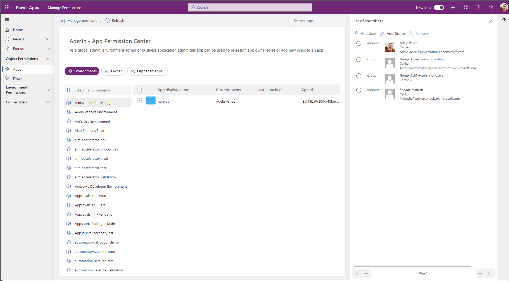
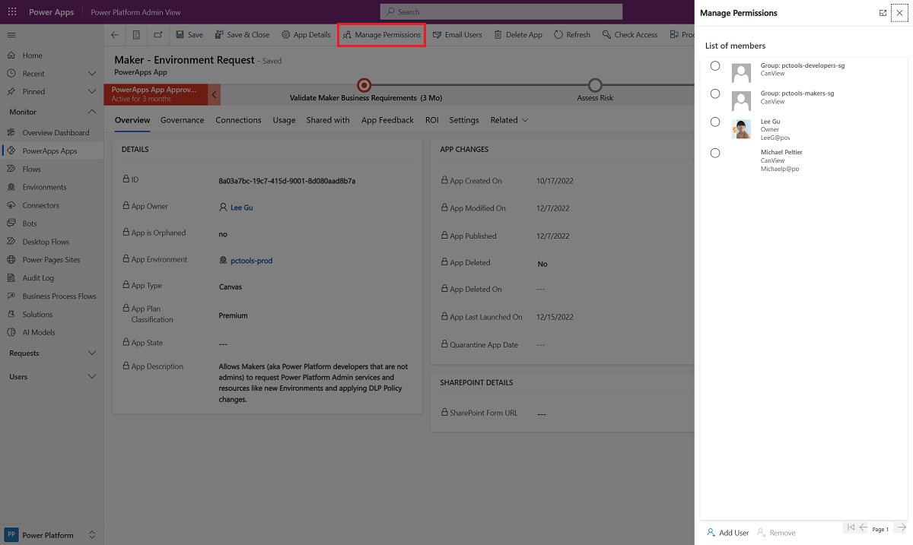
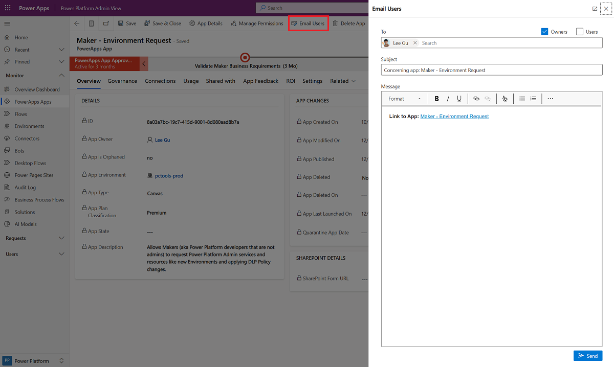

# Use core components

These components provide the core to get started with setting up a Center of Excellence (CoE). They sync all your resources into tables and build admin apps on top of that to help you get more visibility of the apps, flows, and makers in your environment. Additionally, apps like the Manage Permissions help with daily admin tasks. The core components solution contains assets relevant only to admins. More information: [Set up core components](setup-core-components.md) and [Watch](https://www.youtube.com/embed/l0kJQAeKthw) how to use the core components solution.

[Watch an overview](https://www.youtube.com/embed/l0kJQAeKthw) on how to use the core components solution.

## Inventory components

### Tables

> [!NOTE]
> To easily explore and manage data stored in Dataverse, we recommend that you install the [Microsoft Power Apps Office Add-in](https://appsource.microsoft.com/product/office/WA104380330?tab=Overview). More information: [Working with data in Dataverse using the Excel Add-in!](https://powerapps.microsoft.com/blog/cds-for-apps-excel-importexport/)

#### Tenant Objects

The [sync flows](#flows) of the CoE Starter Kit sync your tenant resources to the following Dataverse tables. All tables provide information about created by/on and modified by/on, in addition to resource-specific information.

- **AiBuilderModel** represents an Ai Builder Model.

- **Business Process Flow** represents a business process flow.

- **CoE Connection Reference** represents the linking table for the many-to-many relationships among connectors (PowerApps Connector) and cloud flows (Flows) or apps (PowerApps App). Not currently available for Data Export architecture.

- **Desktop Flow** represents a desktop flow.

- **Environment** represents the Environment object, which contains apps, flows, and connectors.

- **Flow** represents the cloud flows in the tenant.

- **PowerApps App** represents an app, be it a canvas, model driven or other type.

- **PowerApps Connector** represents a standard or custom connector.

- **Power Pages Site** represents a Power Page Site.

- **Power Platform Solution** represents a solution.

- **PVA** represents a bot in Power Virtual Agents.

- **PVA Component** represents a Power Virtual Agents component, such as a topic.

- **PVA Component Flow Lookup** represents a flow triggered as part of Power Virtual Agents. The following information is available for each bot component flow.

#### Users

There are several concepts of Users in the inventory as well gathered.

- **Connection Reference Identity** stores a list of a single instance of all user connections for each environment.

- **Environment Security Role Permission** represents a permision to an environment. Including the user, the security role, the environment and other properties.

- **Maker** represents a user who has created an object: app, flow, custom connector, or other object.

- **Power Platform User** represents who an app is shared with.

- **Power Platform User Role** represents the role a Microsoft Power Platform user has for a specific app. This has a one-to-many relationship with the Power Platform User and PowerApps App tables.

#### Usage

Various flows also collect the usage of some objects above.

- **AI Credit Usage** stores the usage of AI credits by Person per day across the tenant.

- **Audit Log** represents session details for Power Apps. Not currently available for Data Export methodology.

- **Environment Add Ons** stores add-on information for an environment.

- **Environment Capacity** stores capacity information for an environment.

- **RPA Session** represents a desktop flow session. The following information is available for each bot.

#### Inventory Management Features

These tables store information about usage for management.

- **Data Policy Drafts** represents a draft DLP that you are working through in the the [DLP Impact Analysis](#dlp-impact-analysis) app.

- **DLP Impact Analysis** represents an instance violoating a draft DLP that you are working through with a Maker in the the [DLP Impact Analysis](#dlp-impact-analysis) app.

- **Environment Business Area** represents the owning business area of an environment, if cross-charging is required.

- **Flow Action Detail** represents the set of actions that occur in a cloud flow. This table has a many-to-one link with the Flow table.

#### Solution Management

These tables are used to manage the CoE solution itself.

- **CoE Solution Metadata** holds meta-data about flows and apps part of the CoE Starter Kit in a table and is used in the [CoE Admin Command Center](#coe-admin-command-center).

- **Command Center Config** holds bookmark information to for the Bookmarks page of the [CoE Admin Command Center](#coe-admin-command-center).

- **Customized Email** holds meta-data about emails sent from flows in the Core Solution to allow for admins to tailor them without making unmanaged layers on the flows.

- **Setup Wizard State metadata** represents the current state of the user in the Setup Wizard. Used to drive them through the steps.

- **Sync Flow Errors** represents the daily occurrence of sync flow errors to provide a summary email to an admin. The following information is available for each sync flow error.

- **Tenant Security Roles** represents the all the Security Roles in the tenant and allows you to determine which ones you want to gather.

### Security roles

These security roles only give permissions to the custom tables, not to the environment generally. If you would like users to see apps and flows in the environment you will need to grant them access individually to each object, or add them to another security role like System Admin or Environment Maker.
Learn more: [Security roles and privileges](/power-platform/admin/security-roles-privileges)

- **Power Platform Admin SR** Gives full access to create, read, write, and delete operations on the custom tables.

- **Power Platform Maker SR** Gives read and write access to the custom tables (environments, apps, and so on).

- **Power Platform User SR**  Gives read-only access to the resources in the custom tables.

### Flows

| Flow Name | Type | Interval | Description |
| ---- | ---- | --- | ---- |
| Admin \| Add Maker to Group | Automated | New Makers Added | This flow adds a user who created an app, flow, custom connector, or environment for the first time to your Maker group. This flow gets triggered when a new record is created in the maker table. |
| Admin \| Excuse Non Inventoried Envts from Governance Flows | Automated | When the Excuse from Inventory column of an environment is changed | If you are only doing inventory for a subset of environments (not the default behavior) then this flow will ensure the ignored environments have their "excuse from" flags set correctly. |
| Admin \| Excuse Support Envts from Governance Flows | Automated | When an environment record is created in the Environments table | This flow checks if [support environments](/power-platform/admin/support-environment#what-are-support-environments) exist, and excludes those environments from the [inactivity](governance-components.md#inactivity-processes) and [compliance](governance-components.md#compliance-processes) governance processes. |
| Admin \| Gather Tenant SRs | Schedule | Monthly | This flow retrieves the Security Roles in your tenant and ensures they are in the Tenant Security Roles table for management. |
| Admin \| Sync Template v3 (Call Updates) | Scheduled | Weekly | Used to trigger other flows to run on a weekly schedule. Needed so that those flows can be of type button and be used to be run on demand or on a schedule.|
| Admin \| Sync Template v3 (Connectors) | Button | Triggered from Admin \| Sync Template v3 (Call Updates) and manually from apps  | This flow gets connector information by using [Get Connectors](/connectors/powerappsforappmakers/#get-connectors), and stores information such as the connector name, publisher, and tier. |
| Admin \| Sync Template v3 (Flow Action Details) | Automated | triggered by Admin \| Sync Template v4 (Driver) | This flow gets the actions and triggers for all flows. This flow uses [Get Flow as Admin](/connectors/flowmanagement/#get-flow-as-admin) to get action and trigger details for every individual flow in your tenant. Thus, it can be a very time-consuming and resource-consuming flow to run. Turning on this flow is optional, only do so to perform action-level reporting or analysis, such as reporting on who's using the Send Email action of the Microsoft 365 Outlook connector. |
| Admin \| Sync Template v3 (Sync Flow Errors) | Scheduled | Daily | This flow sends an email to the admin about environments that failed to sync (with a link to the flow instance). |
| Admin \| Sync Template v3 CoE Solution Metadata | Button | Triggered from Admin \| Sync Template v3 (Call Updates) and manually from apps | Updates the CoE Solution Metadata table with values from CoE team after upgrades in order to track the solution contents of the CoE solutions. |
| Admin \| Sync Template v3 Configure Emails | Button | Triggered from Admin \| Sync Template v3 (Call Updates) and manually from apps | Updates the Customized Email table with values from MSFT CoE team after upgrades, for values not customized by local CoE admin. |
| Admin \| Sync Template v4 (AI Events) | Automated | triggered by Admin \| Sync Template v4 (Driver) | This flow retrieves AI Builder Credit Consumption information on a daily basis. This information is retrieved from underlying Dataverse tables and requires the user running the flow to have system administrator privileges in the environment. Turning on this flow is optional, and we recommend that you do so only if you're using AI Builder Models in your tenant and are interested in getting a tenant-wide overview. |
| Admin \| Sync Template v4 (AI Models) | Automated | triggered by Admin \| Sync Template v4 (Driver) | This flow retrieves Power Platform AI model information. This information is retrieved from underlying Dataverse tables and requires the user running the flow to have system administrator privileges in the environment. Turning on this flow is optional. Only turn this flow on if you're using AI Builder models in your tenant and are interested in getting a tenant-wide overview. |
| Admin \| Sync Template v4 (Apps) | Automated | triggered by Admin \| Sync Template v4 (Driver) | This flow gets app information by using [Get Apps as Admin](/connectors/powerappsforadmins/#get-apps-as-admin). This information is then created or updated in the PowerApps App table. |
| Admin \| Sync Template v4 (Business Process Flows) | Automated | triggered by Admin \| Sync Template v4 (Driver) | This flow retrieves business process flow information. This information is retrieved from underlying Dataverse tables and requires the user running the flow to have system administrator privileges in the environment. Turning on this flow is optional, only turn this flow on if a tenant-level overview of business process flows is important. |
| Admin \| Sync Template v4 (BYODL App Properties) | Instant | triggered by CoE BYODL \| When App dataflow refresh is complete | DATA EXPORT ONLY - Used by the BYODL sync flows to catch app settings not yet caught by Data Export. |
| Admin \| Sync Template v4 (BYODL Flow Properties) | Instant | triggered by CoE BYODL \| When Flow dataflow refresh is complete  | DATA EXPORT ONLY - Used by the BYODL sync flows to catch flow settings not yet caught by Data Export |
| Admin \| Sync Template v4 (Connection Identities) | Automated | triggered by Admin \| Sync Template v4 (Driver) | This flow gets connection identity information by using Get Connections as Admin. This information is then created or updated in the Connection Reference Identity table. |
| Admin \| Sync Template v4 (Custom Connector) | Automated | triggered by Admin \| Sync Template v4 (Driver) | This flow gets custom connector information by using [Get Custom Connectors as Admin](/connectors/powerappsforadmins/#get-custom-connectors-as-admin), and stores information such as the name, endpoint, and created by/on. |
| Admin \| Sync Template v4 (Desktop Flow - Runs) | Scheduled | Daily | This flow gets desktop flow run history and session details. Turning on this flow is optional, only turn this flow on if a tenant-level overview of desktop flows is important. |
| Admin \| Sync Template v4 (Desktop Flow) | Automated | triggered by Admin \| Sync Template v4 (Driver) | This flow retrieves desktop flow information. This information is retrieved from underlying Dataverse tables and requires the user running the flow to have system administrator privileges in the environment. Turning on this flow is optional. Only turn this flow on if a tenant-level overview of desktop flows is important. |
| Admin \| Sync Template v4 (Driver) | Schedule | Daily | This flow retrieves the environments in your tenant by using [List Environments as Admin](/connectors/powerplatformforadmins/#list-environments-as-admin), and creates or updates a record for each environment in the Dataverse environment table. Running this flow will also trigger the rest of the sync flows indirectly by updating the environment records in the Dataverse instance. |
| Admin \| Sync Template v4 (Flows) | Automated | triggered by Admin \| Sync Template v4 (Driver) | This flow gets cloud flow information by using [List Flows as Admin](/connectors/flowmanagement/#list-flows-as-admin). Also updates the record if flows have been deleted. |
| Admin \| Sync Template v4 (Model Driven Apps) | Automated | triggered by Admin \| Sync Template v4 (Driver) | This flow gets model-driven app information. This information is retrieved from underlying Dataverse tables and requires the user running the flow to have system administrator privileges in the environment. |
| Admin \| Sync Template v4 (Portals) | Automated | triggered by Admin \| Sync Template v4 (Driver) | This flow retrieves Power Pages information. This information is retrieved from underlying Dataverse tables and requires the user running the flow to have system administrator privileges in the environment. Turning on this flow is optional, only turn this flow if you're using portals in your tenant and are interested in getting a tenant-wide overview. |
| Admin \| Sync Template v4 (PVA Usage) | Scheduled | Daily | This flow retrieves Power Virtual Agents (bot) usage information on a daily basis. This information is retrieved from underlying Dataverse tables and requires the user running the flow to have system administrator privileges in the environment. Turning on this flow is optional, and we recommend that you do so only if you're using Power Virtual Agents in your tenant and are interested in getting a tenant-wide overview. |
| Admin \| Sync Template v4 (PVA) | Automated | triggered by Admin \| Sync Template v4 (Driver) | This flow retrieves Power Virtual Agents (bot) information. This information is retrieved from underlying Dataverse tables and requires the user running the flow to have system administrator privileges in the environment. Turning on this flow is optional. Only turn this flow on if a tenant-level overview of chatbots is important. |
| Admin \| Sync Template v4 (Security Roles) | Automated | triggered by Admin \| Sync Template v4 (Driver) | This flow gathers the security role users from the tenant for those security roles the admin has configured to gather. |
| Admin \| Sync Template v4 (Solutions) | Automated | triggered by Admin \| Sync Template v4 (Driver) | This flow retrieves solution information. This information is retrieved from underlying Dataverse tables and requires the user running the flow to have system administrator privileges in the environment. Turning on this flow is optional. Only turn this flow on if a tenant-level overview of solutions is important. |
| CLEANUP - Admin \| Sync Template v3 (Delete Bad Data) | Scheduled | Daily | This flow runs daily, and looks for data in the inventory that is not complete, for example flows without an environment, and removes this data. |
| CLEANUP - Admin \| Sync Template v3 (Orphaned Makers) | Button | Triggered from Admin \| Sync Template v3 (Call Updates) and manually from apps | This flow checks the status of all entries in the Maker table and updates them based on, for example, if they are deleted or disabled. If maker is found to be orphaned, any resources created by the maker (apps, cloud and desktop flows, environments, chatbots) are marked as orphaned. |
| CLEANUP - Admin \| Sync Template v3 (Orphaned Users) | Button | Triggered from Admin \| Sync Template v3 (Call Updates) and manually from apps | This flow checks the status of all entries in the Power Platform Users table and updates them based on, for example, if they are deleted or disabled. |
| CLEANUP - Admin \| Sync Template v3 (Power Apps User Shared With) | Scheduled | Every two weeks | This long running flow runs every other week, and gets who the app is shared with by using [Get App Role Assignments as Admin](/connectors/powerappsforadmins/#get-app-role-assignments-as-admin). |
| CLEANUP - Admin \| Sync Template v3 (PVA Usage)  | Scheduled | Monthly | This flow rolls up Power Virtual Agents (bot) information on a monthly basis. This information is retrieved from underlying Dataverse tables and requires the user running the flow to have system administrator privileges in the environment. Turning on this flow is optional, and we recommend that you do so only if you're using Power Virtual Agents in your tenant and are interested in getting a tenant-wide overview. |
| CLEANUP - Admin \| Sync Template v4 (Check Deleted) | Scheduled | Weekly | This long running flow runs weekly, and compares CoE to the tenant to determine if any objects were deleted since last run. |
| CLEANUP - Admin \| Sync Template v4 (Other Objects) | Scheduled | Weekly |  Used to trigger other inventory objects that are too API intensive to run daily. For example solution objects. |
| CLEANUP HELPER - Check Deleted v4 (Ai Models) | Child Flow | called from Check Deleted | Does the check deleted work for a given environment for Ai Models  |
| CLEANUP HELPER - Check Deleted v4 (Business Process Flows) | Child flow | called from Check Deleted | Does the check deleted work for a given environment for business process flows  |
| CLEANUP HELPER - Check Deleted v4 (Canvas Apps) | Child flow | called from Check Deleted | Does the check deleted work for a given environment for canvas apps  |
| CLEANUP HELPER - Check Deleted v4 (Cloud Flows) | Child flow | called from Check Deleted | Does the check deleted work for a given environment for cloud flows  |
| CLEANUP HELPER - Check Deleted v4 (Custom Connectors) | Child Flow | called from Check Deleted | Does the check deleted work for a given environment for custom connectors  |
| CLEANUP HELPER - Check Deleted v4 (Desktop flows) | Child Flow | called from Check Deleted | Does the check deleted work for a given environment for desktop flows  |
| CLEANUP HELPER - Check Deleted v4 (Model Driven Apps) | Child flow | called from Check Deleted | Does the check deleted work for a given environment for model driven apps  |
| CLEANUP HELPER - Check Deleted v4 (Portals) | Child Flow | called from Check Deleted | Does the check deleted work for a given environment for Power Pages  |
| CLEANUP HELPER - Check Deleted v4 (PVA) | Child Flow | called from Check Deleted | Does the check deleted work for a given environment for chatbots  |
| CLEANUP HELPER - Check Deleted v4 (Solutions) | Child Flow | called from Check Deleted | Does the check deleted work for a given environment for solutions  |
| CLEANUP HELPER - Environment Capacity | Child Flow | called from CLEANUP - Admin \| Sync Template v4 (Other Objects) | Gathers the Capacity information for each environment. |
| CLEANUP HELPER - Power Apps User Shared With | Child Flow | called from CLEANUP - Admin \| Sync Template v3 (Power Apps User Shared With) | Runs once per environment to check who the app is shared. |
| CLEANUP HELPER - Solution Objects | Child Flow | called from CLEANUP - Admin \| Sync Template v4 (Other Objects) | Does the solution to object mapping work which is too API intensive to do daily. |
| CoE BYODL \| When App dataflow refresh is complete | Automated | triggered by CoE BYODL Apps dataflow completing | DATA EXPORT ONLY - Used in BYODL architecture to update App properties after its dataflow runs, and to run additional dataflows as needed. |
| CoE BYODL \| When Environment dataflow refresh is complete | Automated | triggered by CoE BYODL Environments dataflow completing | DATA EXPORT ONLY - Used in BYODL architecture to update Environment properties after its dataflow runs, and to run additional dataflows as needed. |
| CoE BYODL \| When Flow dataflow refresh is complete | Automated | triggered by CoE BYODL Flows dataflow completing | DATA EXPORT ONLY - Used in BYODL architecture to update Flow properties after its dataflow runs, and to run additional dataflows as needed. |
| CoE BYODL \| When Maker dataflow refresh is complete | Automated | triggered by CoE BYODL Makers dataflow completing | DATA EXPORT ONLY - Used in BYODL architecture to update Maker properties after its dataflow runs, and to run additional dataflows as needed. |
| CoE BYODL \| When Model App dataflow refresh is complete | Automated | triggered by CoE BYODL Model Driven Apps dataflow completing | DATA EXPORT ONLY - Used in BYODL architecture to update MDA properties after its dataflow runs, and to run additional dataflows as needed. |
| Command Center > Get M365 Service Messages | Instant | from CoE Admin Command Center canvas apps | This flow connects to [Microsoft Graph](/graph/api/serviceannouncement-list-messages) to list Power Platform Message Center service updates and returns them to the CoE Admin Command Center canvas app. |
| Command Center > Initially Populate Bookmarks | Instant | from CoE Admin Command Center canvas app | This flow runs once to get all CoE Starter Kit apps in the environment and store them to the Command Center Config table as bookmarks used in both the CoE Admin Command Center and CoE Maker Command Center canvas apps. |
| Command Center > Set CoE Flows State | Instant | from CoE Admin Command Center canvas app | Turns a flow on or off when called from an app. |
| DLP Editor > Parse impacted resources into CSV | Instant | from DLP Impact Analysis | This flow creates a CSV file of flows and apps impacted by DLP changes and sends it to the admin. |
| DLP Impact Analysis > Send Notification | Automated | triggered when record added to DLP Impact Analysis table | Sends teams notification to user about an app or flow which violates a draft DLP policy. |
| HELPER - Add User to Security Role | Child Flow | Instant | Helper flow to add users to security roles. Currently supports adding AAD Groups to Security Roles in the main organization of the current environment. |
| HELPER - CanvasAppOperations | Child Flow | Instant | This flow takes in the environment, app, and operation to perform as well as the GUID for the new maker if the operation is to reassign ownership. The operations supported are Delete and Assign (which reassigns owner). It performs the action on the actual object in the tenant and also updates the inventory. |
| HELPER - CloudFlowOperations | Child Flow | Instant | This flow takes in the environment, flow, and operation to perform as well as the GUID for the new maker if the operation is to reassign ownership. The operations supported are Delete and Assign (which reassigns owner). It performs the action on the actual object in the tenant and also updates the inventory. |
| HELPER - Delete Connection | Child Flow | Instant | This flow is called from Manage Permissions app and deletes connections from the tenant. |
| HELPER - Get Connections to Clean | Child Flow | Instant | This flow is called from Manage Permissions app and returns  connections from the tenant for the admin to explore. |
| HELPER - Maker Check | Child Flow | Instant | Consolidates the calls to o365 users and http with Azure AD to determine object orphan status of a maker, and updates its properties in the maker table The third parameter (Recheck) is generally false, and tracks if you want to force a recheck. False will allow the short circuit such that if the maker has been checked already that day, just fetch existing values. True skips the short circuit and always rechecks. This is used in Orphaned cleanup check. |
| HELPER - ObjectOperations | Child Flow | Instant | This flow takes in the environment, flow, and operation to perform as well as the GUID for the new maker if the operation is to reassign ownership. It calls that the operations supported are Delete and Assign (which reassigns owner). It calls either the **HELPER - CloudFlowOperations** or the **HELPER - CanvasAppOperations** child flow depending on its last parameter, objectType. It is needed due to a product bug in which you cannot call child flows with the Dataverse Connector from Canvas Apps. |
| HELPER - Remove User from Security Role | Child Flow | Instant | Removes a user from a SR in a given envt, tailored to our Envt SR Identities work. As such it takes in User as Display Name, Business Unit as Display Name, and SR as either Display Name or TID if it has one. |
| HELPER - Send Email | Child Flow | Instant | This flow is called from all other flows and handles sending emails. |
| SetupWizard>CallOrphan | Child Flow | Instant | This flow is triggered by a state in the Setup Wizard and calls the CLEANUP - Admin \| Sync Template v3 (Orphaned Makers) to identify orphaned makers immediately after setup.  |
| SetupWizard>CreateGroup | Child Flow | Instant | This flow is triggered from the Setup Wizard if a new group is created when communication methods are getting configured.  This flow creates a new Microsoft Entra security group, and returns the group ID and email to the app. |
| SetupWizard>GetCurrentEnvironment | Child Flow | Instant | This flow is triggered from the Setup Wizard and uses the workflow() expression in Power Automate to return the current environment ID to the app. |
| SetupWizard>GetTenantID | Child Flow | Instant | This flow is triggered from the Setup Wizard and calls [Graph API](/graph/api/organization-get) to return the current tenant ID to the app. |
| SetupWizard>GetUserDetails | Child Flow | Instant | This flow is triggered from the Setup Wizard and calls [Graph API](/graph/api/user-list-licensedetails) to return which licenses are assigned to the current user (the user running the Setup Wizard) to the app. |
| SetupWizard>RunInitialFlows | Child Flow | Instant | This flow is triggered from the Setup Wizard and runs the flows required for the initial setup of the core components: Admin \| Sync Template v3 CoE Solution Metadata, Admin \| Sync Template v3 Configure Emails, Admin \| Sync Template v3 (Connectors) |
| SetupWizard>ShareApps | Child Flow | Instant | This flow is triggered if you choose to share all apps from the Setup Wizard. It shares all apps, based on their persona, with the groups configured when setting up communication methods. |
| SetupWizard>UpdateDataflowEnvironment | Child Flow | Instant | This flow is triggered from the Setup Wizard. It updates the environment variables with the unique IDs of the dataflows that are part of the core components solution. |
| SetupWizard>UpdateInventoryTypeAppSetting | Child Flow | Instant | This flow is triggered from the Setup Wizard. It configures what navigation options to show in the Power Platform Admin view app, based on your [inventory data source](setup.md#what-data-source-should-i-use-for-my-power-platform-inventory). |
| SYNC HELPER - Apps | Child Flow | Called by Admin \| Sync Template v4 (Apps) | This flow updates the inventory for a specific app based on current tenant properties for that app. |
| SYNC HELPER - Cloud Flows | Child Flow | Called by Admin \| Sync Template v4 (Flows) | This flow updates the inventory for a specific flow based on current tenant properties for that flow. |
| SYNC HELPER - Get Security Role Users | Child Flow | Called by Admin \| Sync Template v4 (Security Roles) | Gets the System Admin SR users into inventory for a given environment. |

### Apps

#### CoE Setup and Upgrade Wizard

An app used by admins to setup and upgrade their CoE installs.
Launch after each clean install or upgrade to use.

Use this app to:

- Ensure all new environment variables are filled or exposed to you.
- Ensure all new flows are turned on in the correct order.
- Choose between settings the kit offers for solution management.

**Permission**: Intended to be used only by the admin identity that owns the kit install.

**Prerequisite**: This CoE solution has been installed or upgraded before you boot, the app does not assist with the actual upgrade of components, just the configuration of them afterwards.

#### CoE Admin Command Center

An app used by admins to manage their kit implementation.

Use this app to:

- Launch CoE Starter Kit apps and other bookmarks.
- Review CoE Starter Kit service health by checking sync flows that have recently failed.
- Manage the cloud flows used within the kit.
- Update environment variables used in the CoE Starter Kit.
- View Microsoft 365 Message Center news related to Microsoft Power Platform.
- Download the latest CoE Starter Kit version and raise support tickets with the team.
- Launch learning paths to learn more about Microsoft Power Platform.
- Launch the latest posts of the Power Apps, Power Automate, Power BI and Power Virtual Agent blogs.
- Configure email subject and body text for emails send through the CoE Starter Kit.

**Permission**: Intended to be used only by admins. Power Platform Service Admin or Global Admin permission is required. Share this app with your CoE Admins.

**Prerequisite**: This app uses Microsoft Dataverse and other premium connectors. A premium license is required for every app user.

>[!NOTE]
> When you first launch the app, bookmarks to all apps included in the CoE Starter Kit get created. Add other relevant bookmarks such as links to the Power BI dashboard and your Power Platform wiki and community by selecting **Edit bookmarks**.

When you first launch the app, you may have to establish a connection for [HTTP with Microsoft Entra ID (Preauthorized)](/connectors/webcontents/), and set **Base Resource URL** and **Microsoft Entra Resource URI (Application ID URI)** to [https://graph.microsoft.com](https://graph.microsoft.com) for commercial tenants. If your tenant is in GCC, GCC High, or DoD, check your [service root endpoint for Microsoft Graph](/graph/deployments#microsoft-graph-and-graph-explorer-service-root-endpoints).
 

#### DLP Impact Analysis

DLP Impact Analysis is an app that allows you to experiment with changes to policy configrations and get a list of canvas apps and cloud flows that are impacted by the those changes.

Use this app to:

- Make draft DLP policies with changes.
- See what impact each change will have on existing canvas apps and cloud flows.
- Mitigate the risk by contacting and working with makers.

More information: [Data Loss Prevention policies](../../admin/wp-data-loss-prevention.md)

**Permission**: Intended to be used only by admins. Power Platform Service Admin or Global Admin permission is required. Share this app with your CoE admins.

> [!NOTE]
> This app cannot detect or work with endpoint filtering in DLP. Plesae see [Connector Enpoint Filtering](../../admin/connector-endpoint-filtering.md).

> [!NOTE]
> This app cannot check for DLP impact in other object types. However you can explore this other offering for assistance with determining DLP impact of Desktop Flows [RPA CLI](https://github.com/rpapostolis/rpa-cli).

### Manage Permissions

Manage Permissions is an  app that an admin can use to manage various permissions across the tenant.

Permissions you can change with this app include:

- Canvas app ownership.
- Cloud flow ownership.
- Security Roles in tenant environments.
- Connections across the tenant.

**Permission**: This app is intended to be used only by admins. Microsoft Power Platform Service Admin or Global Admin permission is required. Share this app with your CoE admins.

#### Power Platform Admin View

Power Platform Admin View is a model-driven app that provides an interface used to browse items in Dataverse custom tables. It provides access to views and forms for the custom tables in the solution.

Use this app to:

- Get a quick overview of resources in your tenant.
- Learn about your makers, connectors, apps, and flows.
- Find out who apps are shared with.
- Add additional information, such as notes and risk assessments, to your resources.
- Set approved capacity for environments, and see capacity and add-on information per environment.
- Complete [app audits](example-processes.md).
- Manage capacity alerts.
- Set app and flow permissions for individual resources.

**Permission**: This app is intended to be used only by admins. Power Platform Service Admin or Global Admin permission is required. Share this app with your CoE admins.

You can use this app to see who an app is shared with, what roles (editor or viewer) the users have, and&mdash;for groups&mdash;what the size of the group is, all in a quick glance.

You can use this app to manage permissions for apps and flows by selecting **Manage Permissions** from the command bar.

You can use this app to email app owners and app users by selecting **Email Users** from the command bar.

### Power BI report

With Power BI reports, you can get a holistic view of Dataverse data with visualizations and insights for Environment, PowerApps App, Flow, Connector, Connection Reference, Maker, and Audit Log tables.

Follow the [setup instructions](setup-powerbi.md) to set up the Power BI dashboard. More information: [Gain deep insights into your Microsoft Power Platform adoption with the CoE Power BI dashboard](power-bi.md)

## Environment Request management components

[Watch a walk-through](https://www.youtube.com/watch?v=16mspbGz1zA&list=PLi9EhCY4z99W5kzaPK1np6sv6AzMQDsXG) of how the environment and DLP request process works.

### Tables

- **Environment Creation Request** represents a request submitted by non-admins to create a new Environment. This has a many-to-many relationship with the Maker and PowerApps Connector tables.

- **DLP Impact Analysis** represents an instance of an object which violates a draft DLP Policy.

- **DLP Policy** represents a DLP Policy that you wish to offer to Makers for selection in Environment Request.

- **DLP Policy Change Request** represents a request to change the definition of an existing DLP policy in the tenant.

### Flows

| Flow Name | Type | Interval | Description |
| ---- | ---- | --- | ---- |
| DLP Request \| Apply Policy to Environment (Child) | Instant | when creating an envt with a given policy | Helper function that takes the Power Platform Policy Id and an Environment Id as input, and applies the given policy to the given environment. It also removes the environment from all other "Include" type Policies and excludes it from all "Exclude" type Policies.  |
| DLP Request \| Process Approved Policy Change | Automated | when a DLP Policy Change Request record is updated to Approved state | Automated flow, triggers when the Approval Status of a DLP Policy Change Request is updated to 'Approved' state. Calls a child flow to make the actual change on the Power Platform service (e.g., updates DLP policy), then updates the Dataverse request record to 'Fulfilled' state.  |
| DLP Request \| Sync new Policy | Automated | when a new DLP Policy row is created and 'Is Shared' is true | When a new DLP Policy row is created and 'Is Shared' is true, it will trigger the Sync Policy child flow and sync the blocked connectors to the Dataverse row.  |
| DLP Request \| Sync Policy to Dataverse (Child) | Instant | called frmom other flows in this solution area. | Takes the DLP Policy identifier as input (Dataverse record) and syncs the blocked connectors to the Dataverse Policy row.  |
| DLP Request \| Sync Shared Policies | Scheduled | Daily | Runs daily to keep the Dataverse version of each DLP Policy marked as "Is Shared" == True updated with the real policy's blocked connectors.  |
| Env Request \| Cleanup | Schedule | Daily | Runs daily to delete Environments that have an associated Request record that has expired, send warning emails to upcoming deletions, and closes out associated Request records where the Environment was manually deleted from the admin center. |
| Env Request \| Create approved environment | Automated | when an Environment Creation Request’s status is updated to Approved state | Provisions the Environment and other resources identified in the request. |
| Env Request \| Notify admin when a new request is submitted | Automated | when a new Environment Creation Request record’s status is updated by a user to Pending state | Sends an email to the admin alias with instructions on how to review the request. |
| Env Request \| Notify requestor when rejected | Automated | when an Environment Creation Request’s status is updated to Rejected state | Sends an email notification to the requestor with the rejection status and reason, then changes the request to inactive. |

### Apps

#### CoE Admin Environment Request

An  app used by admins as an interface to view and approve or reject requests to create or modify Power Platform development resources. Supports Environment Creation Requests and changes to DLP Policies are logged in the DLP Policy Change Request table.

Use this app to:

- View all Environment Creation Requests in detail.
- Approve or reject Environment Creation Requests.
- View if connectors will be blocked or restricted by existing or modified DLP Policies. Modifications made in the app will update those Policies.

**Permission**: Intended to be used only by admins. Power Platform Service Admin or Global Admin permission is required. Share this app with your CoE Admins.

**Prerequisite**: This app uses Microsoft Dataverse. End-users must have a Per User license, the app must be assigned a Per App license, or the environment must be covered by pay-as-you-go. 

#### CoE Maker Command Center

An app designed to help Makers interact with their Power Platform Admin in many ways including submiting requests for Power Platform resources (such as Environment Creation Requests).

Use this app to:

- See apps shared with the Makers by the Power Platform admin
- Submit new Environment Creation Requests.
- View existing requests in any state that was submitted by that user. Expiration timeline and link to the Live environments can be found here.

**Permission**: As soon as you're using this process, you can share the app with all authorized Makers or the entire organization, depending on which users you want to allow Environment ownership. Requires the Power Platform Maker SR (security role) to use the Dataverse tables.

**Prerequisite**: This app uses Microsoft Dataverse. End-users must have a Per User license, the app must be assigned a Per App license, or the environment must be covered by pay-as-you-go.

## Other core components

### Tables

- **App Catalog Feedback** represents feedback gathered for an app.

### Flows

| Flow Name | Type | Interval | Description |
| ---- | ---- | --- | ---- |
| Admin \| Add-ons Alerts | Scheduled | Daily | This flow checks actual add-on consumption and compares it with approved capacity, that an admin sets. The flow will send an alert to the admin for environments that exceed the approved add-on consumption, or are at 80% of approved capacity. The approved capacity can be set in the Power Platform Admin View model-driven app. |
| Admin \| Capacity Alerts | Scheduled | Daily | This flow checks actual capacity consumption and compares it with approved capacity, that an admin sets. The flow will send an alert to the admin for environments that exceed the approved capacity, or are at 80% of approved capacity. The approved capacity can be set in the Power Platform Admin View model-driven app. |
| Admin \| Welcome Email v3 | Automated | when any sync flow adds a new maker to the Maker table | This flow sends an email to a user who created an app, flow, custom connector, or environment. This flow gets triggered when a new record is created in the maker table. You can customize the email sent out by the flow. |
| App Catalog > Request Access | Instant | from App Catalog | this flow sends an access request approval to the maker. |

### Apps

#### App Catalog

An app that helps give visibility to certain apps in the organization. Admins can choose which apps to highlight in the app catalog if the app meets admin requirements and is meant to be shared broadly.

When you first open the app catalog, you won't see any apps there. There's a field on the Power Apps App table called **In App Catalog**, which is a two-option set type field (Boolean). If the value is set to **Yes**, the app will show up in the catalog. To publish an app to the app catalog, follow the [app auditing process](example-processes.md) in the Power Platform Admin View app.

**Permission**: As soon as you're using this process, you can share the app catalog with the entire organization.

**Prerequisite**: This app uses Microsoft Dataverse. If you have installed this solution in a Production environment, end users need to have a Per User license, or the app needs to be assigned a Per App license, or the environment needs to be covered by pay-as-you-go.

[!INCLUDE[footer-include](../../includes/footer-banner.md)]
