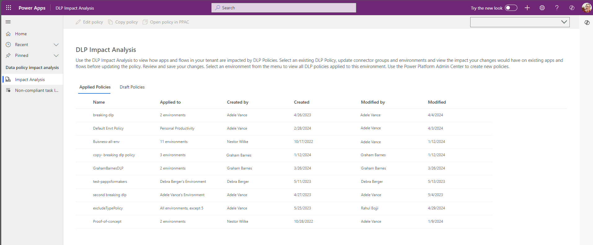

# Use core components

These components provide the core to get started with setting up a Center of Excellence (CoE). They sync all your resources into tables and build admin apps on top of that to help you get more visibility of the apps, flows, and makers in your environment. Additionally, apps like the Set App Permissions help with daily admin tasks. The core components solution contains assets relevant only to admins. More information: [Set up core components](setup-core-components.md) and [Watch](https://www.youtube.com/embed/l0kJQAeKthw) how to use the core components solution.

[Watch an overview](https://www.youtube.com/embed/l0kJQAeKthw) on how to use the core components solution.

## Inventory components

### Tables

The [sync flows](#flows) of the CoE Starter Kit sync your tenant resources to the following Dataverse tables. All tables provide information about created by/on and modified by/on, in addition to resource-specific information.

- **Environment** represents the Environment object, which contains apps, flows, and connectors. The following information is available for each environment:
  - Environment ID
  - Display name
  - Dataverse instance URL
  - Created on
  - Environment maker (created by)
  - Region
  - Sku (trial, developer, production)
  - Number of apps (rollup)
  - Number of flows (rollup)
  - Number of custom connectors (rollup)
  - Environment Owner (if environments are created by admins, manually store owner here)
  - Business Area
  - Approved Capacity

- **PowerApps App** represents an app. The following information is available for each app:
  - Display name
  - App ID
  - Environment
  - Owner
  - Created on
  - Modified on
  - Published on
  - Last launched on (if collecting [audit log](setup-auditlog.md) information is configured)
  - App plan classification (standard, premium, extended)
  - Shared users
  - Shared groups
  - Shared with tenant (yes/no)
  - App type (canvas, model-driven, SharePoint form app)
  - App orphaned
  - Excused from archival

- **Flow** represents a cloud flow. The following information is available for each cloud flow:
  - Display name
  - Flow ID
  - Environment
  - Owner
  - Created on
  - Modified on
  - State (started, suspended, stopped)
  - Flow orphaned
  - Flow trigger
  - Excused from archival

- **Flow Action Detail** represents the set of actions that occur in a cloud flow. This table has a many-to-one link with the Flow table. The following information is available for each action or trigger:
  - Type (scope, for each, Microsoft 365 users)
  - Operation (for connectors, such as Send Email and List Items)
  - Is trigger (yes/no)
  - Flow Action Detail Metadata (for example, host for HTTP calls)

- **PowerApps Connector** represents a standard or custom connector. The following information is available for each connector:
  - Connector ID
  - Display name
  - Icon background color and URI
  - Is custom connector (yes/no)
  - Maker (for custom connectors)
  - Publisher
  - Tier (standard/premium)

- **CoE Connection Reference** represents the linking table for the many-to-many relationships among connectors (PowerApps Connector) and cloud flows (Flows) or apps (PowerApps App).

- **Connection Reference Identity** stores the connections for each environment including their identity
  - Environment
  - Connector
  - accountName (the account used to create the connection)
  - NoneOrCrossTenantIdentity (true if not @yourTenant account)

- **Power Apps Portal** represents a Power Apps portal. The following information is available for each portal:
  - Portal Website ID
  - Portal Website Name
  - Portal Website Record Status
  - Environment
  - Owner
  - Created on
  - Modified on
  - Portal is orphaned

- **Maker** represents a user who has created an app, flow, custom connector, or environment. The following information is available for each maker (retrieved from Microsoft 365 Users profiles):
  - Display name
  - ID
  - Email (user principal name)
  - City
  - Country
  - Department
  - Job title
  - Office
  - Number of apps (rollup)
  - Number of flows (rollup)

- **Audit Log** represents session details for Power Apps. The following information is available for each audit log entry:
  - Operation (launched app, deleted app, deleted flow)
  - App/cloud flow ID
  - User city, country/region, department, job title (from Microsoft 365)
  - Audit log event time

- **Power Platform User** represents who an app is shared with. The following information is available for each user:
  - Display name
  - ID
  - Group size (for users, this is set to 1; for groups, this is the group size according to Microsoft Entra ID)
  - Type (user, group, tenant)
  - User principal name (for users)

- **Power Platform User Role** represents the role a Microsoft Power Platform user has for a specific app. This has a one-to-many relationship with the Power Platform User and PowerApps App tables. The following information is available for each role:
  - App
  - Microsoft Power Platform user
  - Role name (Owner, CanEdit, CanView)
  - Friendly role name (Owner, Co-Owner, Viewer)

- **PVA** represents a bot in Power Virtual Agents. The following information is available for each bot:
  - Display name
  - ID
  - Created on
  - Owner
  - Modified on
  - Last launched on
  - Total number of sessions
  - Number of components (rollup)
  - Number of flows (rollup)
  - Status
  - Environment
  - Is bot orphaned (yes/no)

- **PVA Component** represents a Power Virtual Agents component, such as a topic. The following information is available for each bot component:
  - Name
  - ID
  - Component created on
  - Description
  - Display name
  - Environment
  - Modified on
  - State
  - Type (topic, table)
  - Uses flow (yes/no)

- **PVA Component Flow Lookup** represents a flow triggered as part of Power Virtual Agents. The following information is available for each bot component flow:
  - Name
  - ID
  - Created on/by

- **Desktop Flow** represents a desktop flow. The following information is available for each desktop flow:
  - Display name
  - ID
  - Created on
  - Owner
  - Modified on
  - Desktop flow type (Power Automate Desktop, Selenium IDE)
  - Status
  - Environment
  - Is desktop flow orphaned (yes/no)
  
- **RPA Session** represents a desktop flow session. The following information is available for each bot:
  - ID
  - Desktop Flow
  - Status Code
  - Started On
  - Completed On
  - Error Code
  - Error Message

- **Business Process Flow** represents a business process flow. The following information is available for each BPF:
  - Display name
  - ID
  - Created on
  - Owner
  - Modified on
  - Type (Background, Task)
  - State
  - Environment
  - Primary Entity

- **AiBuilderModel** represents an Ai Builder Model. The following information is available for each model:
  - Display name
  - ID
  - Created on
  - Owner
  - Modified on
  - Type (Template)
  - State
  - Environment

- **Power Platform Solution** represents a solution. The following information is available for each solution:
  - Display name
  - Unique name
  - Environment
  - Publisher
  - isManaged
  - Version
  - Creator
  - Description

- **Environment Capacity** stores capacity information for an environment
  - Capacity Type (File, Database, Log)
  - Unit (GB, MB)
  - Actual Consumption
  - Rated Consumption (takes into account minimum capacity reservation required for the particular environment type)

- **Environment Add Ons** stores add-on information for an environment
  - Add On Type (Per App Pass, AI Builder Consumption)
  - Unit (MB, Logins)
  - Allocation

- **Environment Business Area** represents the owning business area of an environment, if cross-charging is required
  - Area Name
  - Cost Code
  - Area Lead

Additional to the above listed inventory tables, the following helper tables support application functionality:

- **Sync Flow Errors** represents the daily occurrence of sync flow errors to provide a summary email to an admin. The following information is available for each sync flow error:
  - Flow instance URL
  - Environment
  - Created on

- **CoE Solution Metadata** holds meta-data about flows and apps part of the CoE Starter Kit in a table and is used in the [CoE Admin Command Center](#coe-admin-command-center):
  - CoE Solution (Core, Governance, Nurture, Audit Log)
  - CoE Solution Area (for example, Inventory, Compliance, ...)
  - Object Type (app or flow)
  - Object URL
  - Object GUID
  - Ship On
  - Flag
  - Help Link (link to documentation)

- **Customized Email** holds meta-data about emails sent from flows in the Core Solution to allow for admins to tailor them without making unmanaged layers on the flows:
  - Flow Name
  - Action Name
  - Subject
  - Body
  - CC
  - ReplyTo
  - Send on Behalf

> [!NOTE]
> To easily explore and manage data stored in Dataverse, we recommend that you install the [Microsoft Power Apps Office Add-in](https://appsource.microsoft.com/product/office/WA104380330?tab=Overview). More information: [Working with data in Dataverse using the Excel Add-in!](https://powerapps.microsoft.com/blog/cds-for-apps-excel-importexport/)

### Security roles

- **Power Platform Admin SR** Gives full access to create, read, write, and delete operations on the custom tables.

- **Power Platform Maker SR** Gives read and write access to the custom tables (environments, apps, and so on).

- **Power Platform User SR**  Gives read-only access to the resources in the custom tables.

> [!NOTE]
> These security roles only give permissions to the custom tables, not to the environment generally. If you would like users to see apps and flows in the environment you will need to grant them access individually to each object, or add them to another security role like System Admin or Environment Maker. 
Learn more: [Security roles and privileges](/power-platform/admin/security-roles-privileges)

### Flows

| Flow Name | Type | Interval | Description |
| ---- | ---- | --- | ---- |
| Admin \| Sync Template v3 (Driver) | Schedule | Daily | This flow retrieves the environments in your tenant by using [List Environments as Admin](/connectors/powerplatformforadmins/#list-environments-as-admin), and creates or updates a record for each environment in the Dataverse environment table. Running this flow will also trigger the rest of the sync flows indirectly by updating the environment records in the Dataverse instance. |
| Admin \| Sync Template v3 (Apps) | Automated | triggered by Admin \| Sync Template v3 (Driver) | This flow gets app information by using [Get Apps as Admin](/connectors/powerappsforadmins/#get-apps-as-admin). This information is then created or updated in the PowerApps App table. |
| Admin \| Sync Template v3 (Business Process Flows) | Automated | triggered by Admin \| Sync Template v3 (Driver) | This flow retrieves business process flow information. This information is retrieved from underlying Dataverse tables and requires the user running the flow to have system administrator privileges in the environment. Turning on this flow is optional, only turn this flow on if a tenant-level overview of business process flows is important. |
| Admin \| Sync Template v3 (Connectors) | Button | Triggered from Admin \| Sync Template v3 (Call Updates) and manually from apps  | This flow gets connector information by using [Get Connectors](/connectors/powerappsforappmakers/#get-connectors), and stores information such as the connector name, publisher, and tier. |
| Admin \| Sync Template v3 (Custom Connector) | Automated | triggered by Admin \| Sync Template v3 (Driver) | This flow gets custom connector information by using [Get Custom Connectors as Admin](/connectors/powerappsforadmins/#get-custom-connectors-as-admin), and stores information such as the name, endpoint, and created by/on. |
| Admin \| Sync Template v3 (Connection Identities) | Automated | triggered by Admin \| Sync Template v3 (Driver) | This flow gets connection identity information by using Get Connections as Admin. This information is then created or updated in the Connection Reference Identity table. |
| Admin \| Sync Template v3 CoE Solution Metadata | Button | Triggered from Admin \| Sync Template v3 (Call Updates) and manually from apps | Updates the CoE Solution Metadata table with values from CoE team after upgrades in order to track the solution contents of the CoE solutions. |
| Admin \| Sync Template v3 (Desktop Flow - Runs) | Scheduled | Daily | This flow gets desktop flow run history and session details. Turning on this flow is optional, only turn this flow on if a tenant-level overview of desktop flows is important. |
| Admin \| Sync Template v3 (Desktop Flow) | Automated | triggered by Admin \| Sync Template v3 (Driver) | This flow retrieves desktop flow information. This information is retrieved from underlying Dataverse tables and requires the user running the flow to have system administrator privileges in the environment. Turning on this flow is optional. Only turn this flow on if a tenant-level overview of desktop flows is important. |
| Admin \| Sync Template v3 (Environment Properties) | Automated | triggered by Admin \| Sync Template v3 (Driver) | This flow retrieves add-on, capacity, and security role information for environments. This information is retrieved from the Power Platform admin connector and from underlying Dataverse tables, and requires the user running the flow to have system administrator privileges in the environment. |
| Admin \| Sync Template v3 (Flow Action Details) | Scheduled | Daily | This flow gets the actions and triggers for all flows. This flow uses [Get Flow as Admin](/connectors/flowmanagement/#get-flow-as-admin) to get action and trigger details for every individual flow in your tenant. Thus, it can be a very time-consuming and resource-consuming flow to run. Turning on this flow is optional, only do so to perform action-level reporting or analysis, such as reporting on who's using the Send Email action of the Microsoft 365 Outlook connector. |
| Admin \| Sync Template v3 (Flows) | Automated | triggered by Admin \| Sync Template v3 (Driver) | This flow gets cloud flow information by using [List Flows as Admin](/connectors/flowmanagement/#list-flows-as-admin). Also updates the record if flows have been deleted. |
| Admin \| Sync Template v3 (Model Driven Apps) | Automated | triggered by Admin \| Sync Template v3 (Driver) | This flow gets model-driven app information. This information is retrieved from underlying Dataverse tables and requires the user running the flow to have system administrator privileges in the environment. |
| Admin \| Sync Template v3 (Portals) | Automated | triggered by Admin \| Sync Template v3 (Driver) | This flow retrieves Power Pages information. This information is retrieved from underlying Dataverse tables and requires the user running the flow to have system administrator privileges in the environment. Turning on this flow is optional, only turn this flow if you're using portals in your tenant and are interested in getting a tenant-wide overview. |
| Admin \| Sync Template v3 (Solutions) | Automated | triggered by Admin \| Sync Template v3 (Driver) | This flow retrieves solution information. This information is retrieved from underlying Dataverse tables and requires the user running the flow to have system administrator privileges in the environment. Turning on this flow is optional. Only turn this flow on if a tenant-level overview of solutions is important. |
| Admin \| Sync Template v3 (AI Models) | Automated | triggered by Admin \| Sync Template v3 (Driver) | This flow retrieves Power Platform AI model information. This information is retrieved from underlying Dataverse tables and requires the user running the flow to have system administrator privileges in the environment. Turning on this flow is optional. Only turn this flow on if you're using AI Builder models in your tenant and are interested in getting a tenant-wide overview. |
| Admin \| Sync Template v3 (PVA) | Automated | triggered by Admin \| Sync Template v3 (Driver) | This flow retrieves Power Virtual Agents (bot) information. This information is retrieved from underlying Dataverse tables and requires the user running the flow to have system administrator privileges in the environment. Turning on this flow is optional. Only turn this flow on if a tenant-level overview of chatbots is important. |
| Admin \| Sync Template v3 (PVA Usage) | Scheduled | Daily | This flow retrieves Power Virtual Agents (bot) usage information on a daily basis. This information is retrieved from underlying Dataverse tables and requires the user running the flow to have system administrator privileges in the environment. Turning on this flow is optional, and we recommend that you do so only if you're using Power Virtual Agents in your tenant and are interested in getting a tenant-wide overview. |
| Admin \| Sync Template v3 (Sync Flow Errors) | Scheduled | Daily | This flow sends an email to the admin about environments that failed to sync (with a link to the flow instance). |
| Admin \| Sync Template v3 (Call Updates) | Scheduled | Daily | Used to trigger these three flows to run on a schedule. Needed so that those flows can be of type button and be used to be run on demand or on a schedule.|
| Admin \| Excuse Support Envts from Governance Flows | Automated | When an environment record is created in the Environments table | This flow checks if [support environments](/power-platform/admin/support-environment#what-are-support-environments) exist, and excludes those environments from the [inactivity](governance-components.md#inactivity-processes) and [compliance](governance-components.md#compliance-processes) governance processes. |
| CLEANUP - Admin \| Sync Template v3 (Check Deleted) | Scheduled | Every two weeks | This long running flow runs every other week, and compares CoE to the tenant to determine if any objects were deleted since last run. Either just marks them as deleted (if env var Also Delete from CoE = no) or deletes them from the CoE (if Also Delete from CoE = yes). The audit log solution is able to find this information in on a daily basis for apps and flows, but not for other resources such as environments, desktop flows and chatbots. Run this flow periodically to check for deleted resources. |
| CLEANUP - Admin \| Sync Template v3 (Connection Status) | Scheduled | Weekly | This flow runs weekly, and checks if any apps or flows have unresolved connections.|
| CLEANUP - Admin \| Sync Template v3 (Delete Bad Data) | Scheduled | Daily | This flow runs daily, and looks for data in the inventory that is not complete, for example flows without an environment, and removes this data. |
| CLEANUP - Admin \| Sync Template v3 (Orphaned Makers) | Scheduled | Weekly | This flow runs weekly, and checks if any makers have left the organization - if maker information can't be found in Microsoft Entra/Office 365 Users, any resources created by the maker (apps, cloud and desktop flows, environments, chatbots) are marked as orphaned. |
| CLEANUP - Admin \| Sync Template v3 (Power Apps User Shared With) | Scheduled | Every two weeks | This long running flow runs every other week, and gets who the app is shared with by using [Get App Role Assignments as Admin](/connectors/powerappsforadmins/#get-app-role-assignments-as-admin). |
| CLEANUP - Admin \| Sync Template v3 (PVA Usage)  | Scheduled | Monthly | This flow rolls up Power Virtual Agents (bot) information on a monthly basis. This information is retrieved from underlying Dataverse tables and requires the user running the flow to have system administrator privileges in the environment. Turning on this flow is optional, and we recommend that you do so only if you're using Power Virtual Agents in your tenant and are interested in getting a tenant-wide overview. |
| CLEANUP HELPER - Check Deleted (Business Process Flows) | Child flow | called from Check Deleted | Does the check deleted work for a given environment for business process flows  |
| CLEANUP HELPER - Check Deleted (Canvas Apps) | Child flow | called from Check Deleted | Does the check deleted work for a given environment for canvas apps  |
| CLEANUP HELPER - Check Deleted (Cloud Flows) | Child flow | called from Check Deleted | Does the check deleted work for a given environment for cloud flows  |
| CLEANUP HELPER - Check Deleted (Model Driven Apps) | Child flow | called from Check Deleted | Does the check deleted work for a given environment for model driven apps  |
| CLEANUP HELPER - Check Deleted (PVA) | Child Flow | called from Check Deleted | Does the check deleted work for a given environment for chatbots  |
| CLEANUP HELPER - Check Deleted (Solutions) | Child Flow | called from Check Deleted | Does the check deleted work for a given environment for solutions  |
| CLEANUP HELPER - Check Deleted (Custom Connectors) | Child Flow | called from Check Deleted | Does the check deleted work for a given environment for custom connectors  |
| CLEANUP HELPER - Check Deleted (Ai Models) | Child Flow | called from Check Deleted | Does the check deleted work for a given environment for Ai Models  |
| CLEANUP HELPER - Power Apps User Shared With | Child Flow | called from CLEANUP - Admin \| Sync Template v3 (Power Apps User Shared With) | runs once per environment to check |
| HELPER - Add User to Security Role | Child Flow | Instant | This flow adds users to security roles. This flow currently supports adding Microsoft Entra ID groups to security roles in the main organization of the current environment.  |
| HELPER - CanvasAppOperations | Child Flow | Instant | This flow takes in the environment, app, and operation to perform as well as the GUID for the new maker if the operation is to reassign ownership. The operations supported are Delete and Assign (which reassigns owner). It performs the action on the actual object in the tenant and also updates the inventory. |
| HELPER - CloudFlowOperations | Child Flow | Instant | This flow takes in the environment, flow, and operation to perform as well as the GUID for the new maker if the operation is to reassign ownership. The operations supported are Delete and Assign (which reassigns owner). It performs the action on the actual object in the tenant and also updates the inventory. |
| HELPER - ObjectOperations | Child Flow | Instant | This flow takes in the environment, flow, and operation to perform as well as the GUID for the new maker if the operation is to reassign ownership. It calls that the operations supported are Delete and Assign (which reassigns owner). It calls either the **HELPER - CloudFlowOperations** or the **HELPER - CanvasAppOperations** child flow depending on its last parameter, objectType. It is needed due to a product bug in which you cannot call child flows with the Dataverse Connector from Canvas Apps. |
| HELPER - Send Email | Child Flow | Instant | This flow is called from all other flows and handles sending emails. |
| Command Center > Get M365 Service Messages | Instant | from CoE Admin Command Center canvas apps | This flow connects to [Microsoft Graph](/graph/api/serviceannouncement-list-messages) to list Power Platform Message Center service updates and returns them to the CoE Admin Command Center canvas app. |
| Command Center > Initially Populate Bookmarks | Instant | from CoE Admin Command Center canvas app | This flow runs once to get all CoE Starter Kit apps in the environment and store them to the Command Center Config table as bookmarks used in both the CoE Admin Command Center and CoE Maker Command Center canvas apps. |
| Command Center > Set CoE Flows State | Instant | from CoE Admin Command Center canvas app | Turns a flow on or off when called from a Canvas App. |
| DLP Editor > Parse impacted resources into CSV | Instant | from DLP Editor v2 | This flow creates a CSV file of flows and apps impacted by DLP changes and sends it to the admin. |
| SetupWizard>CallOrphan | Child Flow | Instant | This flow is triggered by a state in the Setup Wizard and calls the CLEANUP - Admin \| Sync Template v3 (Orphaned Makers) to identify orphaned makers immediately after setup.  |
| SetupWizard>CreateGroup | Child Flow | Instant | This flow is triggered from the Setup Wizard if a new group is created when communication methods are getting configured.  This flow creates a new Microsoft Entra security group, and returns the group ID and email to the app. |
| SetupWizard>GetCurrentEnvironment | Child Flow | Instant | This flow is triggered from the Setup Wizard and uses the workflow() expression in Power Automate to return the current environment ID to the app. |
| SetupWizard>GetTenantID | Child Flow | Instant | This flow is triggered from the Setup Wizard and calls [Graph API](/graph/api/organization-get) to return the current tenant ID to the app. |
| SetupWizard>GetUserDetails | Child Flow | Instant | This flow is triggered from the Setup Wizard and calls [Graph API](/graph/api/user-list-licensedetails) to return which licenses are assigned to the current user (the user running the Setup Wizard) to the app. |
| SetupWizard>RunInitialFlows | Child Flow | Instant | This flow is triggered from the Setup Wizard and runs the flows required for the initial setup of the core components: Admin \| Sync Template v3 CoE Solution Metadata, Admin \| Sync Template v3 Configure Emails, Admin \| Sync Template v3 (Connectors) |
| SetupWizard>ShareApps | Child Flow | Instant | This flow is triggered if you choose to share all apps from the Setup Wizard. It shares all apps, based on their persona, with the groups configured when setting up communication methods. |
| SetupWizard>ShareApps | Child Flow | Instant | This flow is triggered if you choose to share all apps from the Setup Wizard. It shares all apps, based on their persona, with the groups configured when setting up communication methods. |
| SetupWizard>UpdateDataflowEnvironment | Child Flow | Instant | This flow is triggered from the Setup Wizard. It updates the environment variables with the unique IDs of the dataflows that are part of the core components solution. |
| SetupWizard>UpdateInventoryTypeAppSetting | Child Flow | Instant | This flow is triggered from the Setup Wizard. It configures what navigation options to show in the Power Platform Admin view app, based on your [inventory data source](setup.md#what-data-source-should-i-use-for-my-power-platform-inventory). |

### Apps

#### CoE Admin Command Center

A canvas app used by admins as a starting point to launch other apps in the CoE Starter Kit and review content relevant to admins.

Use this app to:

- Launch CoE Starter Kit apps and other bookmarks.
- Review CoE Starter Kit service health by checking sync flows that have recently failed.
- Update environment variables used in the CoE Starter Kit.
- View Microsoft 365 Message Center news related to Microsoft Power Platform.
- Download the latest CoE Starter Kit version and raise support tickets with the team.
- Launch learning paths to learn more about Microsoft Power Platform.
- Launch the latest posts of the Power Apps, Power Automate, Power BI and Power Virtual Agent blogs.
- Configure email subject and body text for emails send through the CoE Starter Kit.

**Permission**: Intended to be used only by admins. Power Platform Service Admin or Global Admin permission is required. Share this app with your CoE Admins.

**Prerequisite**: This app uses Microsoft Dataverse and other premium connectors. A premium license is required for every app user.

>[!NOTE]
> When you first launch the app, bookmarks to all apps included in the CoE Starter Kit get created. Add other relevant bookmarks such as links to the Power BI dashboard and your Power Platform wiki and community by selecting **Edit bookmarks**.

When you first launch the app, you may have to establish a connection for [HTTP with Microsoft Entra ID](/connectors/webcontents/), and set **Base Resource URL** and **Microsoft Entra Resource URI (Application ID URI)** to [https://graph.microsoft.com](https://graph.microsoft.com) for commercial tenants. If your tenant is in GCC, GCC High, or DoD, check your [service root endpoint for Microsoft Graph](/graph/deployments#microsoft-graph-and-graph-explorer-service-root-endpoints).
:::image type="content" source="media/httpazuread.png" alt-text="Establish an HTTP with Microsoft Entra connection":::

#### DLP Editor v2

DLP Editor v2 is a canvas app that reads and updates data loss prevention (DLP) policies while showing a list of canvas apps and cloud flows that are impacted by the policy configurations.

Use this app to:

- Make changes to DLP policies.
- See what impact each change will have on existing canvas apps and cloud flows.
- Mitigate the risk by contacting makers.

More information: [Data Loss Prevention policies](../../admin/wp-data-loss-prevention.md)

**Permission**: Intended to be used only by admins. Power Platform Service Admin or Global Admin permission is required. Share this app with your CoE admins.

> [!NOTE]
> This app cannot check for DLP impact in other object types. However you can explore this other offering for assistance with determining DLP impact of Desktop Flows [RPA CLI](https://github.com/rpapostolis/rpa-cli).

### Set App Permissions

Set App Permissions is a canvas app that an admin can use to discover apps by app name, environment, or owner name, and to change app permissions.

Use this app to:

- Set a new app owner.
- Add new viewers and editors.
- Remove app permissions.
- Change app permissions from editors to viewers or viewers to editors.

You can also use this app to find apps that have been orphaned by the owner's having left your organization, and clean them up. More information: [Share a canvas app in Power Apps](/powerapps/maker/canvas-apps/share-app)

**Permission**: This app is intended to be used only by admins. Microsoft Power Platform Service Admin or Global Admin permission is required. Share this app with your CoE admins.

#### Set Flow Permissions

Similar to Set App Permissions, Set Flow Permissions is a canvas app that admins can use to discover flows by flow name, environment, or owner name.

Use this app to:

- Add new viewers and editors.
- Remove flow permissions.

Note that the ownership of a flow can't be changed.

You can also use this app to find flows that have been orphaned by the owner's having left your organization, and clean them up. More information: [Share a flow](/power-automate/create-team-flows)

**Permission**: This app is intended to be used only by admins. Microsoft Power Platform Service Admin or Global Admin permission is required. Share this app with your CoE admins.

#### Power Platform Admin View

Power Platform Admin View is a model-driven app that provides an interface used to browse items in Dataverse custom tables. It provides access to views and forms for the custom tables in the solution.

Use this app to:

- Get a quick overview of resources in your tenant.
- Learn about your makers, connectors, apps, and flows.
- Find out who apps are shared with.
- Add additional information, such as notes and risk assessments, to your resources.
- Set approved capacity for environments, and see capacity and add-on information per environment.
- Complete [app audits](example-processes.md).
- Manage capacity alerts.
- Set app and flow permissions for individual resources.

**Permission**: This app is intended to be used only by admins. Power Platform Service Admin or Global Admin permission is required. Share this app with your CoE admins.

You can use this app to see who an app is shared with, what roles (editor or viewer) the users have, and&mdash;for groups&mdash;what the size of the group is, all in a quick glance.

You can use this app to manage permissions for apps and flows by selecting **Manage Permissions** from the command bar.

:::image type="content" source="media/ppadmin-setapp.png" alt-text="Update app and flow permissions using the Set App/Flow Permissions custom page":::

You can use this app to email app owners and app users by selecting **Email Users** from the command bar.

:::image type="content" source="media/ppadmin-email.png" alt-text="Send emails to makers and users of an app using the Email Users custom page":::

### Power BI report

With Power BI reports, you can get a holistic view of Dataverse data with visualizations and insights for Environment, PowerApps App, Flow, Connector, Connection Reference, Maker, and Audit Log tables.

Follow the [setup instructions](setup-powerbi.md) to set up the Power BI dashboard. More information: [Gain deep insights into your Microsoft Power Platform adoption with the CoE Power BI dashboard](power-bi.md)

## Environment Request management components

[Watch a walk-through](https://www.youtube.com/watch?v=16mspbGz1zA&list=PLi9EhCY4z99W5kzaPK1np6sv6AzMQDsXG) of how the environment and DLP request process works.

### Tables

- **Environment Creation Request** represents a request submitted by non-admins to create a new Environment. This has a many-to-many relationship with the Maker and PowerApps Connector tables. The following is available for each request:
  - Approval Date
  - Approval Email
  - Created By (used as Requestor) 
  - Database Currency
  - Database Language
  - Database Security Group ID
  - Duration Requested
  - Environment
  - Environment Display Name
  - Environment Region
  - Environment Type
  - Expiration Date
  - Has Database
  - Has Expiration Date
  - Justification
  - Notes
  - Request No
  - Request Status (pending, approved, rejected, fulfilled, live, expired, canceled, failed)

- **DLP Policy Change Request** represents a request to change the definition of an existing DLP policy in the tenant. The following is available for each request:
  - Action Requested (Add Environment to Policy, Remove Environment from Policy)
  - Created By (used as Requestor)
  - Environment Creation Request
  - Policy ID
  - Request No
  - Request Status

### Flows

| Flow Name | Type | Interval | Description |
| ---- | ---- | --- | ---- |
| DLP Request \| Make approved policy change | Automated | when a DLP Policy Change Request record is updated to Approved state | Modifies the existing DLP Policies identified in the request depending on the action type.  |
| Env Request \| Cleanup expired environments | Schedule | Daily | Cleans up environments with expiration dates identified or sends weekly warning email notifications every Monday if the expiration date is coming up within the month. |
| Env Request \| Create approved environment | Automated | when an Environment Creation Request’s status is updated to Approved state | Provisions the Environment and other resources identified in the request. |
| Env Request \| Notify admin when a new request is submitted | Automated | when a new Environment Creation Request record’s status is updated by a user to Pending state | Sends an email to the admin alias with instructions on how to review the request. |
| Env Request \| Notify requestor when rejected | Automated | when an Environment Creation Request’s status is updated to Rejected state | Sends an email notification to the requestor with the rejection status and reason, then changes the request to inactive. |

### Apps

#### Admin - Environment Requests

A canvas app used by admins as an interface to view and approve or reject requests to create or modify Power Platform development resources. Supports Environment Creation Requests and changes to DLP Policies are logged in the DLP Policy Change Request table.

Use this app to:

- View all Environment Creation Requests in detail.
- Approve or reject Environment Creation Requests.
- View if connectors will be blocked or restricted by existing or modified DLP Policies. Modifications made in the app will update those Policies.

**Permission**: Intended to be used only by admins. Power Platform Service Admin or Global Admin permission is required. Share this app with your CoE Admins.

**Prerequisite**: This app uses Microsoft Dataverse. End-users must have a Per User license, the app must be assigned a Per App license, or the environment must be covered by pay-as-you-go. 

#### Maker - Environment Requests

A canvas app designed to easily submit requests for Power Platform resources (such as Environment Creation Requests).

Use this app to:

- Submit new Environment Creation Requests.
- View existing requests in any state that was submitted by that user. Expiration timeline and link to the Live environments can be found here.

**Permission**: As soon as you're using this process, you can share the app with all authorized Makers or the entire organization, depending on which users you want to allow Environment ownership. Requires the Power Platform Maker SR (security role) to use the Dataverse tables.

**Prerequisite**: This app uses Microsoft Dataverse. End-users must have a Per User license, the app must be assigned a Per App license, or the environment must be covered by pay-as-you-go.

## Other core components

### Flows

| Flow Name | Type | Interval | Description |
| ---- | ---- | --- | ---- |
| Admin \| Capacity Alerts | Scheduled | Daily | This flow checks actual capacity consumption and compares it with approved capacity, that an admin sets. The flow will send an alert to the admin for environments that exceed the approved capacity, or are at 80% of approved capacity. The approved capacity can be set in the Power Platform Admin View model-driven app. |
| Admin \| Add-ons Alerts | Scheduled | Daily | This flow checks actual add-on consumption and compares it with approved capacity, that an admin sets. The flow will send an alert to the admin for environments that exceed the approved add-on consumption, or are at 80% of approved capacity. The approved capacity can be set in the Power Platform Admin View model-driven app. |
| Admin \| Welcome Email v3 | Automated | when any sync flow adds a new maker to the Maker table | This flow sends an email to a user who created an app, flow, custom connector, or environment. This flow gets triggered when a new record is created in the maker table. You can customize the email sent out by the flow. |
| App Catalog > Request Access | Instant | from App Catalog | this flow sends an access request approval to the maker. |

### Apps

#### App Catalog

A canvas app that helps give visibility to certain apps in the organization. Admins can choose which apps to highlight in the app catalog if the app meets admin requirements and is meant to be shared broadly.

When you first open the app catalog, you won't see any apps there. There's a field on the Power Apps App table called **In App Catalog**, which is a two-option set type field (Boolean). If the value is set to **Yes**, the app will show up in the catalog. To publish an app to the app catalog, follow the [app auditing process](example-processes.md) in the Power Platform Admin View app.

**Permission**: As soon as you're using this process, you can share the app catalog with the entire organization.

**Prerequisite**: This app uses Microsoft Dataverse. If you have installed this solution in a Production environment, end users need to have a Per User license, or the app needs to be assigned a Per App license, or the environment needs to be covered by pay-as-you-go.

[!INCLUDE[footer-include](../../includes/footer-banner.md)]
