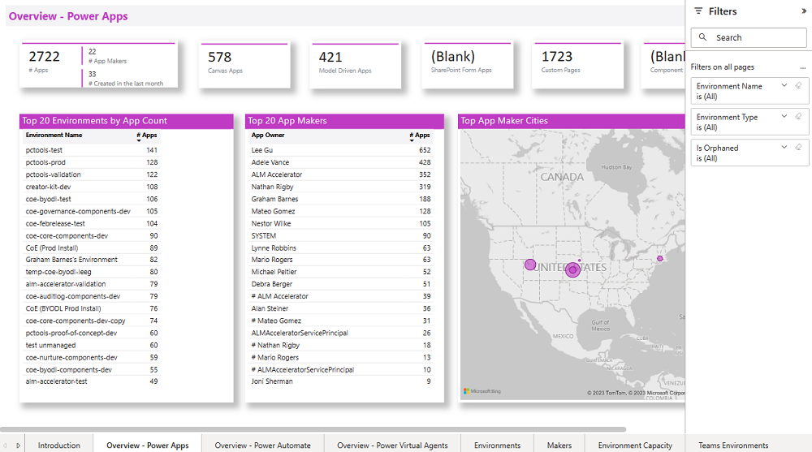

# Use core components

These components provide the core to get started with setting up a Center of Excellence (CoE). They sync all your resources into tables and build admin apps on top of that to help you get more visibility of the apps, flows, and makers in your environment. Additionally, apps like the Set App Permissions help with daily admin tasks. The core components solution contains assets relevant only to admins. More information: [Set up core components](setup-core-components.md)

## Demo: Core components

Watch how to use the core components solution.

> [!VIDEO https://www.youtube.com/embed/l0kJQAeKthw]

## What's in the solution

Here's a breakdown of the assets that form the core components:

- **Catalog tenant resources**
  - [Microsoft Dataverse tables](#tables): Environments, apps, flows, and more
  - [Admin | Sync Template v2 (flows)](#flows): All apps, flows, flow action details, custom connectors, connectors, model-driven apps, shared-with information, chatbots.
  - [Admin | Sync Audit Log (flow)](#flows)
  - [Power BI dashboard](#power-bi-report)
  - [Power Platform Admin View (model-driven app)](#apps)
- **Bulk change permissions for apps and flow**
  - [Set App Permissions (canvas app)](#apps)
  - [Set Flow Permissions (canvas app)](#apps)

## Tables

The [sync flows](#flows) of the CoE Starter Kit sync your tenant resources to the following Dataverse tables. All tables provide information about created by/on and modified by/on, in addition to resource-specific information.

- **Environment** represents the Environment object, which contains apps, flows, and connectors. The following information is available for each environment:
  - Environment ID
  - Display name
  - Dataverse instance URL
  - Created on
  - Environment maker (created by)
  - Region
  - Type (trial, developer, production)
  - Number of apps (rollup)
  - Number of flows (rollup)
  - Number of custom connectors (rollup)
  - Microsoft Teams ID and URL for environments of type Teams

- **PowerApps App** represents an app. The following information is available for each app:
  - Display name
  - App ID
  - Environment
  - Owner
  - Created on
  - Modified on
  - Published on
  - Last launched on (if collecting [audit log](setup-auditlog.md) information is configured)
  - App plan classification (standard, premium, extended)
  - Shared users
  - Shared groups
  - Shared with tenant (yes/no)
  - App type (canvas, model-driven, SharePoint form app)
  - App orphaned

- **Flow** represents a flow. The following information is available for each flow:
  - Display name
  - Flow ID
  - Environment
  - Owner
  - Created on
  - Modified on
  - State (started, suspended, stopped)
  - Flow orphaned
  - Flow trigger

- **Flow Action Detail** represents the set of actions that occur in a flow. This table has a many-to-one link with the Flow table. The following information is available for each action or trigger:
  - Type (scope, for each, Microsoft 365 users)
  - Operation (for connectors, such as Send Email and List Items)
  - Is trigger (yes/no)

- **PowerApps Connector** represents a standard or custom connector. The following information is available for each connector:
  - Connector ID
  - Display name
  - Icon background color and URI
  - Is custom connector (yes/no)
  - Maker (for custom connectors)
  - Publisher
  - Tier (standard/premium)

- **Connection Reference** The linking table for the many-to-many relationships among connectors (PowerApps Connector) and flows (Flows) or apps (PowerApps App).

- **Maker** represents a user who has created an app, flow, custom connector, or environment. The following information is available for each maker (retrieved from Microsoft 365 Users profiles):
  - Display name
  - ID
  - Email (user principal name)
  - City
  - Country
  - Department
  - Job title
  - Office
  - Number of apps (rollup)
  - Number of flows (rollup)

- **Audit Log** represents session details for Power Apps. The following information is available for each audit log entry:
  - Operation (launched app, deleted app, deleted flow)
  - App/flow ID
  - User city, country, department, job title (from Microsoft 365)
  - Audit log event time

- **CoE Settings** Configured settings live in a record in this table. This is an important table to populate data into during the setup process, because it contains details that are important for configuring the branding and support aspect of the solution. The following settings are available to configure:
  - Brand logo
  - Company name
  - Primary color
  - Secondary color
  - End user support email
  - Maker support email
  - Link to community channel
  - Link to learning material
  - Link to policy documents
  - Tenant type (public, GCC)

- **Sync Flow Errors** represents the daily occurrence of sync flow errors to provide a summary email to an admin. The following information is available for each sync flow error:
  - Flow instance URL
  - Environment
  - Created on

- **Power Platform User** represents who an app is shared with. The following information is available for each user:
  - Display name
  - ID
  - Group size (for users, this is set to 1; for groups, this is the group size according to Azure Active Directory)
  - Type (user, group, tenant)
  - User principal name (for users)

- **Power Platform User Role** represents the role a Microsoft Power Platform user has for a specific app. This has a one-to-many relationship with the Power Platform User and PowerApps App tables. The following information is available for each role:
  - App
  - Microsoft Power Platform user
  - Role name (Owner, CanEdit, CanView)
  - Friendly role name (Owner, Co-Owner, Viewer)

- **PVA** represents a bot in Power Virtual Agents. The following information is available for each bot:
  - Display name
  - ID
  - Created on
  - Owner
  - Modified on
  - Last launched on
  - Total number of sessions
  - Number of components (rollup)
  - Number of flows (rollup)
  - Status
  - Environment
  - Is bot orphaned (yes/no)

- **PVA Component** represents a Power Virtual Agents component, such as a topic. The following information is available for each bot component:
  - Name
  - ID
  - Component created on
  - Description
  - Display name
  - Environment
  - Modified on
  - State
  - Type (topic, table)
  - Uses flow (yes/no)

- **PVA Component Flow** represents a flow triggered as part of Power Virtual Agents. The following information is available for each bot component flow:
  - Name
  - ID
  - Created on/by

## Security roles

- **Power Platform Admin SR** Gives full access to create, read, write, and delete operations on the custom tables.

- **Power Platform Maker SR** Gives read and write access to the custom tables (environments, apps, and so on).

- **Power Platform User SR**  Gives read-only access to the resources in the custom tables.

> [!NOTE]
> To easily explore and manage data stored in Dataverse, we recommend that you install the [Microsoft Power Apps Office Add-in](https://appsource.microsoft.com/product/office/WA104380330?tab=Overview). More information: [Working with data in Dataverse using the Excel Add-in!](https://powerapps.microsoft.com/blog/cds-for-apps-excel-importexport/)

## Flows

### Admin \| Sync Template v2

The Admin \| Sync Template v2 flow runs on a weekly schedule, retrieves the environments in your tenant by using [List Environments as Admin](https://docs.microsoft.com/connectors/powerplatformforadmins/#list-environments-as-admin), and creates or updates a record for each environment in the Dataverse Environment table.

Running this flow will also trigger the rest of the sync flows indirectly by updating the environment records in the Dataverse instance.

### Admin \| Sync Template v2 (Apps)

The Admin \| Sync Template v2 (Apps) flow runs when an environment is created or modified, and gets app information by using [Get Apps as Admin](https://docs.microsoft.com/connectors/powerappsforadmins/#get-apps-as-admin). This information is then created or updated in the PowerApps App table.

### Admin \| Sync Template v2 (Flows)

The Admin \| Sync Template v2 (Flows) flow runs when an environment is created or modified, and gets flow information by using [List Flows as Admin](https://docs.microsoft.com/connectors/flowmanagement/#list-flows-as-admin). Also updates the record if flows have been deleted.

### Admin \| Sync Template v2 (Flow Action Details)

The Admin \| Sync Template v2 (Flow Action Details) flow runs once daily on a schedule, and gets the actions and triggers for all flows.

> [!WARNING]
> This flow uses [Get Flow as Admin](https://docs.microsoft.com/connectors/flowmanagement/#get-flow-as-admin) to get action and trigger details for every individual flow in your tenant. Thus, it can be a very time-consuming and resource-consuming flow to run.  Turning on this flow is optional, and we recommend that you do so only to perform action-level reporting or analysis, such as reporting on who's using the Send Email action of the Microsoft 365 Outlook connector.

### Admin \| Sync Template v2 (Connectors)

The Admin \| Sync Template v2 (Connectors) flow runs once daily on a schedule, gets connector information by using [Get Connectors](https://docs.microsoft.com/connectors/powerappsforappmakers/#get-connectors), and stores information such as the connector name, publisher, and tier.

### Admin \| Sync Template v2 (Custom Connector)

The Admin \| Sync Template v2 (Custom Connector) flow runs when an environment is created or modified, gets custom connector information by using [Get Custom Connectors as Admin](https://docs.microsoft.com/connectors/powerappsforadmins/#get-custom-connectors-as-admin), and stores information such as the name, endpoint, and created by/on.

### Admin \| Sync Template v2 (Model Driven Apps)

The Admin \| Sync Template v2 (Model Driven Apps) flow runs when an environment is created or modified, and gets model-driven app information. This information is retrieved from underlying Dataverse tables and requires the user running the flow to have system administrator privileges in the environment.

### Admin \| Sync Template v2 (PVA)

The Admin \| Sync Template v2 (PVA) flow runs when an environment is created or updated, and retrieves Power Virtual Agents (bot) information. This information is retrieved from underlying Dataverse tables and requires the user running the flow to have system administrator privileges in the environment.

Turning on this flow is optional, and we recommend that you do so only if you're using Power Virtual Agents in your tenant and are interested in getting a tenant-wide overview.

### Admin \| Sync Template v2 (Sync Flow Errors)

The Admin \| Sync Template v2 (Sync Flow Errors) flow runs on a schedule, and sends an email to the admin about environments that failed to sync (with a link to the flow instance).

### Admin \| Sync Template v2 (RPA)

The Admin \| Sync Template v2 (RPA) flow runs when an environment is created or updated, and retrieves UI flow information. This information is retrieved from underlying Dataverse tables and requires the user running the flow to have system administrator privileges in the environment.

Turning on this flow is optional, and we recommend that you do so only if you're using UI flows in your tenant and are interested in getting a tenant-wide overview.

### Admin \| Sync Template v2 (UI flow runs)

The Admin \| Sync Template v2 (UI flow runs) flow runs on a schedule, and gets UI flow run history and session details.

Turning on this flow is optional, and we recommended that you do so only if you're using UI flows in your tenant and are interested in getting a tenant-wide overview.

### CLEANUP - Admin \| Sync Template v2 (Power Apps User Shared With)

This long running flow runs every other week, and gets who the app is shared with by using [Get App Role Assignments as Admin](https://docs.microsoft.com/connectors/powerappsforadmins/#get-app-role-assignments-as-admin).

### CLEANUP - Admin \| Sync Template v2 (Check Deleted)

This long running flow runs every other week, and compares CoE to the tenant to determine if any objects were deleted since last run. Either just marks them as deleted (if env var Also Delete from CoE = no) or deletes them from the CoE (if Also Delete from CoE = yes).

The audit log solution is able to find this information in on a daily basis for apps and flows, but not for other resources such as environments, UI flows and chatbots. Run this flow periodically to check for deleted resources.

### CLEANUP - Admin \| Sync Template v2 (Orphaned Makers)

This flow runs weekly, and checks if any makers have left the organization - if maker information can not be found in Azure AD/Office 365 Users, any resources created by the maker (apps, flows, environments, chatbots and UI flows) are marked as orphaned.

### CLEANUP - Admin \| Sync Template v2 (Power Apps User Shared With))

This long running flow runs every other week. It walks the tenant and finds, for all apps in the tenant, who the app is shared with using this connector: [Get App Role Assignments as Admin](https://docs.microsoft.com/connectors/powerappsforadmins/#get-app-role-assignments-as-admin).

## Apps

<!--### DLP Editor

DLP Editor is a canvas app that reads and updates data loss prevention (DLP) policies while showing a list of apps that are affected by the policy configurations.

Use this app to:

- Make changes to DLP policies.
- See what impact each change will have.
- Mitigate the risk that changes in DLP policies will break a flow or an app by contacting makers.

More information: [Introduction to data groups](https://docs.microsoft.com/power-platform/admin/introduction-to-data-groups)

**Permission**: Intended to be used only by admins. Power Platform Service Admin or Global Admin permission is required. Share this app with your CoE admins.

### DLP Customizer

DLP Customizer is a canvas app you can use to add custom connectors to the business data group of a DLP policy, or to enable HTTP connectors to a DLP policy. More information: [HTTP and custom connector support for DLP policies](https://docs.microsoft.com/business-applications-release-notes/october18/microsoft-flow/http-and-custom-connector-support-for-dlp-policies)

**Permission**: Intended to be used only by admins. Power Platform Service Admin or Global Admin permission is required. Share this app with your CoE admins.

-->

### Set App Permissions

Set App Permissions is a canvas app that an admin can use to discover apps by app name, environment, or owner name, and to change app permissions.

Use this app to:

- Set a new app owner.
- Add new viewers and editors.
- Remove app permissions.
- Change app permissions from editors to viewers or viewers to editors.

You can also use this app to find apps that have been orphaned by the owner's having left your organization, and clean them up. More information: [Share a canvas app in Power Apps](https://docs.microsoft.com/powerapps/maker/canvas-apps/share-app)

**Permission**: This app is intended to be used only by admins. Microsoft Power Platform Service Admin or Global Admin permission is required. Share this app with your CoE admins.

### Set Flow Permissions

Similar to Set App Permissions, Set Flow Permissions is a canvas app that admins can use to discover flows by flow name, environment, or owner name.

Use this app to:

- Add new viewers and editors.
- Remove flow permissions.

Note that the ownership of a flow can't be changed.

You can also use this app to find flows that have been orphaned by the owner's having left your organization, and clean them up. More information: [Share a flow](https://docs.microsoft.com/power-automate/create-team-flows)

**Permission**: This app is intended to be used only by admins. Microsoft Power Platform Service Admin or Global Admin permission is required. Share this app with your CoE admins.

### Power Platform Admin View

Power Platform Admin View is a model-driven app that provides an interface used to browse items in Dataverse custom tables. It provides access to views and forms for the custom tables in the solution.

Use this app to:

- Get a quick overview of resources in your tenant.
- Learn about your makers, connectors, apps, and flows.
- Find out who apps are shared with.
- Add additional information, such as notes and risk assessments, to your resources.
- Complete [app audits](example-processes.md).

**Permission**: This app is intended to be used only by admins. Power Platform Service Admin or Global Admin permission is required. Share this app with your CoE admins.

You can use this app to see who an app is shared with, what roles (editor or viewer) the users have, and&mdash;for groups&mdash;what the size of the group is, all in a quick glance.

You can use this app to see Microsoft Teams environments.

## Power BI report

With Power BI reports, you can get a holistic view of Dataverse data with visualizations and insights for Environment, PowerApps App, Flow, Connector, Connection Reference, Maker, and Audit Log tables.

Follow the [setup instructions](setup-powerbi.md) to set up the Power BI dashboard. More information: [Gain deep insights into your Microsoft Power Platform adoption with the CoE Power BI dashboard](power-bi.md)

