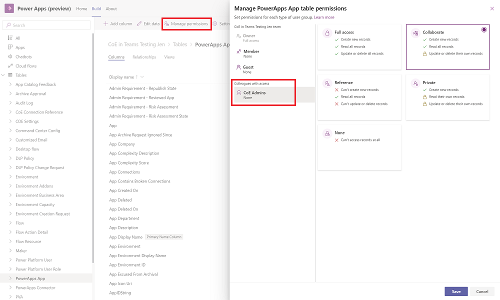
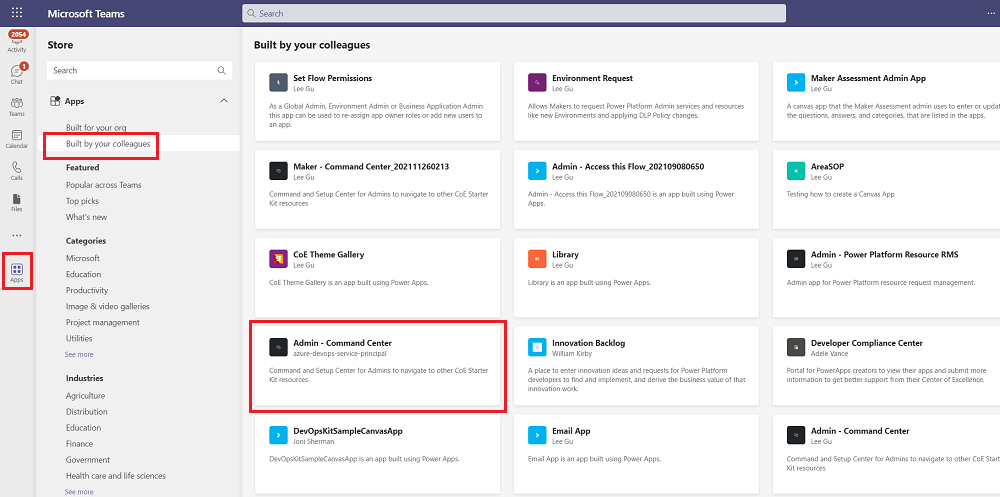
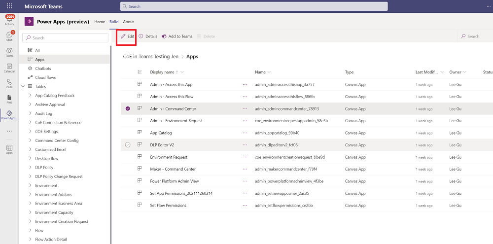
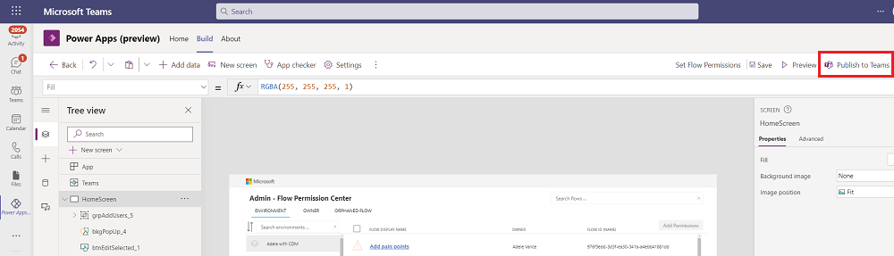
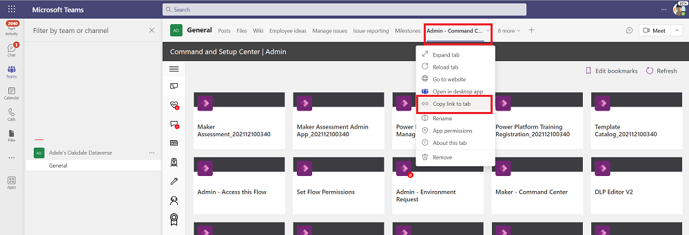

# Frequently asked questions, tips, and how-to's

This article will provide you with answers to frequently asked questions and tips on setting up and using the CoE Starter Kit.

## Installing a solution in a production environment

1. Go to [make.powerapps.com](<https://make.powerapps.com>).
1. Go to your CoE environment. In the example in the following screenshot, we're importing to the environment named **Contoso CoE**.

    

1. On the left pane, select **Solutions**.
1. Select **Import**, and then select **Browse**.
1. Select the solution from the CoE Starter Kit download.
1. Establish connections to activate your solution. If you create a new connection, you must select **Refresh**. You won't lose your import progress.

     
1. Update environment variable values. The environment variables are used to store application and flow configuration data with data specific to your organization or environment. This means that you only have to set the value once per environment, and it will be used in all necessary flows and apps in that environment.
    
1. Select **Import**.

## Set flow run-only users properties

1. Remove [unmanaged layers](after-setup.md) for all flows.
1. Go to the details page, and then select the **Run only users** edit button.

    

1. You'll see all the connections in the child flow. For each one, change the value to **Use this connection (userPrincipalName\@company.com)**.
1. If there's no connection for any of the connectors, go to **Data** > **Connections**, and create one for the connector.

    

1. After you've updated all run-only users, you can turn on the child flow.

## Setting up CoE for a subset of environments

You may want to monitor and govern only certain environments with the CoE Starter Kit. For example, if you're setting the CoE Starter Kit up for individual business organizations running their own smaller CoE or if you want to include your Dynamics 365 environments from the processes in the CoE Starter Kit. The option below describes how to only enable the CoE Starter Kit processes for certain environments.

> [!IMPORTANT]
> This is not a security feature and doesn't implement data privacy or row-level security. The feature is only intended to make monitoring and managing environments easier for organizational units.

1. After import of the Core components and before you turn on flows, set the value of the **is All Environments Inventory** environment variable to **No**. Learn more: [Update environment variables](#update-environment-variables)).
1. Continue with the [inventory setup](setup-core-components.md#turn-on-child-flows) and turn on all inventory flows.
1. Wait for first inventory run of **Admin | Sync Template v3** to complete.
1. Note that all environments in the tenant are added as excluded from inventory
      

1. Add environments you want to monitor and manage to the inventory by selecting **No** for the **Excuse from inventory** configuration.
      

1. Wait for next run of inventory to complete. It will now automatically pick up and monitor inventory for the selected environments.

## Running a full inventory

To reduce API calls, the inventory flows do not update all objects with every sync flow, they only update objects which have been modified since the object was last inventoried.

The inventory flows also don't check each object every day to see if its modified date is more recent than what is in inventory. Instead these flows:

1. Get all the objects. For example, by calling [Get Apps as Admin](/connectors/powerappsforadmins/#get-apps-as-admin).
1. Filter the returned list of objects down to objects where the modified date is greater than 7 days old (configurable via **InventoryFilter_DaysToLookBack**).
1. Check each object in the filtered result to see if its current modified date is more recent than the inventoried one.
1. Update these objects with the more recent modified by date.

If your sync flows were turned off for longer than 7 days, you can only get the inventory updates you missed by modifying the **InventoryFilter_DaysToLookBack** environment variable. Learn more: [Update environment variables](#update-environment-variables)).

If you want to fully update your entire inventory again, you can do that by changing the **Full inventory** environment variable:

1. Set the value of the **Full inventory** environment variable to **Yes**. Learn more: [Update environment variables](#update-environment-variables)).
1. Turn all flows in the Core components solution off and then on.
1. Run the **Admin | Sync Template v3** flow.
1. Set the **Full inventory** environment variable to **No**.
1. Turn all flows in the Core components solution off and then on.

## Update environment variables

The following limitations apply when updating environment variables:

- You can't update the values for environment variables from within the imported solution.
- You need to always add or update a current value, not the default value, because the default value will be overwritten when you install an upgrade.
- Environment variables are cached in cloud flows until the flow is reset (for example, by turning the cloud flow off and back on).

To update environment variables, you can use the [CoE Admin Command Center](core-components.md#admin---command-center)

1. Go to [make.powerapps.com](https://make.powerapps.com), and then select your CoE environment
1. Open the **CoE Admin Command Center** app.
1. Select the tool icon, and update the current value.

    

>[!NOTE]
>After changing the value of an environment variable, you'll need to turn off and on all the flows that use that environment variable to make sure the flows use the latest value.

If you aren't using the [CoE Admin Command Center](core-components.md#admin---command-center) app, do the following to update environment variables:

1. If you've installed the solution in a production environment, do the following:
   1. Go to [Power Automate](https://make.powerautomate.com).
   1. On the left pane, select **Solutions**.
   1. Select the **Default Solution**, and change the filter to show **Environment Variables**.
   1. Select a variable that you want to update, and then configure its **Current Value**.

1. If you've installed the solution in a Dataverse for Teams environment, do the following:
   1. Go to [Power Automate](https://make.powerautomate.com).
   1. On the left pane, select **Solutions**.
   1. Select **Common Data Services Default Solution**.
   1. Select **+ Add > Environment Variables**.
   1. Select the existing environment variables from the managed solution that you want to update.
   1. Change the filter to show **Environment Variables**.
   1. Select a variable that you want to update, and then configure its **Current Value**.

## Share an app from a production environment

1. Go to [make.powerapps.com](https://make.powerapps.com), and then select your CoE environment.
1. On the app that you want to share, select **...** > **Share**.

      

1. Select the Dataverse security role. The CoE Starter Kit makes three security roles available:
    - **Power Platform Admin SR** for sharing an app with admins
    - **Power Platform Maker SR** for sharing an app with your makers
    - **Power Platform User SR** for sharing an app with users

      

1. Select **Share**.

## Share an app from a Dataverse for Teams environment

1. Open the Power Apps app in Teams, select **Build**, and then select the team you've installed the CoE Starter Kit in.
1. Select **Share with colleagues**. You must be a team owner to see this option.
1. Search for and select the security group you want to share the apps and tables with.
1. Select the apps you want to share with members of this security group.

      

1. Select **Save**.
1. Select **Installed apps**.
1. Select **See all** on the Center of Excellence - Core for Teams solution.
1. On the left pane, select **Tables**.
1. Select the table you want to manage, and then select **Manage Permissions**.
1. Assign [table permissions](/powerapps/teams/set-perms-and-share#assign-table-permissions) to the security group. The level of permissions will depend on the app you're sharing. Perform this step for all tables used by the app you're sharing.

      

1. To access the app, colleagues with access can go to Microsoft Teams > **Apps** > **Built by your colleagues**, and select the app from there.

      

      Note that apps are only accessible from within Microsoft Teams.

## Get a Power Apps URL from a production environment

1. Go to [make.powerapps.com](https://make.powerapps.com), and then select your CoE environment.
1. Select **Apps**.
1. Select the app of which you need the URL from.
1. Select **...** > **Details**.
1. Select the **Web link**.

      

## Add apps to Microsoft Teams

1. Open the Power Apps app in Teams, select **Build**.
1. Select the team you've installed the CoE Starter Kit in, and then select **Installed apps**.
1. Select **Apps**, and then select **Edit** for the app you want to add to Teams.

      

1. Select **Publish to Teams** > **Next**.

      

1. Select **Add to a Channel** > **Save and close**.

      

1. If you'd like to save the app URL, go to that channel in Microsoft Teams, open the app, and then select **Copy link to tab**.

      

## Timeouts in the Admin | Sync Template v3

The Dataverse connector might experience some throttling limits if the tenant has many resources. If you see 429 errors in the flow run history occurring in later runs, you can try the following resolution steps:

**Configure the retry policy**

  1. Open **Admin \| Sync Template v3**, and then select **Edit**.
  1. Expand the step **Get Environments and store them in the CoE Table**.
  1. Expand the step **Apply to each Environment**
  1. Go to the **Settings** pane for each call to Dataverse, and configure the timeout/retry settings. The default count is set to **10** and the default interval is set to **PT10S**. Increase these values incrementally.

     

**Configure (reduce) concurrency in Foreach loops to reduce simultaneous calls**

  1. Open **Admin \| Sync Template v3**, and then select **Edit**.
  1. Expand the step **Get Environments and store them in the CoE Table**.
  1. Go to **Settings** for the **Apply to each Environment** step.

     

  1. Use the slider to reduce the value of **Degree of Parallelism**. The default value is 50; reducing the parallelism here will increase the runtime of the flow, so we suggest gradually lowering the number.

[!INCLUDE[footer-include](../../includes/footer-banner.md)]
