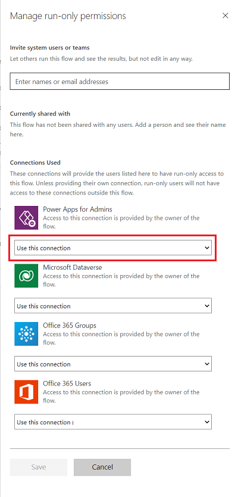
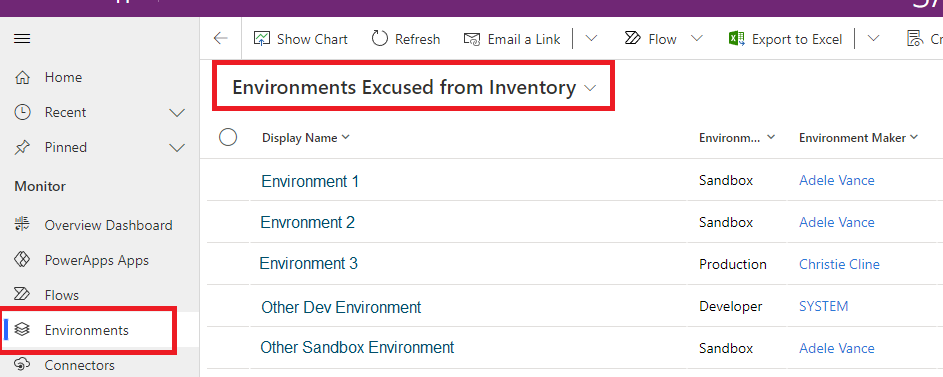
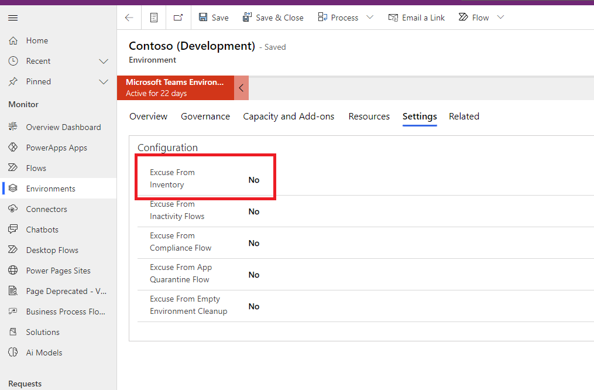
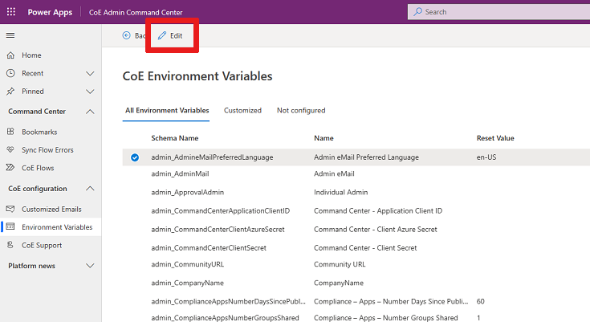
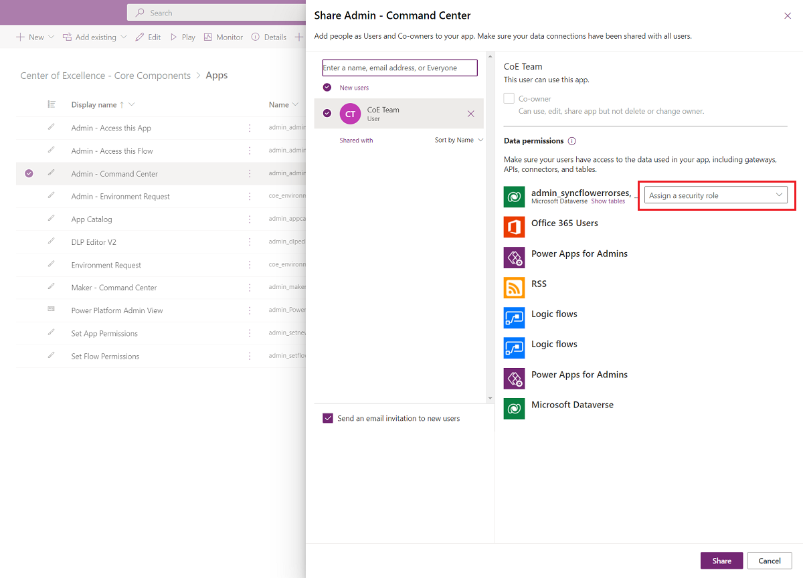
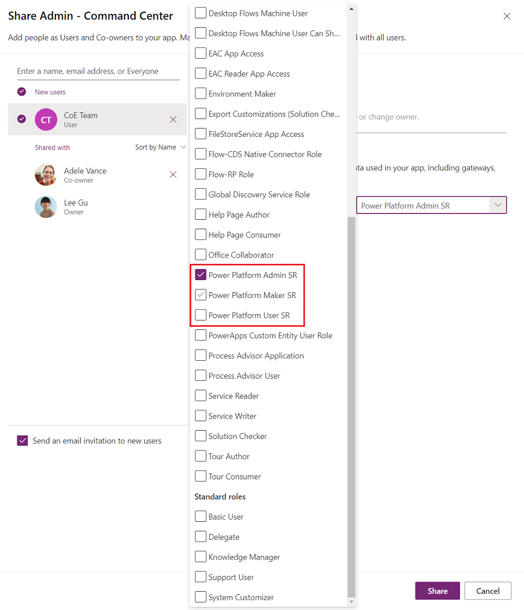
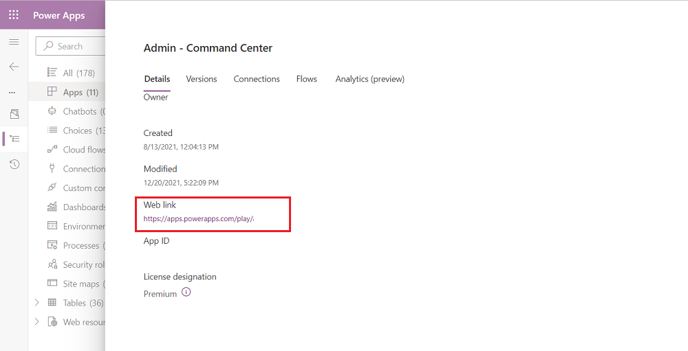
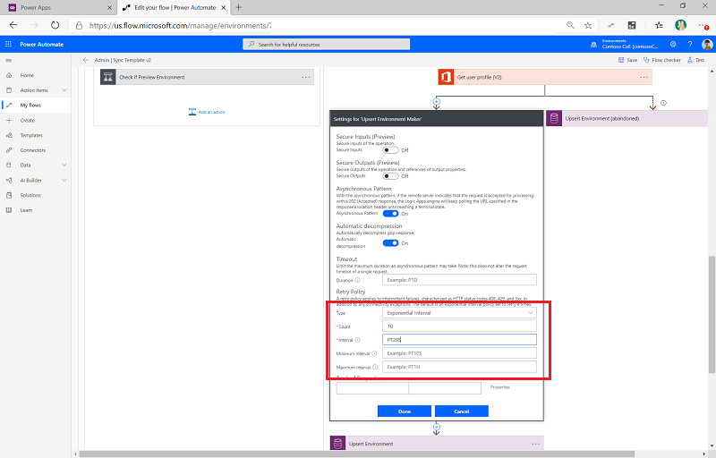
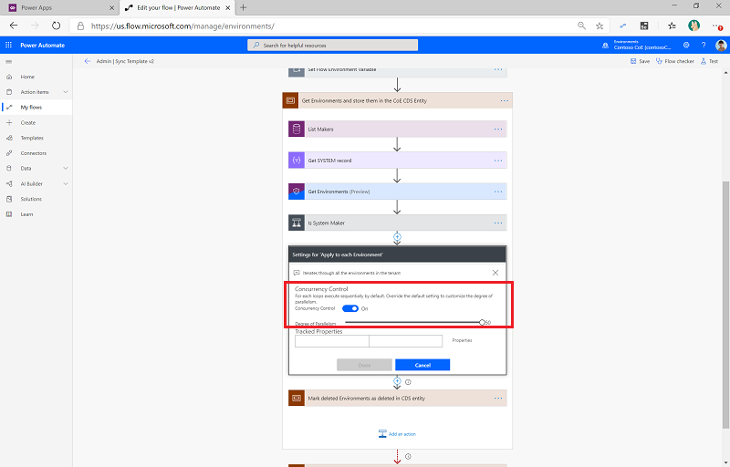

# Frequently asked questions, tips, and how-to's

This article will provide you with answers to frequently asked questions and tips on setting up and using the CoE Starter Kit.

## Installing a solution in a production environment

1. Go to [make.powerapps.com](<https://make.powerapps.com>).
1. Go to your CoE environment. In the example in the following screenshot, we're importing to the environment named **Contoso CoE**.

    

1. On the left pane, select **Solutions**.
1. Select **Import**, and then select **Browse**.
1. Select the solution from the CoE Starter Kit download.
1. Establish connections to activate your solution. If you create a new connection, you must select **Refresh**. You won't lose your import progress.

     
1. Update environment variable values. The environment variables are used to store application and flow configuration data with data specific to your organization or environment. This means that you only have to set the value once per environment, and it will be used in all necessary flows and apps in that environment.
    
1. Select **Import**.

## Set flow run-only users properties

1. Remove [unmanaged layers](after-setup.md) for all flows.
1. Go to the details page, and then select the **Run only users** edit button.

    

1. You'll see all the connections in the child flow. For each one except Microsoft Dataverse, change the value to **Use this connection (userPrincipalName\@company.com)**. For Microsoft Dataverse, leave the value blank.
1. If there's no connection for any of the connectors, go to **Data** > **Connections**, and create one for the connector.

    

1. After you've updated all run-only users, you can turn on the child flow.

## Setting up CoE for a subset of environments

You may want to monitor and govern only certain environments with the CoE Starter Kit. For example, if you're setting the CoE Starter Kit up for individual business organizations running their own smaller CoE or if you want to include your Dynamics 365 environments from the processes in the CoE Starter Kit. The option below describes how to only enable the CoE Starter Kit processes for certain environments.

> [!IMPORTANT]
> This is not a security feature and doesn't implement data privacy or row-level security. The feature is only intended to make monitoring and managing environments easier for organizational units.

1. After import of the Core components and before you turn on flows, set the value of the **is All Environments Inventory** environment variable to **No**. Learn more: [Update environment variables](#update-environment-variables)).
1. Continue with the [inventory setup](setup-core-components.md#turn-on-child-flows) and turn on all inventory flows.
1. Wait for first inventory run of **Admin | Sync Template v3** to complete.
1. Note that all environments in the tenant are added as excluded from inventory
      

1. Add environments you want to monitor and manage to the inventory by selecting **No** for the **Excuse from inventory** configuration.
      

1. Wait for next run of inventory to complete. It will now automatically pick up and monitor inventory for the selected environments.

## Running a full inventory

To reduce API calls, the inventory flows do not update all objects with every sync flow. The flows only update objects which have been modified since the object was last inventoried.

The inventory flows also don't check each object every day to see if its modified date is more recent than what is in inventory. Instead these flows:

1. Get all the objects. For example, by calling [Get Apps as Admin](/connectors/powerappsforadmins/#get-apps-as-admin).
1. Filter the returned list of objects down to objects where the modified date is greater than 7 days old (configurable via **InventoryFilter_DaysToLookBack**).
1. Check each object in the filtered result to see if its current modified date is more recent than the inventoried one.
1. Update these objects with the more recent modified by date.

If your sync flows were turned off for longer than 7 days, you can only get the inventory updates you missed by modifying the **InventoryFilter_DaysToLookBack** environment variable. Learn more: [Update environment variables](#update-environment-variables)).

If you want to fully update your entire inventory again, you can do that by changing the **Full inventory** environment variable:

1. Set the value of the **Full inventory** environment variable to **Yes**. Learn more: [Update environment variables](#update-environment-variables)).
1. Run the **Admin | Sync Template v3 (Driver)** flow.
1. Set the **Full inventory** environment variable to **No**.

## Update inventory for a selected app or flow

To reduce API calls, the inventory flows do not update all objects with every sync flow. The flows only update objects which have been modified since the object was last inventoried.

If you want to force the inventory for an app or flow, for example to make sure all the information is up-to-date, you can use the **Inventory Me** flag.

1. Go to [Power Apps](https://make.powerapps.com), and then select your CoE environment.
1. Open the **Power Platform Admin View** app.
1. Select **Apps** or **Flows**.
1. Select the app or flow you want to inventory from the view.
1. Select **Settings**.
1. Change the **Inventory Me** flag to **Yes**.

Once this flag has been set to **Yes**, the next inventory run updates the object, even if it hasn't recently been modified. The flag is then set back to **No**.

## Customize emails

All emails that are sent as part of the CoE Starter Kit are stored in the **Customized Emails** table. To customize the emails, you don't need to modify the flows or apps that send the emails. Instead, you can use the [CoE Admin Command Center](core-components.md#coe-admin-command-center) app.

1. Go to [Power Apps](https://make.powerapps.com), and then select your CoE environment.
1. Open the **CoE Admin Command Center** app.
1. Select **Customized Emails**.
1. Select the email you want to customize, and then select **Edit**.
1. By default, all emails are provided in English. You can also add localized versions of the email by selecting **Add language**.

## Update environment variables

The following limitations apply when updating environment variables:

- You can't update the values for environment variables from within the imported solution.
- You need to always add or update a current value, not the default value, because the default value will be overwritten when you install an upgrade.
- You can't update Azure Key Vault secret environment variables using the CoE Admin Command Center. Instead, update them via the **Default Solution**.

To update environment variables, you can use the [CoE Admin Command Center](core-components.md#coe-admin-command-center)

1. Go to [Power Apps](https://make.powerapps.com), and then select your CoE environment.
1. Open the **CoE Admin Command Center** app.
1. Select **Environment Variables**, and update the current value.

    

If you aren't using the [CoE Admin Command Center](core-components.md#coe-admin-command-center) app, update environment variables directly in the environment. This is also the only way to update Azure Key Vault secret environment variables.

1. Go to [Power Automate](https://make.powerautomate.com).
1. On the left pane, select **Solutions**.
1. Select the **Default Solution**, and change the filter to show **Environment variables**.
1. Select a variable that you want to update, and then configure its **Current Value**.
1. If you are updating an Azure Key Vault secret environment variable, enter the following information:
    - **Azure Subscription ID**: The Azure subscription ID associated with the key vault.
    - **Resource Group Name**: The Azure resource group where the key vault that contains the secret is located.
    - **Azure Key Vault Name**: The name of the key vault that contains the secret.
    - **Secret Name**: The name of the secret located in Azure Key Vault.

  > [!TIP]
  > The subscription ID, resource group name, and key vault name can be found on the Azure portal **Overview** page of the key vault. The secret name can be found on the key vault page in the Azure portal by selecting **Secrets** under **Settings**.

## Update connection references

1. Go to [Power Automate](https://make.powerautomate.com).
1. On the left pane, select **Solutions**.
1. Select the **Default Solution**, and change the filter to show **Connection References**.
1. Select a connection reference.
1. Set the value by selecting an existing connection from the drop down or creating a new one.
1. Select **Save** and confirm you want to save the changes.

## Which flows in the CoE Starter Kit send emails or notifications to makers or end users?

There are a number of processes in the CoE Starter Kit that send emails or notifications to makers and end users. Each processes is off by default and has to be opted in by configuring it. Each process is described in the [What's in the kit](starter-kit-explained.md) section, the list below provides a summary of the different processes that communicate with your makers and end users.

Use the [CoE Admin Command Center](core-components.md#coe-admin-command-center) to update the email subject and body.

- [Welcome email](core-components.md#flows-2) sends a welcome email to a maker if they create an app, flow, bot etc for the first time.

- [Capacity alerts](core-components.md#flows-2) send capacity alerts to the configured admin group if environments are over the approved capacity.

- [Add-on alerts](core-components.md#flows-2) send add-on capacity alerts to the configured admin group if environments are over the approved capacity.

- [Environment Request management](core-components.md#flows-1) sends emails to the admin about requested environments, and to the requestor about the outcome of the requested environment (approved/rejected).

- [Compliance process](governance-components.md#compliance-processes) sends emails to app and bot makers if their resources are over specific thresholds (e.g. shared with more than x people, launched more than x times).

- [Inactivity process](governance-components.md#inactivity-processes) sends approval tasks to makers if their flows or apps are inactive.

- [Microsoft Teams governance](governance-components.md#microsoft-teams-governance) sends asks for business justifications as Teams adaptive cards to anyone who creates a new Dataverse for Teams environment

- [Clean up of orphaned resources process](governance-components.md#cleanup-for-orphaned-resources) sends emails to managers if someone that previously reported to them left the org and left behind apps and flows that need new owners.

- [Quarantine process](governance-components.md#app-quarantine-process) as part of the Compliance process you can quarantine apps and this also triggers notifications if you do that.

- [Training in a day](nurture-components.md#training-in-a-day-components) sends emails to users that register for upcoming training events

- [Pulse survey](nurture-components.md#pulse-survey-components) sends Teams adaptive cards to makers to get feedback from them.

## Share an app from a production environment

1. Go to [Power Apps](https://make.powerapps.com), and then select your CoE environment.
1. On the app that you want to share, select **...** > **Share**.

      

1. Select the Dataverse security role. The CoE Starter Kit makes three security roles available:
    - **Power Platform Admin SR** for sharing an app with admins
    - **Power Platform Maker SR** for sharing an app with your makers
    - **Power Platform User SR** for sharing an app with users

      

1. Select **Share**.

## Get a Power Apps URL from a production environment

1. Go to [Power Apps](https://make.powerapps.com), and then select your CoE environment.
1. Select **Apps**.
1. Select the app of which you need the URL from.
1. Select **...** > **Details**.
1. Select the **Web link**.

      

## Timeouts in the Admin | Sync Template v3

The Dataverse connector might experience some throttling limits if the tenant has many resources. If you see 429 errors in the flow run history occurring in later runs, you can try the following resolution steps:

### Configure the retry policy

  1. Open **Admin \| Sync Template v3**, and then select **Edit**.
  1. Expand the step **Get Environments and store them in the CoE Table**.
  1. Expand the step **Apply to each Environment**
  1. Go to the **Settings** pane for each call to Dataverse, and configure the timeout/retry settings. The default count is set to **10** and the default interval is set to **PT10S**. Increase these values incrementally.

     

### Configure (reduce) concurrency in Foreach loops to reduce simultaneous calls

  1. Open **Admin \| Sync Template v3**, and then select **Edit**.
  1. Expand the step **Get Environments and store them in the CoE Table**.
  1. Go to **Settings** for the **Apply to each Environment** step.

     

  1. Use the slider to reduce the value of **Degree of Parallelism**. The default value is 50; reducing the parallelism here will increase the runtime of the flow, so we suggest gradually lowering the number.

## Which license should I assign to the user that's running the CoE Starter Kit flows?

The pre-requisite for installing the CoE Starter Kit is that the user installing it has a Power Automate Per User license, or for flows to be covered with a Per Flow license - often a combination of these licenses is required to successfully run the CoE Starter Kit. The combination depends on factors like how many resources (apps, flows, environments) you have in your tenant, how many makers you have, and how often new resources are created and modified. Different Power Automate license types will have different API Limits and enforcements - if your license type is not sufficient, the flow may get throttled or run for a long time. Use the following guide to identify which license to pick.

  1. Understand the [Power Automate request limits](/power-platform/admin/api-request-limits-allocations).
  1. Start by assigning a Power Automate Per user license and turn on all the required flows. Monitor the flows with **CLEANUP**, **Sync Template (Flows)** and **Sync Template (Apps)** in the name - these often consume a high number of API requests. You can use [**action analytics**](https://powerautomate.microsoft.com/blog/introduction-action-usage-analytics-in-power-automate/) to monitor the API requests of these flows.
  1. If the flow runs too many actions, [change the flow owner](/power-automate/change-cloud-flow-owner) to a different account with a Power Automate Per User license. This will load balance the API requests.
  1. If the flow continues to run too many actions, assign a [Per Flow](/power-platform/admin/power-automate-licensing/types#standalone-plans) plan to this flow. This will reserve capacity and API requests for the flow.

[!INCLUDE[footer-include](../../includes/footer-banner.md)]
