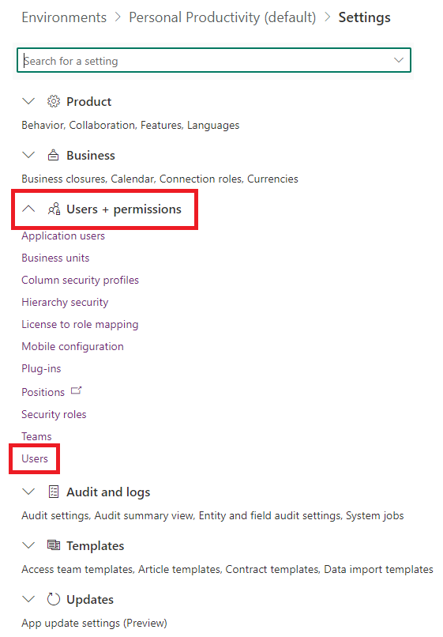

# Frequently asked questions, tips, and how-to's

This article will provide you with answers to frequently asked questions and tips on setting up and using the CoE Starter Kit.

## Installing a solution in a production environment

1. Go to [make.powerapps.com](<https://make.powerapps.com>).
1. Go to your CoE environment. In the example in the following screenshot, we're importing to the environment named **Contoso CoE**.

    

1. On the left pane, select **Solutions**.
1. Select **Import**, and then select **Browse**.
1. Select the solution from the CoE Starter Kit download.
1. Establish connections to activate your solution. If you create a new connection, you must select **Refresh**. You won't lose your import progress.

     
1. Update environment variable values. The environment variables are used to store application and flow configuration data with data specific to your organization or environment. This means that you only have to set the value once per environment, and it will be used in all necessary flows and apps in that environment.
    
1. Select **Import**.

## Set flow run-only users properties

1. Remove [unmanaged layers](after-setup.md) for all flows.
1. Go to the details page, and then select the **Run only users** edit button.

    

1. You'll see all the connections in the child flow. For each one except Microsoft Dataverse, change the value to **Use this connection (userPrincipalName\@company.com)**. For Microsoft Dataverse, leave the value blank.
1. If there's no connection for any of the connectors, go to **Data** > **Connections**, and create one for the connector.

    

1. After you've updated all run-only users, you can turn on the child flow.

## Find a users Security Roles in an Environment

To find the Security Roles of a user in an environment you can use the product UX as shown here

1. Go to [https://admin.powerplatform.microsoft.com/environments](https://admin.powerplatform.microsoft.com/environments)
2. Select the desired environment
3. Settings
    
4. From Users + Permissions, select Users
    
5. Find your user and select their name to bring up their properties. There you will see their Security Roles
    

## Import a Flow

Sometimes we will ship a one off flow to use in order to patch an issue. The first thing you will need to do when we offer these is to import the flow. Here is how to import flows.

1. Go to [https://make.powerautomate.com/](https://make.powerautomate.com/)
1. Select your target environment. For us that will typically be our CoE Environment.
1. Select My flows > Import > Import Package (Legacy)
    
1. Select and upload your flow.
    
1. Create any needed connections and Import
    
1. When done click Open Flow to view and then back to see details and turn on.
    
    
    

## Setting up CoE for a subset of environments

You may want to monitor and govern only certain environments with the CoE Starter Kit. For example, if you're setting the CoE Starter Kit up for individual business organizations running their own smaller CoE or if you want to include your Dynamics 365 environments from the processes in the CoE Starter Kit. The option below describes how to only enable the CoE Starter Kit processes for certain environments.

> [!IMPORTANT]
> This is not a security feature and doesn't implement data privacy or row-level security. The feature is only intended to make monitoring and managing environments easier for organizational units.

1. After import of the Core components and before you turn on flows, set the value of the **is All Environments Inventory** environment variable to **No**. Learn more: [Update environment variables](#update-environment-variables)).
1. Continue with the [inventory setup](setup-core-components.md#turn-on-child-flows) and turn on all inventory flows.
1. Wait for first inventory run of **Admin | Sync Template v3** to complete.
1. Note that all environments in the tenant are added as excluded from inventory
      

1. Add environments you want to monitor and manage to the inventory by selecting **No** for the **Excuse from inventory** configuration.
      

1. Wait for next run of inventory to complete. It will now automatically pick up and monitor inventory for the selected environments.

## Running a full inventory

To reduce API calls, the inventory flows do not update all objects with every sync flow. The flows only update objects which have been modified since the object was last inventoried.

The inventory flows also don't check each object every day to see if its modified date is more recent than what is in inventory. Instead these flows:

1. Get all the objects. For example, by calling [Get Apps as Admin](/connectors/powerappsforadmins/#get-apps-as-admin).
1. Filter the returned list of objects down to objects where the modified date is greater than 7 days old (configurable via **InventoryFilter_DaysToLookBack**).
1. Check each object in the filtered result to see if its current modified date is more recent than the inventoried one.
1. Update these objects with the more recent modified by date.

If your sync flows were turned off for longer than 7 days, you can only get the inventory updates you missed by modifying the **InventoryFilter_DaysToLookBack** environment variable. Learn more: [Update environment variables](#update-environment-variables)).

If you want to fully update your entire inventory again, you can do that by changing the **Full inventory** environment variable:

1. Set the value of the **Full inventory** environment variable to **Yes**. Learn more: [Update environment variables](#update-environment-variables)).
1. Run the **Admin | Sync Template v4 (Driver)** flow.
1. Wait till the flow finishes running.
1. Set the **Full inventory** environment variable to **No**.

## Update inventory for a selected app or flow

### Force inventory on Objects

To reduce API calls, the inventory flows do not update all objects with every sync flow run. The flows only update objects which have been modified since the object was last inventoried.

If you want to force the inventory for an individual object, you can use the **Inventory Me** flag. All objects have this flag. 

Here is an example of how to set this using Cloud Flow objects.

1. Go to [Power Apps](https://make.powerapps.com), and then select your CoE environment.
1. Open the **Power Platform Admin View** app.
1. Select **Flows**.
1. Select the flow for which you want to force inventory from the view.
1. Select **Settings**.
1. Change the **Inventory Me** flag to **Yes**.

Once this flag has been set to **Yes**, the next inventory run updates the object, even if it hasn't recently been modified. The flag is then set back to **No**.

### Force inventory on cloud flow action details

We gather details about the flows actions in a long running flow called **Admin | Sync Template v3 (Flow Action Details)**.

To force this to run for your flow you can use the **Inventory My FlowActionDetails** flag.

1. Go to [Power Apps](https://make.powerapps.com), and then select your CoE environment.
1. Open the **Power Platform Admin View** app.
1. Select **Flows**.
1. Select the flow for which you want to force flow action detail inventory from the view.
1. Select **Settings**.
1. Change the **Inventory My FlowActionDetails** flag to **Yes**.

## Update environment variables

### Limitations for environment variables

The following limitations apply when updating environment variables:

- You can't update the values for environment variables from within the imported solution.
- You need to always add or update a current value, not the default value, because the default value will be overwritten when you install an upgrade.
- You can't update Azure Key Vault secret environment variables using the CoE Admin Command Center. Instead, update them via the **Default Solution**.

### Update CoE Starter kit specific environment variables

To update environment variables used in the kit, you can use the [CoE Admin Command Center](core-components.md#coe-admin-command-center)

1. Go to [Power Apps](https://make.powerapps.com), and then select your CoE environment.
1. Open the **CoE Admin Command Center** app.
1. Select **Environment Variables** screen
1. Select an environment variable to update, click edit and update.

    

### Ensure flows that use it are not cached

Sometime power automate will cache old values for environment variables. If you do not see expected behavior after changing an environment variable, it is recommended that you restart the impacted flows after you set an environment variable as a result.

1. Go to [Power Automate](https://make.powerautomate.com).
1. On the left pane, select **Solutions**.
1. Select the **Default Solution**, and change the filter to show **Environment variables**.
1. Select a variable that you want to update, and show its dependencies

    

1. Look at the Used by find the Object type Process.
    

1. Go turn all these flows off and back on.

### Environment variables outside the kit

If you aren't using the [CoE Admin Command Center](core-components.md#coe-admin-command-center) app, or you need to update environment variables outside the kit. You can do so directly in the environment. This is also the only way to update Azure Key Vault secret environment variables.

1. Go to [Power Automate](https://make.powerautomate.com).
1. On the left pane, select **Solutions**.
1. Select the **Default Solution**, and change the filter to show **Environment variables**.
1. Select a variable that you want to update, and then configure its **Current Value**.
1. If you are updating an Azure Key Vault secret environment variable, enter the following information:
    - **Azure Subscription ID**: The Azure subscription ID associated with the key vault.
    - **Resource Group Name**: The Azure resource group where the key vault that contains the secret is located.
    - **Azure Key Vault Name**: The name of the key vault that contains the secret.
    - **Secret Name**: The name of the secret located in Azure Key Vault.

  > [!TIP]
  > The subscription ID, resource group name, and key vault name can be found on the Azure portal **Overview** page of the key vault. The secret name can be found on the key vault page in the Azure portal by selecting **Secrets** under **Settings**.

## Update connection references

1. Go to [Power Automate](https://make.powerautomate.com).
1. On the left pane, select **Solutions**.
1. Select the **Default Solution**, and change the filter to show **Connection References**.
1. Select a connection reference.
1. Set the value by selecting an existing connection from the drop down or creating a new one.
1. Select **Save** and confirm you want to save the changes.

## Monitor and Customize emails

All emails that are sent as part of the CoE Starter Kit are stored in the **Customized Emails** table. To customize the emails, you don't need to modify the flows or apps that send the emails. Instead, you can use the [CoE Admin Command Center](core-components.md#coe-admin-command-center) app.

1. Go to [Power Apps](https://make.powerapps.com), and then select your CoE environment.
1. Open the **CoE Admin Command Center** app.
1. Select **Customized Emails**.
1. Select the email you want to customize, and then select **Edit**.
1. By default, all emails are provided in English. You can also add localized versions of the email by selecting **Add language**.

      

## Share an app from a production environment

1. Go to [Power Apps](https://make.powerapps.com), and then select your CoE environment.
1. On the app that you want to share, select **...** > **Share**.

      

1. Select the Dataverse security role. The CoE Starter Kit makes three security roles available:
    - **Power Platform Admin SR** for sharing an app with admins
    - **Power Platform Maker SR** for sharing an app with your makers
    - **Power Platform User SR** for sharing an app with users

      

1. Select **Share**.

## Get a Power Apps URL from a production environment

1. Go to [Power Apps](https://make.powerapps.com), and then select your CoE environment.
1. Select **Apps**.
1. Select the app of which you need the URL from.
1. Select **...** > **Details**.
1. Select the **Web link**.

      

## Deal with backend throttling during inventory runs

Some users will get throttled by the product backends (ex updating records in Dataverse) when doing their inventory, and experience 429 errors as a result.
We have added an environment variable if you see this which you can use. This will add a delay at the top of each individual inventory action and prevent them from running at the same time. It will then make your inventory run take longer as it will avoid concurrency.

To use this update value of the DelayObjectInventory environment variable to Yes

See [How to update environment variables](#update-environment-variables) for how to update environment variables.

<!-- See [All inventory environment variables](./setup-core-components#all-environment-variables)) for full list of environment variables associated with Inventory. -->

## Cross Tenant Connection Identities

In the Power Platform Admin View app you can see where we highlight cross tenant connection identities. How do we configure what is considered cross tenant?
    

### How to configure what is a local connection identity

By default only the host domain of the identity running the inventory flows will be considered a local identity. To configure this you can use  the **Host Domains** environment variable.
Enter any hosts you which to add to this environment variable as a comma separated string.
    

See [How to update environment variables](#update-environment-variables) for how to update environment variables.

<!-- See [All inventory environment variables](./setup-core-components#all-environment-variables)) for full list of environment variables associated with Inventory. -->

### How to update data to respect configured local tenants

Note that changing the Host Domains environment variable will not go back and update the old data in the tables. Since we expect this to be a rare setting change we do not want to compare this regularly, to avoid additional API hits.
So you will need to do this manually.

There are many ways you can do this, including a custom flow, the Excel add in or via plug ins.
The logic is always the same, and so you can chose which way you will do this.
We have demonstrated how to do this via the Excel Add In as it is ideal given it is fast and does not require a big API hit.

1. Browse to the **Connection Reference Identity** table and **Edit data in Excel**
    

1. Click Enable Editing, Accept and Continue if prompted and sign in as your CoE Admin identity
    
    

1. Filter the **accountName** field by the domain you have added to the **Host Domains** environment variable
    

1. Set the **NoneOrCrossTenantIdentity** to false (No)
    

1. Remove the filters and publish.
    

## How to activate Business Process Flows?

<!-- Occasionally people will see the BPFs used in the kit as disabled due to some issue with their install. If this happens and you want to use the features that employ them, for example the [Compliance processes](./governance-components#compliance-processes), you will need to activate them manually. -->
Occasionally people will see the BPFs used in the kit as disabled due to some issue with their install. If this happens and you want to use the features that employ them, you will need to activate them manually.

1. Browse to the solution with the BPFs and click to view Processes
1. Find BPFs that are turned off and click their name to open
    

1. Click Activate to turn on the BPF
    

## Which license should I assign to the user that's running the CoE Starter Kit flows?

The pre-requisite for installing the CoE Starter Kit is that the user installing it has a Power Automate Per User license, or for flows to be covered with a Per Flow license - often a combination of these licenses is required to successfully run the CoE Starter Kit. The combination depends on factors like how many resources (apps, flows, environments) you have in your tenant, how many makers you have, and how often new resources are created and modified. Different Power Automate license types will have different API Limits and enforcements - if your license type is not sufficient, the flow may get throttled or run for a long time. Use the following guide to identify which license to pick.

  1. Understand the [Power Automate request limits](/power-platform/admin/api-request-limits-allocations).
  1. Start by assigning a Power Automate Per user license and turn on all the required flows. Monitor the flows with **CLEANUP**, **Sync Template (Flows)** and **Sync Template (Apps)** in the name - these often consume a high number of API requests. You can use [**action analytics**](https://powerautomate.microsoft.com/blog/introduction-action-usage-analytics-in-power-automate/) to monitor the API requests of these flows.
  1. If the flow runs too many actions, [change the flow owner](/power-automate/change-cloud-flow-owner) to a different account with a Power Automate Per User license. This will load balance the API requests.
  1. If the flow continues to run too many actions, assign a [Per Flow](/power-platform/admin/power-automate-licensing/types#standalone-plans) plan to this flow. This will reserve capacity and API requests for the flow.

[!INCLUDE[footer-include](../../includes/footer-banner.md)]
