# Use governance components

>[!NOTE]
>Governance components where previously named Audit components. There might still be some references to Audit components in the solution and/or documentation.

After you've become familiar with your environments and resources, you might start thinking about governance processes for your apps. You might want to gather additional information about your apps from your makers, or audit specific connectors or app usage.

[Watch an overview](https://www.youtube.com/embed/6bfaFsFtLow) of how to use the Governance components solution.

The Governance components solution contains assets relevant to admins and makers. More information: [Set up governance components](setup-governance-components.md)

## Compliance processes

[Watch a walk-through](https://www.youtube.com/watch?v=WXXFjHLt5ss&list=PLi9EhCY4z99W5kzaPK1np6sv6AzMQDsXG) of how the compliance process works.

### Flows

>[!NOTE]
>These flows are part of the Core components solution; however, most of its functionality is implemented in the Governance components solution.

| Flow | Type | Schedule |
| --- | --- | --- |
| Admin \| Compliance request complete apps v3 | Automated |  Triggered if the [Power Apps Approval BPF](#power-apps-app-approval-bpf) is marked complete. |
| Admin \| Compliance request complete bots v3 | Automated |  Triggered if the [Chatbot Approval BPF](#chatbot-approval-bpf) is marked complete. |
| Admin \| Compliance request complete custom connector v3 | Automated |  Triggered if the [Custom Connector Approval BPF](#custom-connector-approval-bpf) is marked complete. |
| Admin \| Compliance request complete flow v3 | Automated |  Triggered if the [Flow Approval BPF](#flow-approval-bpf) is marked complete. |
| Admin \| Compliance Teams Environment BPF kickoff v3 | Automated |  Triggered if a business justification is submitted for a Microsoft Teams environment. |
| [Admin \| Compliance Detail request v3](#admin-compliance-detail-request-v3) | Scheduled | Facilitate the process described in [App auditing process](example-processes.md). |

#### Admin Compliance Detail request v3

This flow works together with other apps and flows in the Center of Excellence (CoE) Starter Kit to facilitate the process described in [App auditing process](example-processes.md). Compliance detail request emails are sent for apps and chatbots.

This flow sends an email to users who have apps in the tenant that aren't compliant with the following thresholds:

- The app is shared with more than 20 users or at least one group, and no business justification details have been provided for it.

- The app does have business justification details, but hasn't been published in 60 days (so it's likely not on the latest version of Power Apps) or is missing a description.

- The app has business justification details and an indication of high business impact, but no mitigation plan has been submitted to the attachments field.

This flow sends an email to users who have chatbots in the tenant that aren't compliant with the following thresholds:

- The chatbot has been launched more than 50 times, and no business justification details have been provided for it.

- The chatbot has business justification details and an indication of high business impact, but no mitigation plan has been submitted to the attachments field.

You can customize the criteria for when makers are asked to provide a business justification using [environment variables](faq.md#update-environment-variables). Default values are provided.

You can customize the email sent out by the flow; by default, it looks like the following image:

### Apps

#### Developer Compliance Center

This app is used in the [auditing process](example-processes.md) as a tool for users to check whether apps, flows, chatbots, or custom connectors they own are compliant, and to submit information to the CoE admins as business justification to stay in compliance.

**Permission**: As soon as you're using the app auditing process, this app needs to be shared with your app makers. If you intend to use this process, modify the [Welcome email](setup-nurture-components.md) flow to add users to a security group, and then share this app with the security group.

**Prerequisite**: This app uses Microsoft Dataverse. If you have installed this solution in a production environment, end users need to have a Per User license, or the app needs to be assigned a Per App license, or the environment needs to be covered by pay-as-you-go.

#### Compliance status

The Developer Compliance Center allows makers to check the compliance status and submit more details for the following resources:

- Canvas apps
- Model-driven apps
- Flows
- Bots
- Custom connectors
- Desktop Flows
- Solutions
- Environments

Based on the resource, makers can filter their resources to the following compliance status:

- **Missing Details** indicates that the compliance process or an admin has requested more details to be submitted to bring the resource back into compliance.
- **Flagged as inactive** indicates that the resource has been marked as inactive.
- **Non-compliant** indicates that the resource is currently noncompliant with existing DLP or billing policies; often this means that the resource can't be used until the problem is resolved.
- **Re-publish needed** (for canvas apps only) indicates that the app hasn't been published in the past 60 days.
- **Missing description** indicates that the resource needs a description populated to help the admin understand what the resource is used for.

:::image type="content" source="media/coe56.png" alt-text="Developer Compliance Center overview":::

For **Missing Details**, makers can achieve compliance by providing additional information through the **Support Details** form:

- **Business Justification**: Describe the business need and the problem you're solving with this solution.
- **Business Impact**: Define the operational impact this solution has on the people using it.
- **Access Management**: Describe who has access to this resource, how access is managed (individual user access or access through group membership) and how joiners/movers/leavers processes are managed.
- **Dependencies**: Describe any dependencies this solution uses—for example, external or internal APIs or Azure resources.
- **Conditions of use**: (For connectors only) Describe in which situations the connector can and should be used.
- **Mitigation Plan provided**: For critical solutions, upload a mitigation plan that details what business users do if there isn't an outage.

**Customize**: Verify that the **Support details** form matches your requirements, and update if necessary.

:::image type="content" source="media/coe57.png" alt-text="Developer Compliance Center app details":::

### Business process flows (BPFs)

#### Power Apps App Approval BPF

This process helps the admin audit the app approval process by providing a visualization of the stage in the process they're currently on. The audit stages are:

- Validate maker requirements.
- Assess risk.
- Highlight the app in the app catalog.

:::row:::
   :::column span="":::
      
   :::column-end:::
   :::column span="":::
      
   :::column-end:::
:::row-end:::

#### Flow Approval BPF

This process helps the admin audit the flow approval process by providing a visualization of the stage in the process they're currently on. The audit stages are:

- Validate maker requirements.
- Assess risk.
- Complete the admin review.

:::row:::
   :::column span="":::
      
   :::column-end:::
   :::column span="":::
      
   :::column-end:::
:::row-end:::

#### Custom Connector Approval BPF

This process helps the admin audit the custom connector approval process by providing a visualization of the stage in the process they're currently on. The audit stages are:

- Validate maker requirements.
- Assess risk.
- Complete the admin review.

:::row:::
   :::column span="":::
      
   :::column-end:::
   :::column span="":::
      
   :::column-end:::
:::row-end:::

#### Chatbot Approval BPF

This process helps the admin audit the chatbot approval process by providing a visualization of the stage in the process they're currently on. The audit stages are:

- Validate maker requirements.
- Assess risk.
- Complete the admin review.

:::row:::
   :::column span="":::
      
   :::column-end:::
   :::column span="":::
      
   :::column-end:::
:::row-end:::

#### Activate the business process flows

All business process flows are disabled by default. To enable them, do the following:

1. Go to [make.powerapps.com](<https://make.powerapps.com>) and set the current environment to the same environment where the CoE solution is installed.

1. Select **Solutions** > **Center of Excellence**.

1. Select **Process** from the filter option at the top.

1. In **Power Apps App Approval BPF**, select the ellipsis (…) button, and then select **Turn On**.

1. Repeat the previous step for **Flow Approval BPF**, **Custom Connector Approval BPF**, and **Chatbot Approval BPF**.

## Inactivity processes

[Watch a walk-through](https://www.youtube.com/watch?v=PZ5u_2E9uUI&list=PLi9EhCY4z99W5kzaPK1np6sv6AzMQDsXG) of how the inactivity process works.

### Tables

#### Inactivity notifications approval

Represents inactivity notifications approval tasks started during the Admin | Inactivity notifications v2 flows.

### Flows

| Flow | Type | Schedule |
| --- | --- | --- |
| [Admin \| Inactivity notifications (Start Approval for Apps)](#admin--inactivity-notifications-v2-start-approval-for-apps) | Schedule | Weekly |
| [Admin \| Inactivity notifications (Start Approval for Flows)](#admin--inactivity-notifications-v2-start-approval-for-flows) | Schedule | Weekly |
| [Admin \| Inactivity notifications v2 (Check Approval)](#admin--inactivity-notifications-check-approval) | Schedule | Daily |
| [Admin \| Inactivity notifications v2 (Clean Up and Delete)](#admin--inactivity-notifications-clean-up-and-delete) | Schedule | Daily |
| [Admin \| Email Managers Ignored Approvals](#admin--email-managers-ignored-inactivity-notifications-approvals) | Instant | Weekly |

#### Admin \| Inactivity notifications v2 (Start Approval for Apps)

Checks for apps that haven't been modified or launched in the last six months (this time span is configurable) and asks the app owner (via flow approvals) whether the app can be deleted.

It recommends that the app owner takes a backup of the app if they would like to restore it at some later point.

This flow starts the approval process and writes the approval task to the Archive Approval Dataverse table.

**Customize**: By default, this flow assigns approvals to the app owner. In order to test in a debug environment, in which you don't want to involve users, you can update the [*ProductionEnvironment* environment variable](setup-governance-components.md#all-environment-variables) to **No**, and the approvals are sent to the admin account instead.

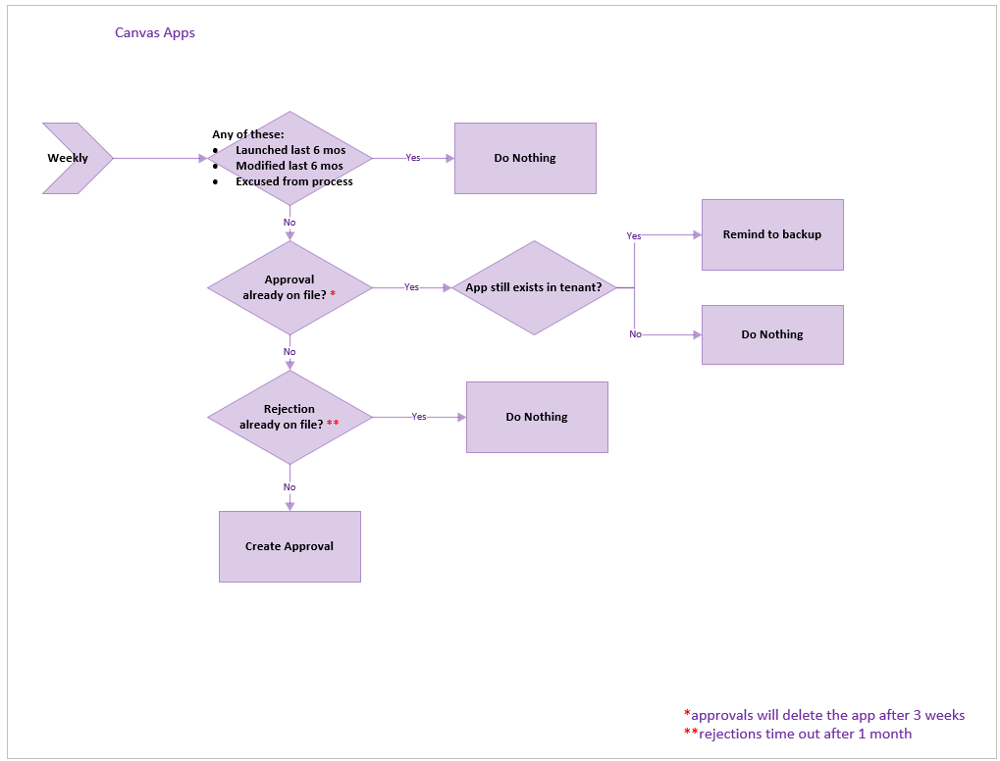

#### Admin \| Inactivity notifications v2 (Start Approval for Flows)

Similar to the previous flow, but for flows rather than apps. This flow checks for flows that haven't been modified in the last six months (this time span is configurable) and asks the flow owner (via flow approvals) whether the flow can be deleted.

It recommends that the flow owner takes a backup of the app if they would like to restore it at some later point.

This flow starts the approval process and writes the approval task to the Archive Approval Dataverse table.

**Customize**: By default, this flow assigns approvals to the flow owner. In order to test in a debug environment, in which you don't want to involve users, you can update the [*ProductionEnvironment* environment variable](setup-governance-components.md#all-environment-variables) to **No**, and the approvals are sent to the admin account instead.

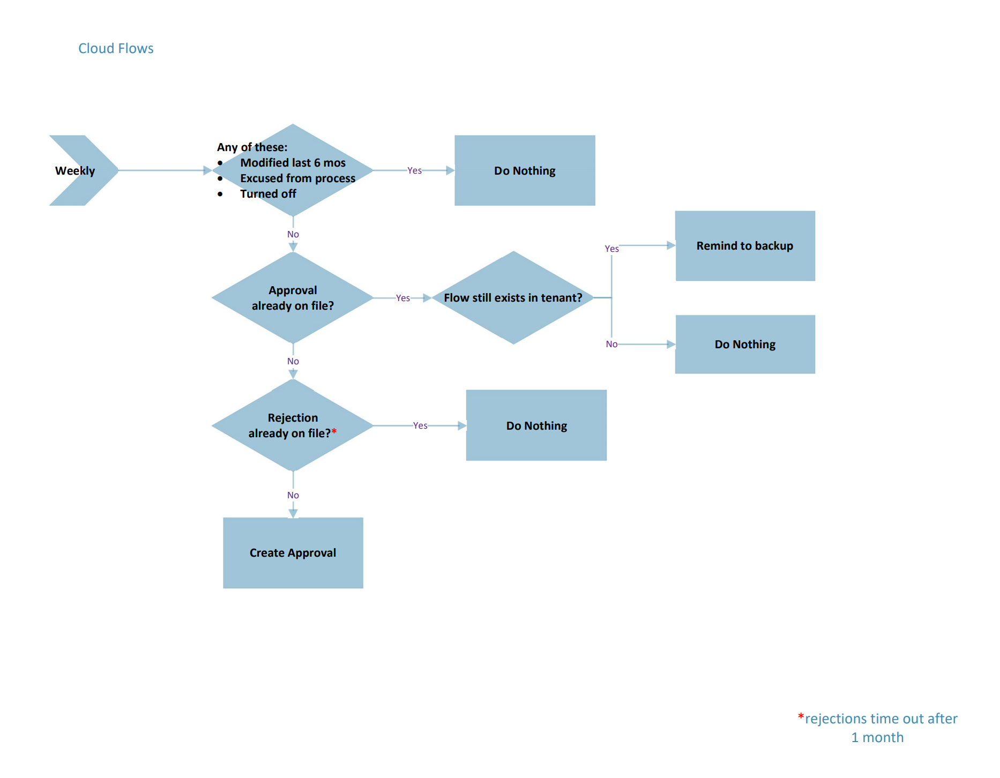

#### Admin \| Inactivity notifications (Check Approval)

On a scheduled interval, checks for approval responses created by the Start Approval flows described above and, if newly approved, marks the approved date so that the Inactivity notifications v2 (Clean Up and Delete) flow (described below) can delete it after the user has time to archive.

If approved in the past, but before deletion, it sends a reminder to archive the app or flow before deletion.

#### Admin \| Inactivity notifications (Clean Up and Delete)

Runs daily and does two cleanup tasks for the workflow.

1. Deletes the flows and apps that were approved for deletion more than three weeks ago (configurable).
1. Deletes expired approval requests that were created over a month ago. If a maker ignores an approval request, their app or flow won't get deleted, however they'll receive another approval request again in the future. Additionally, their manager receives a notification on ignored requests.

#### Admin \| Email Managers Ignored Inactivity notifications Approvals

This flow works with the other Inactivity notifications flows in that it looks for approvals from this system that have been ignored by makers for one month or more and sends their manager a list of these, asking they help by encouraging their employees to approve or reject the request.

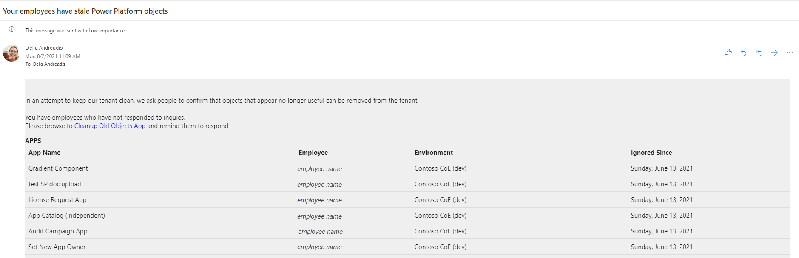

### Apps

#### Cleanup Old Objects App

As makers are asked to respond if objects are still useful with the Archival flows above, they'll sometimes ignore these asks. In that case, a flow above will send their manager this email.

The manager can select the link in the mail and be brought to this app for cleaning.

They can choose which employee to work on first.

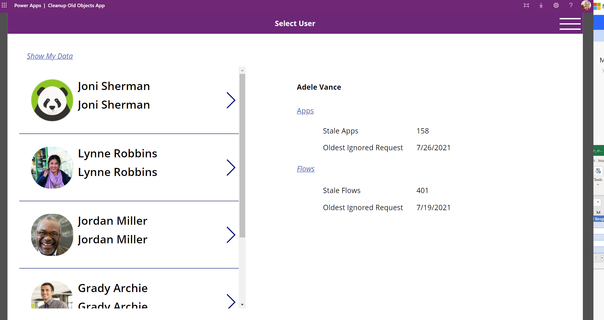

And then for each employee, either reject the deletion or send a reminder.

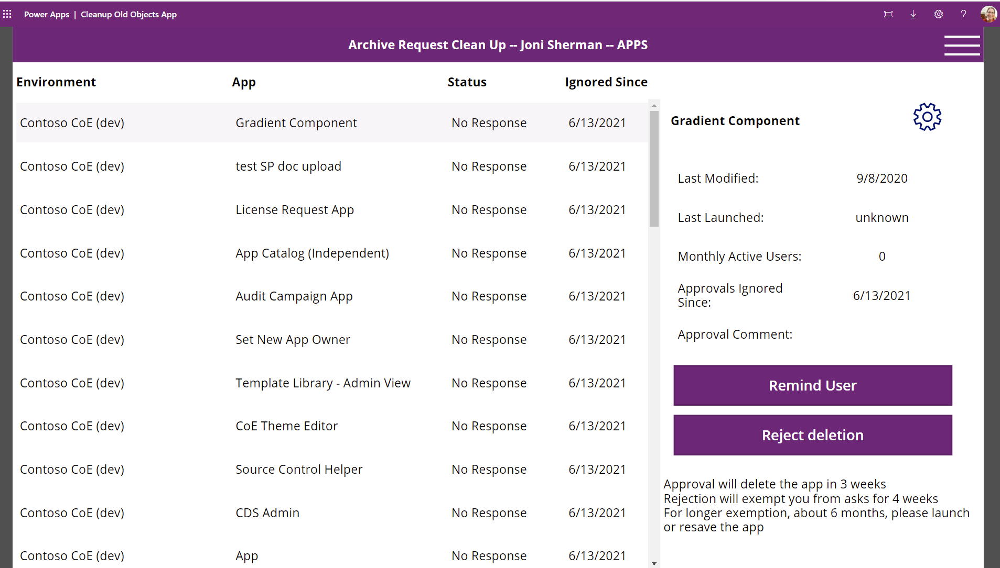

They can send the person to the app to do the cleanup as well. There, they're able to approve/reject deletion for all their objects.

#### App and Flow Inactivity Notifications Clean Up View

This app gives the admin a view of all objects currently being considered for archival and deletion. An admin can filter to the apps that have been rejected with a note to review:

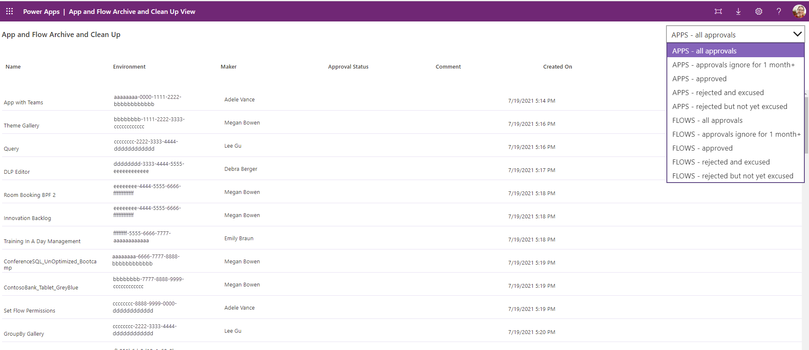

And if the reason is sound, they can choose to exempt the object from future runs and consideration for archival and deletion.

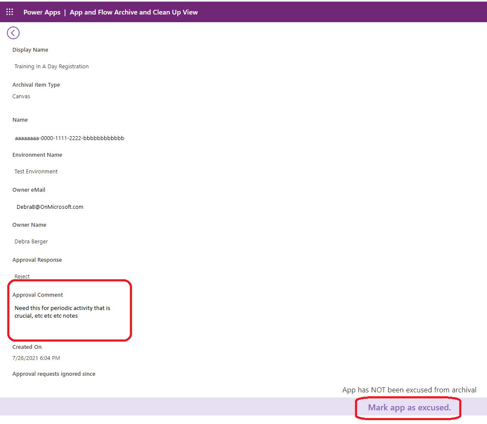

## Microsoft Teams governance

>[!NOTE]
>These components will not work in GCC High and DoD as posting adaptive cards to Teams is not supported in those regions.

### Flows

| Flow | Type | Schedule |
| --- | --- | --- |
|[Microsoft Teams Admin \|  Ask for Business Justification when Microsoft Teams environment is created](#microsoft-teams-admin--ask-for-business-justification-when-microsoft-teams-environment-is-created) | Automated |  Triggered by Admin \| Sync Template v3 |
| [Microsoft Teams Admin \|  Weekly Clean Up of Microsoft Teams environments](#microsoft-teams-admin--weekly-clean-up-of-microsoft-teams-environments) | Schedule | Weekly |
| [Microsoft Teams Admin \| Send Reminder Mail](#microsoft-teams-admin--send-reminder-mail) | Schedule | Daily

#### Microsoft Teams Admin | Ask for Business Justification when Microsoft Teams environment is created

This flow runs daily and checks whether new environments of type [Microsoft Teams](../../admin/about-teams-environment.md) have been created. Team owners who have created Microsoft Teams environments receive an adaptive card via Teams that prompts them to provide a business justification.

Additionally, this flow also sends a welcome email to new team owners to provide them with further information about their environment. A link to the policy documentation you have set up as part of [configuring the CoE Settings](setup-core-components.md) is included in this email.

Save a copy of this flow if you want to change the wording in the emails or adaptive cards.

Learn more about the Microsoft Teams governance process in the CoE Starter Kit: [Microsoft Teams environment audit process](teams-governance.md)

#### Microsoft Teams Admin | Weekly Clean Up of Microsoft Teams environments

> [!NOTE]
> Automatically deleting an inactive Dataverse for Teams environment is now part of the Power Platform admin center. More information: [Automatic deletion of inactive Microsoft Dataverse for Teams environments](../../admin/inactive-teams-environment.md).

> [!IMPORTANT]
> This flow deletes environments for which no business justification exists, or where the business justification has been rejected. Environment owners have 7 days to provide a business justification before the environment gets deleted.

This flow runs weekly and deletes environments that:

- Have been created more than **7 days** ago and have no business justification, or the business justification has been rejected by the admin.
- Have been created more than **90 days** ago and have no apps or flows in the environment.

> [!NOTE]
> Currently, bots created via Microsoft Copilot Studio in Microsoft Teams environments aren't discoverable in the CoE Starter Kit.

Environments are deleted from the tenant and marked as deleted in the Environment table of the CoE Starter Kit. You can view deleted environments in the [Power Platform Admin View](core-components.md).

> [!IMPORTANT]
> You can recover a recently deleted environment (within seven days of deletion) by using the Power Platform admin center or the Power Apps cmdlet Recover-AdminPowerAppEnvironment. More information: [Recover environment](../../admin/recover-environment.md#power-platform-admin-center)

Save a copy of this flow in case you want to make any changes to the criteria for when environments are deleted.

Learn more about the Microsoft Teams governance process in the CoE Starter Kit: [Microsoft Teams environment audit process](teams-governance.md)

#### Microsoft Teams Admin \| Send Reminder Mail

This flow sends a daily reminder email to environment owners who have been asked for a business justification for their Dataverse for Teams environment but haven't yet provided one. The email additionally provides information on how to turn on flow integration in Microsoft Teams.

## Cleanup for orphaned resources

>[!NOTE]
>These components will not work in GCC High and DoD as posting adaptive cards to Teams is not supported in those regions.

[Watch a walk-through](https://www.youtube.com/watch?v=0zptiBppTNo&list=PLi9EhCY4z99W5kzaPK1np6sv6AzMQDsXG) of how the cleanup for orphaned objects process works.

### Flows

| Flow | Type | Schedule |
| --- | --- | --- |
| [Request Orphaned Objects Reassigned (Parent)](#request-orphaned-objects-reassigned-parent) | Schedule | weekly |
| [Request Orphaned Objects Reassigned (Child)](#request-orphaned-objects-reassigned-child) | Instant | child |

#### Request Orphaned Objects Reassigned (Parent)

On a daily basis, this collects all the orphaned objects in the tenant and attempts to associate them with the manager of the former owner. It then sends a Teams bot note to each impacted manager and lets them know there are objects to clean, and then concurrently calls the child flow for each manager.

A list of orphaned objects that can't resolve to a previous manager is sent to the admin email so that admins know which orphaned objects need to be cleaned manually.

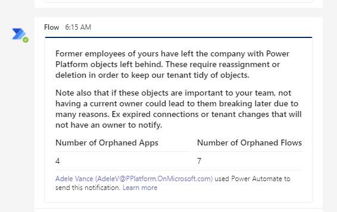

#### Request Orphaned Objects Reassigned (Child)

This flow is triggered daily for every manager who has objects owned by former employees who have left the company. It shows all the cloud flows and canvas apps owned by the former employees and lets the manager decide what to do:

1. Email themselves the list.
1. Take ownership of them all.
1. Delete them all.
1. Assign them all to someone else.
1. See each one individually.

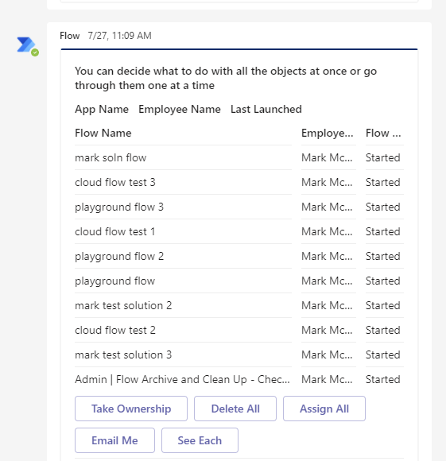

If they choose to see the items individually, then they can make these decisions granularly.

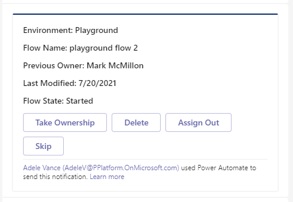

## App Quarantine process

### Environment variables

| Name | Description | Default value |
|------|---------------|------|
| Quarantine Apps after x days of noncompliance | If using the Compliance flow for apps to gather compliance details from makers, specify if you want to quarantine apps if they're not compliant. Specified in days. | 7 days |

### Flows

| Flow | Type | Schedule |
| --- | --- | --- |
|[Admin \| Quarantine non-compliant apps](#admin--quarantine-non-compliant-apps) | Scheduled |  Daily |
| [Admin \| Set app quarantine status](#admin--set-app-quarantine-status) | Automated | When the Quarantine App field in the Power Apps App table is changed |

#### Admin \| Quarantine non-compliant apps

This flow runs on a schedule and checks if any apps need quarantining based on the following criteria:

- Environment is included in the quarantine process.
- Compliance details have been requested, but aren't yet submitted, and are pending longer than specified in the "Quarantine Apps after x days of non-compliance" environment variable.
- App isn't already quarantined.
- Admin Risk Assessment status isn't complete.

For any apps matching the above criteria, the app quarantine status is set to **Yes**. If a maker submits compliance details via the [Developer Compliance Center](#developer-compliance-center), it doesn't automatically release their app from quarantine, an admin has to perform a risk assessment and manually release the app from quarantine using the [Power Platform Admin View](core-components.md#power-platform-admin-view).

To release an app from quarantine, use the [Power Platform Admin View](core-components.md#power-platform-admin-view) to set the **Quarantine App** field to **No** and mark the **Admin Requirement - Risk Assessment State** as **Complete**.

#### Admin \| Set app quarantine status

This flow is triggered automatically if the app quarantine status field of the Power Apps App table is updated.

This field:

- Is set to **Yes** by the Admin \| Quarantine noncompliant apps.
- Can be updated to either **Yes** or **No** manually by the admin from the [Power Platform Admin View](core-components.md#power-platform-admin-view) to quarantine apps or release apps from quarantine.

This flow sets the quarantine status of the app.

If the app is quarantined, an email is sent to the maker to inform them their app can no longer be launched.

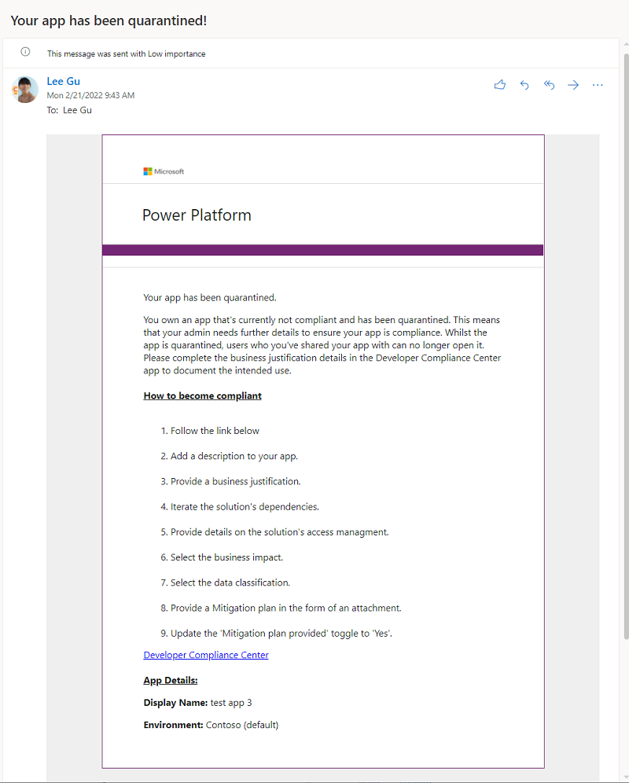

If the app is released from quarantine, an email is sent to the maker to inform them the app is available for use again.

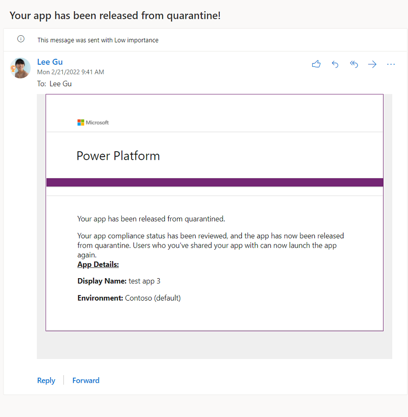

Apps that are quarantined are also flagged in the [Developer Compliance Center](#developer-compliance-center) as **Non-Compliant**.

[!INCLUDE[footer-include](../../includes/footer-banner.md)]
