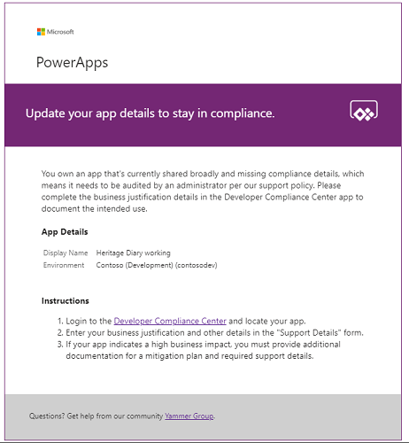
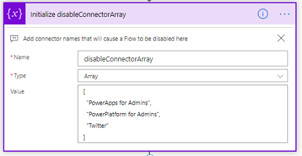
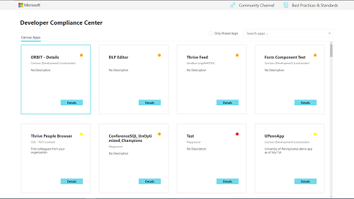
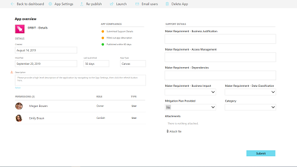
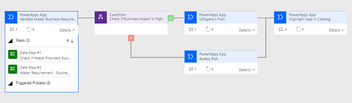
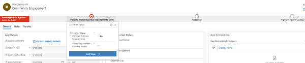

# Use governance components

Once you are familiar with your environments and resources, you might start thinking about audit and compliance processes for your apps. You might want to gather additional information about your apps from your makers, you might want to audit specific connectors or app usage - the apps and flows part of this solution help you get started.  

The Audit and Report Components solution contains assets relevant to admins and makers.

Learn how to [set up the governance components](setup-governance-components.md).

Here's a breakdown of the assets that form the core components

1. Sample Audit Process
    1. Developer Compliance Center (Canvas App)
    1. Flow – Compliance detail request
    1. Business Process Flow for Auditing resources
1. Archive unused apps
    1. App Archive and Clean Up – Start Approval and Check Approval (Flows)
    1. App Archive and Clean Up Admin View (Model Driven App)
1. Act based on certain connector usage
    1. Find and add admins as owners for apps that leverage certain connectors (Flow)
    1. Find and disable flows that leverage certain connectors (Flow)

## Entities

- **Archive Approval** Represents archival approval tasks started during the App Archive and Clean Up Flow

## Flows

### Admin \| Compliance detail request

This flow works in conjunction with other apps and flows in the CoE toolkit to facilitate a process described in the following section: [PowerApps App Auditing
Process](#powerapps-app-auditing-process)

It sends an email to users who have Power Apps apps in the tenant who are not compliant with specific thresholds:

- The app is shared with \> 20 Users or at least 1 group and the business justification details have not been provided.

- The app has business justification details provided but has not be published in 60 days or is missing a description.

- The app has business justification details provided and has indicated high business impact and has not submitted a mitigation plan to the attachments field.

The Flow has a template you can customize in the email sent out by the Flow, but will otherwise look like the following:  

### Admin \| App archive and clean up – Start Approval

Checks for apps that have not been modified in the last six months (configurable) and asks the app owner (via Flow Approvals) if the app can be archived.

This flow starts the approval process and writes the Approval Task to the *Archive Approval* CDS Entity.

### Admin \| App archive and clean up – Check Approval

Monitors Approval Responses of the App Archive and Clean Up – Start Approval Flow and, if approved, archives the app file to SharePoint.

**Pre-Requisite**: Create a SharePoint document library to store the archived apps and configure this in flow

**Update**: By default, this flow will archive the application but not remove it or its permission from the environment. Update this flow based on your requirements, to delete the app from the environment, or remove app permissions.

### SETUP REQUIRED \| Admin \| Find and disable flows that leverage Certain connectors

Checks if any Flows are using specific connectors, notifies the Flow maker and disables the Flow. The admin will receive a report.

**Update**: On setup, the array provided is blank so that we do not inadvertently disable flows in your tenant. You must specify what connectors you want to audit by editing the flow and updating the *disableConnectorArray* as shown for the connectors of your choice:  

### SETUP REQUIRED \| Admin \| Find and add admins as owners for apps that leverage certain connectors

Checks for apps that leverage certain connectors; notifies the app maker and shares the app with the admin security group.

**Update**: On setup, the array provided is blank so that we do not inadvertently add owners to apps with connectors in your tenant. You must specify what connectors you want to audit by editing the Flow and updating the *disableConnectorArray* as shown for the connectors of your choice:  

## Apps

### Developer Compliance Center

This app is used in the [PowerApps App Auditing
Process](#powerapps-app-auditing-process), as a
tool for users to check if their app is compliant and to submit information to the Center of Excellence admins as business justification to stay in compliance.
They can also use the app to update the description and re-publish, which are
other ways to stay in compliance.

**Permission**: Once you are using the [PowerApps App Auditing Process](#powerapps-app-auditing-process), this app needs to be shared with your App Makers. If you are intending to use this process, modify the *Welcome email* (see [setup nurture components](setup-nurture-components.md))
Flow to add users to a Security Group and then share this app with the Security Group.

**Pre-Requisite**: This app uses CDS, a Premium license is therefore required.

**Update**: Verify the Support Details form matches your requirement, and update if necessary.

## Model Driven App

### App Archive and Clean Up View

A model driven app that provides an interface to canvas apps that have been highlighted for archiving, and their approval status.

This Model Driven App works in conjunction with other apps and flows in the CoE toolkit to facilitate a process described in the following section: [PowerApps
App Auditing Process](#powerapps-app-auditing-process)

**Update**: Instead of using this model driven app, you could also modify the Power Platform Admin View app to additionaly show the *Archive Approval* entity.

## Business Process Flow

### Power Apps App Approval BPF

This process helps the admin audit the Power Apps App audit process by providing a visual placeholder for the stage in the process they are currently on.

#### Activate Business Process Flow

The Power Apps App Approval BPF, that helps admins implement an audit process, is disabled by default. In order to enable it

1. Go to [make.powerapps.com](<https://make.powerapps.com>)and set the current Environment to the same Environment where the Center of Excellence solution is installed

1. Select **Solutions** \> **Center of Excellence**

1. Select **Process** from the Filter option at the top

1. Select the ellipse (…) menu of Power Apps App Approval BPF and \> **Turn On**
