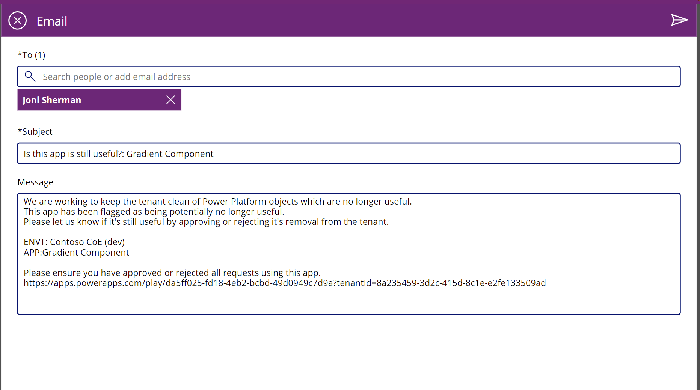

# Use governance components

After you've become familiar with your environments and resources, you might start thinking about governance processes for your apps. You might want to gather additional information about your apps from your makers, or audit specific connectors or app usage.

[Watch an overview](https://www.youtube.com/embed/6bfaFsFtLow) of how to use the governance components solution.

The governance components solution contains assets relevant to admins and makers. More information: [Set up governance components](setup-governance-components.md)

## Compliance processes

### Flows

>[!NOTE]
>These flows are part of the Core components solution however most of its functionality is implemented in the Governance components solution. This is in order to facilitate easier shipping for Dataverse for Teams.

| Flow | Type | Schedule |
| --- | --- | --- |
| Admin \| Compliance request complete apps v3 | Automated |  triggered if the [Power Apps Approval BPF] is marked complete. |
| Admin \| Compliance request complete bots v3 | Automated |  triggered if the [Chatbot Approval BPF] is marked complete. |
| Admin \| Compliance request complete custom connector v3 | Automated |  triggered if the [Custom Connector Approval BPF] is marked complete. |
| Admin \| Compliance request complete flow v3 | Automated |  triggered if the [Flow Approval BPF] is marked complete. |
| Admin \| Compliance Teams Environment BPF kickoff v3 | Automated |  triggered when a business justification is submitted for a Microsoft Teams environment |
| [Admin \| Compliance Detail request v3](#admin--compliance-detail-request-v3) | Scheduled | facilitate the process described in [App auditing process](example-processes.md) |

#### Admin \| Compliance Detail request v3

This flow works in conjunction with other apps and flows in the CoE Starter Kit to facilitate the process described in [App auditing process](example-processes.md). Compliance detail request emails are sent for apps and chatbots.

This flow sends an email to users who have apps in the tenant that aren't compliant with the following thresholds:

- The app is shared with more than 20 users or at least one group, and no business justification details have been provided for it.

- The app does have business justification details, but hasn't been published in 60 days (so it's likely not on the latest version of Power Apps) or is missing a description.

- The app has business justification details and an indication of high business impact, but no mitigation plan has been submitted to the attachments field.

This flow sends an email to users who have chatbots in the tenant that aren't compliant with the following thresholds:

- The chatbot has been launched more than 50 times, and no business justification details have been provided for it.

- The chatbot has business justification details and an indication of high business impact, but no mitigation plan has been submitted to the attachments field.

You can customize the criteria for when makers are asked to provide a business justification using [environment variables](faq.md#update-environment-variables). Default values are provided.

You can customize the email sent out by the flow; by default, it will look like the following image.

### Apps

#### Developer Compliance Center

This app is used in the [auditing process](example-processes.md) as a tool for users to check whether their app, flow, chatbot or custom connector is compliant, and to submit information to the CoE admins as business justification to stay in compliance.

**Permission**: As soon as you're using the app auditing process, this app needs to be shared with your app makers. If you intend to use this process, modify the [Welcome email](setup-nurture-components.md) flow to add users to a security group, and then share this app with the security group.

**Prerequisite**: This app uses Microsoft Dataverse. If you have installed this solution in a Production environment, a Premium license is required for every app user. If you have installed this solution in a Dataverse for Teams environment, a Microsoft 365 license is required for every user.

#### Compliance Status

A traffic light indicates how compliant the resource is in relation to a predefined rule set.

- **Apps** are compliant if the app description is populated, the business justification is submitted, and the app has been published in the past 60 days.
- **Flows** are compliant if the flow description is populated, the business justification is submitted, and the flow isn't suspended.
- **Chatbots** are compliant if the chatbot description and the business justification are populated, and the chatbot isn't suspended.
- **Custom connectors** are compliant if the custom connector description, business justification, and conditions of use are populated.

**Customize**: Verify that the compliance criteria matches your requirements, and update if necessary.

Makers can achieve compliance by providing additional information through the **Support Details** form:

- **Business Justification**: Describe the business need and the problem you're solving with this solution.
- **Business Impact**: Define the operational impact this solution has on the people using it.
- **Access Management**: Describe who has access to this resource, how access is managed (individual user access or access through group membership) and how joiners/movers/leavers processes are managed.
- **Dependencies**: Describe any dependencies this solution uses, for example external or internal APIs or Azure resources.
- **Conditions of use**: (For connectors only) Describe in which situations the connector can and should be used.
- **Mitigation Plan provided**: For critical solutions, upload a mitigation plan that details what business users will do in the event of an outage.

**Customize**: Verify that the **Support Details** form matches your requirements, and update if necessary.

:::row:::
   :::column span="":::
      
   :::column-end:::
   :::column span="":::
      
   :::column-end:::
:::row-end:::

### Business process flows

> [!NOTE]
> Business process flows are not available if you have installed the Core Components in Dataverse for Teams.

#### Power Apps App Approval BPF

This process helps the admin audit the app approval process by providing a visualization of the stage in the process they're currently on. The audit stages are:

- Validate maker requirements.
- Assess risk.
- Highlight the app in the app catalog.

:::row:::
   :::column span="":::
      
   :::column-end:::
   :::column span="":::
      
   :::column-end:::
:::row-end:::

#### Flow Approval BPF

This process helps the admin audit the flow approval process by providing a visualization of the stage in the process they're currently on. The audit stages are:

- Validate maker requirements.
- Assess risk.
- Complete the admin review.

:::row:::
   :::column span="":::
      
   :::column-end:::
   :::column span="":::
      
   :::column-end:::
:::row-end:::

#### Custom Connector Approval BPF

This process helps the admin audit the custom connector approval process by providing a visualization of the stage in the process they're currently on. The audit stages are:

- Validate maker requirements.
- Assess risk.
- Complete the admin review.

:::row:::
   :::column span="":::
      
   :::column-end:::
   :::column span="":::
      
   :::column-end:::
:::row-end:::

#### Chatbot Approval BPF

This process helps the admin audit the chatbot approval process by providing a visualization of the stage in the process they're currently on. The audit stages are:

- Validate maker requirements.
- Assess risk.
- Complete the admin review.

:::row:::
   :::column span="":::
      
   :::column-end:::
   :::column span="":::
      
   :::column-end:::
:::row-end:::

#### Activate the business process flows

All business process flows are disabled by default. To enable them, do the following:

1. Go to [make.powerapps.com](<https://make.powerapps.com>) and set the current environment to the same environment where the CoE solution is installed.

1. Select **Solutions** > **Center of Excellence**.

1. Select **Process** from the filter option at the top.

1. In **Power Apps App Approval BPF**, select the ellipsis (…) button, and then select **Turn On**.

1. Repeat the previous step for **Flow Approval BPF**, **Custom Connector Approval BPF**, and **Chatbot Approval BPF**.

## Archive processes

### Tables

#### Archive Approval

Represents archival approval tasks started during the App Archive and Clean Up flow.

### Flows

| Flow | Type | Schedule |
| --- | --- | --- |
|[Microsoft Teams Admin \|  Ask for Business Justification when Microsoft Teams environment is created](#microsoft-teams-admin--ask-for-business-justification-when-microsoft-teams-environment-is-created) | Automated |  triggered by Admin \| Sync Template v3 |
| [Microsoft Teams Admin \|  Weekly Clean Up of Microsoft Teams environments](#microsoft-teams-admin--weekly-clean-up-of-microsoft-teams-environments) | Schedule | Weekly |
| [Admin \| Archive and Clean Up v2 (Check Approval)](#admin--archive-and-clean-up-v2-check-approval) | Schedule | Daily |
| [Admin \| Archive and Clean Up v2 (Clean Up and Delete)](#admin--archive-and-clean-up-v2-clean-up-and-delete) | Schedule | Daily |
| [Admin \| Archive and Clean Up v2 (Start Approval for Apps)](#admin--archive-and-clean-up-v2-start-approval-for-apps) | Schedule | Weekly |
| [Admin \| Archive and Clean Up v2 (Start Approval for Flows)](#admin--archive-and-clean-up-v2-start-approval-for-flows) | Schedule | Weekly |
| [Admin \| Email Managers Ignored Approvals](#admin--email-managers-ignored-approvals) | Instant | Weekly |
| [Admin \| Setup - Ignored Archival Requests](#admin--setup---ignored-archival-requests) | Instant | Run Once |

#### Admin \| Archive and Clean Up v2 (Start Approval for Apps)

Checks for apps that haven't been modified or launched in the last six months (this time span is configurable) and asks the app owner (via flow approvals) whether the app can be deleted.

It recommends that the app owner take a backup of the app in the event that they would like to restore it at some later point.

This flow starts the approval process and writes the approval task to the Archive Approval Dataverse table.

 flow")

**Customize**: By default, this flow will assign approvals to the app owner. In order to test in a debug environment, in which you do not want to involve users, you can update the [*ProductionEnvironment* environment variable](setup-governance-components.md#all-environment-variables) to **No**, and the approvals will be sent to the admin account instead.

#### Admin \| Archive and Clean Up v2 (Start Approval for Flows)

Similar to the previous flow, but for flows rather than apps. This flow checks for flows that haven't been modified in the last six months (this time span is configurable) and asks the flow owner (via flow approvals) whether the flow can be deleted.

It recommends that the flow owner take a backup of the app in the event that they would like to restore it at some later point.

This flow starts the approval process and writes the approval task to the Archive Approval Dataverse table.

**Customize**: By default, this flow will assign approvals to the flow owner. In order to test in a debug environment, in which you do not want to involve users, you can update the [*ProductionEnvironment* environment variable](setup-governance-components.md#all-environment-variables) to **No**, and the approvals will be sent to the admin account instead.

#### Admin \| Archive and Clean Up v2 (Check Approval)

On a scheduled interval, checks for approval responses created by the Start Approval flows described above and, if newly approved, marks the approved date so that the Archive and Clean Up v2 (Clean Up and Delete) flow (described below) can delete it after user has time to archive.

If approved in the past, but before deletion, it sends a reminder to archive the app or flow before deletion.

#### Admin \| Archive and Clean Up v2 (Clean Up and Delete)

Runs on a daily basis and does two clean up tasks for the workflow.

1. Deletes timed out requests. Deletes, from the Archive Approval table, all non-approved requests that were created over a month ago.

1. Deletes the flows and apps that were approved for deletion more than 3 weeks ago (configurable).

**Customize**: By default, this flow will not delete the apps and flows. This is to ensure you explicitly are ready for that to occur. To begin deletion of flows and apps, update the [*Auto Delete On Archive* environment variable](setup-governance-components.md#all-environment-variables) to **Yes**.

#### Admin \| Setup - Ignored Archival Requests

This flow is run once in order to pre-populate the values for how long people have ignored requests for archival for apps and flows. This flow is optional, values will eventually populate as part of the archive process. It is a long running flow updating all apps and flows in your inventory.

#### Admin \| Email Managers Ignored Approvals

This flow works with the other Archive and Clean flows in that it looks for approvals from this system that have been ignored by makers for one month or more and sends their manager a list of these, asking they help by encouraging their employees to approve or reject the request.

### Apps

#### Cleanup Old Objects App

As makers are asked to respond if objects are still useful with the Archival flows above, they will sometimes ignore these asks. In that case, a flow above will send their manager this email.

The manager can click on the link in the mail and be brought to this app for cleaning.

They can chose which employee to work on first

And then for each employee go and either reject the deletion or send a reminder notification.

They can send the person to the app do do the clean up as well, where they will be able to approve/reject deletion for all their objects.

#### App and Flow Archive and Clean Up View

This app gives the admin a view of all objects currently being considered for archival and deletion. Admin can filter to the apps which have been rejected with a note for example to review:

And if the reason is sound, they can chose to exempt the object from future runs and consideration for archival and deletion.

## Microsoft Teams governance

### Flows

| Flow | Type | Schedule |
| --- | --- | --- |
|[Microsoft Teams Admin \|  Ask for Business Justification when Microsoft Teams environment is created](#microsoft-teams-admin--ask-for-business-justification-when-microsoft-teams-environment-is-created) | Automated |  triggered by Admin \| Sync Template v3 |
| [Microsoft Teams Admin \|  Weekly Clean Up of Microsoft Teams environments](#microsoft-teams-admin--weekly-clean-up-of-microsoft-teams-environments) | Schedule | Weekly |
| [Microsoft Teams Admin \| Send Reminder Mail](#microsoft-teams-admin--send-reminder-mail) | Schedule | Daily

#### Microsoft Teams Admin | Ask for Business Justification when Microsoft Teams environment is created

This flow runs daily and checks whether new environments of type [Microsoft Teams](../../admin/about-teams-environment.md) have been created. Team owners who have created a Microsoft Teams environments receive an adaptive card via Teams that prompts them to provide a business justification.

Additionally, this flow also sends a welcome email to new team owners to provide them with further information about their environment. A link to the policy documentation you have set up as part of [configuring the CoE Settings](setup-core-components.md) is included in this email.

Save a copy of this flow if you want to change the wording in the emails or adaptive cards.

Learn more about the Microsoft Teams governance process in the CoE Starter Kit: [Microsoft Teams environment audit process](teams-governance.md)

#### Microsoft Teams Admin | Weekly Clean Up of Microsoft Teams environments

> [!IMPORTANT]
> This flow deletes environments for which no business justification exists, or where the business justification has been rejected. Environment owners have 7 days to provide a business justification before the environment gets deleted.

This flow runs weekly and deletes environments that:

- Have been created more than **7 days** ago and have no business justification, or the business justification has been rejected by the admin.
- Have been created more than **90 days** ago and have no apps or flows in the environment.

>[!NOTE]
> Currently, bots created via Power Virtual Agents in Microsoft Teams environments aren't discoverable in the CoE Starter Kit.

Environments are deleted from the tenant and marked as deleted in the Environment table of the CoE Starter Kit. You can view deleted environments in the [Power Platform Admin View](core-components.md).

>[!IMPORTANT]
> You can recover a recently deleted environment (within seven days of deletion) by using the Power Platform admin center or the Power Apps cmdlet Recover-AdminPowerAppEnvironment. More information: [Recover environment](../../admin/recover-environment.md#power-platform-admin-center)

Save a copy of this flow in case you want to make any changes to the criteria for when environments are deleted.

Learn more about the Microsoft Teams governance process in the CoE Starter Kit: [Microsoft Teams environment audit process](teams-governance.md)

#### Microsoft Teams Admin \| Send Reminder Mail

This flow sends a daily reminder email to environment owners who have been asked for a business justification for their Dataverse for Teams environment but have not yet provided one. The email additionally provides information on how to turn on flow integration in Microsoft Teams.

## Cleanup for orphaned resources

### Flows

| Flow | Type | Schedule |
| --- | --- | --- |
| [Request Orphaned Objects Reassigned (Child)](#request-orphaned-objects-reassigned-child) | Instant | child |
| [Request Orphaned Objects Reassigned (Parent)](#request-orphaned-objects-reassigned-parent) | Schedule | Daily |
| [HELPER - CanvasAppOperations Gov](#helper---canvasappoperations-gov) | Instant | helper |
| [HELPER - CloudFlowOperations Gov](#helper---cloudflowoperations-gov) | Instant | helper |

#### Request Orphaned Objects Reassigned (Parent)

On a daily basis, this collects all the orphaned objects in the tenant and attempts to associate them with the manager of the former owner. It then sends a teams bot note to each impacted manager and let's them know that there are objects to clean, and then concurrently calls the child flow for each manager.  
For those orphaned objects which cannot resolve to a previous manager, it sends the list to the admin email so that admins know which orphaned objects will need cleaned manually.

#### Request Orphaned Objects Reassigned (Child)

This flow is triggered daily for every manager that has objects owned by former employees that have left the company. It shows all the cloud flows and canvas apps owned by the employees that left the company and lets the manager decide what they want to do:

1) Email themselves the list
1) Take ownership of them all
1) Delete them all
1) Assign them all to someone else
1) See each one individually 

If they chose to see the items individually then they can make these decisions granularly. 

#### HELPER - CanvasAppOperations Gov

This flow takes in the environment, app, and operation to perform as well as the GUID for the new maker if the operation is to reassign ownership.  
The operations supported are Delete and Assign (which reassigns owner)  
It performs the action on the actual object in the tenant and also updates the inventory.

#### HELPER - CloudFlowOperations Gov

This flow takes in the environment, flow, and operation to perform as well as the GUID for the new maker if the operation is to reassign ownership.  
The operations supported are Delete and Assign (which reassigns owner)  
It performs the action on the actual object in the tenant and also updates the inventory.

## App Quarantine process

### Environment variables

| Name | Description | Default value |
|------|---------------|------|
| Quarantine Apps after x days of non-compliance | If using the Compliance flow for apps to gather compliance details from makers, specify if you want to quarantine apps if they're not compliant. Specified in days. | 7 days |

### Flows

| Flow | Type | Schedule |
| --- | --- | --- |
|[Admin \| Quarantine non-compliant apps](#microsoft-teams-admin--ask-for-business-justification-when-microsoft-teams-environment-is-created) | Scheduled |  Daily |
| [Admin \| Set app quarantine status](#microsoft-teams-admin--weekly-clean-up-of-microsoft-teams-environments) | Automated | when the Quarantine App field in the PowerApps App table is changed |

#### Admin \| Quarantine non-compliant apps

This flow runs on a schedule and checks if any apps need quarantining based on the following criteria:

- Environment is included in the quarantine process.
- Compliance details have been requested and are pending longer than specified in the "Quarantine Apps after x days of non-compliance" environment variable.
- App is not already quarantined.
- Admin Risk Assessment status is not complete.

For any apps matching the above criteria, the app quarantine status is set to **Yes**. Note that a maker submitting compliance details via the [Developer Compliance Center](#developer-compliance-center) does not automatically release their app from quarantine, an admin will have to perform a risk assessment and manually release the app from quarantine using the [Power Platform Admin View](core-components.md#power-platform-admin-view).

#### Admin \| Set app quarantine status

This flow is triggered automatically if the app quarantine status field of the PowerApps App table is updated.

This field

- is et to **Yes** by the Admin \| Quarantine non-compliant apps.
- can be updated to either **Yes** or **No** manually by the admin from the [Power Platform Admin View](core-components.md#power-platform-admin-view)., to quarantine apps or release apps from quarantine.

[!INCLUDE[footer-include](../../includes/footer-banner.md)]
