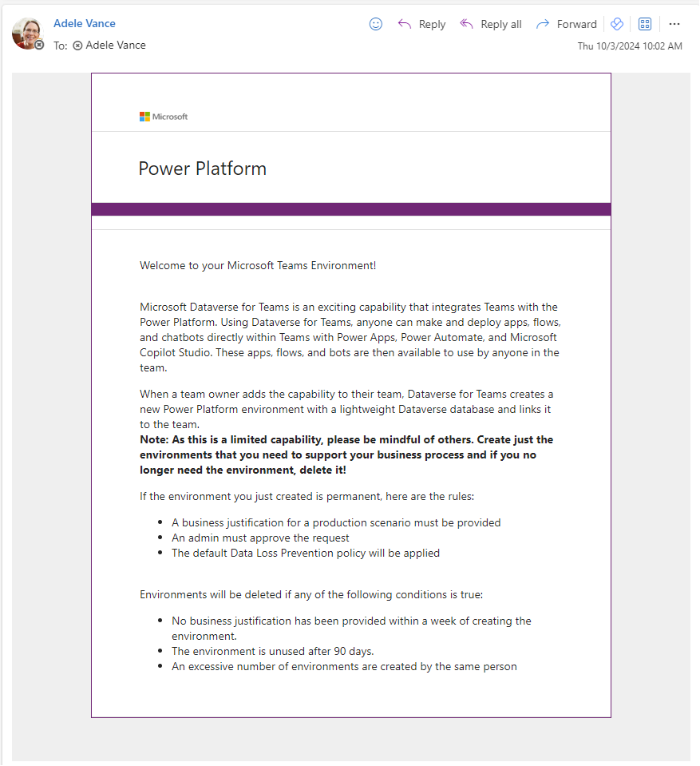

# Use governance components

After you've become familiar with your environments and resources, you might start thinking about governance processes for your apps. You might want to gather additional information about your apps from your makers, or audit specific connectors or app usage.

## Demo: Governance components

Watch how to use the governance components solution.

> [!VIDEO https://www.youtube.com/embed/6bfaFsFtLow]

The governance components solution contains assets relevant to admins and makers. More information: [Set up governance components](setup-governance-components.md)

Here's a breakdown of the assets that form the governance components:

- Microsoft Teams environment management
  - [Ask team owners to provide a business justification (flow)](#flows)
  - [Welcome email to new team owners (flow)](#flows)
  - [Business process flow for auditing environments](#business-process-flows)

- Sample audit process
  - [Developer Compliance Center (canvas app)](#apps)
  - [Compliance Detail Request (flow)](#flows)
  - [Business process flows for auditing resources](#business-process-flows)

- Archive unused apps
  - [App and Flow Archive and Clean Up – Start Approval and Check Approval (flows)](#admin--archive-and-clean-up-v2-start-approval-for-apps)
  - [App Archive and Clean Up View (canvas app)](#app-and-flow-archive-and-clean-up-view)

## Tables

### Archive Approval

Represents archival approval tasks started during the App Archive and Clean Up flow.

## Flows

| Flow | Type | Schedule |
| --- | --- | --- |
|[Microsoft Teams Admin \|  Ask for Business Justification when Microsoft Teams environment is created](#microsoft-teams-admin--ask-for-business-justification-when-microsoft-teams-environment-is-created) | Automated |  when *Admin \| Sync Template v3* flow adds or modifies a record in the Environment table |
| [Microsoft Teams Admin \|  Weekly Clean Up of Microsoft Teams environments](#microsoft-teams-admin--weekly-clean-up-of-microsoft-teams-environments) | Schedule | Weekly |
| [Admin \| Setup - Ignored Archival Requests](#admin--setup---ignored-archival-requests) | Instant | Run Once |
| [Admin \| Archive and Clean Up v2 (Start Approval for Apps)](#admin--archive-and-clean-up-v2-start-approval-for-apps) | Schedule | Weekly |
| [Admin \| Archive and Clean Up v2 (Start Approval for Flows)](#admin--archive-and-clean-up-v2-start-approval-for-flows) | Schedule | Weekly |
| [Admin \| Archive and Clean Up v2 (Check Approval)](#admin--archive-and-clean-up-v2-check-approval) | Schedule | Daily |
| [Admin \| Archive and Clean Up v2 (Clean Up and Delete)](#admin--archive-and-clean-up-v2-clean-up-and-delete) | Schedule | Daily |

### Microsoft Teams Admin | Ask for Business Justification when Microsoft Teams environment is created

This flow runs daily and checks whether new environments of type [Microsoft Teams](../../admin/about-teams-environment.md) have been created. Team owners who have created a Microsoft Teams environments receive an adaptive card via Teams that prompts them to provide a business justification.

Additionally, this flow also sends a welcome email to new team owners to provide them with further information about their environment. A link to the policy documentation you have set up as part of [configuring the CoE Settings](setup-core-components.md) is included in this email.

Save a copy of this flow if you want to change the wording in the emails or adaptive cards.

Learn more about the Microsoft Teams governance process in the CoE Starter Kit: [Microsoft Teams environment audit process](teams-governance.md)

## Microsoft Teams Admin | Weekly Clean Up of Microsoft Teams environments

> [!IMPORTANT]
> This flow deletes environments for which no business justification exists, or where the business justification has been rejected. Environment owners have 7 days to provide a business justification before the environment gets deleted.

This flow runs weekly and deletes environments that:

- Have been created more than **7 days** ago and have no business justification, or the business justification has been rejected by the admin.
- Have been created more than **90 days** ago and have no apps or flows in the environment.

>[!NOTE]
> Currently, bots created via Power Virtual Agents in Microsoft Teams environments aren't discoverable in the CoE Starter Kit.

Environments are deleted from the tenant and marked as deleted in the Environment table of the CoE Starter Kit. You can view deleted environments in the [Power Platform Admin View](core-components.md).

>[!IMPORTANT]
> You can recover a recently deleted environment (within seven days of deletion) by using the Power Platform admin center or the Power Apps cmdlet Recover-AdminPowerAppEnvironment. More information: [Recover environment](../../admin/recover-environment.md#power-platform-admin-center)

Save a copy of this flow in case you want to make any changes to the criteria for when environments are deleted.

Learn more about the Microsoft Teams governance process in the CoE Starter Kit: [Microsoft Teams environment audit process](teams-governance.md)

### Admin \| Setup - Ignored Archival Requests

This flow is run once in order to pre-populate the values for how long people have ignored requests for archival for apps and flows. This flow is optional, values will eventually populate as part of the archive process. It is a long running flow updating all apps and flows in your inventory.

### Admin \| Archive and Clean Up v2 (Start Approval for Apps)

Checks for apps that haven't been modified or launched in the last six months (this time span is configurable) and asks the app owner (via flow approvals) whether the app can be deleted.

It recommends that the app owner take a backup of the app in the event that they would like to restore it at some later point.

This flow starts the approval process and writes the approval task to the Archive Approval Dataverse table.

 flow")

**Customize**: By default, this flow will assign approvals to the app owner. In order to test in a debug environment, in which you do not want to involve users, you can update the [*ProductionEnvironment* environment variable](setup-governance-components.md#update-environment-variables) to **No**, and the approvals will be sent to the admin account instead.

### Admin \| Archive and Clean Up v2 (Start Approval for Flows)

Similar to the previous flow, but for flows rather than apps. This flow checks for flows that haven't been modified in the last six months (this time span is configurable) and asks the flow owner (via flow approvals) whether the flow can be deleted.

It recommends that the flow owner take a backup of the app in the event that they would like to restore it at some later point.

This flow starts the approval process and writes the approval task to the Archive Approval Dataverse table.

**Customize**: By default, this flow will assign approvals to the flow owner. In order to test in a debug environment, in which you do not want to involve users, you can update the [*ProductionEnvironment* environment variable](setup-governance-components.md#update-environment-variables) to **No**, and the approvals will be sent to the admin account instead.

### Admin \| Archive and Clean Up v2 (Check Approval)

On a scheduled interval, checks for approval responses created by the Start Approval flows described above and, if newly approved, marks the approved date so that the Archive and Clean Up v2 (Clean Up and Delete) flow (described below) can delete it after user has time to archive.

If approved in the past, but before deletion, it sends a reminder to archive the app or flow before deletion.

### Admin \| Archive and Clean Up v2 (Clean Up and Delete)

Runs on a daily basis and does two clean up tasks for the workflow.

1. Deletes timed out requests. Deletes, from the Archive Approval table, all non-approved requests that were created over a month ago.

1. Deletes the flows and apps that were approved for deletion more than 3 weeks ago (configurable).

**Customize**: By default, this flow will not delete the apps and flows. This is to ensure you explicitly are ready for that to occur. To begin deletion of flows and apps, update the [*Auto Delete On Archive* environment variable](setup-governance-components.md#update-environment-variables) to **Yes**.

## Apps

### Developer Compliance Center

This app is used in the [auditing process](example-processes.md) as a tool for users to check whether their app, flow, chatbot or custom connector is compliant, and to submit information to the CoE admins as business justification to stay in compliance.

**Permission**: As soon as you're using the app auditing process, this app needs to be shared with your app makers. If you intend to use this process, modify the [Welcome email](setup-nurture-components.md) flow to add users to a security group, and then share this app with the security group.

**Prerequisite**: This app uses Dataverse; a Premium license is therefore required for each app user.

#### Compliance Status

A traffic light indicates how compliant the resource is in relation to a predefined rule set.

- **Apps** are compliant if the app description is populated, the business justification is submitted, and the app has been published in the past 60 days.
- **Flows** are compliant if the flow description is populated, the business justification is submitted, and the flow isn't suspended.
- **Chatbots** are compliant if the chatbot description and the business justification are populated, and the chatbot isn't suspended.
- **Custom connectors** are compliant if the custom connector description, business justification, and conditions of use are populated.

**Customize**: Verify that the compliance criteria matches your requirements, and update if necessary.

Makers can achieve compliance by providing additional information through the **Support Details** form:

- **Business Justification**: Describe the business need and the problem you're solving with this solution.
- **Business Impact**: Define the operational impact this solution has on the people using it.
- **Access Management**: Describe who has access to this resource, how access is managed (individual user access or access through group membership) and how joiners/movers/leavers processes are managed.
- **Dependencies**: Describe any dependencies this solution uses, for example external or internal APIs or Azure resources.
- **Conditions of use**: (For connectors only) Describe in which situations the connector can and should be used.
- **Mitigation Plan provided**: For critical solutions, upload a mitigation plan that details what business users will do in the event of an outage.

**Customize**: Verify that the **Support Details** form matches your requirements, and update if necessary.

:::row:::
   :::column span="":::
      
   :::column-end:::
   :::column span="":::
      
   :::column-end:::
:::row-end:::

### App and Flow Archive and Clean Up View

An app that provides an interface to canvas apps and cloud flows that have been highlighted for archiving and their approval status. This app works in conjunction with other apps and flows in the CoE Starter Kit to facilitate the process described for the [app auditing process](example-processes.md).

## Business process flows

> [!NOTE]
> Business process flows are not available if you have installed the Core Components in Dataverse for Teams.

### Power Apps App Approval BPF

This process helps the admin audit the app approval process by providing a visualization of the stage in the process they're currently on. The audit stages are:

- Validate maker requirements.
- Assess risk.
- Highlight the app in the app catalog.

:::row:::
   :::column span="":::
      
   :::column-end:::
   :::column span="":::
      
   :::column-end:::
:::row-end:::

### Flow Approval BPF

This process helps the admin audit the flow approval process by providing a visualization of the stage in the process they're currently on. The audit stages are:

- Validate maker requirements.
- Assess risk.
- Complete the admin review.

:::row:::
   :::column span="":::
      
   :::column-end:::
   :::column span="":::
      
   :::column-end:::
:::row-end:::

### Custom Connector Approval BPF

This process helps the admin audit the custom connector approval process by providing a visualization of the stage in the process they're currently on. The audit stages are:

- Validate maker requirements.
- Assess risk.
- Complete the admin review.

:::row:::
   :::column span="":::
      
   :::column-end:::
   :::column span="":::
      
   :::column-end:::
:::row-end:::

### Chatbot Approval BPF

This process helps the admin audit the chatbot approval process by providing a visualization of the stage in the process they're currently on. The audit stages are:

- Validate maker requirements.
- Assess risk.
- Complete the admin review.

:::row:::
   :::column span="":::
      
   :::column-end:::
   :::column span="":::
      
   :::column-end:::
:::row-end:::

### Activate the business process flows

All business process flows are disabled by default. To enable them, do the following:

1. Go to [make.powerapps.com](<https://make.powerapps.com>) and set the current environment to the same environment where the CoE solution is installed.

1. Select **Solutions** > **Center of Excellence**.

1. Select **Process** from the filter option at the top.

1. In **Power Apps App Approval BPF**, select the ellipsis (…) button, and then select **Turn On**.

1. Repeat the previous step for **Flow Approval BPF**, **Custom Connector Approval BPF**, and **Chatbot Approval BPF**.

[!INCLUDE[footer-include](../../includes/footer-banner.md)]
