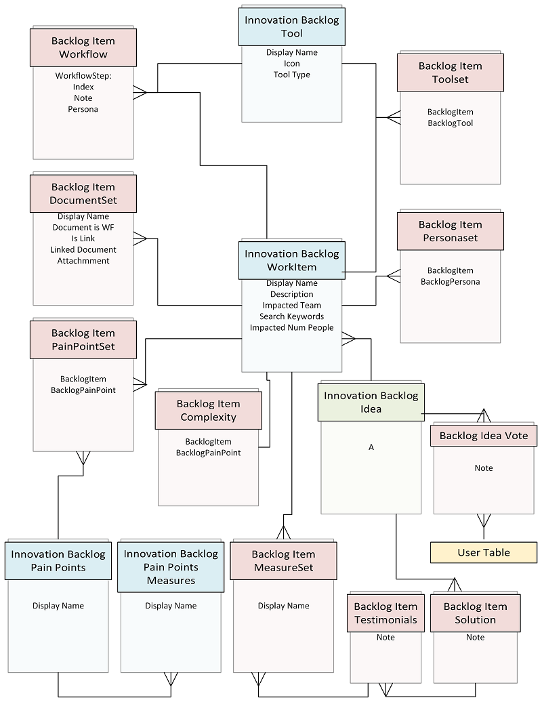
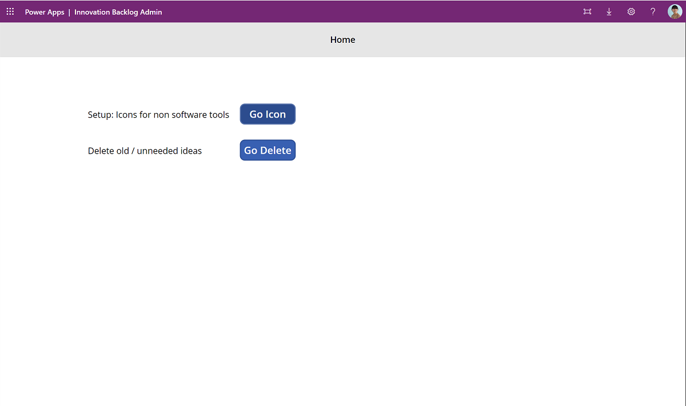
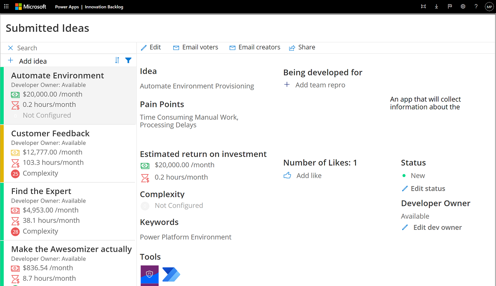

# Use the Innovation Backlog components

Use the Innovation Backlog app to ask users to submit ideas for apps and flows that need building, and describe pain points with the current process. As users describe the process, they will provide information about personas involved, tools used, and measures for improvement. This information is then used to calculate an ROI and complexity score.

Pick the most impactful ideas to for your development team to build, or select them for an upcoming hackathon. Other users can vote on ideas, or add their own scenarios to an existing idea. Developers can additionally request feedback and testimonials to build their portfolio.

More information: [Set up Innovation Backlog components](setup-innovationbacklog.md)

Here's a breakdown of the assets that form the nurture components solution:

## Security roles

**Innovation Backlog Maker** Gives a user access to read and create records in the Innovation Backlog tables. When you share the Innovation Backlog app with your team, make sure to assign them the **Innovation Backlog Maker** security role.

## Tables

Ideas and information, such as pain points, personas, measures, and tools used, are stored in the following Dataverse tables:

- Innovation Backlog Idea
- Backlog Idea Vote
- Backlog Item Complexity
- Backlog Item Documentset
- Backlog Item MeasureSet
- Backlog Item PainPointSet
- Backlog Item PersonaSet
- Backlog Item Solution
- Backlog Item Testimonial
- Backlog Item Toolset
- Backlog Item Workflow
- Innovation Backlog Pain Points
- Innovation Backlog Pain Points Measures
- Innovation Backlog Tool
- Innovation Backlog Workitem

View an entity relationship diagram of the tables used for the Innovation Backlog app:

## Flows

### Add pain points

This instant cloud flow runs once during setup to add some default values into the pain points table. Pain points are selected when a new idea is added to the Innovation Backlog.

### Update software tools

This instant flow runs once during setup to add some default values in the software tools table. Software tools are selected when a new idea is added to the Innovation Backlog.

## Apps

### Innovation Backlog Admin app

A canvas app that the Innovation Backlog admin uses to update icons for non-software tools, configure further pain point,s and delete obsolete or old ideas from the Innovation Backlog app.

**Permission**: Share this app with the Innovation Backlog admin - this can be your CoE or Power Platform adoption lead.

**Prerequisite**: This app uses Dataverse; a Premium license is therefore required for every app user.

### Innovation Backlog app

A canvas app that is used to share and vote on ideas, describe pain points and apps that need building, and measure ROI.

**Permission**: The Innovation Backlog app can be shared with the entire organization.

**Prerequisite**: This app uses Dataverse; a Premium license is therefore required for every app user.

More information: [Use the Innovation Backlog app](use-innovationbacklog.md)

[!INCLUDE[footer-include](../../includes/footer-banner.md)]