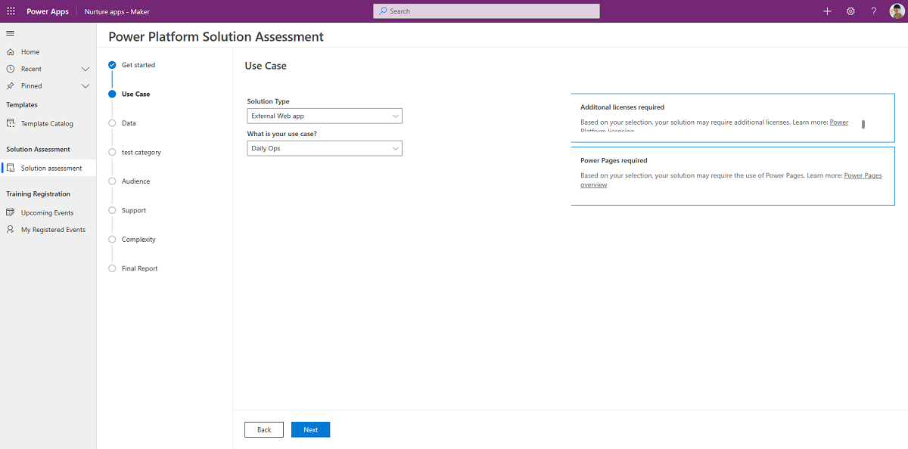

# Use the Maker Journey components

Use the Maker Assessment app to ask users a series of questions like who will support the app, and the types of data to which it will connect. You can then submit an email to an admin alias with the findings including notes that premium licenses or extra storage may be required.

Use the Maker Assessment Admin App to tailor these questions to fit your organizational needs.

More information: [Set up Maker Journey components](setup-makerjourney.md)

Here's a breakdown of the assets that from the Maker Journey components solution:

## Security roles

Maker Journey Admin SR

**Maker Journey Admin SR** Gives a user full access (create, read, write, etc) to the Maker Journey tables. When you share the Maker Assessment Admin app with your admin team, make sure to assign them the **Maker Journey Admin SR** security role.

**Maker Journey Maker SR** Gives a user read access to the Maker Journey tables. When you share the Maker Assessment app with your organization, make sure to assign them the **Maker Journey Maker SR** security role.

## Tables

Questions, answers, and categories for questions, are stored in the following Dataverse tables:

- Assessment Category
- Assessment Questions
- Answer Options

## Flows

### Setup - starter data

This instant cloud flow runs once during setup to add some starter questions, answers, and categories into your dataverse tables.

## Apps

### Maker Assessment Admin App

A canvas app that the Maker Journey admin uses to enter or update the questions, answers, and categories, that are listed in the apps.

**Permission**: Share this app with the Maker Journey admins - this can be your CoE or Power Platform adoption lead.

**Prerequisite**: This app uses Dataverse; a Premium license is therefore required for every app user unless installed in Dataverse for Teams.

### Maker Assessment

A canvas app that is used by makers to see if they will need special licenses, storage, etc. And then share a mail with the admin team of findings.

**Permission**: The Maker Assessment app can be shared with the entire organization.

**Prerequisite**: This app uses Dataverse; a Premium license is therefore required for every app user unless installed in Dataverse for Teams.

