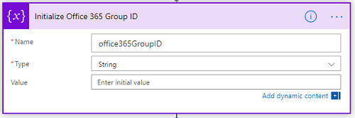
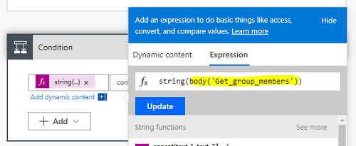

# Extend, customize and modify components

Prior to making any changes to the CoE Starter Kit, please follow the steps under [Extending the Starter Kit](setup.md#extending-the-starter-kit) and create a new unmanaged solution for your changes.

## Change Welcome Email from Office 365 Group to Azure AD Security Group

If you would prefer to use an Azure AD Security Group instead of an Office 365 Group for your makers, the *Admin \| Welcome Email* flow can be modified.  

>[!NOTE]
>Using an Azure AD Security Group will allow you to share apps with your maker security group. Currently, apps can not be shared with Office 365
Groups.

1. Go to [make.powerapps.com](<https://make.powerapps.com>) and set the current Environment to the Environment where the Center of Excellence solution is installed.

1. Select **Solutions** \> **Center of Excellence**.

1. Select **Flow** from the Filter option at the top.

1. Select the **Admin \| Welcome Email** flow and select **Edit** on the Flow Details page.

1. Update the **Initialize Office 365 Group ID** with your Azure AD Group ID (you can rename the variable and action as well). 

1. Remove the List Group members action.

1. In the same place, select **+ Add an action**, search for and insert **Get Group Members** from the Azure AD connector. 
1. Set the **Group ID** to the **office365GroupID** variable from dynamic content.<Br> 

1. Select the **condition** and on the string expression in the value on the left. Update *List_group_members* to *Get_group_members* in the body of the expression. The expression should look like the highlighted below. 

1. Open the **No** branch of the condition to remove the **Add member to group** action.

1. In the same place, select **+ Add an action**, search for and insert **Add user to group** from the Azure AD connector. 
1. Set the **Group ID** to the **office365GroupID** variable and the User Id to Maker (from dynamic content).  

1. **Save** the flow.

## Set up Template Catalog and upload components

Open the Template Catalog Canvas Apps and edit the SharePoint connection to point to your new Document library.

1. Browse to the *Center of Excellence - Nurture solution solution.*
1. Select Template Catalog and select **Edit**.
1. Select **File \> Save As** to create your own copy so that updates to the starter kit do not erase your changes. Add your copy of the Template Catalog to your unmanaged solution.
1. Go back to your copy of the Template Catalog.
1. Select **data** on the left and remove the reference to the SharePoint Doc Lib shown.<Br> 

1. In the search bar under Data sources, type SharePoint, and select the SharePoint data source shown, then **Add a connection**. <br>

1. Choose to connect directly, enter the URL of the library and choose connect.

1. Select the AppTemplates library and connect.

1. In the Tree View on the left, select **Screen1** and then **HomeScreen** to repopulate the gallery.

Your template catalog is now ready


### Controls Provided

We are providing you with three components to get started, download them from [GitHub](https://github.com/microsoft/powerapps-tools/raw/master/Administration/CoEStarterKit/Individual%20Components/CoE%20Starter%20Components.zip). Here is
description of them. The demo app included in the Template Catalog list shows all three in action.

All three components provide a Style Property which allows you to set default look and feel for people that use the components, otherwise they default to the app theme.

*Dual Range Slider*: This control let's user get two values from an input range. The values can then be used to filter galleries, or define limits, within their
appli

*Calendar Control*: Similar to the Dual Range Slider, this control let's user get a date, or a date range. The date(s) can then be used to filter galleries,
or define limits, within their applications

*Header with Navigation Control:* This control allows users to have their header and navigation pre-built for them, and not have to re-do. It helps you to streamline the look and feel across your organization.

The user must specify in the *MenuList* property, the Screen Names for
navigation

```
Table(
    {TextShown: "Home Screen", Screen: App.ActiveScreen},
    {TextShown: "Search", Screen: App.ActiveScreen},
    {TextShown: "Contact", Screen: App.ActiveScreen})
```

:::row:::
   :::column span="":::
      
   :::column-end:::
   :::column span="":::
      
   :::column-end:::
:::row-end:::
