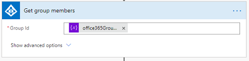
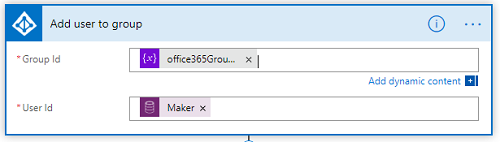

# Extend, customize and modify components

## Change Welcome Email from Office 365 Group to Azure AD Security Group

If you would prefer to use an Azure AD Security Group instead of an Office 365 Group for your makers, the *Admin \| Welcome Email* flow can be modified.  

>[!NOTE]
>Using an Azure AD Security Group will allow you to share apps with your maker security group. Currently, apps can not be shared with Office 365
Groups.

1. Go to [make.powerapps.com](<https://make.powerapps.com>) and set the current Environment to the Environment where the Center of Excellence solution is installed.

1. Select **Solutions** \> **Center of Excellence**.

1. Select **Flow** from the Filter option at the top.

1. Select the **Admin \| Welcome Email** flow and select **Edit** on the Flow Details page.

1. Update the **Initialize Office 365 Group ID** with your Azure AD Group ID (you can rename the variable and action as well). 

1. Remove the List Group members action.

1. In the same place, select **+ Add an action**, search for and insert **Get Group Members** from the Azure AD connector. 
1. Set the **Group ID** to the **office365GroupID** variable from dynamic content.  

1. Select the **condition** and on the string expression in the value o the left. Update *List_group_members* to *Get_group_members* in the body of the expression. The expression should look like the highlighted below. 

1. Open the **No** branch of the condition to remove the **Add member to group** action.

1. In the same place, select **+ Add an action**, search for and insert **Add user to group** from the Azure AD connector. 
1. Set the **Group ID** to the **office365GroupID** variable and the User Id to Maker (from dynamic content).  

1. **Save** the flow.
