<!-- Should line 82 also mention **Name**? Is the screenshot in line 146 in the right location? It doesn't match the step. In line 158, this is confusing: "a copy of a cloud flows triggering child flows". Should it be "a cloud flow"? -->

# Extend and customize CoE Starter Kit components

There's no "one size fits all" solution for a Center of Excellence (CoE). Some companies will want a more restrictive set of rules for their organization, while others will want to let users personally explore with less limitation.

That's why the CoE Starter Kit intends to provide a starting point for administration, governance, and nurture tooling approaches. However, you may find that you'll need to extend the kit to fit your needs in addition to using the tools from the CoE Starter Kit as they are.

There are many reasons for why you may want to extend the CoE Starter Kit:

- Capturing additional metadata for apps and flows—for example, as part of the [Compliance process](sample-process.md).
- Modifying the apps and flows to fit existing processes you may have in place—for example, asking makers to provide additional information in the [Developer Compliance Center](governance-components.md#developer-compliance-center).
- Customizing the apps to fit with your organization's brand and theme, especially for broadly used apps like the [App Catalog](core-components.md#app-catalog).
- Building additional apps and flows on top of the inventory gathered by the CoE Starter Kit.

This article prepares you to extend the CoE Starter Kit. It provides guidance on:

- How to customize CoE Starter Kit components.
- How to add your own CoE Starter Kit components.
- How to deploy and publish your customizations.

Not following best practices when extending the CoE Starter Kit can lead to unintended consequences, like no longer receiving updates from Microsoft during an upgrade.

## What components can I customize?

Before we explain how to extend the CoE Starter Kit, here's some guidance on what components we do and don't recommend extending:

- Tables and model-driven apps support merging. These resources can easily be extended by creating your own unmanaged solution and making changes there (for example, adding new fields). During an upgrade, you'll receive our changes and also keep your changes.
- Canvas apps and cloud flows do not support merging. These resources can only be extended and customized by creating a copy in your own unmanaged solution. During an upgrade, you'll no longer receive our changes, which should be a deliberate choice in order to customize a process and make it fit to your organization.
- Cloud flows that are responsible for [gathering inventory](core-components.md#flows) should not be customized. These flows are frequently updated to fix bugs, gather additional data, or improve performance. If you have additional requirements for what inventory to gather, raise a [feature ask](https://github.com/microsoft/coe-starter-kit/issues) or create separate flows for your requirements.

## What's the mechanism to extend the CoE Starter Kit?

The CoE Starter Kit is composed of components made by using the capabilities of Microsoft Power Platform. It can be extended by using Power Platform itself. The following article gives guidelines on how to properly customize and deploy your customizations.

The CoE Starter Kit is made available as [managed solutions](/power-platform/alm/solution-concepts-alm#managed-and-unmanaged-solutions). Any new components or customizations must be included in an unmanaged solution so you can keep track of your changes and deploy them to other environments.

Learn more about solutions:

- [Introduction to solutions](/powerapps/developer/common-data-service/introduction-solutions)
- [Solution concepts](/power-platform/alm/solution-concepts-alm)
- [How managed solutions are merged](/power-platform/alm/how-managed-solutions-merged)
- [Use a solution to customize](/power-platform/alm/use-solutions-for-your-customizations)
- [Manage solutions in Power Apps and Power Automate](https://docs.microsoft.com/learn/modules/manage-solutions-power-automate)

If you plan to make customizations to a large number of CoE Starter Kit components, use multiple unmanaged solutions to organize your extensions better and reduce the size of each solution. Lighter solutions reduce deployment time. Learn more: [Organize solutions](/power-platform/alm/organize-solutions)

 >[!IMPORTANT]
 >Any extensions or customizations to the CoE Starter Kit components should be made in a **nonproduction environment** before being deployed to your production environment as managed.

## Creating a new solution

To create a new unmanaged solution:

1. Go to [make.powerapps.com](<https://make.powerapps.com>).
1. Go to your CoE development environment. The managed solutions of the CoE Starter Kit components you are using should already be installed in this environment—for example, Center of Excellence - Core components and Center of Excellence - Innovation Backlog.
1. Select **Solutions**.
1. Select **+ New solution**.

   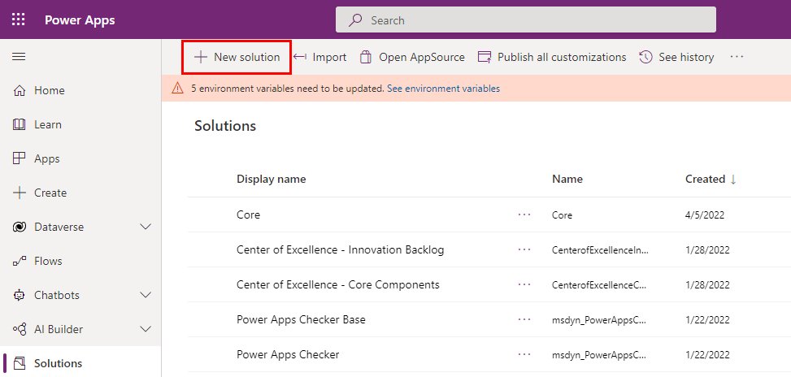
   
1. Enter the **Display name** (for example, *Contoso CoE Extension*), [**Publisher**](power-platform/alm/solution-concepts-alm#solution-publisher) (author of your solution), and **Version** (leave 1.0.0.0 if it's your first solution).

   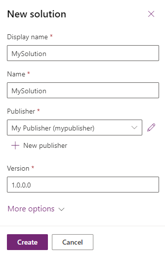
   
1. Select **Create** to create your solution.

## Creating components in a solution

To add a new component to your new solution:

1. Go to [make.powerapps.com](<https://make.powerapps.com>).
1. Go to your CoE development environment.
1. Select **Solutions**.
1. Select your new solution.
1. Select **+ New** in the top menu.
 
   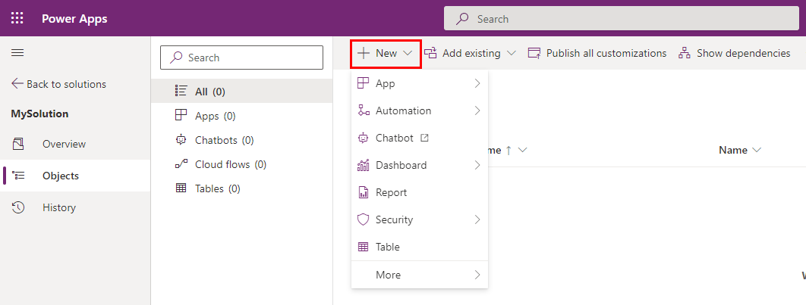
        
1. Choose the component type to add this component to your solution.

> [!IMPORTANT]
> Create additional components within your own solution rather than the existing CoE Starter Kit solutions so that the prefix of your publisher (author) is applied to the name of the component. Your publisher's prefix enables you to differentiate your components from the components belonging to the CoE Starter Kit.

## Customizing CoE Starter Kit components

> [!CAUTION]
> The CoE Starter Kit is distributed as a managed solution and shouldn't be customized directly.

Most components can be customized by duplicating the component and customizing the copy. The only exception is [adding new fields in an existing table](#adding-a-new-column-within-an-existing-table).

Below are common examples of how to customize and extend some of the main components of the CoE Starter Kit.

### Creating a copy of a canvas application

Add a canvas app to your unmanaged solution:

1. Go to [make.powerapps.com](<https://make.powerapps.com>).
1. Go to your CoE development environment.
1. Go to **Solutions**.
1. Select your solution.
1. Select **+ Add existing**.
1. Select **App** > **Canvas app**.

   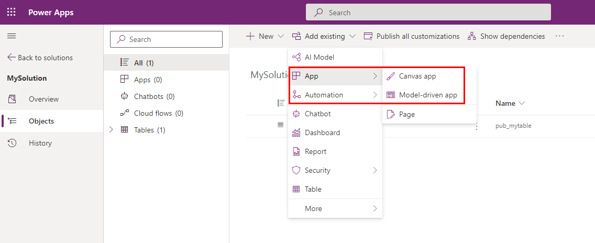
   
1. Search for the canvas app you want to customize and select **Add** to add it to your solution.

   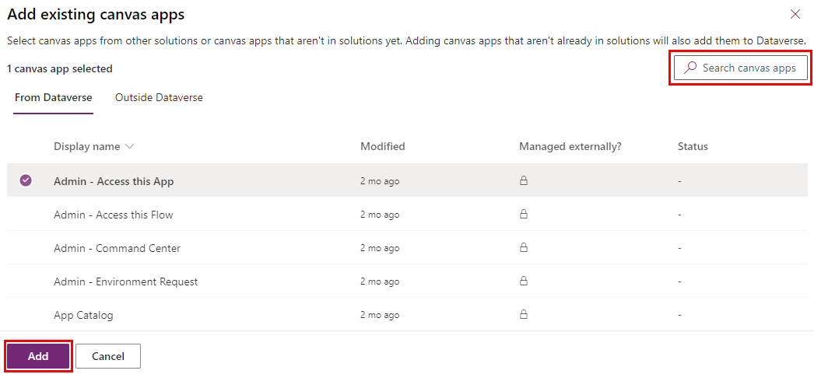

Next, create a copy of the canvas app:

1. Select the canvas app in your solution and select **Edit**.

   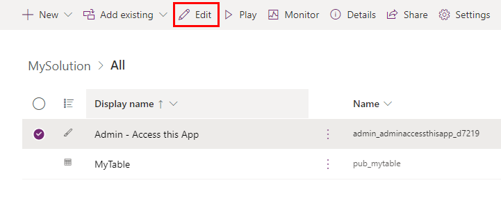
   
1. The app is opened in Power Apps Studio.
1. Select **File**.

   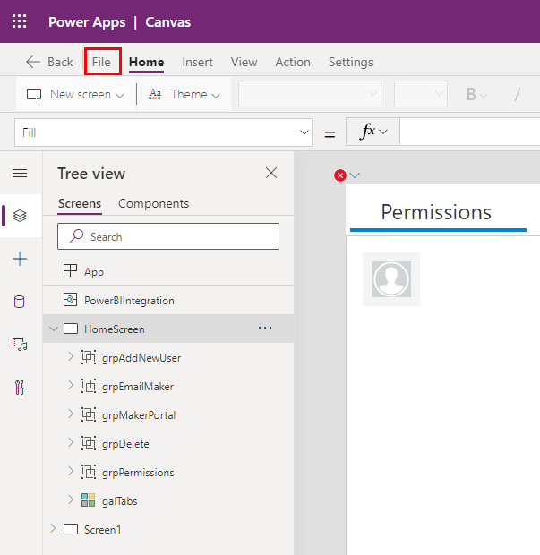
   
1. Go to **Save as**, change the name of the app (for instance, add a prefix), and select **Save**.
1. Go back to your solution—your copy of the app is displayed in the list (with your publisher prefix).
1. Remove the original app from your solution by selecting it and, in the menu, selecting **Remove** and then **Remove from solution**.

   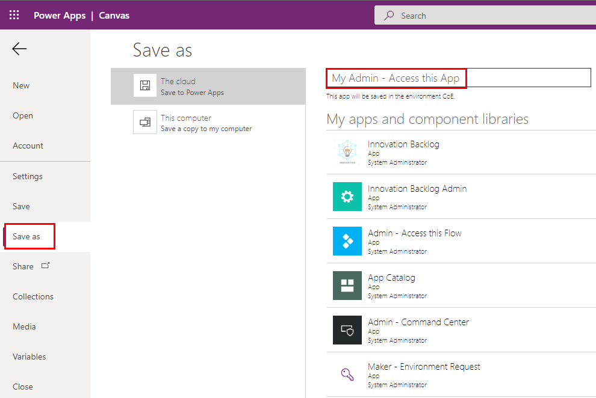

   Remove [unmanaged layers](after-setup.md#removing-other-customizations) to continue receiving updates to the original app. You may want to compare them to your changes.

You can now safely edit your own copy.

> [!NOTE]
> Creating a copy of a canvas app to extend and customize it means you'll no longer receive updates for this app during an upgrade.

### Working with cloud flows

> [!CAUTION]
> - Due to a product limitation, you can't create a copy of a cloud flows triggering child flows. Most CoE Starter Kit flows use child flows.
> - Customizations to cloud flows can be made on the existing flows as unmanaged.
> - Unmanaged changes will take precedence over the managed ones; therefore, customized flows won't be updated as part of a CoE upgrade.
> - Learn more: [Solution Layers](/power-platform/alm/solution-layers-alm/)

Customize an existing flow:

1. Go to [make.powerapps.com](<https://make.powerapps.com>).
1. Go to your CoE development environment.
1. Go to **Solutions**.
1. Select your solution.
1. Select **Add existing**.

   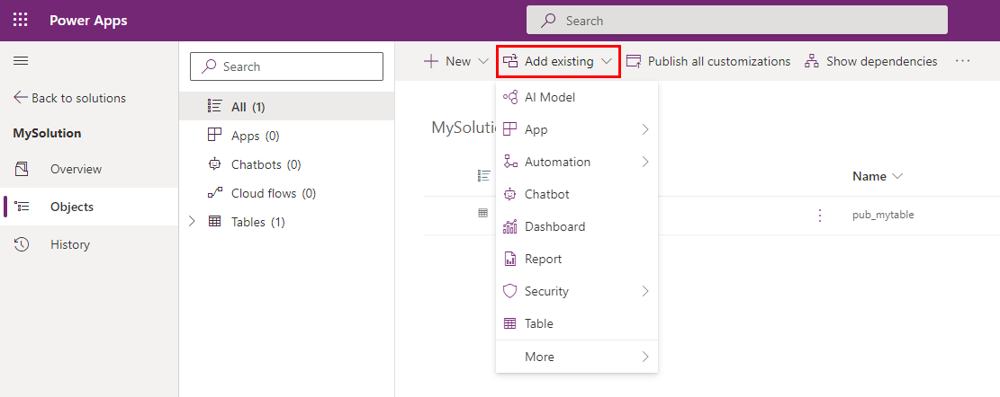
   
1. Select **Automation** > **Cloud flow**.
1. Select or search for the flow you want to customize.
1. Select the flow in your solution and use the **Edit** button to start customizing the flow.

> [!NOTE]
> Creating a copy of a canvas app to extend and customize the app means you'll no longer receive updates for this app during an upgrade.

### Working with model-driven apps and extending Dataverse tables

Create your own model-driven app instead of extending the existing one to avoid your changes being impacted by an upgrade. Learn more: [Overview of building a model-driven app with Power Apps](/power-apps/maker/model-driven-apps/model-driven-app-overview)

#### Configure a new model-driven application

First, create a new model-driven application:

1. Go to [make.powerapps.com](<https://make.powerapps.com>).
1. Go to your CoE development environment.
1. Go to **Solutions**.
1. Select your solution.
1. Select **+ New**.
1. Select **App** > **Model-driven app**.
1. Select **Create**.
1. Enter a **Name** and a **Unique Name** (technical name for the application).
1. Select **Done**.

   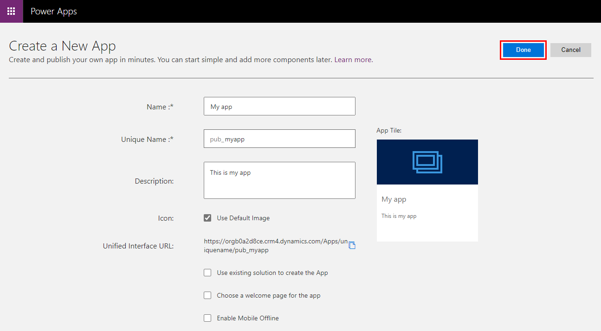
        
Then, configure the new model-driven application:

1. In the **App Designer**, use the menu to select the components for your app.
1. Configure the **Site Map** to show the elements in your app's menu.

   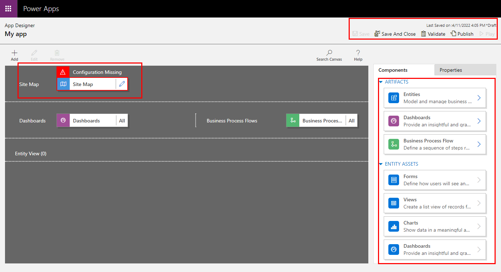
        
1. Select **Save**.
1. Select **Validate**, and correct any issues.
1. Select **Publish**.

#### Add a new column to an existing table

1. Start by adding the table you want to add the field to, if it's not already in your solution
    1. Go to [make.powerapps.com](<https://make.powerapps.com>).
    1. Go to your CoE development environment.
    1. Go to **Solutions**.
    1. Select your solution.
    1. Select **Add existing**.

        
    1. Choose **Table**.
    1. Search for the table you want to add and select **Next**.
        > [!IMPORTANT]
        > If you only want to add new fields and not modify the views and forms of the table, do not check the options to include **metadata** or **objects** so that the components in your solution to only the ones you have modified/created.
        > 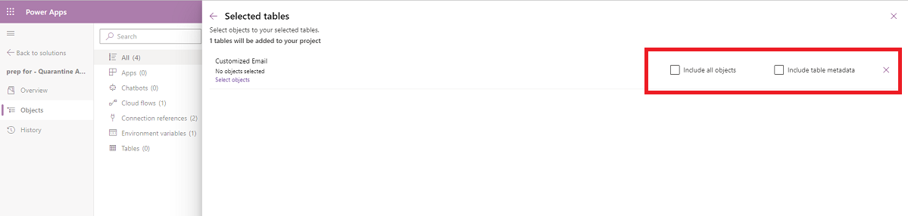
    1. Select **Add**.
1. Adding a new field.
    1. Select the table just added to the solution.
    1. In the **Columns** tab, select **Add Column**
    1. Fill in the form with the details of your new field, such as name and data type, and select **Done**.
    1. Select **Save Table** at the bottom right of the screen.

#### Customizing an existing form

Forms are used within model-driven application and portals to render table data. Forms support merge behavior.

Form merge occurs on a section-by-section basis. When you add new elements to an existing tab or section, your changes can affect or conceal the elements from the managed layers, including when the managed element is updated. This behavior occurs because the managed layers are underneath the unmanaged layer you're introducing with your customization. If you don't want to affect or conceal managed elements on the form, we recommend that you include your new elements within new container elements, such as a section or tab.

Learn more: [Merge form customizations](/power-platform/alm/how-managed-solutions-merged#merge-form-customizations)

1. Add the table linked to the form to your solution.
    1. Go to [make.powerapps.com](<https://make.powerapps.com>).
    1. Go to your CoE development environment.
    1. Go to **Solutions**.
    1. Select your solution.
    1. Select **Add existing**.
    1. Choose **Table**
    1. Search for the table you want to add and select **Next**.
    1. Select **Add**.
1. Add the form you want to customize.
    1. Select **... > + Add subcomponents**.
                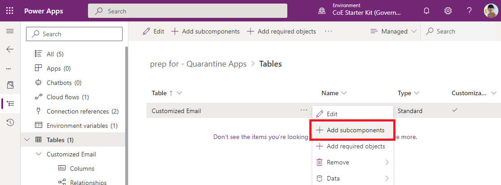
    1. Select **Forms** and select the form you want to customize.
    1. Select **Add**.
1. Customize the form.
    1. Select the table and then select **Forms**.
    1. Select **... > Edit form** to edit the form.
    > [!NOTE]
    > Depending on the goal of your customization, you can also create a new form or duplicate the existing form.
1. Add the new form to your model-driven application
    1. If you have created a new form or duplicated the existing form, start by disabling the old one so that it is not shown.
    1. On the original form, select **... > Remove form from this solution**.
    1. Select **Form settings**.
    1. Make sure that the new form's settings are configured correctly including **Ordering** and **Security roles**

        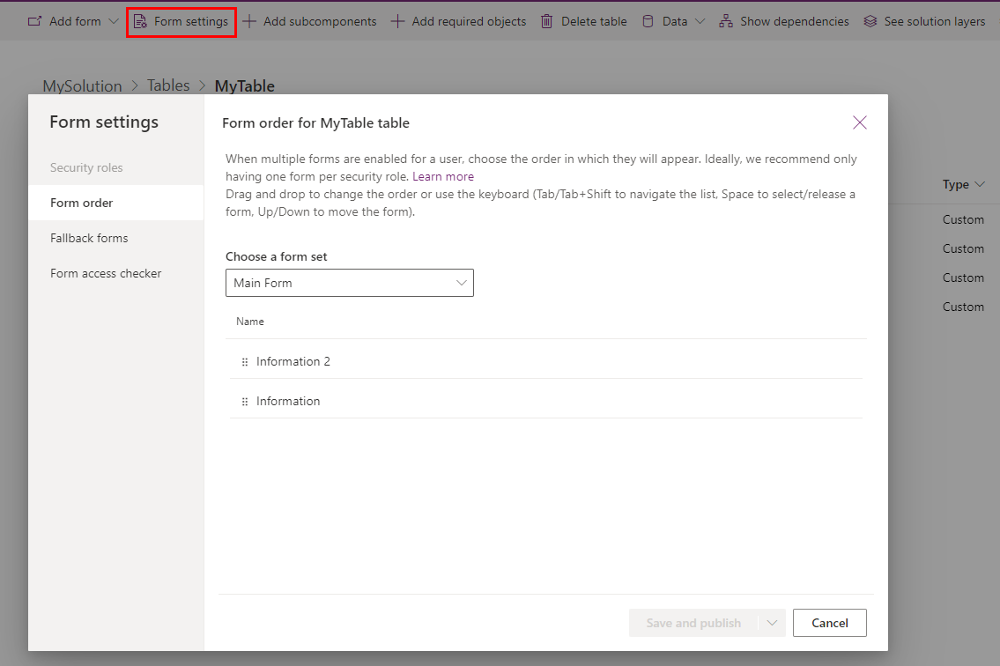
    1. Add your new form to your model-driven application in the **App Designer**

#### Customizing a view

Views are used in model-driven applications to display table data as lists.

Learn more: [Create and edit views](/power-apps/maker/model-driven-apps/create-edit-views-app-designer).

1. Add the table linked to the form to your solution.
    1. Go to [make.powerapps.com](<https://make.powerapps.com>).
    1. Go to your CoE development environment.
    1. Go to **Solutions**.
    1. Select your solution.
    1. Select **Add existing**.
    1. Choose **Table**
    1. Search for the table you want to add and select **Next**.
    1. Select **Add**.
1. Add the view you want to customize.
    1. Select **... > + Add subcomponents**.
        
    1. Select **Views** and select the view you want to customize.
    1. Select **Add**.
1. Customize the view.
    1. Select the table and then select **Views**.
    1. Select **... > Edit view** to edit the view.
    > [!NOTE]
    > Depending on the goal of your customization, you can also create a new view or duplicate the existing view.
1. Add the new view to your model-driven application
    1. If you have created a new view or duplicated the existing view, start by disabling the old one so that it is not shown.
    1. On the original view, select **... > Remove view from this solution**.
    1. Add your new view to your model-driven application in the **App Designer**

#### Customize a model-driven app system dashboard

Dashboards are used in model-driven applications to display table data as graphical components.
Learn more: [Create or edit model-driven app dashboards](/power-apps/maker/model-driven-apps/create-edit-dashboards).

System dashboards cannot be duplicated as system dashboards.
Two options are available to customize these dashboards:

1. (Recommended option) In your development environment, create a **new system dashboard** and reuse the components from the CoE Starter Kit dashboards.
2. Directly in your production environment, you can create a **personal dashboard** from the system dashboard and then share it with the team.

    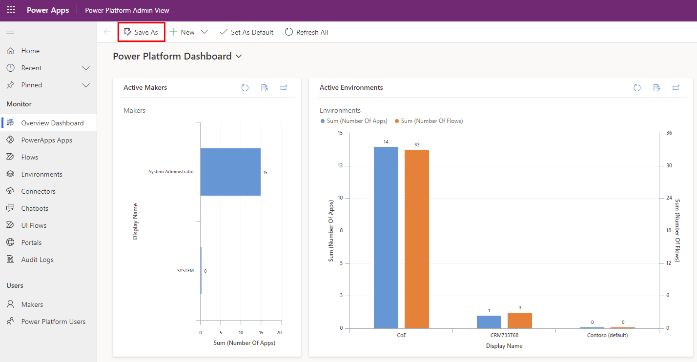

## Deploy and publish your customizations

Deploy the solution with your customizations as a managed solution to test and  production environments.

Learn more: [Implementing healthy project and solution ALM](/power-platform/alm/implement-healthy-alm)

Consider using the [ALM Accelerator for Power Platform](almacceleratorpowerplatform-components.md) to manage your deployments.
