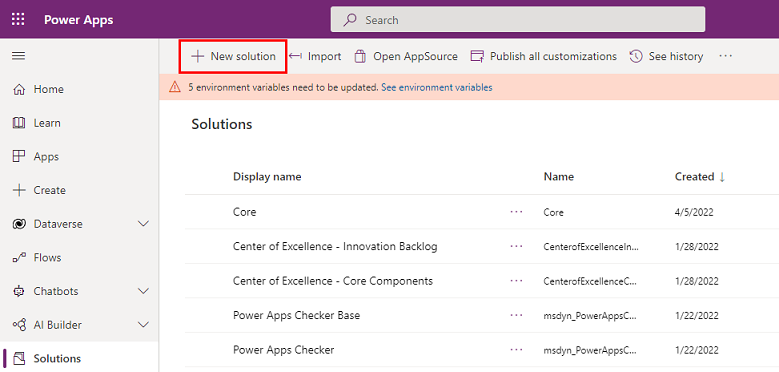
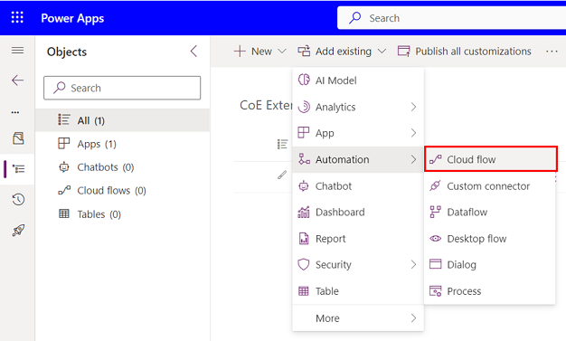
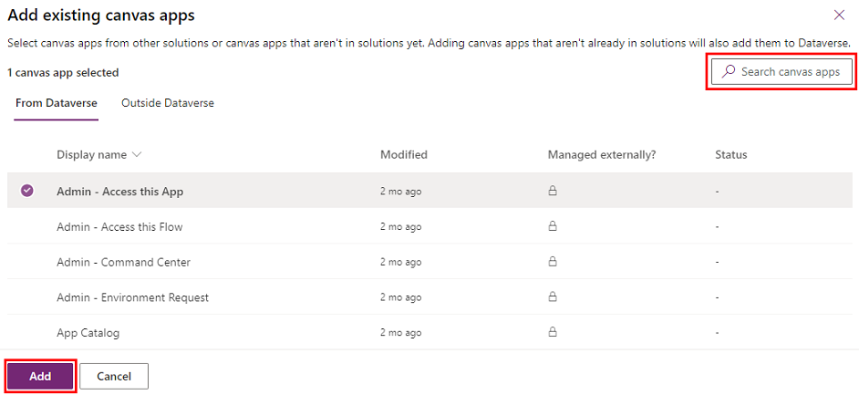
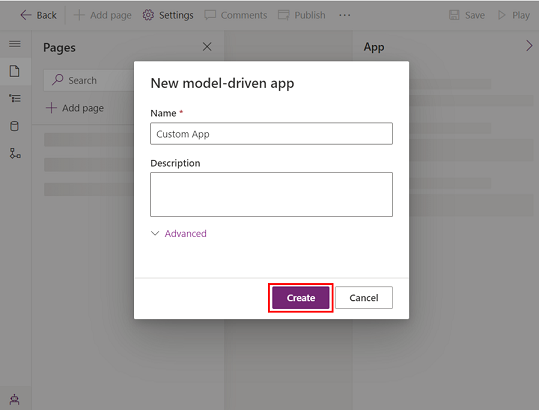
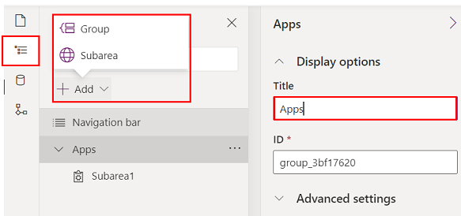

# Extending and customizing CoE Starter Kit components

The CoE Starter Kit is composed of components made by using the capabilities of the Power Platform, therefore it can be extended by using the Power Platform itself. The following article gives guidelines on how to properly customize and deploy your customizations.

Any new components must be included within one or multiple unmanaged solutions to be able to identify them easily and be capable of deploying them to other environments. Read about solutions in our documentation, which will introduce you to the concepts in addition to notions like how to create your publisher. For more information related to solutions, visit [Introduction to solutions](https://docs.microsoft.com/powerapps/developer/common-data-service/introduction-solutions) and for training content, take a look at [Manage solutions in Power Apps and Power Automate](https://docs.microsoft.com/learn/modules/manage-solutions-power-automate).

If you plan on making a sizeable number of extensions, it's recommended to use multiple solutions to organize your extensions better and reduce the size of each solution. Lighter solutions reduce deployment time. More information at [Organize solutions](https://docs.microsoft.com/power-platform/alm/organize-solutions).

 >[!IMPORTANT]
 >Any extensions or customizations to the CoE Starter Kit components should be made in a **non production environment** before being deployed to your production environment as managed.

## Creating a new solution

1. To create a new unmanaged solution:

    1. Login and go to the [PowerApps Maker Portal](https://make.powerapps.com/)
    2. Switch environment to open the development environment on which the CoE Starter Kit is deployed:

        
    3. Go to **Solutions** in the left navigation bar
    4. Select **New solution** in the menu at the top

        
    5. Fill in the **Display Name** (name of your solution displayed in the portal), **Name** (technical name of your solution), **Publisher** (author of your solution) and **Version** (leave 1.0.0.0 if it is your first solution).

        
    6. Select **Create** once your done.

## Creating components in a solution

1. To add a new component to your new solution

    1. Login and go to the [PowerApps Maker Portal](https://make.powerapps.com/)
    2. Go to **Solutions** in the left navigation bar
    3. Select your new solution
    4. Select **New** in the top menu

        
    5. Choose the component type and proceed with the creation

 >[!IMPORTANT]
 > It is important to create additional components within your own solution because it applies the publisher's prefix to the technical name of any new component which enables you to identify them better from the components belonging to the CoE or the system. Also it helps you keep track of new components and already packages them for deployment to production.

## Customizing CoE Starter Kit components

> [!CAUTION]
> Every components part of the CoE Starter Kit are distributed as managed and should not be customized directly.

If you wish to customize an existing component, this component should be duplicated and only its copy should be customized.
The only exception is related to creating new fields in an existing table, which is described below.

Here are some common examples of how to customize and extend some of the main components of the CoE Starter Kit. For more information, refer to [Power Platform Documentation](https://docs.microsoft.com/power-platform/).

### Duplicating a canvas application

1. Add the canvas app to your unmanaged solution

    1. Login and go to the [PowerApps Maker Portal](https://make.powerapps.com/)
    2. Go to **Solutions** in the left navigation bar
    3. Select your solution
    4. Select **Add existing**

        
    5. Choose **App** then the related application type (canvas app)  

        
    6. Add the target application or use the search bar to find the target application, select it and click on **Add**

        
2. Duplicate the canvas app
    1. Select the canvas app in your solution and select **Edit** in the top menu

        
    2. The app is opened in the Power Apps Studio
    3. Navigate to **File** in the top left menu

        
    4. Go to **Save as**, change the name of the app (for instance add a prefix) and select **Save** on the bottom right
    5. Go back to your solution, your copy of the app is displayed in the list (with your publisher prefix)
    6. Remove the original app from your solution by selecting it and in the menu selecting **Remove** then **Remove from solution**

        
    7. You can now safely edit your own copy

### Working with cloud flows

> [!CAUTION]
> System Cloud flows cannot be duplicated, if you use the **Save as** on System Cloud Flows, the copy is a personal cloud flow.
> Customizations to cloud flows can be made on the existing flows as unmanaged.
> Unmanaged changes will take precedence over the managed ones, therefore any customized flows will not be updated as part of a CoE upgrade.
> For more information on solution layers visit [Solution Layers](https://docs.microsoft.com/power-platform/alm/solution-layers-alm/)

1. Customizing an existing flow
    1. Login and go to the [PowerApps Maker Portal](https://make.powerapps.com/)
    2. Go to **Solutions** in the left navigation bar
    3. Select your solution
    4. Select **Add existing**

        
    5. Choose **Automation** then **Cloud flow**
    6. Then select the flow you want to customize
    7. From your solution select the flow and use the **Edit** button in the top menu 

### Working with Model-driven applications and extending Dataverse Tables

> [!CAUTION]
> Existing components part of the tables should not be removed or modified.

Model-driven applications cannot be duplicated but can be created easily by configuration.
If you need to extend existing model-driven applications, it is better to configure your own from existing CoE components otherwise your changes may be affected by the upgrade process.
For more information on building model-driven apps, take a look at [Overview of building a model-driven app with Power Apps](https://docs.microsoft.com/power-apps/maker/model-driven-apps/model-driven-app-overview)

#### Configuring a new Model-Driven application

1. Initiating your model-driven application
    1. Login and go to the [PowerApps Maker Portal](https://make.powerapps.com/)
    2. Go to **Solutions** in the left navigation bar
    3. Select your solution
    4. Select **New** in the top menu
    5. Then select **App** and **Model-driven app**
    6. Select **Create**
    7. Fill in a **Name** (used in the menus) and a **Unique Name** (technical name for the application)
    8. Select **Done** at the top right corner

        
2. Configuring your model-driven application
    1. In the **App Designer** use the right side menu to select the components to be added
    2. Configure the **Site Map** to show the elements in your app's left side menu
    3. Once done select **Save** then **Validate**
    4. Correct the issues if there are any
    5. Finish by **Publish**

        

#### Adding a new column within an existing table

> [!IMPORTANT]
> When you add the table, do not include **Metadata** or any **Objects** in order to keep the components within your solution to only the ones you have modified/created.
> This will make sure that the upgrade process of the CoE Starter Kit is not impacted.

1. Start by adding the table you want to add the field to, if it's not already in your solution
    1. Login and go to the [PowerApps Maker Portal](https://make.powerapps.com/)
    2. Go to **Solutions** in the left navigation bar
    3. Select your solution
    4. Select **Add existing**

        
    5. Choose **Table**
    6. Search for the table you want to add and select **Next**
    7. Select **Add** at the bottom
2. Adding a new field
    1. Select the table just added to the solution
    2. In the **Columns** tab, select the button at the top **Add Column**
    3. Fill in the form with the details of your new field and select **Done**
    4. Select **Save Table** at the bottom right of the screen

#### Customizing an existing form

Forms are used within model-driven application and Power Portals to render table data.
For more information related to forms, visit [Create and Design model-driven app forms](https://docs.microsoft.com/power-apps/maker/model-driven-apps/create-design-forms).

> [!IMPORTANT]
> When customizing the form, it's important to duplicate the form so that your changes are not overridden post upgrade.

1. Start by adding the table you want to duplicate the form to, if it's not already in your solution
    1. Login and go to the [PowerApps Maker Portal](https://make.powerapps.com/)
    2. Go to **Solutions** in the left navigation bar
    3. Select your solution
    4. Select **Add existing**

        
    5. Choose **Table**
    6. Search for the table you want to add and select **Next**
    7. Select **Add** at the bottom
2. Add the form you want to duplicate
    1. Open the table by selecting it
    2. Select **Add subcomponents** in the top menu
    3. Navigate to **Forms** and select the form you want to duplicate
    4. Select **Add** in the bottom left
3. Duplicate the form
    1. Navigate to the tab **Forms**
    2. Open the form to duplicate
    3. Select the drop down menu next to **Save** in the top right corner
    4. Select **Save As**

        
    5. Change the **Name** and select **Save**
    6. You can now safely edit the form  
4. Setting up the new form in a model-driven application
    1. Once you've created your copy, start by disabling the old one so that it is not shown
    2. Remove it from your solution
    3. Make sure that the new form's settings are configured correctly including **Ordering** and **Security roles**

        
    4. Be sure to have your new form part of the model-driven application you want in the **App Designer**

#### Customizing a view

Views are used in model-driven applications to display table data as lists.
For more information on views, visit [PowerApps Maker Portal](https://docs.microsoft.com/power-apps/maker/model-driven-apps/create-edit-views-app-designer).

1. Start by adding the table you want to duplicate the view to, if it's not already in your solution
    1. Login and go to the [PowerApps Maker Portal](https://make.powerapps.com/)
    2. Go to **Solutions** in the left navigation bar
    3. Select your solution
    4. Select **Add existing**

        
    5. Choose **Table**
    6. Search for the table you want to add and select **Next**
    7. Select **Add** at the bottom
2. Add the view you want to duplicate
    1. Open the table by selecting it
    2. Select **Add subcomponents** in the top menu
    3. Navigate to **Views** and select the view you want to duplicate
    4. Select **Add** in the bottom left
3. Duplicate the form
    1. Navigate to the tab **Views**
    2. Open the view to duplicate
    3. Select the drop down menu next to **Save** in the top right corner
    4. Select **Save As**

        
    5. Change the **Name** and select **Save**
    6. You can now safely edit the view
4. Setting up the new view in a model-driven application
    1. Once you've created your copy, start by disabling the old one so that it is not shown
    2. Remove it from your solution
    3. Be sure to have your new view part of the model-driven application you want in the **App Designer**

#### Customizing a model-driven app system dashboard

Dashboards are used in model-driven applications to display table data as graphical components.
For more information on dashboards, visit [Create or edit model-driven app dashboards](https://docs.microsoft.com/power-apps/maker/model-driven-apps/create-edit-dashboards).

System dashboards cannot be duplicated as system dashboards.
Two options are available to customize them:

1. (Preferred option) In your development environment, create a **new system dashboard** and reuse the components from the CoE Starter Kit dashboards.
2. Directly in your production environment, you can create a **personal dashboard** from the system dashboard and then share it with the team

    
