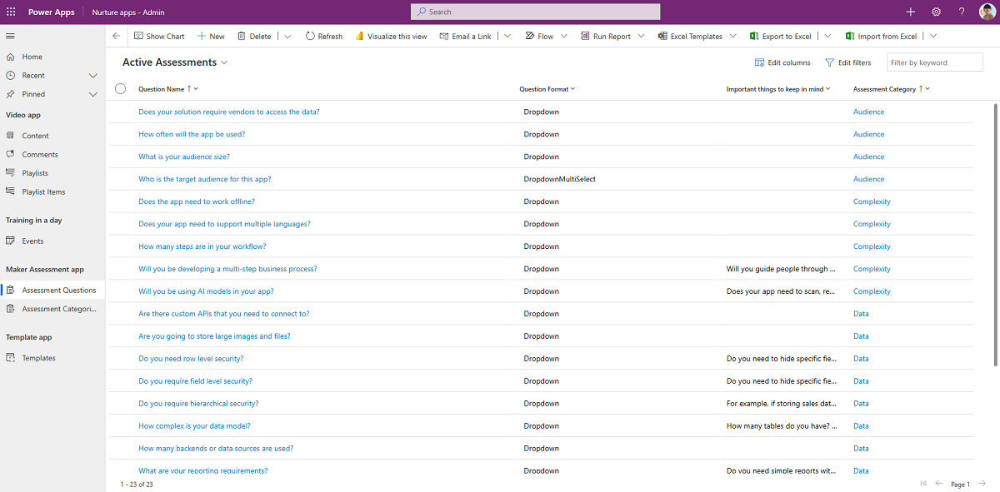
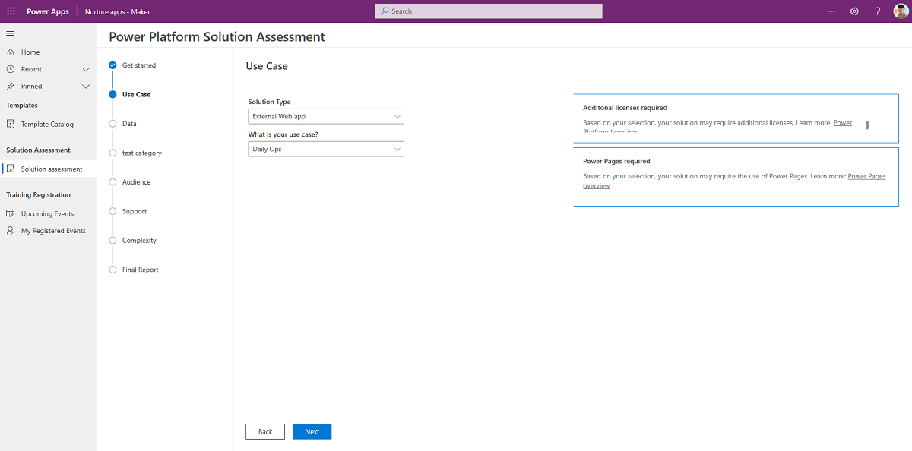

# Use nurture components

An essential part of establishing a Center of Excellence (CoE) is nurturing your makers and an internal community. You'll want to share best practices and templates, and onboard new makers. The assets in this solution can help you develop a strategy for this motion.  

## Demo: Nurture components

Watch how to use the nurture components solution.

> [!VIDEO https://www.youtube.com/embed/StqxBgbt_ZM]

The CoE nurture components solution contains assets relevant to everyone in the organization: admins, makers, in addition to users of apps and flows. More information: [Set up nurture components](setup-nurture-components.md)

Here's a breakdown of the assets that form the nurture components solution:

- Onboard new makers and share best practices
  - [Maker Assessment](#apps)
  - [Template Catalog (canvas app)](#apps)
  - [Admin | Newsletter with Product Updates (flow)](#flows)
- Encourage adoption
  - [Training in a Day Management and Registration (canvas apps)](#apps)
  - [Training in a Day Feedback Reminder, Registration Confirmation and Reminder (flow)](#flows)

## Security roles

**Maker Journey Admin SR** Gives a user full access (create, read, write, etc) to the Maker Assessment tables. When you share the Maker Assessment Admin app with your admin team, make sure to assign them the **Maker Journey Admin SR** security role.

**Maker Journey Maker SR** Gives a user read access to the Maker Assessment tables. When you share the Maker Assessment app with your organization, make sure to assign them the **Maker Journey Maker SR** security role.

## Tables

### InADayAttendees

Represents attendees that have registered for a Training in a Day course by using the Training in a Day Registration canvas app. The following information is available for each attendee:

- Attendee email
- Name
- Registered event

### InADayEvent

Represents available training events created through the Training in a Day Management canvas app. The following information is available for each event:

- Name
- Description
- Start time
- End time
- Max attendees
- Location

### Assessment Category

Categories - such as Data, Audience, Support - used in the Maker Assessment app.

### Assessment Questions

Questions used in the Maker Assessment app.

## Answer Options

Potential answers to questions in the Maker Assessment app.

## Flows

| Flow | Type | Schedule | Description |
| --- | --- | --- | --- |
| Admin \| Newsletter with Product Updates | Schedule | Weekly | Sends a weekly email with a summary of product updates, consisting of posts from the product blogs for Power Apps, Power Automate, and Power BI, and the Power Apps Community blog. |
| Training in a Day \| Feedback Reminder | Schedule | Daily | Sends an email to attendees of a training event on the day, and requests feedback. |
| Training in a Day \| Registration Confirmation Automated | Automated | when a user registers for an event using the [Training in a day](#training-in-a-day--registration) app | Sends an email to attendees of a training event on the day, and requests feedback. |
| Training in a Day \| Reminder 3 days prior to event | Schedule | Daily | Sends a reminder email to an attendee of a Training in a Day event three days before the event. |
| Maker Assessment \| Import starter data | Instant | Manual (once) | This instant cloud flow runs once during setup to add some starter questions, answers, and categories into your dataverse tables. |

## Apps

### Maker Assessment Admin App

A canvas app that the Maker Assessment admin uses to enter or update the questions, answers, and categories, that are listed in the apps.

**Permission**: Share this app with the Maker Assessment admins - this can be your CoE or Power Platform adoption lead.

**Prerequisite**: This app uses Dataverse; a Premium license is therefore required for every app user unless installed in Dataverse for Teams.

### Maker Assessment

The Maker Assessment app can be used to ask users a series of questions regarding the target audience, data and support of the solution they are planning and informing them about governance, support and license considerations a maker needs to keep in mind before starting the development of their solution.

**Permission**: The Maker Assessment app can be shared with the entire organization.

**Prerequisite**: This app uses Dataverse; a Premium license is therefore required for every app user unless installed in Dataverse for Teams.

### Template Catalog

A canvas app that CoE admins can use to share app and component templates, in addition to best practice documents, with their makers.

**Permission**: After you've made the content ready, the template catalog can be shared with the entire organization.

**Prerequisite**: This app uses SharePoint in the background and requires a SharePoint site to be configured. This is described in [Set up nurture components](setup-nurture-components.md).

> [!NOTE]
> This app can't be used in the managed solution; it can only be tested and used after you've [imported it into your extended unmanaged solution](modify-components.md). This is due to some limitations in the environment variables and data sources in the canvas apps. For more information, go to [Set up the Template Catalog and upload components](modify-components.md#set-up-the-template-catalog-and-upload-components).

#### Training in a Day – Management

If you're planning to run an internal Training in a Day event (such as App in a Day), you can use this canvas app to create and manage it.

**Permission**: Share with CoE admins or the owners of your internal training events.

**Prerequisite**: This app uses Dataverse; a Premium license is therefore required for the admins who are using it.

#### Training in a Day – Registration

If you're planning to run a Training in a Day event, use this canvas app to enable your users to register for upcoming events.

**Permission**: As soon as you're running internal training events, share with everyone in the organization.

**Prerequisite**: This app uses Dataverse; a Premium license is therefore required for everyone in your org.

[!INCLUDE[footer-include](../../includes/footer-banner.md)]