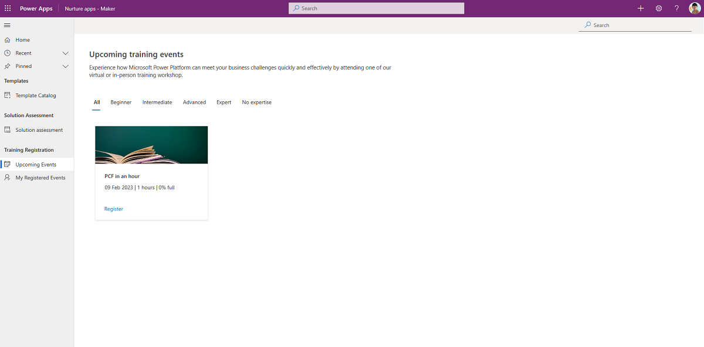

# Use nurture components

An essential part of establishing a Center of Excellence (CoE) is nurturing your makers and an internal community. You want to share best practices and templates, and onboard new makers. The assets in this solution can help you develop a strategy for this motion.   More information: [Set up nurture components](setup-nurture-components.md) and [watch the video](https://www.youtube.com/embed/StqxBgbt_ZM) on how to use the core components solution.

The CoE nurture components solution contains assets relevant to everyone in the organization: admins, makers, and users of apps and flows. More information: [Set up nurture components](setup-nurture-components.md)

## Video hub components

### Tables

| Name | Description |
|------|--------------|
| Community hub content | Represents video content that is available in the video hub canvas app, or the video hub - admin model-driven app. |
| Community hub comment | Represents comments that video hub users have made.  The 'comment status' column controls which comments are approved and viewable in the video hub canvas app. |
| Playlist | Represents a playlist.  Playlists are curated lists of video content for a specific group or requirement; for example, community meeting recordings. The playlist type column currently defines two types of playlist: shared or private. Shared playlists are viewable to all users, whereas private playlists are available to the playlist creator (in development). |
| Playlist item | Represents the relationship between a playlist and community hub content (video). |
| Champion profile | Represents a champion in your organization. A champion profile is displayed on the start screen of the video hub canvas app. |

### Apps

#### Video hub - admin

A model-driven app, designed for administrators or moderators of the video hub.  Users of this app can add video content and manage comment status and playlists.

**Permission**: Share with CoE admins, community leads or champions community.

**Prerequisite**: This app uses Microsoft Dataverse. End users need to have a Per User license.

#### Video hub

The canvas app for video content, playlists, and more.

Content is grouped in one of three built-in categories:

- How-to videos
- Community calls
- Success stories

Aside from providing a centralized hub for enterprise video content, administrators can create curated playlists. Playlists are a useful way of grouping related videos for end users.

Currently, internal (Stream) and external (YouTube) are the only types of video available in the app.

**Prerequisite**: This app uses Microsoft Dataverse. If you've installed this solution in a Production environment, end users need to have a Per User license, or the app needs to be assigned a Per App license, or the environment needs to be covered by pay-as-you-go.

## Training in a day components

### Tables

| Name | Description |
|------|---------------|
| InADayAttendees | Represents attendees who have registered for a Training in a Day course by using the Training in a Day Registration canvas app. The following information is available for each attendee: attendee email, name, and registered event |
| InADayEvent | Represents available training events created through the Training in a Day Management canvas app. The following information is available for each event: name, description, start time, end time, max attendees, and location |

### Flows

| Flow | Type | Schedule | Description |
| --- | --- | --- | --- |
| Training in a Day \| Feedback Reminder | Schedule | Daily | Sends an email to attendees of a training event on the day, and requests feedback. |
| Training in a Day \| Registration Confirmation Automated | Automated | When a user registers for an event using the [Training in a day](#training-in-a-day-pages-in-nurture-apps---maker-app) app | Sends an email to attendees of a training event on the day, and requests feedback. |
| Training in a Day \| Reminder 3 days prior to event | Schedule | Daily | Sends a reminder email to an attendee of a Training in a Day event three days before the event. |

### Apps

#### Nurture apps - admin

If you're planning to run an internal Training in a Day event (such as App in a Day), you can use this canvas app to create and manage it.

**Permission**: Share with CoE admins or the owners of your internal training events.

**Prerequisite**: This app uses Microsoft Dataverse. If you've installed this solution in a production environment, end users need to have a Per User license, or the app needs to be assigned a Per App license, or the environment needs to be covered by pay-as-you-go.

#### Training in a day pages in Nurture apps - Maker app

If you're planning to run a Training in a Day event, use this page in the Nurture apps - Maker app to enable your users to register for upcoming events.

**Permission**: As soon as you're running internal training events, share the Nurture apps - Maker with everyone in the organization.

**Prerequisite**: This app uses Microsoft Dataverse. If you've installed this solution in a production environment, end users need to have a Per User license, or the app needs to be assigned a Per App license, or the environment needs to be covered by pay-as-you-go.

## Maker assessment components

### Security roles

- **Nurture Admin SR** gives a user full access, including create, read, and write permissions, to the Maker Assessment tables. When you share the Nurture apps - Admin app with your admin team, be sure to assign team members to the **Nurture Admin SR** security role.

- **Nurture Maker SR** gives a user read access to the Maker Assessment tables. When you share the Nurture apps - Maker app with your organization, be sure to assign individuals to the **Nurture Maker SR** security role.

### Tables

| Name | Description |
|------|---------------|
| Assessment Category | Categories - such as Data, Audience, Support - used in the Maker Assessment app.|
| Assessment Questions | Questions used in the Maker Assessment app. |
| Answer Options | Potential answers to questions in the Maker Assessment app. |

### Apps

#### Nurture apps - Admin

A page inside the Nurture apps - Admin app that the Solution Assessment admin uses to enter or update the questions, answers, and categories that are listed in the apps.

**Permission**: Share this app with the Solution Assessment admins—this can be your CoE or Power Platform adoption lead.

**Prerequisite**: This app uses Microsoft Dataverse. If you've installed this solution in a production environment, end users need to have a Per User license, or the app needs to be assigned a Per App license, or the environment needs to be covered by pay-as-you-go.

#### Solution Assessment page in Nurture apps - Maker apps

The Solution Assessment page can be used to ask users a series of questions regarding the target audience, data and support of the solution they're planning and informing them about governance, support and license considerations a maker needs to keep in mind before starting the development of their solution.

**Permission**: The Nurture apps - Maker can be shared with the entire organization.

**Prerequisite**: This app uses Microsoft Dataverse. If you've installed this solution in a production environment, end users need to have a Per User license, or the app needs to be assigned a Per App license, or the environment needs to be covered by pay-as-you-go.

## Pulse survey components

>[!NOTE]
>These components will not work in GCC High and DoD as posting adaptive cards to Teams is not supported in those regions.

### Tables

| Name | Description |
|------|---------------|
| Pulse Feedback | Stores feedback received via Pulse feedback surveys. |

### Flows

| Flow | Type | Schedule | Description |
| --- | --- | --- | --- |
| Pulse - Survey Makers for CoE feedback | Schedule | Weekly on Thursdays | Posts an adaptive card to randomly identified makers to ask them for feedback on what they think about the Power Platform support and adoption strategy. |
| Pulse [Child] - post adaptive cards to maker | Manual | Child flow | Uses AI Builder to translate and analyze the feedback response and stores the response in the Pulse Feedback table.|

Makers receive adaptive cards sent by the **Pulse [Child] - post adaptive cards to maker** flow to provide feedback:

### Power BI

Pulse feedback Power BI Dashboard to display feedback and sentiment over time.

The dashboard also provides the ability to view detailed feedback and filter by department that provided it.

## Other nurture components

### Flows

| Flow | Type | Schedule | Description |
| --- | --- | --- | --- |
| Admin \| Newsletter with Product Updates | Schedule | Weekly | Sends a weekly email with a summary of product updates, consisting of posts from the product blogs for Power Apps, Power Automate, and Power BI, and the Power Apps Community blog. |

### Apps

#### Template Catalog page in Nurture apps - Maker app

A custom page that CoE admins can use to share app and component templates, in addition to best practice documents, with their makers.

**Permission**: After you've made the content ready, the Nurture apps - Maker can be shared with the entire organization.

**Prerequisite**: This app uses Microsoft Dataverse. If you've installed this solution in a production environment, end users need to have a Per User license, or the app needs to be assigned a Per App license, or the environment needs to be covered by pay-as-you-go.

> [!NOTE]
> This app can't be used in the managed solution; it can only be tested and used after you've [imported it into your extended unmanaged solution](modify-components.md). This is due to some limitations in the environment variables and data sources in the canvas apps.

[!INCLUDE[footer-include](../../includes/footer-banner.md)]
