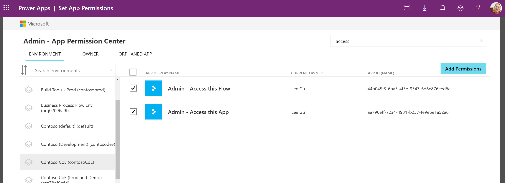
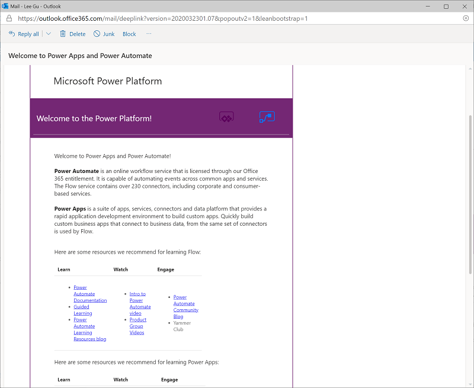

# Center of Excellence (CoE) overview

A Center of Excellence (CoE) drives innovation and improvement, and brings together like-minded people with similar business goals to share knowledge and success, while providing standards, consistency, and governance.

The Microsoft Power Platform CoE Starter Kit is a collection of components and tools that are designed to help you get started with developing a strategy for adopting and supporting Microsoft Power Platform, with a focus on Power Apps and Power Automate.

You can download the most recently updated assets from the [GitHub repository](https://aka.ms/CoEStarterKitRepo).

The kit doesn't represent the entire CoE, because managing a CoE requires more than tools alone; the CoE also requires people, communication, and defined requirements and processes. The tools provided here are just a means to get to the end goal, but the CoE itself must be thoughtfully designed by each organization based on their needs and preferences. More information: [What is a Center of Excellence?](motivation.md)

The kit provides some automation and tooling to help teams build monitoring and automation necessary to support a CoE. The foundation of the kit is a Microsoft Dataverse data model and workflows to collect resource information across the environments in the tenant. The kit includes multiple apps and Power BI analytics to view and interact with the data you collect, in addition to flows to collect data across environments and help with workflows for your compliance needs. The kit also provides several templates and suggested patterns and practices for implementing CoE efforts.

## Disclaimer

Although the underlying features and components used to build the kit (such as Dataverse, admin APIs, and connectors) are fully supported, the kit itself represents sample implementations of these features. Our customers and community can use and customize these features to implement admin and governance capabilities in their organizations.

If you face issues with:

- **Using the kit**: Report your issue at [aka.ms/coe-starter-kit-issues](https://aka.ms/coe-starter-kit-issues). (Microsoft Support won't help you with issues related to this kit, but they will help with related, underlying platform and feature issues.)
- **The core features in Microsoft Power Platform**: Use your standard channel to contact Support.

## Purpose of this document

This CoE Starter Kit and this guidance are targeted toward the person or department responsible for setting up a Microsoft Power Platform CoE in their organization. The goal of this guidance is to help you understand what the motivation for&mdash;and the responsibilities of&mdash;a Center of Excellence are, in addition to walking you through the prerequisites, setup instructions, and individual components of the CoE Starter Kit.

## How to get started

After you've [installed the CoE Starter Kit solution](setup.md), get familiar with the resources in your tenant.

> [!NOTE]
> The following steps are just examples of what you can do with the components in the CoE Starter Kit. Explore the rest of the guidance here to see what's available and how to make the most of the kit.

1. Open the Power BI dashboard, and familiarize yourself with resources and makers that are already in your environments.

    

1. Identify orphaned apps, and assign them to new owners by using the embedded app in the Power BI dashboard.

    

1. Start planning your governance strategy by identifying your requirements for what makes a compliant app or maker, what information you'll need per app or per maker, what happens to noncompliant apps and makers, how you'll support your maker community in building compliant apps that follow best practices, what audits you want to run, and what actions you'll drive based on those audits.

    

1. Embrace your maker community and develop a nurture and adoption strategy. Think about how to onboard new makers; organize internal events such as show-and-tell sessions, training workshops, and hackathons; and put together templates and best practices for your makers to use.

    

## Further resources

- Explore the [Power Apps admin documentation](https://docs.microsoft.com/power-platform/admin/admin-documentation).

- Find training resources, including guided learning and step-by-step guides, at [aka.ms/PowerPlatformLabs](https://aka.ms/powerplatformlabs).

- Read up on customer success stories and find resources relevant to your experience, technical background, and skill level at [aka.ms/PowerPlatformResources](https://aka.ms/powerplatformresources).

- Get started with the Microsoft Power Platform path on Microsoft Learn, a free online and interactive training platform [aka.ms/PowerUp](https://aka.ms/PowerUp).

- As an admin looking after the CoE, you should be familiar with the administration and governance of Microsoft Power Platform. We recommend the following white paper as a resource: [aka.ms/PowerAppsAdminWhitepaper](https://aka.ms/powerappsadminwhitepaper).
