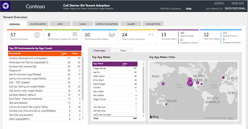
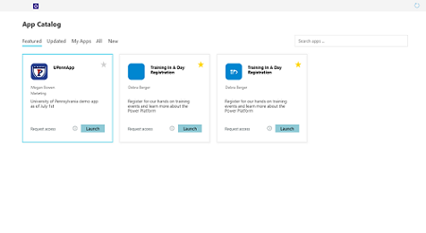
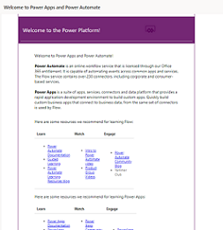

# Overview

A Center of Excellence (CoE) in an organization drives innovation and improvement and brings together like-minded people with similar business goals to share knowledge and success, while at the same time providing standards, consistency, and governance to the organization. 

The Power Platform Center of Excellence (CoE) starter kit is a collection of components and tools that are designed to help get started with developing a strategy for adopting and supporting the Power Platform, with a focus on Power Apps and Power Automate.

You can download the most updated assets from the [GitHub repository](https://aka.ms/CoEStarterKitRepo).

The kit does not represent the entire Center of Excellence, because
managing a CoE requires more than the tools alone; the Center of Excellence
also requires people, communication, defined requirements and processes. The
tools provided here are just a means to get to the end goal, but the Center of
Excellence itself must be thoughtfully designed by each organization based on
their needs and preferences - read more under [Why we built it?](motivation.md).

The kit provides some automation and tooling to help teams build monitoring and
automation necessary to support a CoE. The foundation of the kit is a Common
Data Service (CDS) data model and workflows to collect resource information
across the environments in the tenant. The kit includes multiple Power Apps and
Power BI analytics to view and interact with the data collected, as well as
flows to collect data across environments, and help with workflows for your
Compliance needs. The kit also provides several templates
and suggested patterns and practices for implementing CoE efforts.

## Disclaimer

While the underlying features and components used to build the kit (such as Common Data Service, Admin APIs, and Connectors) are fully supported, the kit itself represents sample implementations of these features that our customers and community can use and customize to implement admin and governance capabilities in their organization.

If you face issues with:

- Using the kit, report your issue here: [aka.ms/coe-starter-kit-issues](https://aka.ms/coe-starter-kit-issues). (Microsoft Support won't help you with issues related to this kit, but they do help with related underlying platform and feature issues.)
- The core features in Power Platform, use your standard channel to contact Microsoft Support.

## Purpose of this document

This CoE Starter Kit and this guidance are targeted toward the person or department responsible for setting up a Microsoft Power Platform CoE in their organization. The goal of this guidance is to help you understand what the motivation as well as responsibilities of a Center of Excellence are, as well as walk you through the pre-requisites, setup instructions and individual components of the CoE Starter Kit.

## How to get started

After you've installed the CoE Starter Kit solution (see [Set up the CoE Starter Kit](setup.md)), get familiar with the resources in your tenant:

:::row:::
   :::column span="":::
      
   :::column-end:::
   :::column span="":::
      
   :::column-end:::
      :::column span="":::
      
   :::column-end:::
:::row-end:::

1. Open the **Power BI Dashboard** and familiarize yourself with resources and makers already in your environments.
1. Plan your **Data Loss Prevention Policy Strategy** and use the DLP Editor (canvas app) to mitigate the risk of impacting apps when making changes to your policies.
1. **Identify orphaned apps** and assign them to new owners using the embedded app in the Power BI Dashboard.
1. Start planning your **governance strategy** by identifying your requirements on what makes a compliant app or maker, what information you will need per app or per maker, what happens to non-compliant apps and makers, how you will support your maker community in building compliant apps that follow best practices, what audits you want to run, and what actions you will drive based on those audits.
1. Embrace your maker community and develop a **nurture and adoption strategy**. Think about how to onboard new makers; organize internal events such as Show & Tell sessions, training workshops, and hackathons; and put together templates and best practices for your makers to use.

The above are just some samples of the components in the CoE Starter Kit. Explore the rest of the guidance here to see what is available in the kit.

## Further Resources

- [Power Apps admin documentation](<https://docs.microsoft.com/powerplatform/admin>)

- Find training resources, including guided learning and step-by-step guides [aka.ms/PowerPlatformLabs](https://aka.ms/powerplatformlabs)

- Read up on customer success stories and find resources relevant to your experience, technical background and skill level [aka.ms/PowerPlatformResources](https://aka.ms/powerplatformresources)

- Get started with the Microsoft Power Platform path on Microsoft Learn, a free online and interactive training platform [aka.ms/PowerUp](<https://aka.ms/PowerUp>)

- As an admin looking after the Center of Excellence, you should be familiar with the Administration and Governance of the Power Platform. We recommend the following whitepaper as a resource: [aka.ms/PowerAppsAdminWhitepaper](<https://aka.ms/powerappsadminwhitepaper>)
