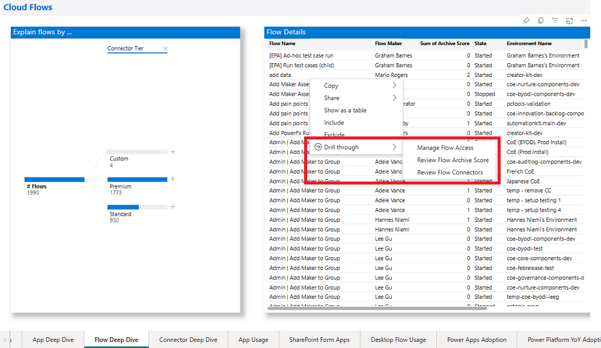

# Govern with the CoE Power BI dashboard

As an admin, you'll want to use the insights you gather to drive action, such as performing risk assessments and identifying critical, orphaned, or unused resources. The pages in the **Govern** section enable you to drive action directly from within the Power BI report through an embedded app. The app can be used to grant yourself or others ownership of a resource, archive it, or delete it.

## App license assessment

You can use the App license assessment page to view apps that use premium or standard features and drill down into connectors, departments or makers that are using premium connectors.

## App risk assessment

You can use the dashboard to identify overshared and overused resources, or resources that use specific connectors. Not only will you have visibility to those types of resources, you can grant yourself ownership to inspect the resource behavior and decide whether you need to take further action.

You can filter the **App Risk Assessment** page by:

- Environment

- Maker

- Is the app shared with the entire tenant?

- Number of shared (individual) users

- App type

- Connector

- Last launched date

In addition, you can sort the output data by the number of unique users or sessions, and the last launched date.

Some typical assessments an admin might perform are described in the following sections.

### Identify widely shared apps

Set **Shared with Everyone** to **True**, or select the **Number of Shared Users** on the slider on the rightmost filter pane to find widely shared apps.

- Widely shared resources (shared with the entire tenant or many individual users) might need a stronger support model, or you might need to review the number of people they're shared with.

- Often apps are shared with the entire organization because it's the easy option. If the app is for a single department, job role, or group of people, you can help the maker by setting up an Azure Active Directory (Azure AD) group to share their app. Otherwise, (a) Your entire org will see the app in the Power Apps mobile player or on make.powerapps.com (even if it's not relevant to them), and (b) If a user doesn't have access to the underlying data source, they'll receive an error message when they try to open the app, which can cause an increase in support tickets and confusion.

- Apps shared with a large number of individual users pose a different risk: if the app is for a specific job role or department, when a user leaves the department or job role they'll still see the app and be able to access the information. Therefore, we recommend sharing role-specific apps with an Azure AD group instead.

### Identify orphaned apps

Select **Blank** in the **Owner** drop-down list on the rightmost filter pane to find orphaned apps.

Orphaned apps, where the app owner has left the organization, will still work for users, but changes or bug fixes can only be made by an owner. It's important, therefore, to identify orphaned apps and find a new owner for them, or work on a retirement plan for those apps.

### Identify implicitly shared app connections

- Some connectors, like the SQL Connector used with SQL Server Authentication, are [shared implicitly with users](https://docs.microsoft.com/powerapps/maker/canvas-apps/connections-list\#sql-user-name-and-password-authentication). This means that as soon as the app is published, the connection is also published and available to your users. Your users can then also create apps by using any connection that uses SQL Server authentication that's shared with them.

- Identify apps that use the SQL Server Connector. Ensure that users are aware of the risks, and help them mitigate it by enabling Azure AD authentication for SQL Server.

Select **SQL Server** in the **Connector** drop-down on the rightmost filter pane to find apps that use the SQL Server Connector.

## Flows risk assessment

The **Flows Risk Assessment** page enables you to filter by:

- Environment

- Maker

- Connector (Microsoft 365 Users, Microsoft Dataverse)

- Operation (Parse JSON, HTTP)

- Action (Send Email, Delete SharePoint Items)

Some typical assessments an admin might perform are described in the following sections.

### Identify suspended flows

- Flows will be suspended due to using a combination of connectors that conflict with the company [data loss prevention (DLP) policies](https://docs.microsoft.com/power-automate/prevent-data-loss) or billing restrictions.

- Find those flows, and work with the maker to decide whether the flow is still needed, and if so, what policy violation they've encountered. Educate the maker or modify the DLP policy as needed.

Sort by **State** in the grid to look at flows that are **Suspended**.

### Identify orphaned flows

- Orphaned flows, where the flow owner has left the organization, will stop working. It's therefore important to identify orphaned flows, check whether they're still needed, and find a new owner.

- In the meantime, grant yourself ownership to see what the flow is doing.

Select **Blank** in the **Owner** drop-down list on the rightmost filter pane to find orphaned flows.

### Implicitly shared flow connections

- Some connectors, like the SQL Connector used with SQL Server Authentication are [shared implicitly with users](https://docs.microsoft.com/powerapps/maker/canvas-apps/connections-list\#sql-user-name-and-password-authentication). This means that as soon as the flow is shared, the connection is also published and available to your users. Your users can also create flows by using any connection that uses SQL Server authentication that's shared with them.

- Identify flows that use the SQL Server Connector. Ensure that users are aware of the risk, and help them mitigate it by enabling Azure AD authentication for SQL Server.

Select **SQL Server** in the **Connector** drop-down list on the rightmost filter pane to find flows that use the SQL Server Connector.

### Identify flow actions

- Specific actions or connectors might require you to gather additional information from the maker or educate them on usage. Some examples might be the Forward Email action of the Outlook connector or HTTP requests.

Select actions or connectors you're interested in from the **Connector** and **Action** lists on the rightmost side of this page to find flows that use those connectors or actions.

## UI flows risk assessment

The **UI flows Risk Assessment** page enables you to filter by:

- Environment

- Maker

- UI flow type

Some typical assessments an admin might perform are described in the following sections.

### Identify orphaned UI flows

- Orphaned UI flows, where the flow owner has left the organization, will stop working. It's therefore important to identify orphaned UI flows, check whether they're still needed, and find a new owner.

Select **Blank** in the **Owner** drop-down list on the rightmost filter pane to find orphaned flows.

## App and Flow Archive

Using the CoE dashboard, admins also have the ability to identify unused apps and flows by monitoring their archive score: in short, the higher the score, the more likely it is that you can safely archive the resource.

- The highest possible score for an app is 6. A score of 6 represents an app that hasn't been modified since it was created, is using a non-production word like  _test_ or _demo_ in the title, was created over three years ago, and was likely created from a template.

- The highest possible score for a flow is 7. A score of 7 represents a flow that hasn't been modified since it was created, is using a non-production word like _test_ or _demo_ in the title, was created over three years ago, was likely created from a template, is in a stopped state, and isn't complex (contains fewer than five actions).

- The highest possible score for a UI flow is 4. A score of 4 represents a UI flow that hasn't been modified since it was created, is using a non-production word like _test_ or _demo_ in the title, was created over a year ago, and was likely created from a template.

:::row:::
   :::column span="":::
      
   :::column-end:::
   :::column span="":::
      
   :::column-end:::
:::row-end:::

The **App Archive** page is sorted by highest archive score. You can use filters to target specific makers, date ranges, environments, departments, or connectors.

The **Archive Score** is the sum of multiple criteria:

- Has the app been modified since it was created? (+1)

- Does the app name use non-production words such as *test*, *demo*, or *sample*? (+1)

- When was the app last modified? (+3 for more than two years ago, +2 for more than one year ago, +1 for more than three months ago)

- Is this app likely a template, or are there multiple apps with the same name? (+1)

A [tooltip](https://docs.microsoft.com/power-bi/desktop-tooltips) shows additional details like the number of launches and last launched date.

Right-click to select a specific app, and then select **Drill through** >  **App Detail** to open the detail page for the selected app.

The **Flow Archive** page is sorted by highest archive score. You can target specific makers, date ranges, environments, departments, or connectors.

The **Archive Score** is the sum of multiple criteria:

- Has the flow been modified since it was created? (+1)

- Does the flow name use non-production words such as *test*, *demo*, or *sample*? (+1)

- When was the flow last modified? (+3 for more than two years ago, +2 for more than one year ago, +1 for more than three months ago)

- Is this flow likely a template, or are there multiple flows with the same name? (+1)

- What is the flow state? (+2 for stopped, +1 for suspended)

- How complex is the flow, based on the number of unique actions? (-1 if it's complex, because that indicates a user has spent a lot of time putting it together)

A tooltip shows additional details like the number of launches and last launched date, in addition to the scores for the above criteria.

The **UI flow Archive** page is sorted by highest archive score. You can target specific makers, date ranges, environments, departments, or connectors.

The **Archive Score** is the sum of multiple criteria:

- Has the flow been modified since it was created? (+1)

- Does the flow name use non-production words such as *test*, *demo*, or *sample*? (+1)

- When was the flow last modified? (+3 for more than two years ago, +2 for more than one year ago, +1 for more than three months ago)

- Is this flow likely a template, or are there multiple flows with the same name? (+1)

A tooltip shows additional details like the number of launches and last launched date, in addition to the scores for the above criteria.

By right-clicking to select a specific flow and going to **Drill through** > **Flow Detail**, you can open the detail page for the selected flow.

### App Detail

The **App Detail** page provides you with rich information about this resource, in addition to an embedded app that lets you immediately take action.

With the embedded app, you don't have to leave the Power BI dashboard to take action:

- You can grant yourself or others ownership. Note that this will trigger an email notification to the users you share the app with.

- You can delete the app.

- You can email the app owner.

- After you've granted yourself ownership, you can open the maker portal to view the version number.

### Flow Detail

The **Flow Detail** page provides you with richer information about this resource, in addition to an embedded app to immediately take action.

With the embedded app, you don't have to leave the Power BI dashboard to take action:

- You can grant yourself or others ownership. Note that this will trigger an email notification to the users you share the flow with.

- You can export the flow.

- You can delete the flow.

- You can email the flow maker.

- After you've granted yourself ownership, you can open the maker portal to view flow analytics and details.

### UI flow Detail

The **UI flow Detail** page provides you with richer information about the runs of this UI flow. You will be able to review the run history, identify anomalies in time it takes to complete a single run, and view error codes and messages if the UI flow has failed.

