# Monitor with the CoE Power BI dashboard

With the **Monitor** section of the Center of Excellence (CoE) Power BI dashboard, you can query basic inventory (environments, apps, flows, makers, connectors, and audit logs) to monitor usage across your entire tenant and within each environment. These reports also support drill-downs and filtering, for example by maker department/country/city, connector usage, or premium feature usage.

## Overview

The **Overview – Power Apps, Power Automate and Chatbots** page provides you with a tenant-wide overview of resources:

- Total number of environments (and environments created this month)

- Total number of environment makers

- Total number of custom connectors

- Total number of apps, app makers, and apps created this month

- Total number of flows, flow makers, and flows created this month
- Total number of bots, bot makers, and bots created this month

The visualizations highlight environments and makers that have the most resources, and show a map of where your makers are based.

:::row:::
   :::column span="":::
      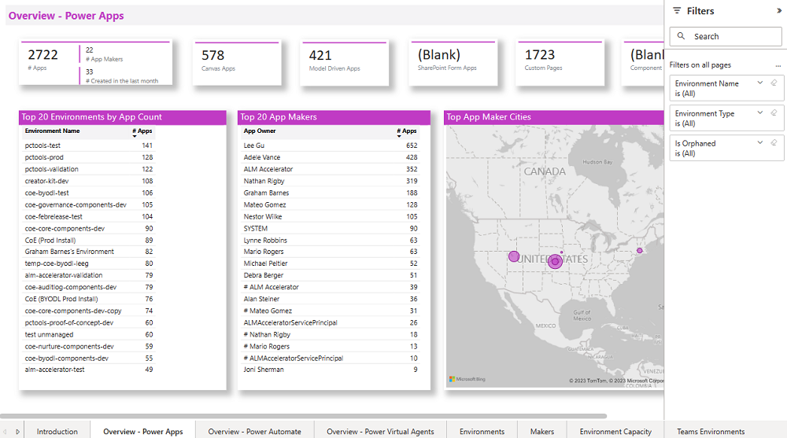
   :::column-end:::
   :::column span="":::
      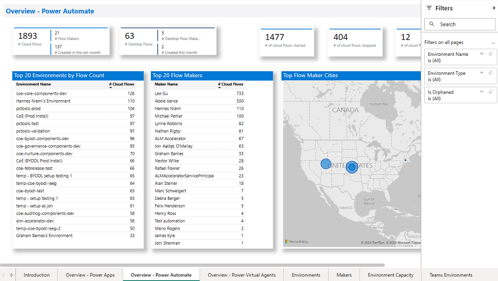
   :::column-end:::
   :::column span="":::
      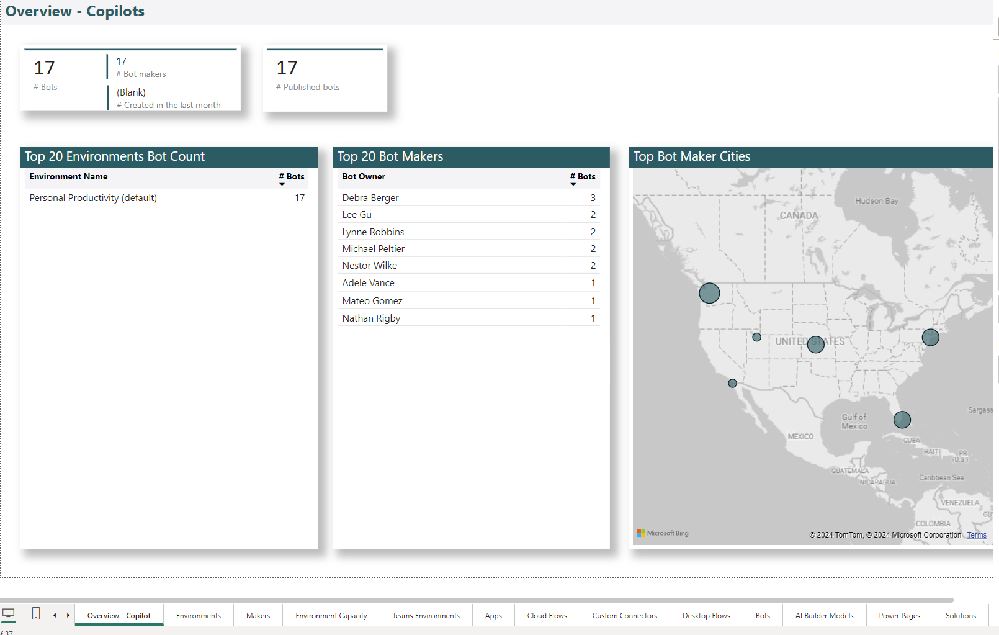
   :::column-end:::
:::row-end:::

## Environments

The **Environments** page shows you how many environments, environment makers, and Microsoft Dataverse instances you have.

The graphs visualize:

- The environment creation trend by environment type

- The number of resources per environment

- The number of environments by type

- Top environment creators

The filters allow you to drill down and analyze specific environment types, maker trends, and changes over time through a filter on the **Environment Created** date.

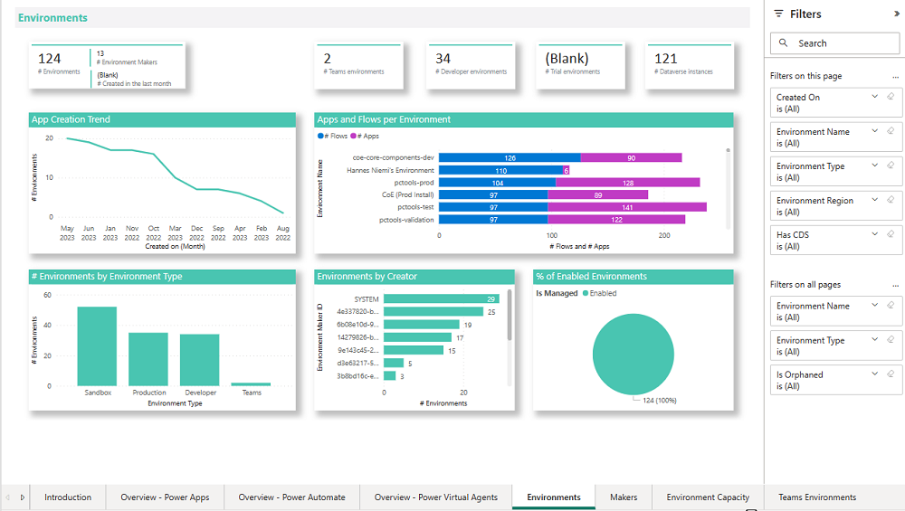

## Microsoft Teams Environments

The **Microsoft Teams Environments** page shows you the number of Microsoft Teams environments, environment makers, and resources in those environments you have

The graphs visualize:

- The environment creation trend

- The number of resources per environment

The tables of environments shows:

- Environment Name
- Link to the Environment in the Admin Center
- Link to the connected Microsoft Teams
- Owner
- Latest App launch in the environment
- Number of apps and flows
- A red icon if no apps or flows exist in the environments
- Created On date

The table of apps shows:

- App Name
- Owner
- Last Launched
- Created On date
- Modified On date

>[!NOTE]
> Last Launched information is only available if the [Audit Log](setup-auditlog.md) has been configured.
>
> Information about bots created via Power Virtual Agents in Microsoft Teams environments is currently not available in the CoE Starter Kit.

The filters allow you to filter by Owner as well as Created date.

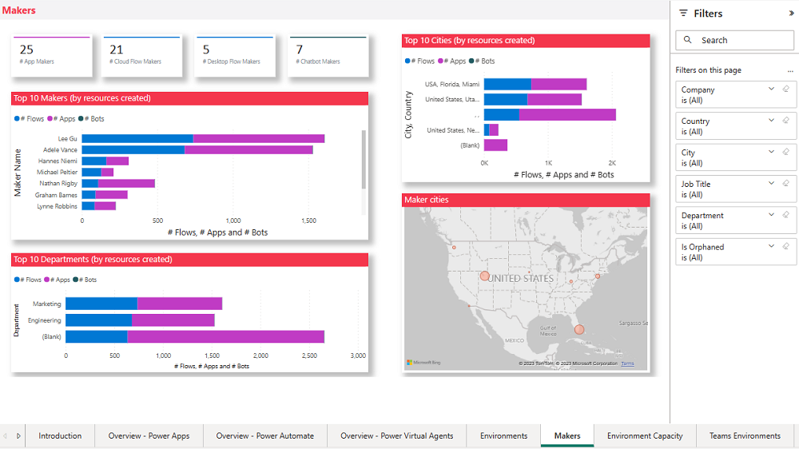

## Apps

The **Apps** page provides an overview of apps in your environment:

- Total number of apps

- Total number of apps created this month

- Total number of app makers

- Total number of canvas apps and model-driven apps

- The number of production apps (a *production app* has had 50 active sessions, or active sessions by five unique users, in a month)

On the graphs, you can see your app creation trend, your top active departments, and environments that have the largest number of apps. Use the list view of all apps to sort your apps by unique users, sessions, users and groups shared with, and last launched date.

Filters on this page can help you narrow down this view by app owner, app display name, environment, maker department, or connector used.

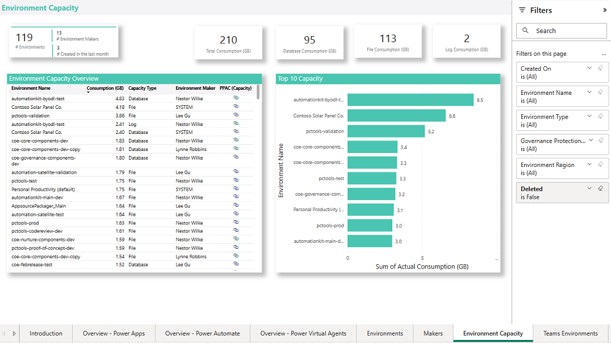

The hamburger menu on this page helps you navigate to other reports relevant to Power Apps.

### SharePoint integration

The **SharePoint integration** page provides an overview of apps created to customize SharePoint list or document library forms.

Navigate directly to the SharePoint site and view how many connectors are being used in a customized form.

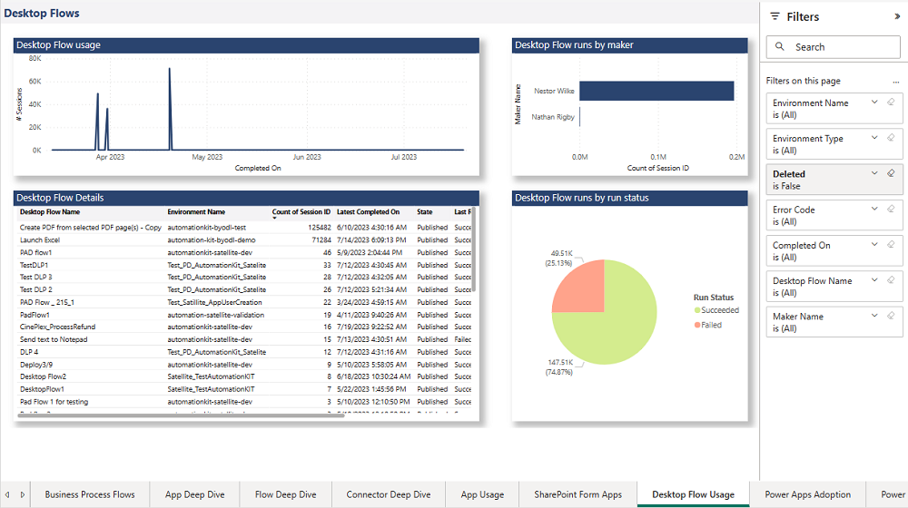

## Flows

The **Flows** page provides an overview of cloud-based API automation flows in your environment:

- Total number of flows

- Total number of flows created this month

- Total number of flow makers

- Total number of suspended and stopped flows

Through visuals, you can see your flow creation trend, your top active departments, and top environments. Use the list view of all flows to sort your flows by number of actions in a flow, flow creator, and flow state.

Filters on this page can help you narrow down this view by flow owner, flow display name, environment, maker department, or connector used.

## Custom Connectors

The **Custom Connectors** page helps you understand what [custom connectors](https://docs.microsoft.com/connectors/custom-connectors/) you have, what endpoints they're connecting to, and which resources are using the custom connector.

Next to the total number of custom connectors and number of test connectors (those that have the word **Test** in the display name), you'll also see a connector creation trend, top connector makers, and the link between a connector and its consuming flow or app.

Filters help you narrow down the view by connector creator, environment, or created date.

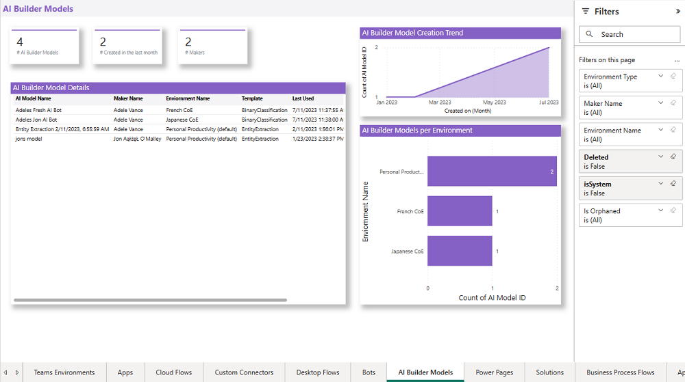

## Connections

The **Connections** page shows which resources and makers are using which connectors and&mdash;at a high level&mdash;which resources and makers are using premium features.

The filters on this page are:

- Connector tier (premium or standard)

- Connector (Microsoft 365 Users, Dataverse, Azure AD)

The visuals then show you a list of all apps, flows, and makers using the tier or connector specified, in addition to the number of connections for the filters specified.

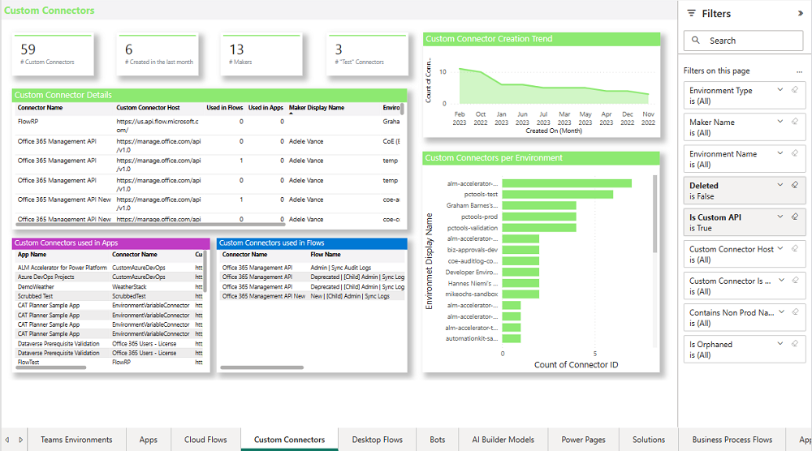

## Virtual Agents

The **Virtual Agents** page provides an overview of bots in your environment:

- Total number of bots

- Total number of bots created this month

- Total number of bot makers

- Total number of published bots

Through visuals, you can see your bot creation trend, your top active departments, and top environments. Use the list view of all flows to sort your flows by number of components and flows in a bot, bot maker, and bot state. You can also view last launched date of the bot, in addition to the total number of sessions.

Filters on this page can help you narrow down this view by environment and by maker.

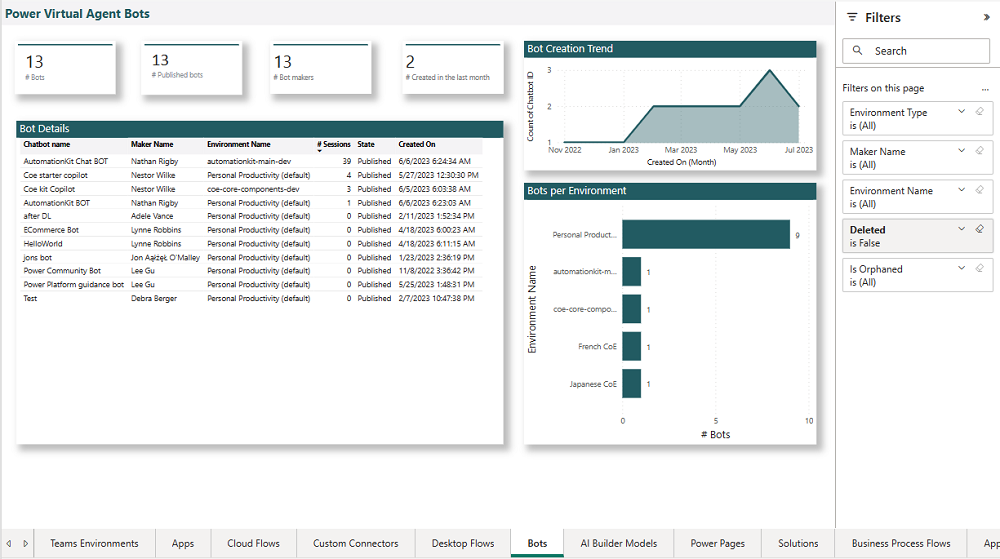

## UI flows

The **UI flows** page provides an overview of UI-based robotic process automation (RPA) flows in your environment:

- Total number of UI flows

- Total number of UI flows created this month

- Total number of UI flow makers

Through visuals, you can see your flow creation trend, your top active departments, and top environments. Use the list view of all flows to sort your flows by type, and flow state.

Filters on this page can help you narrow down this view by flow owner, flow display name, environment, maker department, or UI flow type.

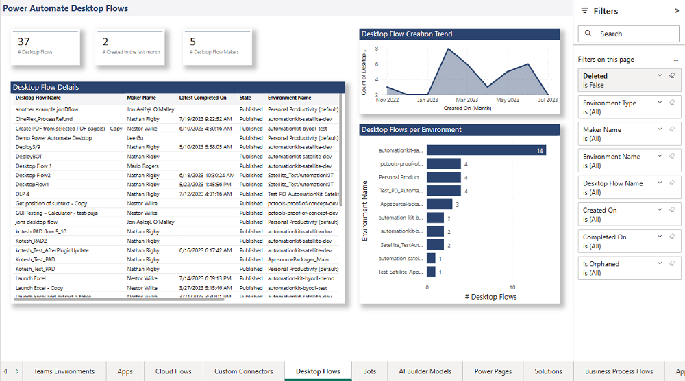

### UI flows usage

The **UI flow usage** page provides an overview of UI=based RPA flow runs in your environment:

- Number of runs per date and UI flow type
- Total number of runs
- Last run date and status

Filters on this page can help you narrow down this view by UI flow type, run status, maker, and environment.

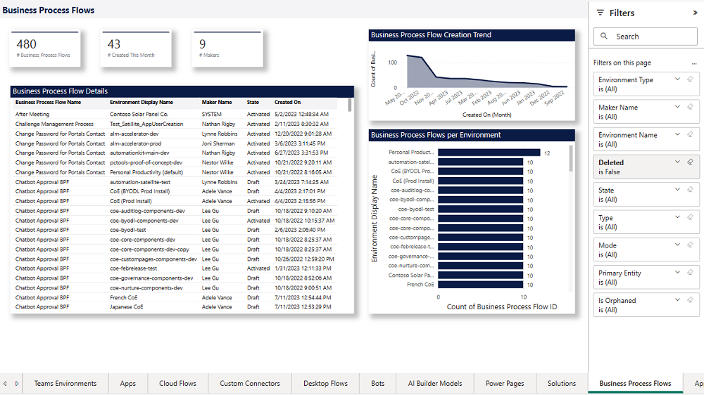

### UI flows errors

The **UI flow errors** page provides an overview of UI-based RPA flow runs that have failed in your environment:

- UI flows run status
- Error type details
- Total number of runs, number of failed runs, and number of successful runs in addition to last run date and status

Filters on this page can help you narrow down this view by UI flow type, run status, maker, and environment.

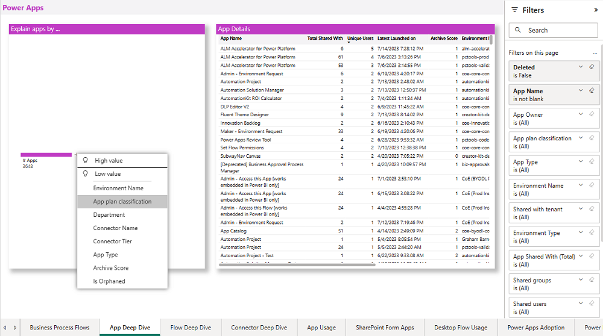
