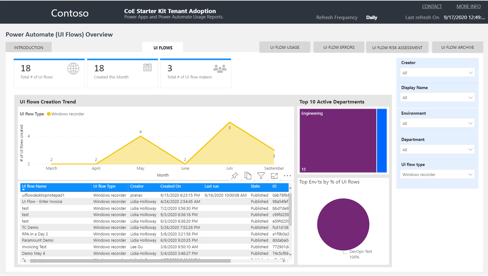
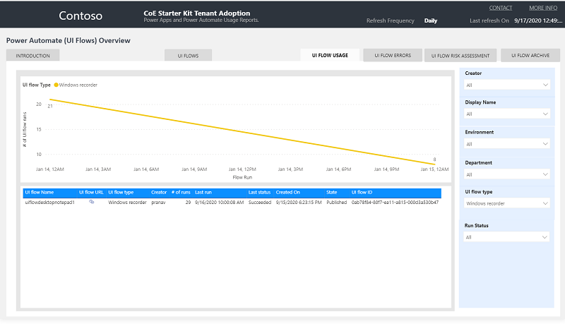
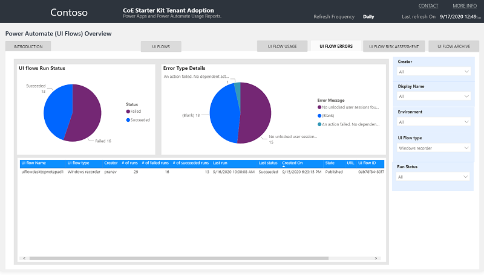

# Monitor with the CoE Power BI dashboard

The **Monitor** section of the Center of Excellence (CoE) Power BI dashboard gives you the ability to query basic inventory (environments, apps, flows, makers, connectors, and audit logs) to monitor usage across your entire tenant and within each environment. These reports also support drill-downs and filtering, for example by maker department/country/city, connector usage, or premium feature usage.

## Overview – Power Apps and Power Automate

The **Overview – Power Apps and Power Automate** page provides you with a tenant-wide overview of resources:

- Total Number of Environments (and Environments created this month)

- Total Number of Environment Makers

- Total Number of Custom Connectors

- Total Number of Apps, App Makers and Apps created this month

- Total Number of Flows, Flow Makers and Flows created this month

The visualizations highlight environments and makers that have the most resources, and show a map of where your makers are based.

:::row:::
   :::column span="":::
      
   :::column-end:::
   :::column span="":::
      
   :::column-end:::
:::row-end:::

## Environments

The **Environments** page shows you how many environments, environment makers, and Common Data Service instances you have.

The graphs visualize:

- Environment creation trend by environment type

- Number of resources per environment

- Number of environments by type

- Top environment creators

The filters allow you to drill down and analyze specific environment types, maker trends, and changes over time through a filter on the Environment Created date.

## Apps

The **Apps** page provides an overview of apps in your environment:

- Total Number of Apps

- Total Number of Apps created this month

- Total Number of App Makers

- Total Number of Canvas Apps and Model Driven Apps

- Number of Production Apps (The definition of a Production App is 50 active sessions or active sessions by five unique users for the same app in a month.)

On the graphs, you'll be able to see your app creation trend, your top active departments, and environments that have the largest number of apps. A list view of all apps enables you to sort your apps by unique users, sessions, users and groups shared with, and last launched date.

Filters on this page can help you narrow down this view by app owner, app display name, environment, maker department, or connector used.

## Flows

The **Flows** page provides an overview of cloud based API automation flows in your environment:

- Total Number of Flows

- Total Number of Flows created this month

- Total Number of Flow Makers

- Total Number of Suspended and Stopped Flows

Through visuals, you'll be able to see your flow creation trend, your top active departments, and top environments. A list view of all flows enables you to sort your flows by number of actions in a flow, flow creator, and flow state.

Filters on this page can help you narrow down this view by flow owner, flow display name, environment, maker department, or connector used.

## Custom Connectors

The **Custom Connectors** page helps you understand what [custom connectors](https://docs.microsoft.com/connectors/custom-connectors/) you have, what endpoints they're connecting to, and which resources are using the custom connector.

Next to the total number of custom connectors and number of test connectors (those that have the word **Test** in the display name), you'll also see a connector creation trend, top connector makers, and the link between a connector
and its consuming flow or app.

Filters help you narrow down the view by connector creator, environment, or created date.

## Connections

The **Connections** page shows which resources and makers are using which connectors and&mdash;at a high level&mdash;which resources and makers are using premium features.

The filters on this page are:

- Connector tier (premium or standard)

- Connector (Microsoft 365 Users, Common Data Service, Azure AD)

The visuals then show you a list of all apps, flows, and makers using the tier or connector specified, in addition to the number of connections for the filters specified.

## Virtual Agents

The **Virtual Agents** page provides an overview of bots in your environment:

- Total Number of Bots

- Total Number of Bots created this month

- Total Number of Bot Makers

- Total Number of Published Bots

Through visuals, you'll be able to see your bot creation trend, your top active departments, and top environments. A list view of all flows enables you to sort your flows by number of components and flows in a bot, bot maker, and bot state. You can also view last launched date of the bot, as well as total number of sessions.

Filters on this page can help you narrow down this view by environment and by maker.

## UI flows

The **UI flows** page provides an overview of UI based RPA automation flows in your environment:

- Total Number of UI flows

- Total Number of UI flows created this month

- Total Number of UI flow Makers

Through visuals, you'll be able to see your flow creation trend, your top active departments, and top environments. A list view of all flows enables you to sort your flows by type, and flow state.

Filters on this page can help you narrow down this view by flow owner, flow display name, environment, maker department, or UI flow type.

### UI flows usage

The **UI flow usage** page provides an overview of UI based RPA automation flow runs in your environment:

- Number of runs per date and UI flow type
- Total # of runs
- Last run date and status

Filters on this page can help you narrow down this view by UI flow type, Run Status, maker, and environment.

### UI flows errors

The **UI flow errors** page provides an overview of UI based RPA automation flow runs that have failed in your environment:

- UI flows Run Status
- Error Type Details
- Total # of runs, # failed runs, # successful runs as well as Last run and status

Filters on this page can help you narrow down this view by UI flow type, Run Status, maker, and environment.

