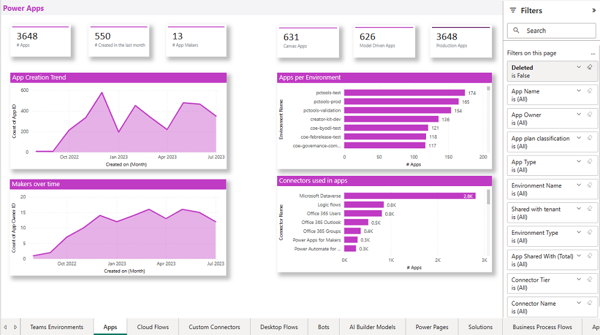
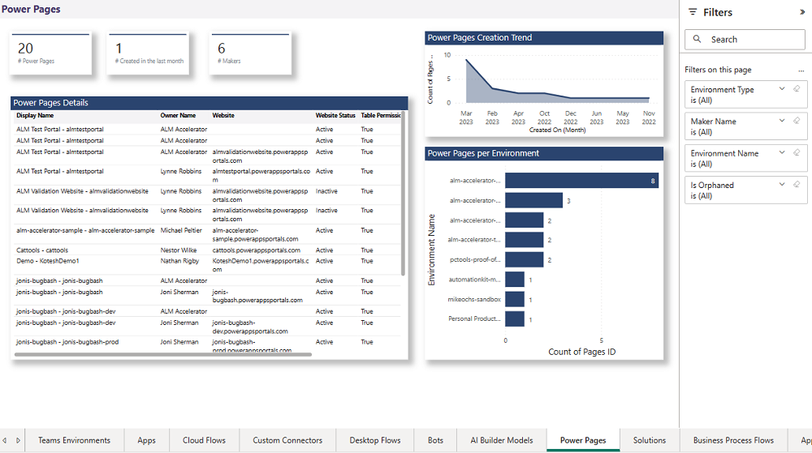

# Monitor with the CoE Power BI dashboard

With the **Monitor** section of the Center of Excellence (CoE) Power BI dashboard, you can query basic inventory (environments, apps, flows, makers, connectors, and audit logs) to monitor usage across your entire tenant and within each environment. These reports also support drill-downs and filtering, for example by maker department/country/city, connector usage, or premium feature usage.

## Overview

The **Overview – Power Apps, Power Automate and Chatbots** page provides you with a tenant-wide overview of resources:

- Total number of environments (and environments created this month)
- Total number of environment makers
- Total number of custom connectors
- Total number of apps, app makers, and apps created this month
- Total number of flows, flow makers, and flows created this month
- Total number of bots, bot makers, and bots created this month

The visualizations highlight environments and makers that have the most resources, and show a map of where your makers are based.

:::row:::
   :::column span="":::
      
   :::column-end:::
   :::column span="":::
      
   :::column-end:::
   :::column span="":::
      
   :::column-end:::
:::row-end:::

## Environments

The **Environments** page shows you how many environments, environment makers, and Microsoft Dataverse instances you have.

The graphs visualize:

- The environment creation trend by date
- The number of resources per environment
- The number of environments by type
- Top environment creators
- The number of Managed Environments

The filters allow you to drill down and analyze specific environment types, maker trends, and changes over time.

## Teams Environments

The **Teams Environments** page shows you the number of Microsoft Teams environments, environment makers, and resources in those environments.

The graphs visualize:

- The environment creation trend
- The number of resources per environment

The tables of environments shows:

- Environment Name
- Link to the Environment in the Admin Center
- Link to the connected Microsoft Teams
- Owner
- Latest App launch in the environment
- Number of apps and flows
- A red icon if no apps or flows exist in the environments
- Created On date

The table of apps shows:

- App name
- Owner
- Last launched
- Created on date
- Modified on date

>[!NOTE]
> **Last launched** information is only available if the [Audit Log](setup-auditlog-http.md) has been configured.
>
> Information about bots created via Microsoft Copilot Studio in Microsoft Teams environments is currently not available in the CoE Starter Kit.

The filters allow you to filter by Owner as well as Created date.

## Apps

The **Apps** page provides an overview of apps in your environment:

- Total number of apps
- Total number of apps created this month
- Total number of app makers
- Total number of canvas apps and model-driven apps
- The number of production apps (a *production app* has had 50 active sessions, or active sessions by five unique users, in a month)

On the graphs, you can see your app creation trend, your makers over time, your top environments, and top connectors used in apps. 

Filters on this page can help you narrow down this view by app owner, app plan classification, app type, environment name and type, or connector used.

The hamburger menu on this page helps you navigate to other reports relevant to Power Apps.

### SharePoint form apps

The **SharePoint Form Apps** page provides an overview of apps created to customize SharePoint lists or document library forms.

Navigate directly to the SharePoint site and view how many connectors are being used in a customized form.

## Cloud flows

The **Cloud flows** page provides an overview of cloud-based API automation flows in your environment:

- Total number of flows
- Total number of flows created this month
- Total number of flow makers
- Total number of started, suspended and stopped flows

Through visuals, you can see your flow creation trend, your top active departments, and top environments and top connectors used in flows.

Filters on this page can help you narrow down this view by flow owner, flow state, flow display name, environment, maker department, or connector used.

## Custom connectors

The **Custom Connectors** page helps you understand what [custom connectors](/connectors/custom-connectors/) you have, what endpoints they're connecting to, and which resources are using the custom connector.

Next to the total number of custom connectors and number of test connectors (those that have the word **Test** in the display name), you'll also see a connector creation trend, which environments have the most custom connectors, and which flows and apps are using custom connectors.

Filters help you narrow down the view by connector creator, environment, or created date.

## Desktop flows

The **Desktop flows** page provides an overview of UI-based robotic process automation (RPA) flows in your environment:

- Total number of desktop flows
- Total number of desktop flows created this month
- Total number of desktop flow makers

Through visuals, you can see your flow creation trend and top environments with desktop flows. Use the list view of all flows to sort your flows by type and flow state.

Filters on this page can help you narrow down this view by flow owner, flow display name, environment, maker department, or desktop flow type.

## Bots

The **Bots** page provides an overview of Microsoft Copilot Studio bots in your environment:

- Total number of bots
- Total number of bots created this month
- Total number of bot makers
- Total number of published bots

Through visuals, you can see your bot creation trend and top environments with bots. Use the list view of all bots to sort your bots by bot maker or bot state.

Filters on this page can help you narrow down this view by environment and by maker.

## AI Builder models

The **AI Builder Models** page provides an overview of AI Builder Models in your environment:

- Total number of AI Builder models
- Total number of AI Builder models created this month
- Total number of AI Builder models makers

Through visuals, you can see your AI Builder model creation trend and top environments with AI Builder models. Use the list view of all AI Builder models to sort your AI Builder models by maker or template.

Filters on this page can help you narrow down this view by environment and by maker.

## Power Pages

The **Power Pages** page provides an overview of  Power Pages in your environment:

- Total number of Power Pages
- Total number of Power Pages created this month
- Total number of Power Pages makers

Through visuals, you can see your Power Pages creation trend and top environments with Power Pages. Use the list view of all Power Pages to sort your Power Pages by maker, website, website status, and table permission.

Filters on this page can help you narrow down this view by environment and by maker.

## Solutions

The **Solutions** page provides an overview of Power Platform solutions in your environment:

- Total number of solutions
- Total number of solutions created this month
- Total number of solution makers

Through visuals, you can see your solution creation trend and top environments with solutions. Use the list view of all solutions to sort your solutions by publisher, maker, or environment.

Filters on this page can help you narrow down this view by environment, publisher, and maker.

## Business process flows

The **Business Process Flows** page provides an overview of Business process flows in your environment:

- Total number of business process flows
- Total number of business process flows created this month
- Total number of business process flows makers

Through visuals, you can see your business process flow creation trend and top environments with business process flows. Use the list view of all business process flows to sort by state, maker, and environment.

Filters on this page can help you narrow down this view by environment, state, and maker.

[!INCLUDE[footer-include](../../includes/footer-banner.md)]
