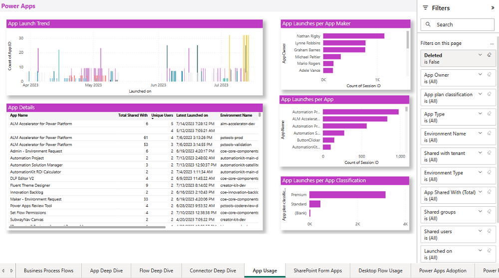
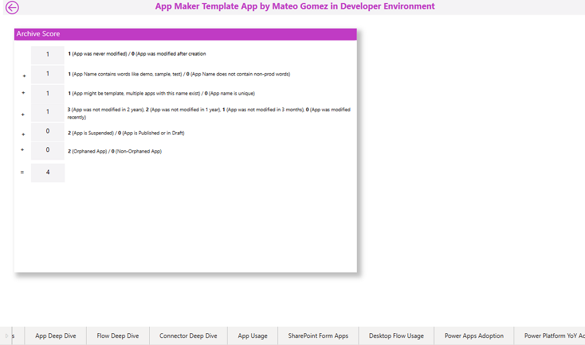
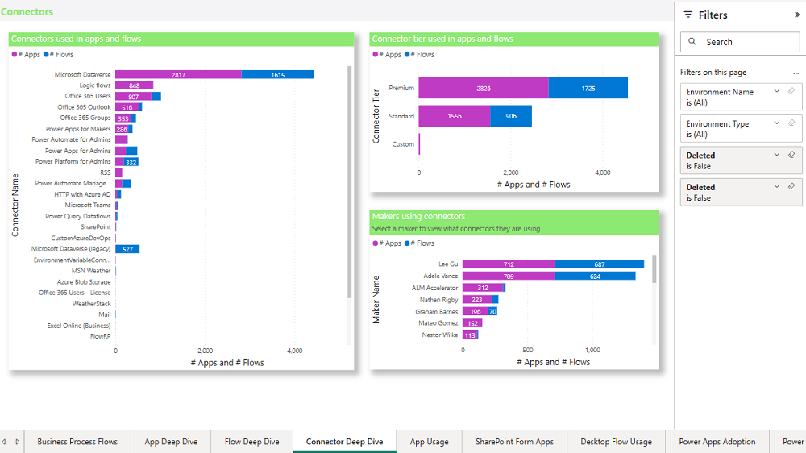
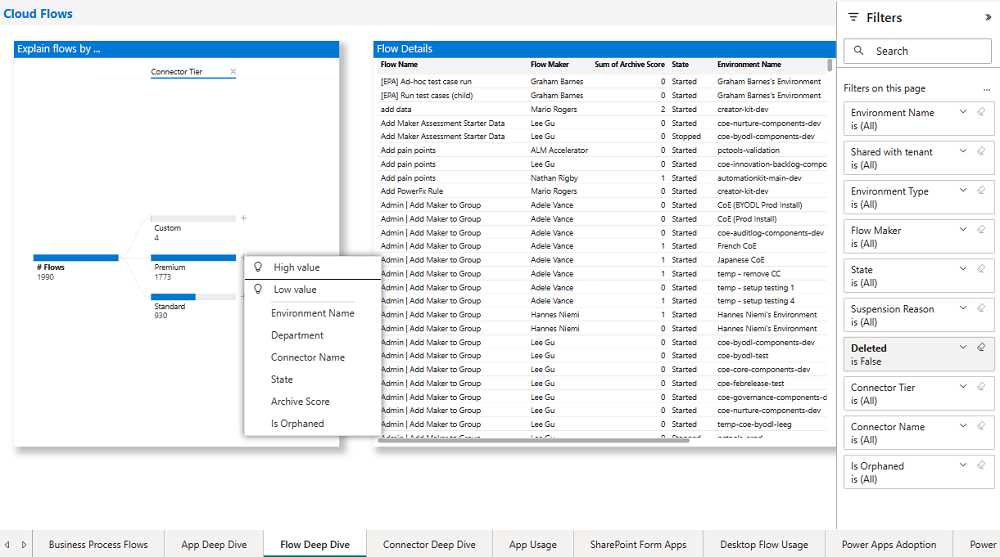

# Nurture in the CoE Power BI dashboard

As you establish your Center of Excellence (CoE), a significant part of your activity will be nurturing your maker community, enabling them to follow best practices and working together with them to identify whether they or their resources need additional support.

The **Nurture** section helps you find your "star" app and flow makers and see what connectors they're using, where they're based (department/city/country), and how they're adopting Microsoft Power Platform.

## Makers

The **Maker** page, at one glance, helps you see your top makers, how many apps and flows those makers have created, and your top active departments.

## App Gurus

The **App Gurus** page gives you an overview of which makers are using which connectors. Makers with a high usage of different connectors are likely more advanced and might turn into your champions; makers who use only Office connectors are likely at the beginning of their journey and might need a helping hand.

## Flow Gurus

The **Flow Gurus** page gives you an overview of how many actions and connectors your makers are using for each flow. Makers with complex flows that have multiple actions or use multiple connectors are likely more advanced and might turn into your champions; makers who use very few connectors or mostly template flows are likely at the beginning of their journey and might need a helping hand.

## App Shares

The **App Shares** page shows your top apps (by the number of users it's shared with and the number of app launches) and your users who most frequently launch apps.

## App Usage

The **App Usage** page shows your top apps by number of app launches and your users who most frequently launch apps.

