# Gain deep insights into your Power Platform adoption with the CoE Starter Kit

As a Power Platform Admin, you want visibility into how your organization is using Power Apps and Power Automate. Insights into your adoption will help you govern and secure the platform, identify patterns and enable you to nurture your makers to accelerate adoption.

Out of the box, the [Admin Analytics](https://docs.microsoft.com/power-platform/admin/analytics-powerapps) that
are part of the [Power Platform Admin Center](https://aka.ms/ppac) provide you with environment-level analytics based on your usage for the past 28 days. As your adoption grows, you might need customized dashboards that show you more insights and allow you to apply richer filters to your data.

The Power BI Dashboard of the CoE Starter Kit provides a holistic view with visualizations and insights into resources in your tenant: Environments, Power Apps apps, Power Automate flows, Connectors, Connection References, Makers and Audit Logs.
Telemetry from the Audit Log is stored from the moment you set up the CoE Starter Kit, so over time you can look back and identify trends for longer than 28 days.

The dashboard provides analytics and data for the following areas:

- **Monitor** (oversight of tenant resources)

- **Govern** (drive actions through insights)

- **Nurture** (learn about your community)

Get ready to use the dashboard by installing the [Core Components of the CoE Starter Kit](setup-core-components.md) and configuring the Power BI dashboard following the [Setup Instructions](setup-powerbi.md).

The first page of the dashboard provides an overview of all areas and their purpose, as well as buttons to navigate to the different sections and pages.

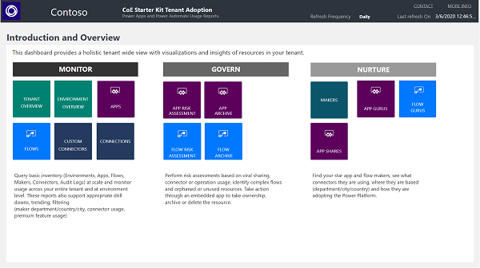

Within each section, you'll find [bookmarks](https://docs.microsoft.com/power-bi/desktop-bookmarks)) at the top of each page to help you navigate to the information you are looking for.

## Monitor

The Monitor section gives you the ability to query basic inventory (Environments, Apps, Flows, Makers, Connectors, Audit Logs) to monitor usage across your entire tenant and within each environment. These reports also support drill downs and filtering for example by maker department/country/city, connector usage, and premium feature usage.

### Overview – Power Apps and Power Automate

The **Overview – Power Apps and Power Automate** page provides you with a
tenant-wide overview of resources:

- Total Number of Environments (and Environments created this month)

- Total Number of Environment Makers

- Total Number of Custom Connectors

- Total Number of Apps, App Makers and Apps created this month

- Total Number of Flows, Flow Makers and Flows created this month

The visualizations highlight environments and makers with the most resources and show a map of where your makers are based.

### Environments

The **Environments** page shows you how many environments, environment makers
and CDS instances you have.

The graphs visualize

- Environment creation trend by environment type

- Number of resources per environment

- Number of environments by type

- Top environment creators

The filters allow you to drill down and analyse specific environment types and maker trends as well as changes over time through a filter on Environment Created date.

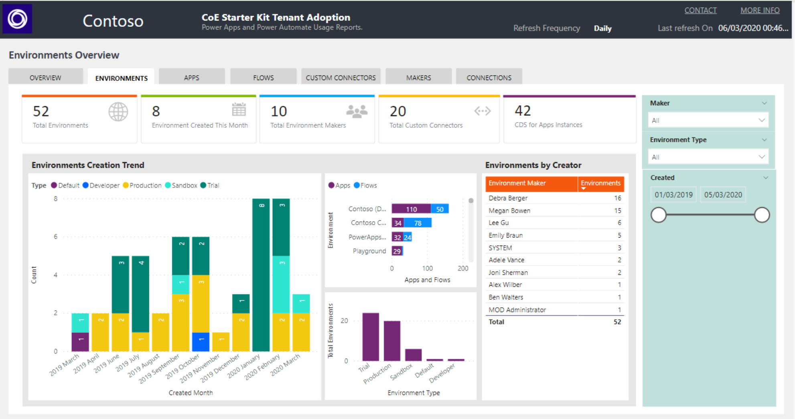

### Apps

The **Apps** page provides an overview of apps in your environment:

- Total Number of Apps

- Total Number of Apps created this month

- Total Number of App Makers

- Total Number of Canvas Apps and Model Driven Apps

- Number of Production Apps (The definition of a Production App is 50 active sessions or active sessions by 5 unique users for the same app in a month.)

On the graphs, you will be able to see your app creation trend, your top active departments, and environments with the highest number of apps. A list view of all apps enables you to sort your apps by unique users, sessions, users and
groups shared with, and last launched date.

Filters on this page can help you narrow down this view by app owner, app display name, environment, maker department and connector used.

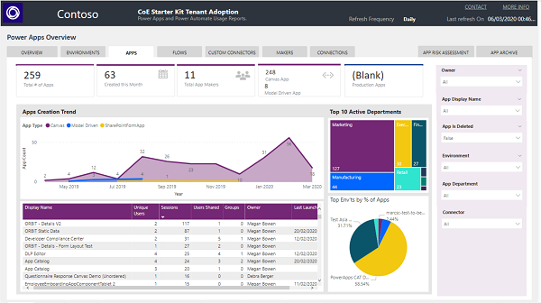

### Flows

The **Flows** page provides an overview of apps in your environment:

- Total Number of flows

- Total Number of flows created this month

- Total Number of flow Makers

- Total Number of Suspended and Stopped flows

Through visuals, you will be able to see your flow creation trend, your top active departments and top environments. A list view of all flows enables you to sort your flows by number of actions in a flow, creator and flow state.

Filters on this page can help you narrow down this view by flow owner, flow display name, environment, maker department and connector used.

### Custom Connector

The **Custom Connector** page helps you understand what [custom connectors](https://docs.microsoft.com/connectors/custom-connectors/) you have, what endpoint they are connecting to and which resources are using the custom
connector.

Next to the total number of custom connectors and number of test connectors (those that have the word Test in the display name), you will also see a connector creation trend, top connector makers and the link between a connector
and its consuming flow or app.

Filters help you narrow down the view by connector creator, environment and created date.

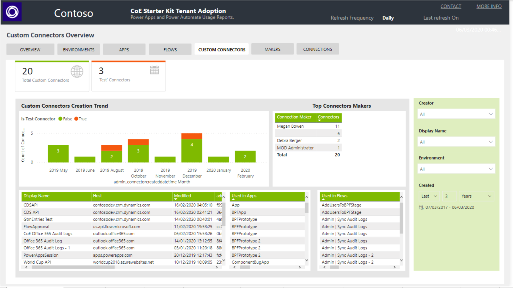

### Connections

The **Connections** page shows what resources and makers are using which connectors, and at a high-level which resources and makers are using premium features.

The filters on this page are

- Connector tier (premium or standard)

- Connector (Office 365 Users, Common Data Service, Azure AD)

The visuals then show you a full list of all apps, flows and makers using the tier or connector specified – as well as the number of connections for the criteria specified.

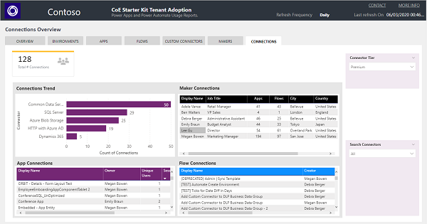

## Govern

As an Admin you will also want to use the insights you gather to drive action – such as performing risk assessments and identifying critical, orphaned or unused
resources. The pages in the Govern section enable you to drive action directly from within the Power BI report through an embedded Power Apps app. The app can
be used to grant yourself or others ownership or a resource, archive it, or delete it.

### App and Flow Risk Assessment

Added in March 2020 is the ability for admins to identify overshared and overused resources, or resources using specific connectors. Not only will the admin have visibility of those types of resources, they can also grant themselves ownership to inspect the resource behavior and decide if further action needs to be taken.

The **App Risk Assessment** page enables you to filter by:

- Environment

- Maker

- Is the app shared with the entire tenant?

- Number of Shared (Individual) Users

- App Type

- Connector

- Last Launched Date

You can additionally sort the output data by number of unique users or sessions and last launched date.

Some typical assessments an admin would perform would be:

#### Identify overshared apps

- Overshared resources (shared with the entire tenant or many individual users) might need a stronger support model through a dedicated environment.
- Often apps are shared with the entire organization because it's the easy option, if the app is for a dedicated department, job role or group of people you can help the maker by setting up an AD group to share their app with.    Otherwise a) your entire org will see the app even if it's not relevant to them in the Power Apps mobile player or on make.powerapps.com and b) if the user does not have access to the underlying data source but to the app, they  will receive an error message upon trying to launch the app which can cause  an increase in support tickets and confusion

- Apps shared with a large number of individual users pose a different risk – if the app is for a specific job role or department, should an end user more departments or job roles they would still see the app if it is shared with    them and would be able to access the information. Therefore, it would also  be recommended to share the app with an AD group instead.

Set *Shared with Everyone* to true or Select the Number of Shared Users on  the slider in the right-hand filter section of this page to find overshared  apps.

#### Identify orphaned apps

- Orphaned apps, where the app owner has left the org, will still work for end users but changes or bug fixes can only be made by an owner. It is therefore important to identify orphaned apps and find a new owner for them, or work  on a retirement plan for those apps.

Select *Blank* in the Owner dropdown in the right-hand filter section of this page to find orphaned apps.

#### Implicitly shared app connections

- Some connectors, like the SQL Connector used with SQL Server Authentication are [shared implicitly with users](<https://docs.microsoft.com/powerapps/maker/canvas-apps/connections-list\#sql-user-name-and-password-authentication>). This means, once the application is published, the connection is also published and available to your users. Your end users can also create applications using any connection using SQL Server authentication that is shared with them.

- Identify apps using the SQL Server Connector, ensure the end users is aware of the risk and help the mitigate it by enabling AAD Authentication for SQL

Select *SQL Server* in the Connector dropdown in the right-hand filter section of this page to find apps using the SQL Server Connector.

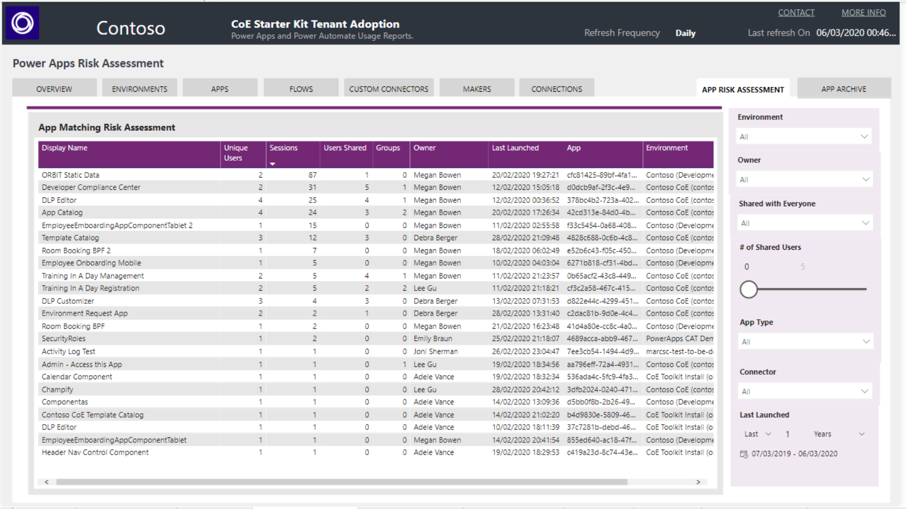

### Flow Risk Assessment

The **Flow Risk Assessment** page enables you to filter by:

- Evironment

- Maker

- Connector (Office 365 Users, Common Data Service)

- Operation (Parse JSON, HTTP)

- Action (Send Email, Delete SharePoint Items)

Some typical assessments an admin would perform would be:

#### Identify suspended flows

- Flows will be suspended due to using a combination of connectors that conflict with the company [data loss prevention policies](https://docs.microsoft.com/power-automate/prevent-data-loss) or billing restrictions

- Find those flows and work with the maker to identify if the flow is still needed, and if so, what policy violation they've encountered. Educate the maker or modify the DLP policy as needed!

Sort by *State* in the grid to look at flows that are Suspended.

#### Identify orphaned flows

- Orphaned flows, where the flow owner has left the org, will stop working. It is therefore important to identify orphaned flows, check if they are still  needed and find a new owner

- In the meantime, grant yourself ownership to see what the flow is doing.

Select *Blank* in the Owner dropdown in the right-hand filter section of this page to find orphaned flows.

#### Implicitly shared flow connections

- Some connectors, like the SQL Connector used with SQL Server Authentication are [shared implicitly with users]  (<https://docs.microsoft.com/powerapps/maker/canvas-apps/connections-list\#sql-user-name-and-password-authentication>). This means, once the flow is shared, the connection is also published and  available to your users. Your end users can also create applications using any connection using SQL Server authentication that is shared with them.

- Identify flows using the SQL Server Connector, ensure the end users is aware of the risk and help the mitigate it by enabling AAD Authentication for SQL

Select *SQL Server* in the Connector dropdown in the right-hand filter section of this page to find flows using the SQL Server Connector.

### Identify Flow Actions

- Specific actions or connectors might require you to gather additional information from the maker or educate them on the usage. An example might be the Forward Email action of the Office 365 Outlook connector, or HTTP  Requests.

Select **actions** or **connectors** you are interested in in the Connector and Action lists in the right-hand filter section of this page to find flows using those
connectors or actions.

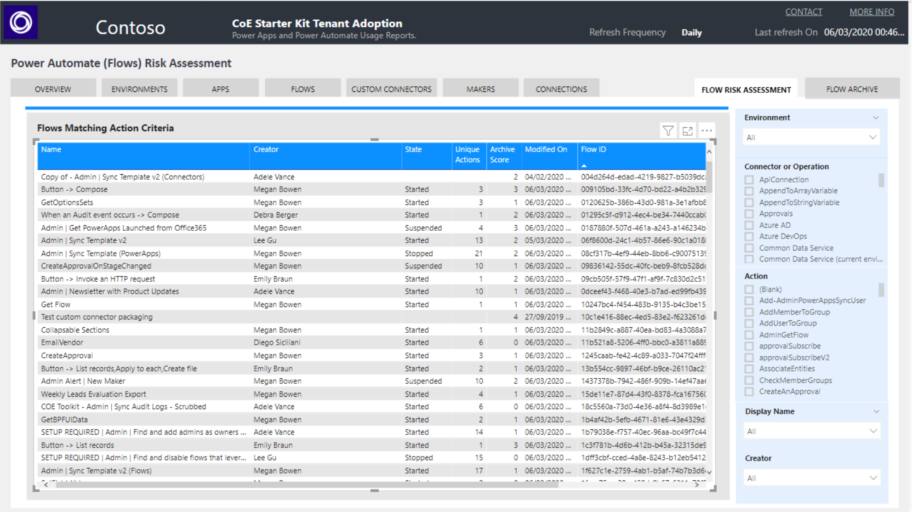

### App and Flow Archive

Added in March 2020 is the ability for admins to identify unused apps and flow - admins want to act by deleting or archiving those resources to avoid sprawl. One of the reasons is that unused resources that are still shared with users would still be accessible through the maker portal or mobile apps and lead to an untidy and unorganized user experience.

To support this, we have introduced an Archive Score – in short, the higher the score the more likely you can archive the resource.

- The highest possible score for an **app** is 6 – a score of 6 would represent an app that has not been modified since it was created, that is using a non-production word like test or demo in the title, that has been created over three years ago and has likely been created from a template.

- The highest possible score for a **flow** is 7 – a score of 7 would represent a flow that has not been modified since it was created, that is  using a non-production word like test or demo in the title, that has been created over three years ago and has likely been created from a template,that is in stopped state and not complex (contains less than five actions)

The **App Archive** page is sorted by highest archive score, and through filters allows you to target specific makers, date ranges, environments, departments or
connectors.

The **Archive Score** is a sum of multiple criteria:

- Has the app been modified since it was created (+1)

- Is the app name using non-production words such as *test,demo, sample*? (+1)

- When was the app last modified? (+3 for more than 2 years ago, +2 for more than 1 year ago, +1 for more than 3 months ago)

- Is this app likely a template or are there multiple apps with the same name? (+1)

A [tooltip](https://docs.microsoft.com/power-bi/desktop-tooltips) (pops up when you hover over a line item) shows additional details like number of launches and last launched date.

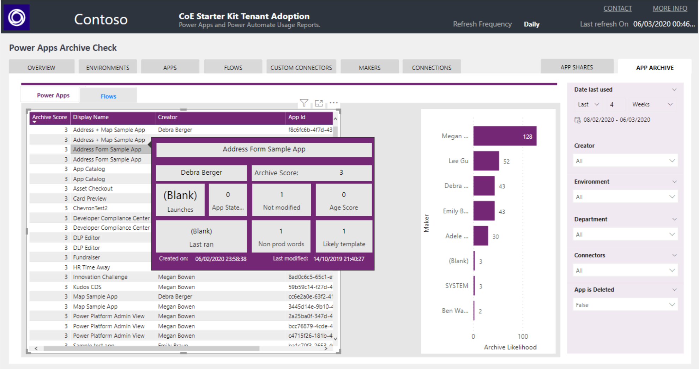

By right-clicking a specific App and navigating to Drill through **App Detail**, you can open the Detail page for the selected app.

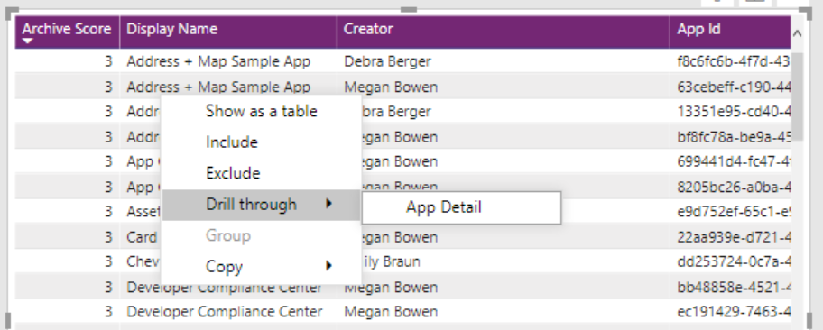

The **Flow Archive** page is sorted by highest archive score and allows you to target specific makers, date ranges, environments, departments or connectors.

The **Archive Score** is a sum of multiple criteria:

- Has the flow been modified since it was created (+1)

- Is the flow using non production words such as *test, demo, sample* (+1)

- When was the flow last modified? (+3 for more than 2 years ago, +2 for more than 1 year ago, +1 for more than 3 months ago)

- Is this flow likely a template or are there multiple flows with the same name? (+1)

- What is the flow state? (+2 for stopped, +1 for suspended)

- How complex is the flow, based on number of unique actions? (-1 if complex, as it indicates a user has spent a lot of time putting together)

A tooltip (pops up when you hover over a line item) shows additional details like number of launches and last launched date as well as the scores for the above criteria.

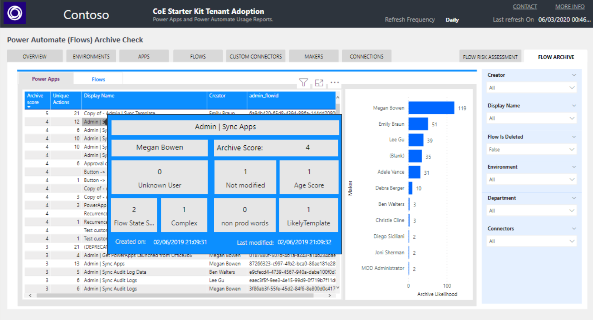

By right-clicking a specific flow and navigating to Drill through **Flow Detail**, you can open the Detail page for the selected flow.

### App and Flow Detail

The **App Detail** page provides you with rich information about this resource, as well as an embedded Power Apps that lets you immediately take action.

- You can grant yourself or others ownership

- You can archive the app (this requires a SharePoint site with a Document Library to be configured beforehand)

- You can delete the app

- You can email the app owner

- Once you have granted yourself ownership, you can launch the Maker Portal to view version

- details and app analytics

With the embedded Power Apps app you don't have to leave the Power BI dashboard to take action.

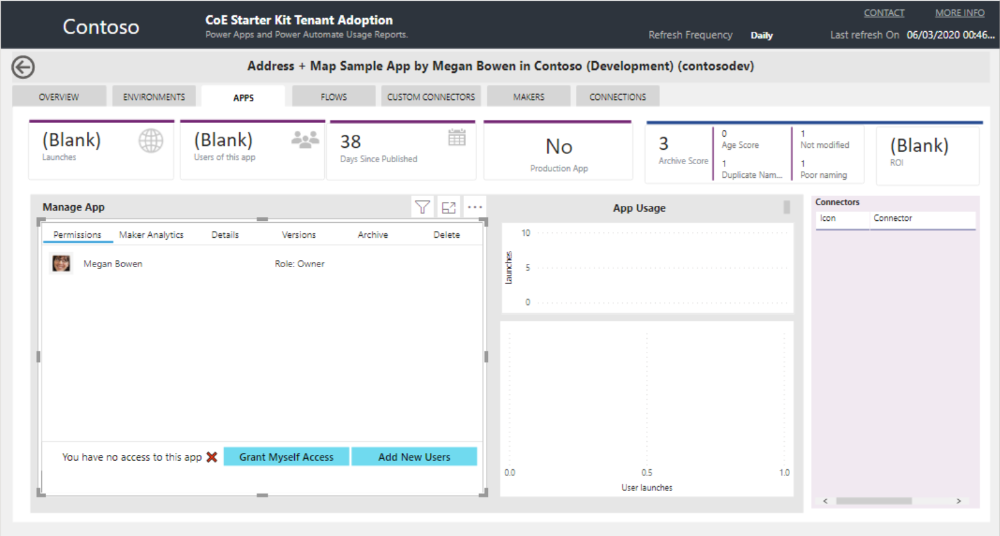

### Flow Archive

The **Flow Detail** page provides you with richer information about this resource, as well as an embedded Power Apps to immediately take action for this
flow.

- You can grant yourself or others ownership

- You can export the flow

- You can delete the flow

- You can email the flow maker

- Once you have granted yourself ownership, you can launch the Maker Portal to view flow analytics and details

With the embedded Power App you don't have to leave the Power BI dashboard to take action.

## Nurture

As you establish your Center of Excellence, a significant part of your activity will be nurturing your maker community, enabling them to follow best practices, and working together with them to identify whether they or their resources need additional support.

The Nurture section helps you find your "star" app and flow makers, see what connectors they are using, where they are based (department/city/country) and how they are adopting the Power Platform.

The **Maker page**, at one glance, helps you see your top makers, how many apps and flows those makers have created and your top active departments.

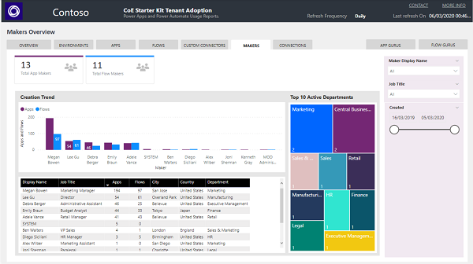

The **App Gurus** page gives you an overview of which makers are using which connectors. Makers with a high usage of different connectors are likely more
advanced and could turn into your champions; makers who use only Office
connectors are likely at the beginning of their journey and might need a helping
hand.

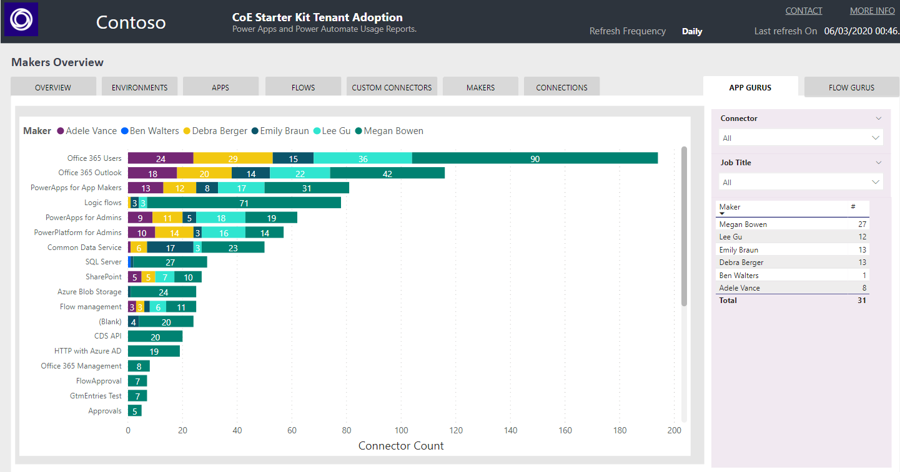

The **Flow Gurus** page gives you an overview of how many actions and connectors
per flow your makers are using. Makers with complex flows that have multiple
actions or use multiple connectors are likely more advanced and could turn into
your champions, makers use very few connectors or mostly template flows are
likely at the beginning of their journey and might need a helping hand

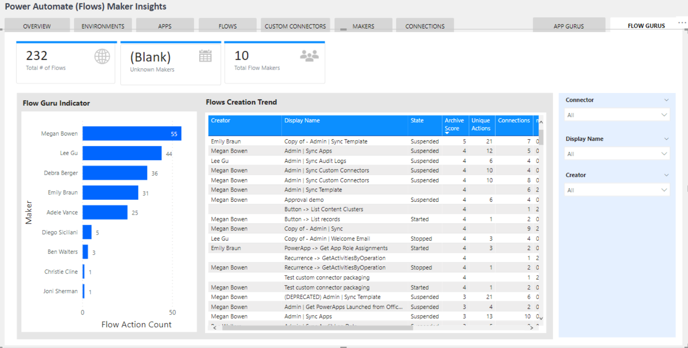

Finally, the **App Shares** page shows your top apps by number of users it is shared
with and number of app launches, and users who most frequently launch Power
Apps.

## Summary

In summary, the Power BI Dashboard of the CoE Starter Kit provides analytics and data for the following important tasks for your center of excellence:

- Monitor (oversight of tenant resources)

- Govern (drive actions through insights)

- Nurture (learn about your community)
