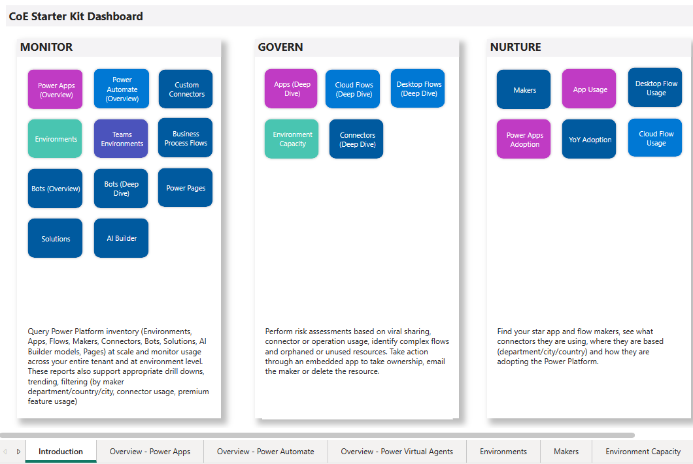

# Gain deep insights into your Microsoft Power Platform adoption with the CoE Power BI dashboard

As a Microsoft Power Platform admin, you want visibility into how your organization is using Power Apps and Power Automate. Insights into your adoption will help you govern and secure the platform, identify patterns, and enable you to nurture your makers to accelerate adoption.

Out of the box, the [admin analytics](https://docs.microsoft.com/power-platform/admin/analytics-powerapps) that are part of the [Power Platform admin center](https://aka.ms/ppac) provide you with environment-level analytics based on your usage for the past 28 days. As your adoption grows, you might need customized dashboards that show you more insights and allow you to apply richer filters to your data over a longer period of time.

The Power BI dashboard of the Center of Excellence (CoE) Starter Kit provides a holistic view with visualizations and insights into resources in your tenant: environments, apps, Power Automate flows, connectors, connection references, makers, and audit logs. Telemetry from the audit log is stored from the moment you set up the CoE Starter Kit, so over time you can look back and identify trends for longer than 28 days.

The dashboard provides analytics and data for the following areas:

- [**Monitor**](power-bi-monitor.md): Oversight of tenant resources

- [**Govern**](power-bi-govern.md): Drive actions through insights

- [**Nurture**](power-bi-nurture.md): Learn about your community

Get ready to use the dashboard by installing the [core components of the CoE Starter Kit](setup-core-components.md) and configuring the Power BI dashboard by following the [dashboard setup instructions](setup-powerbi.md).

>[!NOTE]
>Screenshots are taken from a sample of the report that's [published as an app](https://docs.microsoft.com/power-bi/collaborate-share/service-create-distribute-apps). If you are working in Power BI Desktop or have published the report to a workspace, your navigation and view will be different.

The first page of the dashboard provides an overview of all areas and their purpose, in addition to buttons to use to go to different sections and pages.

Within each section, you'll find [bookmarks](https://docs.microsoft.com/power-bi/desktop-bookmarks) at the top of each page to help you get to the information you're looking for.
