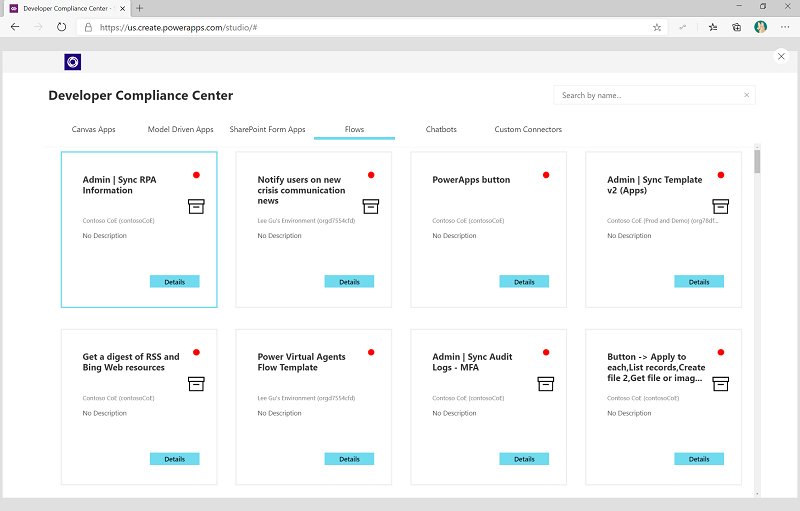
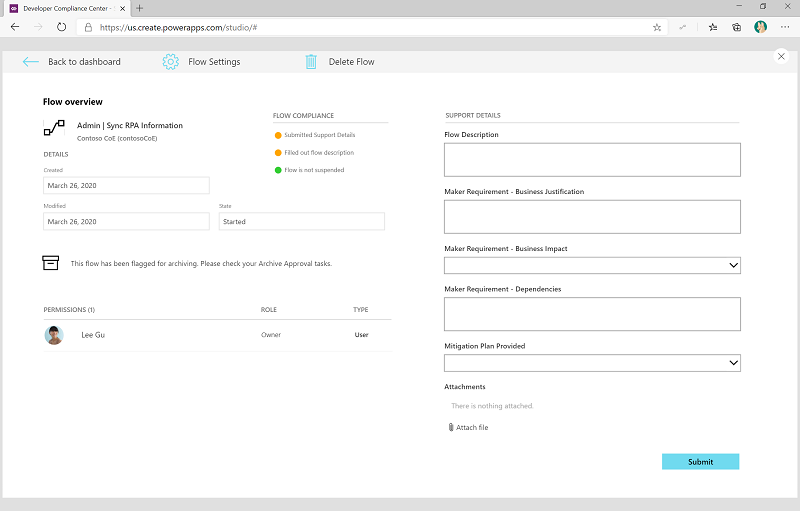

# Released version Governance Components 1.19

## Introduction

Version 1.19 for the CoE Starter Kit Governance Components is now available. This article describes the updates, including the new features and the fixes to existing functionality, included in this release. This version was first made available on .

## Developer Compliance Center

The Developer Compliance Center has been updated to now include a compliance process for

- Canvas Apps
- Model Driven apps
- SharePoint Form Apps
- Flows
- Custom Connectors
- Chatbots

Makers can now provide compliance and support details for all app types, flows, chatbots and custom connectors

Additionally, if the Archival process of the Governance components is used, apps and flows flagged for archiving are highlighted to makers in the Developer Compliance Center.

## Business Process Flows

New Compliance Approval flows have been added for [**Flows, Chatbots and Custom Connectors**](../governance-components.md#business-process-flow).

