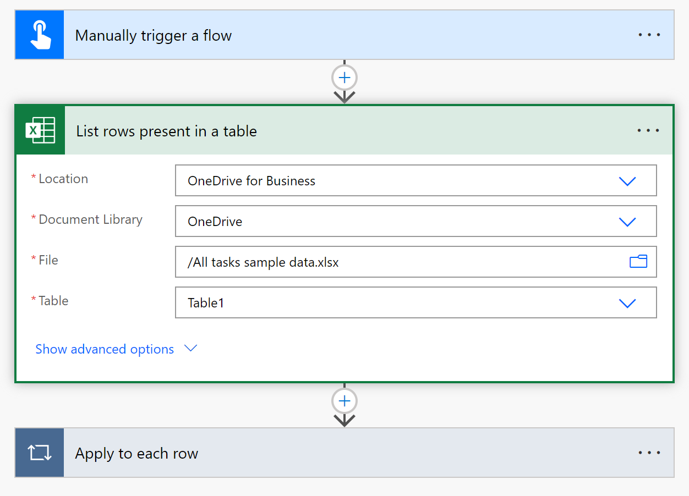

# Setup the Power Platform administration planning component

This article will help you set up the Power Platform Administration Planning component of the Center of Excellence (CoE) Starter Kit.

If your organization is just getting started, or already using Power Platform, defining administrative tasks and analyzing where you spend time administrating the platform enables you to:

- Plan your team structure.
- Expose opportunities for automation and innovation.

The Power Platform Administration Planning component contains:

- Dataverse table
- Model driven app
- Sample data import flow
- Power BI Dashboard

Install the solution following the steps below:

## Import the Power Platform Administration Planning component solution

1. Download the CoE Starter Kit compressed file ([aka.ms/CoeStarterKitDownload](https://aka.ms/CoeStarterKitDownload)).

    >[!IMPORTANT]
    > **Extract the zip file** after downloading and before moving on to the next step. The CoE Starter Kit compressed file contains all solution components in addition to the non–solution-aware components that make up the CoE Starter Kit.

1. Import the solution:
    1. If you're [installing to a production environment](faq.md#installing-a-solution-in-a-production-environment), use the PowerPlatformAdministrationPlanning_x_x_x_xx_managed.zip solution file from the download.

The import can take up to 15 minutes to be completed.

>[!NOTE]
>The next steps are optional, if you want to import sample task data (recommended).

## Importing sample admin task data

If you're getting started or want to populate the solution with common administrative tasks, then import data from the sample admin tasks spreadsheet.

### Extending the Power Platform administration planning solution

Power Platform administration planning is a 'managed solution'. The following instructions create an unmanaged solution that contains your configuration changes.  Read ['Extend and customize CoE Starter kit'](/power-platform/guidance/coe/modify-components) document to learn more about extending components of the CoE Starter Kit.

1. [Create a solution](power-apps/maker/data-platform/create-solution).
1. Complete the **Display name** and **Name** fields, then select a **Publisher** (or [create a solution publisher](power-apps/maker/data-platform/create-solution#solution-publisher))
1. When the solution has been created, open it, then select **'Cloud flows'** > **Add existing** > **Automation** > **Cloud flow** > Select the **Import-SampleTaskData** Cloud flow > **Add**
1. Select *...* > **Edit** > **Edit**
1. Expand the second action, labeled **'List rows present in a table'** and update the following parameters:
    1. Location: the root location that you copied the 'Sample-task-data.xlsx' spreadsheet to (for example: SharePoint Site URL, OneDrive for Business')
    1. Document library: the document library that you copied the 'Sample-task-data.xlsx' file to
    1. File: Select the file
    1. Table: Set to Table1
1. Select **Save**

Screenshot:

1. Turn on the cloud flow
1. Run the cloud flow

Once the cloud flow has completed successfully, check that the sample data is present.

#### Check sample data

If the cloud flow successfully completes, all sample tasks should be present in the Dataverse table named 'Admin tasks'. Launch the Admin tasks app to check tasks were successfully imported. When you've successfully launched the app, you should see the sample admin tasks:

By default, all tasks are set as 'Active'

## Admin tasks - model driven app

Launch the Admin tasks app to start adding your own, or configuring tasks that you imported via the Sample-task-data.xlsx spreadsheet.

### Configuring and creating tasks

The dashboard and insights this solution provides derive from admin task data that you interact with via the Admin tasks app.

The following table illustrates the purpose for each column:

|Column   |Type | Purpose |
|----------|-----------|---|
|Name   | Text | Display name of task, for example: 'Create an environment'  |
|Task description| Text | Brief description of the task. |
|Task documentation link | URL | Url link to documentation. |
|Active task | Choice | 'Yes'/ 'No' - Active tasks are tasks that you perform as an organization. |
| Outsourced task | Choice | 'Yes' / 'No' - Is the task outsourced? |
| Automation | Choice | 'Yes' / 'No' - Is the task automated? |
| Owner | User | User that created the record. |
| Frequency | Choice | Choice of daily, weekly, monthly, ad-hoc. | 
| Anticipated task iterations | Number | How many times do you believe the task will be performed in one year? **This column is managed by a business rule calculating the number of iterations for you, unless you select 'Ad-hoc'**|
| Duration | Number | How many minutes will the task take to complete? |
| Experience required | Choice | What level of experience is required to complete the task. |
| Core admin persona | Choice | Who in the core team will primarily perform the task (for example: Environment Admin, Product Owner). |
| Peripheral admin persona | Choice | Who else is required to complete the task (for example: Azure AD Administrator, SharePoint Administrator). |
| Primary task category | Choice | Select a category that the task predominantly fits into (for example: reporting, security, etc.) |
| Secondary task category | Choice | Select a second category that the task predominantly fits into (for example: Capacity, Performance)  |
| Product or service | Choice | Select the Power Platform Product or service |

## Set up the Power BI dashboard

The Power BI dashboard provides visualizations and insights into what your administration story looks like based on your task metadata. Providing insights into: your team structure, automation and outsourcing gains, proactive/ reactive task balance, persona and experience requirements. Follow the steps outlined to set up your dashboard.

### Configure the Power BI dashboard

You can configure and modify the Power BI dashboard by working directly with the Power BI (.pbit) file and Power BI Desktop.  Using Power BI desktop gives you flexibility to modify the dashboard to your own branding and include or exclude visuals that you want to see in the dashboard.

1. Download and install [Microsoft Power BI Desktop](https://www.microsoft.com/download/details.aspx?id=58494)

1. In Power BI Desktop, open the .pbit file, which can be found in the CoE Starter Kit you downloaded from [aka.ms/CoEStarterKitDownload](https://aka.ms/CoEStarterKitDownload). The template file title is **PowerPlatformAdminPlanner.pbit**

1. Enter the URL of your environment instance where you imported the solution.

> [!NOTE]
> Do not include the https:// prefix, or the '/' suffix when adding the environment URL 

1. Save the dashboard locally, or select **Publish** and choose the workspace you want to publish the report to.

1. [Configure scheduled refresh](/power-bi/connect-data/refresh-data#configure-scheduled-refresh) for your Power BI Dataset to update the report daily.

[!INCLUDE[footer-include](../../includes/footer-banner.md)]
