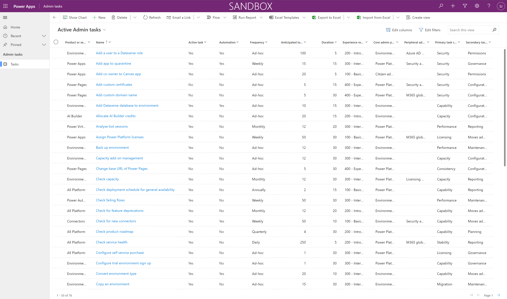

# Set up the Microsoft Power Platform administration planning component

This article will help you set up the [Microsoft Power Platform administration planning component](admin-tasks-component.md) of the Center of Excellence (CoE) Starter Kit.

The Microsoft Power Platform administration planning component contains:

- A Microsoft Dataverse table.
- A security role to grant access to the table.
- The Admin Tasks model-driven app.
- A flow that imports sample admin task data.
- A Power BI dashboard.

> [!NOTE]
> The Microsoft Power Platform administration planning component doesn't have a dependency on other components of the CoE Starter Kit. They can be used independently.

## Import the Power Platform administration planning component solution

You'll need to download the CoE Starter Kit file to install the administration planning solution, but the solution doesn't require you to install and use the rest of the CoE Starter Kit.

1. Download the CoE Starter Kit compressed file ([aka.ms/CoeStarterKitDownload](https://aka.ms/CoeStarterKitDownload)).

2. Extract the zip file.

   The CoE Starter Kit compressed file contains all solution and non-solution components that make up the CoE Starter Kit.

   > [!IMPORTANT]
   > The solution name contains the version number. In the following step, use the **admintaskanalysis_core_x_x_x_xx_managed** zip solution from the download.

3. Import the solution.

The import can take up to 15 minutes to be completed.

## Import sample admin task data

> [!NOTE]
> Importing the sample task data is optional, but recommended.

If you want to prepopulate the solution with common administrative tasks, import data from the sample admin tasks workbook. This task list can be particularly helpful when you're just getting started with Microsoft Power Platform.

1. Open the Admin Tasks app, which you installed as part of this component.

1. From the command bar, select **...** > **Import from Excel**.

1. Select **Choose File**.

1. Go to the location where you saved the file **Sample-task-data.xlsx**, and then select **Open**.

1. Select **Next** > **Review mapping**.

1. Select the fields you want to import.

   > [!NOTE]
   > If you're new to Microsoft Power Platform administration, we recommend that you import all sample columns data.

1. Select **Finish**.

An import job is created. You can track its progress by selecting **Track Progress**.

If the import job is successfully completed, all sample tasks will be present in the Dataverse table named **Admin tasks**. Open the Admin Tasks app to verify that tasks were successfully imported. You should see a list of sample admin tasks, as shown in the following image.

By default, all tasks are set as Active and task metadata—such as duration, frequency, and experience required—includes sample values.

## Configure the admin task data

The dashboard and insights this component provides are derived from admin task data that you interact with through the Admin Tasks app. If you're new to administration in Microsoft Power Platform, review the tasks that you think you'll be performing and update the task metadata where appropriate. If you're already administrating Microsoft Power Platform, review tasks that you perform by using your own actual data.

Open the Admin Tasks app to start adding your own tasks or configuring tasks that you imported from sample data, as described earlier in this article.

## Share apps with other admins

This solution contains an app and Power BI report designed to give admins access to planned activities.

Share this app with other Power Platform admins and assign them the **PP Admin Planning - Admin SR** security role.

## Set up the Power BI dashboard

The Power BI dashboard provides visualizations and insights into what your administration story looks like, based on your task metadata. You can work directly with the Power BI (.pbit) file and Power BI Desktop to configure and modify the Power BI dashboard to reflect your own branding, and include or exclude visuals that you want to see in the dashboard.

1. Download and install [Microsoft Power BI Desktop](https://www.microsoft.com/download/details.aspx?id=58494).

2. In Power BI Desktop, open the file **Power Platform Administration Planning.pbit**, which can be found in the CoE Starter Kit you downloaded and extracted.

3. Enter the URL of the environment where you imported the solution.

   > [!IMPORTANT]
   > Don't include the `https://` prefix or the `/` suffix when you enter the environment URL.

4. Save the dashboard locally, or select **Publish** and choose the workspace you want to publish the report to.

5. [Configure scheduled refresh](/power-bi/connect-data/refresh-data#configure-scheduled-refresh) for your Power BI dataset to update the report daily.

[!INCLUDE[footer-include](../../includes/footer-banner.md)]
